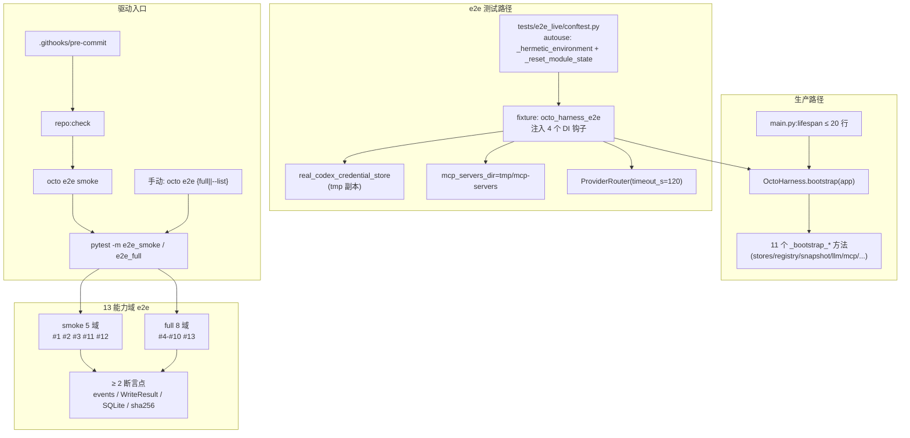

# Implementation Plan: Agent E2E Live Test Suite

**Feature ID**: 087
**Feature Slug**: agent-e2e-live-test-suite
**分支**: 087-agent-e2e-live-test-suite
**生成日期**: 2026-04-30
**上游制品**: `spec.md`（323 行 / 35 FR / 13 能力域）+ `research/product-research.md`（268 行）+ `research/tech-research.md`（400 行）+ `clarifications.md` + `checklists/requirements.md`
**复杂度**: MEDIUM（spec §12 锁定）
**Repo 实际位置**: `octoagent/`（worktree 根之下）

---

## 1. Summary

F087 通过抽离 `OctoHarness` + 两条 autouse fixture（仿 Hermes 模式）+ 13 能力域真实 LLM live e2e + native shell pre-commit hook + `octo e2e` CLI，构建 OctoAgent 在单测和 Codex Adversarial Review 之外的**第三层防御**——**运行时漂移**保险。

核心交付：
- **生产代码改动 2 处**：抽 `OctoHarness`（lifespan ≤ 20 行）、`McpInstallerService` 加 `mcp_servers_dir` DI
- **新增 e2e 基础设施**：`tests/e2e_live/` + 两条 autouse fixture + module 单例 reset 全清单
- **13 能力域 e2e**：6 个测试文件，每场景 ≥ 2 断言点，断言聚焦副作用而非 LLM 文本
- **强制保险**：`.githooks/pre-commit` + `make install-hooks` + `octo e2e {smoke|full|<id>|--list}`

约束硬指标：smoke ≤ 180s（目标 90-120s）/ full ≤ 10min / 5x 循环 0 regression / F086 ≥ 2038 测试 0 regression / `~/.octoagent` 跑前后 sha256 一致 / Codex review 0 high。

---

## 2. Technical Context

| 项 | 值 |
|----|----|
| 语言 | Python 3.12+ |
| 包管理 | uv |
| 测试框架 | pytest + pytest-asyncio (auto) + pytest-xdist (已装但 e2e 不开) |
| 新增依赖 | `pytest-rerunfailures>=14.0`（仅 dev / e2e 用，单测不加） |
| LLM Provider | Codex OAuth → GPT-5.5 think-low（订阅内零边际成本） |
| MCP | 真实 Perplexity 子进程（`mcp.install` + `mcp__perplexity__search`） |
| 数据存储 | e2e 自有 tmp SQLite（不污染宿主） |
| Hook 体系 | native shell（`.githooks/pre-commit`）+ `git config core.hooksPath`，**不引入** pre-commit framework |
| Marker | `e2e_smoke` / `e2e_full` / `e2e_live`（前两者互斥，`e2e_live` 正交） |
| 单测 timeout | 30s 单场景 / 180s smoke 总 / 10min full 总 / 单 LLM call 120s（#5 单独 60s） |
| 重试策略 | `pytest-rerunfailures` `@pytest.mark.flaky(reruns=1, reruns_delay=2)`，**不**手写 retry 循环 |

---

## 3. 4 个新 Risk 决策（spec 留给 plan）

### Risk #1：旧 `apps/gateway/tests/e2e/test_acceptance_scenarios.py` 5 域循环 vs 新 13 域 e2e

**决策**：**部分迁移 + 删除**——旧文件在 P5 末尾整体删除，5 域循环范式（5x 跑同一组测试验证稳定性）作为 **shell 层 NFR-7 验证手段**保留（在 `octo e2e smoke --loop=5` CLI 子参数实现，spec §10 NFR-7 锁定）。

**执行路径**：
- P3 上线 smoke 5 域时，旧文件继续保留并跑（双源真相但不冲突）
- P5 验收阶段在新 13 域 e2e 跑通 5x 循环 0 regression 后，删除旧文件 + 删除其依赖的 helper（如 `_loop_acceptance_runner` 之类）
- 不接受永久并存：双源真相会导致两边漂移，违反 OctoAgent "不保留死代码" 准则

**理由**：
- 旧 5 域是新 13 域的子集，保留 = 重复跑 LLM call、浪费 quota
- 旧文件的 5x 循环范式有价值，但应该泛化为 CLI 参数而非锁死在某一组测试
- 如果旧测试当下还在用，证明它能跑通 → 5x 范式直接借鉴到 P1 conftest.py，本体可删

### Risk #2：测试 helper 合并去向

**决策**：**独立模块 `tests/e2e_live/helpers/`**（不放 OctoHarness 也不放 conftest）。

**理由**：
- `OctoHarness.test_factory()` classmethod：会让生产类被测试代码污染（违反"生产代码 byte-for-byte 等价"的 SC-6）
- 单一 `test_factory()` 函数：单文件超 200 行后失维护
- 独立 `tests/e2e_live/helpers/` 模块：按职责分文件（`assertions.py` / `factories.py` / `fixtures_real_credentials.py` / `state_diff.py`），新人也能直接定位

**结构**：
```
tests/e2e_live/
├── conftest.py              # autouse fixture 双闸 + 30s SIGALRM
├── helpers/
│   ├── __init__.py
│   ├── assertions.py        # assert_tool_called / assert_event_emitted / assert_writeresult / assert_file_contains
│   ├── factories.py         # 复用 OctoHarness.test_factory()，含 _build_real_user_profile_handler / _ensure_audit_task / _insert_turn_events
│   ├── fixtures_real_credentials.py  # real_codex_credential_store / real_perplexity_api_key
│   ├── state_diff.py        # sha256_dir / sha256_file / module_singletons_snapshot
│   └── domain_runner.py     # run_domain(domain_id) — 用于 octo e2e <id> CLI
├── test_e2e_basic_tool_context.py
├── test_e2e_memory_pipeline.py
├── test_e2e_mcp_skill_pipeline.py
├── test_e2e_delegation_a2a.py
├── test_e2e_safety_gates.py
└── test_e2e_routine.py
```

### Risk #3：module 单例 reset 全清单（必须 P2 早期完成）

**决策**：**P2-T1（最优先任务）**完成全 grep；plan 阶段先给出**精确 grep 命令清单 + 已知必清模块**，P2 实现时按此清单逐个验证。

**精确 grep 命令清单**（P2 必须全跑）：

```bash
# 1. module-level 单例（dict / set / list / 简单 = 赋值）
cd octoagent
grep -rn "^_[a-z_][a-zA-Z0-9_]* *=" \
  apps/gateway/src/octoagent/gateway/harness/ \
  apps/gateway/src/octoagent/gateway/services/ \
  apps/gateway/src/octoagent/gateway/builtin_tools/

# 2. ContextVar 全部
grep -rn "ContextVar\|contextvars\.ContextVar" \
  apps/gateway/src/octoagent/gateway/ \
  packages/

# 3. classmethod 改类属性 pattern（如 AgentContextService.set_xxx）
grep -rn "cls\._[a-z_][a-zA-Z0-9_]* *=" \
  apps/gateway/src/octoagent/gateway/services/

# 4. lru_cache / cache decorator
grep -rn "@\(functools\.\)\?lru_cache\|@\(functools\.\)\?cache" \
  apps/gateway/src/octoagent/gateway/

# 5. 模块级 list / dict / set 字面量赋值
grep -rn "^[A-Z_][A-Z0-9_]* *= *\(\[\]\|{}\|set()\)" \
  apps/gateway/src/octoagent/gateway/harness/ \
  apps/gateway/src/octoagent/gateway/services/
```

**已知必清模块清单**（基于 tech-research §6）：

| Module 路径 | 清理目标 | Reset 方式 |
|-------------|--------|----------|
| `gateway/harness/tool_registry.py` | `_REGISTRY` 全局单例 | `module._REGISTRY = None` |
| `gateway/harness/snapshot_store.py` | 实例由 OctoHarness lifecycle 管 | 通过 OctoHarness shutdown 清 |
| `gateway/harness/approval_gate.py` | `_session_approvals: dict` | `.clear()` |
| `gateway/harness/delegation_manager.py` | `_active_children: dict` | `.clear()` |
| `gateway/harness/threat_scanner.py` | pattern compiled cache（如有） | `.clear()` 或重建 |
| `gateway/services/agent_context.py` | `AgentContextService._llm_service` / `_provider_router` 类属性 | reset 为 None |
| `gateway/services/memory_console.py` / `memory_runtime.py` | Memory Candidates 内存索引 | `.clear()` |
| `gateway/session_context.py` | 全部 `ContextVar`（≥ 9 个，需 P2 grep 确认） | `.set(default)` |

**失效信号**（P2 验证时必查）：5x 循环跑 smoke，若任一场景 "alone pass / together fail" 即漏一个；逐个二分定位。

### Risk #4：Codex OAuth quota 耗尽 FAIL vs SKIP

**决策**：**SKIP，不阻塞 commit**（FR-22 总 timeout 180s 兜底；quota 错误明确区分于业务错误）。

**实现机制**：
- 在 `tests/e2e_live/helpers/fixtures_real_credentials.py` 注册 `pytest_runtest_makereport` hook 或在每个 e2e fixture 内 catch `ProviderQuotaError` / HTTP 429 → 调 `pytest.skip(reason="codex quota exhausted: <details>")`
- `octo e2e` CLI 在 PASS / FAIL / SKIP 三状态间区分：SKIP 不阻塞 commit（exit 0），但**输出明显警告**到 stderr：`[WARN] E2E #N skipped due to quota`
- pre-commit hook 全 SKIP（5 个 smoke 场景全 SKIP）的特殊情况：仍 exit 0，但日志写入 `~/.octoagent/logs/e2e/quota-skip-<ts>.log` 留痕
- Quota 检测时机：**单 LLM call 收到 429 时立即 SKIP**（不等 timeout）；其他 5xx / 网络错误走 rerunfailures retry 1 次后 FAIL

**理由**：
- 配额耗尽是 **环境问题**，不是代码问题；FAIL 阻塞 commit 会让 Connor 失去工作流信任
- SKIP 留痕足够：用户看到 WARN 后可手动跑 `octo e2e full` 或换时段重试
- 与 FR-23 / FR-24 的"#5 远端故障 SKIP" 一脉相承

---

## 4. Codebase Reality Check

### 4.1 目标文件 LOC / 方法数 / debt 表

| 文件 | LOC | 公开方法 | 已知 debt | 改动量预估 |
|------|-----|---------|----------|----------|
| `apps/gateway/src/octoagent/gateway/main.py` | ~900 | `lifespan` / `create_app` / `_resolve_project_root` | lifespan 600+ 行（行 289-892）单函数承担 11 类 bootstrap 职责 | 删除 ~590 行 / 新增 ~10 行（lifespan 改 builder 调用） |
| `apps/gateway/src/octoagent/gateway/services/mcp_installer.py` | ~600 | `install` / `uninstall` / `install_status` / `_run_subprocess` | `_DEFAULT_MCP_SERVERS_DIR = Path.home() / ...`（L29 硬编码 home） | 新增 `mcp_servers_dir` DI 参数 + 替换全部 `_DEFAULT_MCP_SERVERS_DIR` 引用 ~30 行 |
| `apps/gateway/src/octoagent/gateway/harness/octo_harness.py` | 0（新建） | `bootstrap` / `shutdown` / `commit_to_app` / 11 个 `_bootstrap_*` | N/A | 新增 ~600 行（搬运为主） |
| `octoagent/pyproject.toml` | ~80 | N/A | `[tool.pytest.ini_options]` 未注册任何 markers | 新增 ~10 行（markers + dev deps） |
| `octoagent/conftest.py` | ~50 | `tmp_db_path` / `tmp_artifacts_dir` / `db_conn` | 仅有最小 fixture | 不动（e2e 在 `tests/e2e_live/conftest.py` 自包含） |
| `apps/gateway/tests/e2e/test_acceptance_scenarios.py` | ~待 P5 grep | 5 场景循环 | 与新 13 域重复 | P5 整体删除 |
| `Makefile` | 不存在 / 待确认 | N/A | N/A | 新建或 append `install-hooks` target |
| `.githooks/pre-commit` | 0（新建） | N/A | 仓库无 hook 体系 | 新增 ~30 行 shell |

### 4.2 前置 cleanup 判定

`gateway/main.py` 命中 **LOC > 500 且新增 > 50 行** 规则（虽然净 LOC 是减的，但 lifespan 单函数 600 行的 debt 必须先清理才能引入 OctoHarness）。

→ **前置 cleanup task** 在 tasks 阶段标记为 `[CLEANUP]`：P1-T0「lifespan 行号映射 + 11 段切片标记」（不改代码，先在 main.py 加注释 marker，方便 P1-T1 抽离时按 marker 切分）。

### 4.3 概念泄漏 / 兼容层风险点

- F084 已退役 BootstrapSession 状态机但 `gateway/services/` 下若残留旧引用 → P2 grep `BootstrapSession\|bootstrap_orchestrator\|UserMdRenderer` 应为 0 命中（已在 F084 净删 ~2400 行）
- McpInstaller `_DEFAULT_INSTALLS_PATH = Path("data/ops/mcp-installs.json")` 是相对路径（cwd 依赖）→ **不**在 F087 范围内（与 mcp_servers_dir 解耦，spec 未要求）

---

## 5. Impact Assessment

### 5.1 影响范围

- **直接修改文件数**：5（`main.py` / `mcp_installer.py` / `pyproject.toml` / 新增 `octo_harness.py` / 新增 `.githooks/pre-commit`）
- **新增文件数**：~15（OctoHarness + e2e_live/ 目录 + helpers + 6 测试文件 + Makefile target + CLI 命令）
- **间接受影响文件数**：~3（任何当前在 main.py lifespan 末尾抓 `app.state.xxx` 的测试 / CLI；P1 完成时确认）
- **跨包影响**：1（`apps/gateway/` + `packages/provider/` 接口契约不变；新增 e2e 不动 packages）
- **数据迁移**：**无**（不动 SQLite schema / 配置格式 / 状态文件格式）
- **API/契约变更**：
  - `McpInstallerService.__init__` 加可选参数 `mcp_servers_dir: Path | None = None` → **向后兼容**（默认 None 行为不变）
  - `OctoHarness` 是新类，无契约破坏
  - `octo` CLI 新增 `e2e` 子命令 → 向后兼容（不动现有命令）
- **风险等级**：**MEDIUM**

### 5.2 MEDIUM 判定理由

按 plan agent 规则：
- 影响文件数 ~8（直接 5 + 间接 3）→ MEDIUM 边界
- 跨包影响 = 0（仅 apps/gateway 内）→ 倾向 LOW
- 无数据迁移、无公共 API 破坏 → 倾向 LOW
- 但 **lifespan 600 行搬运 + byte-for-byte 等价约束 + module 单例 reset 易漏**三条工程风险叠加 → 校准为 MEDIUM（与 spec §12 一致）

MEDIUM 不强制分阶段，但 spec §10 已锁定 5 phases，本 plan 按此拆分。

---

## 6. Constitution Check

| # | 原则 | 适用性 | 评估 | 说明 |
|---|------|------|------|------|
| 1 | Durability First | 适用 | ✅ | e2e 跑真 SQLite + artifacts，不 mock；OctoHarness 抽离不改持久化语义 |
| 2 | Everything is an Event | 适用 | ✅ **加强** | e2e 断言主要依赖 events 表，反向强制系统全程产事件；F087 是事件覆盖率的回归保险 |
| 3 | Tools are Contracts | 适用 | ✅ **加强** | 13 域断言每条都验工具签名 / WriteResult schema；任何 tool schema 漂移立刻被发现 |
| 4 | Side-effect Two-Phase | 适用 | ✅ **加强** | 域 #12 ApprovalGate 是直接验证；mcp.install 走 ApprovalGate，e2e 自动 approve 时显式记录 |
| 5 | Least Privilege | 适用 | ✅ | secrets 全 env 注入；fixture 不写 token 明文；OPENROUTER_API_KEY 通过 `mcp.install(env=...)` 显式注入，`_SAFE_ENV_KEYS` 不透传保留 |
| 6 | Degrade Gracefully | 适用 | ✅ | echo mode 仍可用；e2e 跳过路径（quota / Perplexity 故障）SKIP 不 FAIL |
| 7 | User-in-Control | 适用 | ✅ **加强** | `SKIP_E2E=1` 紧急 bypass + commit message 不被改写；用户保留最终决定权 |
| 8 | Observability | 适用 | ✅ **加强** | hook 失败 3 行核心信息 + 日志路径，不刷屏；events / artifacts 落 tmp 不污染宿主 |
| 9 | Agent Autonomy | 适用 | ✅ | e2e 不引入硬编码规则；断言聚焦 LLM 自主决策的副作用而非"必须含字串 X" |
| 10 | Policy-Driven Access | 适用 | ✅ **加强** | e2e 走 ApprovalManager / ToolBroker 真实路径，不绕；任何工具自做权限判断会被 e2e 测出 |

**总评**：F087 不仅不破宪法，而是**对 #2 / #3 / #4 / #7 / #8 / #10 共 6 条原则的直接回归保险**。0 VIOLATION，0 豁免。

---

## 7. Project Structure

### 7.1 新增 / 修改文件树

```
octoagent/
├── apps/gateway/src/octoagent/gateway/
│   ├── main.py                                  # [改] lifespan 600 行 → 10 行
│   ├── harness/
│   │   └── octo_harness.py                      # [新] ~600 行 / 11 个 _bootstrap_* 方法
│   └── services/
│       └── mcp_installer.py                     # [改] +mcp_servers_dir DI / 替换 _DEFAULT 全部引用
├── apps/gateway/tests/
│   ├── e2e/test_acceptance_scenarios.py         # [P5 删]
│   └── e2e_live/                                # [新]
│       ├── conftest.py                          # autouse fixture 双闸 + SIGALRM
│       ├── helpers/                             # 见 §3 Risk #2 结构
│       ├── test_e2e_basic_tool_context.py       # 域 #1 #2 #3
│       ├── test_e2e_memory_pipeline.py          # 域 #4
│       ├── test_e2e_mcp_skill_pipeline.py       # 域 #5 #6 #7
│       ├── test_e2e_delegation_a2a.py           # 域 #8 #9 #10
│       ├── test_e2e_safety_gates.py             # 域 #11 #12
│       └── test_e2e_routine.py                  # 域 #13
├── tests/fixtures/local-instance/               # [新] 脱敏 ~/.octoagent 模板
│   ├── octoagent.yaml.template
│   ├── behavior/                                # 行为目录树脱敏快照
│   └── .gitignore                               # 严格规则
├── packages/provider/src/octoagent/provider/cli/  # 或 apps/gateway/.../cli/
│   └── e2e_command.py                           # [新] octo e2e CLI 实现
├── pyproject.toml                               # [改] markers + dev deps
├── Makefile                                     # [新或改] install-hooks target
├── .githooks/
│   └── pre-commit                               # [新] ~30 行 shell
└── docs/codebase-architecture/
    └── e2e-testing.md                           # [新] P5 文档
```

### 7.2 关键路径锁定

- e2e fixture 重定向 env 全清单（FR-7 锁定）：
  - 清空：`OPENAI_API_KEY` / `SILICONFLOW_API_KEY` / `OPENROUTER_API_KEY` / `TELEGRAM_BOT_TOKEN` / 其他 `*_API_KEY` / `*_TOKEN`
  - 重定向到 tmp：`OCTOAGENT_DATA_DIR` / `OCTOAGENT_DB_PATH` / `OCTOAGENT_ARTIFACTS_DIR` / `OCTOAGENT_PROJECT_ROOT`
  - **不动** `HOME`（子进程依赖）
  - 固定：`PYTHONHASHSEED=0`（决定性 hash）
- `OCTOAGENT_E2E_*` env var 命名规范（仅 e2e 测试代码内使用）：
  - `OCTOAGENT_E2E_REAL_LLM=1` — 强制真实 LLM（默认）
  - `OCTOAGENT_E2E_PERPLEXITY_API_KEY` — 从宿主 mcp-servers.json 读后注入
  - `OCTOAGENT_E2E_LOG_DIR` — 日志输出路径

---

## 8. Architecture

### 8.1 总览（Mermaid）



### 8.2 OctoHarness DI 钩子（FR-2 锁定）

```python
class OctoHarness:
    def __init__(
        self,
        project_root: Path,
        *,
        credential_store: CredentialStore | None = None,    # e2e 注入 tmp 副本
        llm_adapter: MessageAdapter | None = None,           # e2e 强制真实
        mcp_servers_dir: Path | None = None,                  # e2e 注入 tmp/mcp-servers
        data_dir: Path | None = None,                          # e2e 直接传 tmp，避免读 env
    ) -> None: ...

    async def bootstrap(self, app: FastAPI) -> None:
        # 11 个 _bootstrap_* 顺序执行（按 main.py 现有顺序）
        ...
    async def shutdown(self, app: FastAPI) -> None: ...
    def commit_to_app(self, app: FastAPI) -> None: ...
```

生产路径 4 个 DI 钩子全传 None → 行为 byte-for-byte 等价（SC-6）。

---

## 9. Phase 拆分（5 phases，按 spec §10 锁定）

### Phase 1: OctoHarness 抽离 + DI 钩子 (~2-3d)

**工时**：~2-3d
**依赖**：无（首阶段）；前置 [CLEANUP] task 标 lifespan 行号 marker

**新增文件**：
- `apps/gateway/src/octoagent/gateway/harness/octo_harness.py`（~600 LOC，搬运 lifespan + 11 个 `_bootstrap_*` 方法 + DI 钩子）

**改动文件**：
- `apps/gateway/src/octoagent/gateway/main.py`（行 289-892：lifespan ~600 行 → ~10 行；保留 `_resolve_project_root` 等顶层 helper）

**任务清单**（粗粒度）：
- T-1-0（[CLEANUP]）：在 main.py lifespan 加 11 段 `# === _bootstrap_xxx 边界 ===` 注释 marker（按 tech-research §5 行号映射），不改逻辑
- T-1-1：新建 `octo_harness.py`，定义类 + 4 DI 钩子 + `bootstrap` / `shutdown` / `commit_to_app` 骨架
- T-1-2：搬运 `_bootstrap_paths` / `_bootstrap_stores` / `_bootstrap_tool_registry_and_snapshot` / `_bootstrap_owner_profile`（前 4 段，行 291-371）
- T-1-3：搬运 `_bootstrap_runtime_services` / `_bootstrap_llm` / `_bootstrap_capability_pack` / `_bootstrap_mcp`（中 4 段，行 373-565）
- T-1-4：搬运 `_bootstrap_executors` / `_bootstrap_optional_routines` / `_bootstrap_control_plane`（后 3 段，行 575-821）
- T-1-5：搬运 shutdown 段（行 832-891）
- T-1-6：替换 main.py lifespan 为 OctoHarness 调用，行数压缩到 ≤ 20
- T-1-7：跑 F086 全量测试基线 ≥ 2038 测试 0 regression（SC-10）

**测试与断言点**：
- 单元测试：F086 现有测试全绿（不新增单测）
- 集成验证：`uv run pytest -q` 无 fail
- byte-for-byte 等价验证：跑一次 `octo update` + 启动 gateway，比对 `app.state.*` 关键属性集合（手动 grep 或简单 diff）

**完成标准**：
- lifespan ≤ 20 行（SC-6）
- F086 ≥ 2038 测试 0 regression
- OctoHarness 4 DI 钩子全 None 时行为不变
- 跑 `uv run python -c "from octoagent.gateway.harness.octo_harness import OctoHarness; print(OctoHarness)"` 无 ImportError

---

### Phase 2: McpInstaller DI + e2e 基础设施 + 单例 reset 清单 (~1-2d)

**工时**：~1-2d
**依赖**：P1 完成（OctoHarness 已可注入 mcp_servers_dir）

**新增文件**：
- `apps/gateway/tests/e2e_live/conftest.py`（~250 LOC，autouse 双闸 + 30s SIGALRM + 主 fixture `octo_harness_e2e`）
- `apps/gateway/tests/e2e_live/helpers/assertions.py`（~150 LOC）
- `apps/gateway/tests/e2e_live/helpers/factories.py`（~200 LOC，含 `_build_real_user_profile_handler` 等迁移 helper）
- `apps/gateway/tests/e2e_live/helpers/fixtures_real_credentials.py`（~100 LOC）
- `apps/gateway/tests/e2e_live/helpers/state_diff.py`（~80 LOC，sha256 工具）
- `apps/gateway/tests/e2e_live/helpers/domain_runner.py`（~100 LOC，给 CLI 单跑用）
- `tests/fixtures/local-instance/`（脱敏 `~/.octoagent` 模板 + `.gitignore`）

**改动文件**：
- `apps/gateway/src/octoagent/gateway/services/mcp_installer.py`（FR-16 / FR-17 / FR-18：加 `mcp_servers_dir: Path | None = None` 参数 + 替换 **全部** `_DEFAULT_MCP_SERVERS_DIR` 引用为 `self._mcp_servers_dir`）
- `apps/gateway/src/octoagent/gateway/harness/octo_harness.py`（`_bootstrap_mcp` 内传 `mcp_servers_dir=self._mcp_servers_dir`）
- `octoagent/pyproject.toml`：
  - `[tool.pytest.ini_options]` 加 markers（`e2e_smoke` / `e2e_full` / `e2e_live`）
  - dev deps 加 `pytest-rerunfailures>=14.0`

**任务清单**（粗粒度，T-2-1 优先级最高）：
- **T-2-1**（最优先）：执行 §3 Risk #3 全 grep 命令清单 + 输出**精确 reset 清单文档**（落到 `helpers/__init__.py` docstring 或独立 `MODULE_SINGLETONS.md`）
- T-2-2：实现 `_hermetic_environment` autouse fixture（清凭证 env + 重定向 OCTOAGENT_* env + 不动 HOME + PYTHONHASHSEED=0）
- T-2-3：实现 `_reset_module_state` autouse fixture（按 T-2-1 清单逐个 reset；每条加测试验证 reset 后状态等于 import-time 默认）
- T-2-4：30s SIGALRM 单场景 timeout 装置（`signal.alarm(30)` 包裹每个 e2e function）
- T-2-5：`McpInstallerService.__init__` 加 `mcp_servers_dir: Path | None = None` 参数 + grep 替换全部 `_DEFAULT_MCP_SERVERS_DIR` 引用 + 跑现有 mcp_installer 单测验证向后兼容
- T-2-6：实现 `real_codex_credential_store` fixture（从 `~/.octoagent/auth-profiles.json` 只读复制到 tmp + chmod 0o600 + 宿主不存在时 `pytest.skip`）
- T-2-7：实现 `octo_harness_e2e` 主 fixture（注入 4 DI 钩子 + ProviderRouter timeout=120s + max_steps=10）
- T-2-8：实现 `assert_tool_called` / `assert_event_emitted` / `assert_writeresult_status` / `assert_file_contains` 断言 helper
- T-2-9：实现 `sha256_dir(path)` / `sha256_file(path)` 用于 SC-7（`~/.octoagent` 跑前后一致）
- T-2-10：实现 quota detection（`pytest.skip` on 429）
- T-2-11：注册 `pytest_collection_modifyitems` hook，给 `e2e_smoke` / `e2e_full` 测试自动加 `@pytest.mark.flaky(reruns=1, reruns_delay=2)`

**测试与断言点**：
- 单元测试（针对 fixture 自身）：
  - `test_hermetic_environment_clears_creds`：注入 `OPENAI_API_KEY=foo` → fixture 后读 env 应空
  - `test_reset_module_state_clears_singletons`：手动污染各单例 → fixture 后等于初始
  - `test_real_codex_skip_when_missing`：宿主无 auth-profiles → SKIP（不 FAIL）
  - `test_mcp_installer_di_backwards_compat`：`McpInstallerService()` 无参 → 行为同 F086

**完成标准**：
- T-2-1 输出文档落盘且 P3 之前不可改动
- McpInstaller 单测全绿（含新增 DI 注入测）
- pytest markers 注册成功（`pytest --markers` 输出含 3 个新 marker）
- `pytest-rerunfailures` 装入并能在 e2e 上工作（写一个 sanity test 验证）

---

### Phase 3: smoke 套件 5 域实现 + pre-commit hook (~2-3d)

**工时**：~2-3d
**依赖**：P2 完成（fixture / helper / DI 全就位）

**新增文件**：
- `apps/gateway/tests/e2e_live/test_e2e_basic_tool_context.py`（域 #1 #2 #3，~300 LOC）
- `apps/gateway/tests/e2e_live/test_e2e_safety_gates.py`（域 #11 #12，~200 LOC）
- `.githooks/pre-commit`（~30 LOC shell）
- `Makefile`（新建或追加 `install-hooks` target）

**改动文件**：
- `apps/gateway/tests/e2e/test_acceptance_scenarios.py`（**保留并存**，P5 删）

**任务清单**（粗粒度）：
- T-3-1：域 #1（工具调用基础 / `memory.write`）实现 + 2 断言点（events `tool.call(name="memory.write")` + WriteResult.memory_id 非空 + `status="written"`）
- T-3-2：域 #2（USER.md 全链路 / `user_profile.update`）实现 + 2 断言点（USER.md 含 "Python" 字符串 + WriteResult 返回 user_md_path + ThreatScanner.passed=True）
- T-3-3：域 #3（Context 注入 / 冻结快照）实现 + 2 断言点（两次调用 frozen_prefix_hash 相同 + LLM 输出含 "Connor"）
- T-3-4：域 #11（ThreatScanner block）实现 + 2 断言点（events 含 `threat.blocked` + USER.md 内容 sha256 不变）
- T-3-5：域 #12（ApprovalGate SSE）实现 + 2 断言点（SSE 流含 `approval.pending` + approve 后 task `status="completed"`）
- T-3-6：编写 `.githooks/pre-commit`：检测 `SKIP_E2E=1` env → exit 0；否则 `cd octoagent && uv run pytest -m e2e_smoke --maxfail=1 -q`
- T-3-7：Makefile 加 `install-hooks` target：`git config core.hooksPath .githooks`
- T-3-8：hook 失败输出格式实现（3 行核心 + 日志路径，FR-31）
- T-3-9：smoke 5 场景 5x 循环跑通 0 regression（SC-4 部分验证）
- T-3-10：实测 smoke 总耗时 ≤ 180s（目标 90-120s，SC-2）+ LLM 调用预算 ≤ 10 次（FR-25）

**测试与断言点**：
- e2e 验证：5 域各自独立跑 PASS；smoke 整体 5x 循环 0 regression
- hook 验证：手动 `make install-hooks` + 故意写一个 fail 的 e2e + commit → hook 应阻塞 + 输出 3 行核心信息
- bypass 验证：`SKIP_E2E=1 git commit` → hook exit 0
- sha256 验证：跑前 `sha256_dir(~/.octoagent)` == 跑后 sha256（SC-7）

**完成标准**：
- smoke 5 域全 PASS（5x 循环）
- pre-commit hook 上线 + `make install-hooks` 可用
- smoke 总耗时实测 p95 ≤ 150s
- LLM 调用预算 ≤ 10 次/次执行

---

### Phase 4: full 套件 8 域实现 (~3-4d)

**工时**：~3-4d
**依赖**：P3 完成（smoke 已稳定，证明 fixture / DI 路径全通）

**新增文件**：
- `apps/gateway/tests/e2e_live/test_e2e_memory_pipeline.py`（域 #4，~150 LOC）
- `apps/gateway/tests/e2e_live/test_e2e_mcp_skill_pipeline.py`（域 #5 #6 #7，~350 LOC）
- `apps/gateway/tests/e2e_live/test_e2e_delegation_a2a.py`（域 #8 #9 #10，~400 LOC）
- `apps/gateway/tests/e2e_live/test_e2e_routine.py`（域 #13，~150 LOC）

**改动文件**：
- `apps/gateway/tests/e2e_live/conftest.py`（域 #5 单独 timeout 60s 单 LLM call，FR-14）

**任务清单**（粗粒度）：
- T-4-1：域 #4（Memory observation→promote）实现 + 2 断言（candidate.confidence ≥ THRESHOLD + promote 后 `status="promoted"` + memory_sor +1）
- T-4-2：域 #5（真实 Perplexity）实现 + 2 断言（tool.call.name 以 `mcp__` 前缀 + 返回 markdown 含至少 1 个 http(s) 链接） + 单 call timeout 60s + retry 1 后 SKIP（FR-24）
- T-4-3：域 #6（Skill 调用）实现 + 2 断言（skill_runs +1 `status="success"` + Pydantic Output schema 验证通过）
- T-4-4：域 #7（Graph Pipeline）实现 + 2 断言（graph_runs `status="completed"` + 所有 node checkpoint 落盘）
- T-4-5：域 #8（delegate_task / Worker 派发）实现 + 2 断言（parent_task_id 链路完整 + a2a_messages 含 request + response 各 1 行）
- T-4-6：域 #9（Sub-agent max_depth=2 拒绝）实现 + 2 断言（events 含 `delegation.rejected` reason="max_depth" + 子 task 未创建）
- T-4-7：域 #10（A2A 通信，OQ-1 决议）实现 + 4 子断言（FR-15 锁定的全部 4 条）
- T-4-8：域 #13（Routine cron / webhook）实现 + 2 断言（routine_runs +1 `trigger_type="cron"` + 触发时刻误差 < 2s）
- T-4-9：full 8 场景独立跑 PASS + full 整体跑通 ≤ 10min（SC-3）

**测试与断言点**：
- 每域 ≥ 2 断言；域 #10 ≥ 4 子断言
- full 总耗时 ≤ 10min
- Perplexity 网络抖动场景 SKIP 路径验证

**完成标准**：
- 13 域全 e2e 实现完毕（SC-1）
- full 总耗时 ≤ 10min
- 域 #5 SKIP 路径正确（不 FAIL commit）

---

### Phase 5: octo e2e CLI + 5x 循环验收 + Codex Review + 文档 (~1-2d)

**工时**：~1-2d
**依赖**：P4 完成（13 域稳定）

**新增文件**：
- `packages/provider/src/octoagent/provider/cli/e2e_command.py` 或 `apps/gateway/.../cli/e2e_command.py`（~200 LOC，CLI 入口）
- `docs/codebase-architecture/e2e-testing.md`（~400 字，文档）

**改动文件**：
- `apps/gateway/tests/e2e/test_acceptance_scenarios.py`（**整体删除**，按 §3 Risk #1 决策）
- `apps/gateway/tests/e2e/`（旧目录若空则删）
- 任何引用旧 acceptance_scenarios 的导入清理

**任务清单**（粗粒度）：
- T-5-1：实现 `octo e2e {smoke|full|<domain_id>|--list}` CLI（pytest argparse 转发，含 `--loop=N` 参数支持 5x 循环）
- T-5-2：CLI 输出格式实现（PASS / FAIL / SKIP 三态 + 日志路径）
- T-5-3：删除旧 `test_acceptance_scenarios.py` + 清理引用
- T-5-4：撰写 `docs/codebase-architecture/e2e-testing.md`（覆盖 §1-§9：架构 / 13 域清单 / 跑法 / SKIP_E2E / quota 处理 / module reset 维护指南）
- T-5-5：跑 5x 循环 e2e_smoke 0 regression（SC-4 完整验证）
- T-5-6：跑全量基线测试 0 regression（SC-10 ≥ 2038 测试）
- T-5-7：sha256 对比验证 SC-7（跑前后 `~/.octoagent/{USER.md, MEMORY.md, mcp-servers/, auth-profiles.json}` 一致）
- T-5-8：secrets grep 验证 SC-8（仓库内无明文 token / API_KEY）
- T-5-9：触发 `/codex:adversarial-review`（plan 大改后 + Phase implement 末尾各一次，按 CLAUDE.local.md 要求）
- T-5-10：处理 Codex finding（high → 必处理；medium → 评估；low → 可忽略但 commit message 注明）
- T-5-11：blueprint 同步：`docs/blueprint.md` 加 F087 完成标记 + Milestone 状态变更

**测试与断言点**：
- SC-1 至 SC-10 全部通过
- Codex Adversarial Review 0 high finding
- 5x 循环 e2e_smoke 0 regression
- F086 ≥ 2038 测试基线 0 regression

**完成标准**：
- `octo e2e --list` 输出 13 域清单
- 旧 `test_acceptance_scenarios.py` 已删除
- 文档落盘
- Codex 0 high
- commit + push 通过 hook

---

## 10. 风险登记表

| # | 风险描述 | 概率 | 影响 | 缓解策略 | 触发条件 / 早期信号 |
|---|---------|------|------|---------|------------------|
| R1 | OctoHarness 抽离破坏 byte-for-byte 等价（隐式依赖 lifespan 内变量作用域） | 中 | 高 | P1-T1~T5 每段搬运后立即跑全量测试；保留 11 段 marker 注释方便回滚；任何 `app.state.xxx` 缺失立即定位 | F086 ≥ 2038 测试出现非 e2e 的 fail；启动 gateway 后 `app.state.<某属性>` 未定义 |
| R2 | module 单例 reset 漏一项导致 "alone pass / together fail" | 中 | 高 | P2-T1 最优先 grep 全清单 + 文档化；P3 5x 循环跑 smoke 验证；测试间 reset 验证（每个测开始时断言初始态） | 单跑某 e2e PASS，但与其他 e2e 一起跑某条 FAIL；同一测重跑结果不一致 |
| R3 | Codex OAuth quota 耗尽阻塞 commit | 中 | 中 | §3 Risk #4 决策：429 立即 SKIP 不 FAIL；smoke ≤ 10 次 LLM call 预算；`SKIP_E2E=1` 紧急 bypass | 单 LLM call 返回 HTTP 429；连续多次 SKIP 出现 |
| R4 | Perplexity 远端故障 / 网络抖动炸 commit | 中 | 中 | 域 #5 仅放 full（不进 smoke）；rerunfailures retry 1 次；超时降级为 SKIP；单 call timeout 60s | full 跑到 #5 timeout / connection error |
| R5 | OctoHarness 抽离破坏 prefix cache（snapshot frozen_prefix_hash 漂移） | 低 | 高 | 域 #3 直接断言两次调用 frozen_prefix_hash 一致；P1 不动 SnapshotStore 接口 | 域 #3 断言 A 失败 |
| R6 | LLM 响应非确定性导致 e2e 假阳 / 假阴 | 中 | 中 | FR-11 锁定：断言聚焦副作用（events / WriteResult / SQLite / sha256）而非 LLM 文本；rerunfailures 单次重试 | 同一测多次跑结果不一致（rerun 后才过） |
| R7 | hook 拖慢 commit 节奏被 Connor 绕过（用 `--no-verify`） | 中 | 低 | smoke 总时间硬指标 ≤ 180s（目标 90-120s）；`SKIP_E2E=1` 显式留痕替代 `--no-verify`；文档警示 | 出现连续多次 `SKIP_E2E=1` 或 `--no-verify` commit |
| R8 | xdist 并发 race（`-n auto` 时） | 低 | 中 | F087 默认串行跑 e2e（不开 xdist）；conftest.py 显式不设 `--numprocesses` | xdist 模式下 e2e 出现 race 类失败 |
| R9 | tests/fixtures/local-instance/ 误提交真实 token | 低 | 高 | `.gitignore` 严格规则 + secrets grep 在 P5-T8 强制验证（SC-8）+ 模板文件命名 `.template` 后缀 | git diff 含 `API_KEY` / `TOKEN` / `SECRET` 字串（非 negative pattern） |
| R10 | McpInstaller `mcp_servers_dir` DI 替换不全（漏一处 `_DEFAULT_MCP_SERVERS_DIR`） | 中 | 高 | P2-T5 grep 验证全部引用替换；e2e 域 #5 跑后断言 sha256_dir(`~/.octoagent/mcp-servers/`) 不变 | e2e 跑完 `~/.octoagent/mcp-servers/` 出现新文件；SC-7 失败 |

---

## 11. Complexity Tracking（偏离简单方案的决策）

| 决策 | 简单方案 | 实际方案 | 理由 |
|------|---------|---------|------|
| OctoHarness 抽离（vs 直接拉 lifespan） | e2e 直接 `LifespanManager(app)` | 抽离 OctoHarness + DI 钩子 | CredentialStore / mcp_servers_dir 硬编码 home，不抽离无法 e2e；长期 CLI / Standalone runner 也复用 |
| McpInstaller 加 DI（vs monkeypatch） | `monkeypatch.setattr(_DEFAULT_MCP_SERVERS_DIR, ...)` | 生产代码加 `mcp_servers_dir` 参数 | 硬编码 home 是污染宿主的根因，DI 改动小且长远受益（OQ-2 决议 A） |
| native shell hook（vs pre-commit framework） | 引入 `pre-commit` python pkg | 自写 `.githooks/pre-commit` shell | 仓库当前无 hook 体系；framework 增加依赖 + venv 隔离 + 缓存目录复杂度 |
| 独立 `tests/e2e_live/helpers/` 模块（vs OctoHarness.test_factory） | OctoHarness 加 classmethod | 独立 helpers 模块 | 生产类不被测试代码污染；按职责分文件可维护 |
| Quota SKIP（vs FAIL） | 429 → FAIL 阻塞 commit | 429 → SKIP 不阻塞 + WARN 留痕 | 配额是环境问题非代码问题；FAIL 会让 Connor 失去工作流信任 |

---

## 12. Constitution 对齐总结

F087 不仅满足 OctoAgent Constitution 10 条，且**对其中 6 条形成直接回归保险**：

1. **#2 Everything is an Event**：13 域断言主要依赖 events 表 → 任何环节漏写事件立即 FAIL
2. **#3 Tools are Contracts**：每条断言验证工具签名 / WriteResult schema → tool schema 漂移立即 FAIL
3. **#4 Side-effect Two-Phase**：域 #12 直接验证 ApprovalGate 双段式语义
4. **#7 User-in-Control**：`SKIP_E2E=1` 紧急 bypass + commit message 不被改写
5. **#8 Observability**：失败信息 3 行核心 + 日志路径，事件 / artifacts 落 tmp 不污染
6. **#10 Policy-Driven Access**：e2e 走 ApprovalManager / ToolBroker 真实路径，工具自做权限判断会被测出

这是 F087 在 OctoAgent 架构中的核心定位——**Constitution 6 条原则的运行时回归保险**。

---

## 13. 输出制品清单

- `plan.md`（本文件）
- `research.md`（拟空，所有技术决策已在 `research/tech-research.md` 落定，本 plan 直接引用 — 若 spec-driver 模板要求强制存在，则建立索引文件指向 research/）
- `data-model.md`（拟空 — 无新增数据模型；OctoHarness 是 builder / e2e Domain 是 dataclass-like 测试结构 / WriteResult 已存在 / A2AConversation 已存在）
- `contracts/`（拟空 — 无新增 API 契约；`McpInstallerService.__init__` 加可选参数向后兼容；`octo e2e` CLI 接口在 plan §7 / §9-T-5-1 已定义）
- `quickstart.md`（在 P5-T4 文档 `docs/codebase-architecture/e2e-testing.md` 内合并交付）

注：F087 是基础设施 + 测试套件特性，无新增数据模型 / API 契约。强行生成 data-model.md / contracts/ 会引入空模板 / 形式主义文档，违反 CLAUDE.md "去掉功能时直接删除" 与 "拒绝废话" 原则。如 spec-driver 模板强制存在，可建立**最小索引文件**指向上游制品（research/ 内已有完整技术决策表）。
