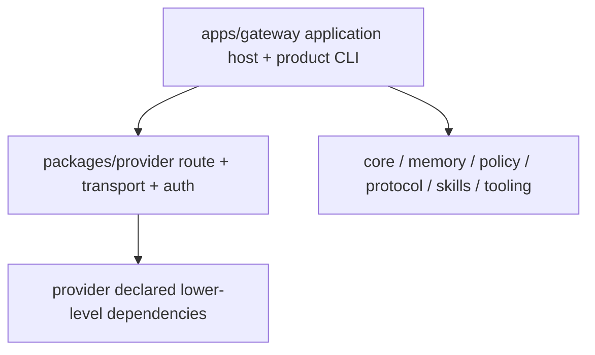

# Runtime Boundary Contract

**T012当前状态**：dependency selector、standard backend、preliminary import inventory、真实child observation与S011 release已闭合；GATE_DESIGN/GATE_TASKS/Implement=true。canonical v2=47 records、`through_task=T012` PASS，C09/C10 PASS；T013+未开始。

## 1. Package direction and migration

允许的生产方向：



禁止Provider production引用Gateway。D-03按machine manifest固定CLI15+config1+operations33+2-delete。13/5/9/6仅为role tags：41 imports与147可解析direct-name calls是stable tuple ceiling，只减不增但不冒充完整interaction graph；每个changed operations hunk另做attribute-call diff与manual adversarial responsibility review。domain→other=0，新F151 seam强制clean direction。

## 2. Provider route contract

Gateway：

1. 使用现有 `ProviderEntry` 归一化 v1 `auth_type/api_key_env/base_url` 与 v2 schema。
2. 解析alias、应用现有默认URL；transport显式值原样验证，缺省按`openai-codex→openai_responses`、`anthropic-claude→anthropic_messages`、其他→`openai_chat`映射为required值。
3. 把 optional schema URL 转为 required、非空 `ProviderRoute.api_base`。
4. `api_base`只允许absolute http/https；允许path，拒绝userinfo/query/fragment/control characters。
5. auth只允许复用既有regex验证的API-key env name或canonical OAuth profile reference；不接受`SecretStr`/raw credential。
6. 构造 `ProviderRouter(route_resolver=...)`。

`ProviderRoute`/`ProviderAuthRoute`是Provider包Pydantic `BaseModel`、`frozen=True`，字段严格为alias/provider/model/required transport/absolute api_base/env-name或OAuth-profile auth reference。真实`ProviderEntry`没有`extra_headers`/`extra_body`，DTO也不得新增它们。Codex OAuth等内置静态/动态headers由Provider内`BUILTIN_PROVIDERS`/`AuthResolver`生成；per-call `extra_body`仍是现有LLM调用参数。`provider_route.py`不得import Gateway/config/filesystem/http client。

ProviderRouter：

1. 不接收 project root，不 import/probe Gateway config，不复制 v1/v2 schema compatibility。
2. 只依据 ProviderRoute 建立 auth/transport client。
3. 保持 task-scope alias pinning：同一 Task 首次解析后的 provider/model route 不因 alias table 中途变化而漂移。
4. 保持`invalidate_provider_client`现状：只逐出`_client_cache`，不关闭共享HTTP、不清理`_task_alias_cache`；已pinned Task继续使用旧client，新Task下次创建新client；共享HTTP只在Router shutdown关闭。
5. resolver error 原样转为 typed route/config error，不 fallback 到第二 loader。

## 3. Execution semantics

| 域 | 输入/存储 | 允许值 | 输出/行为 |
|---|---|---|---|
| 用户delegation selector | 四个现役输入面的`target_kind` | case-sensitive `worker|subagent|acp_runtime|graph_agent|fallback` | 仅字段缺省用入口默认；显式空/空白/大小写/非string/其他值拒绝，不自动重选 |
| profile capability | profile/revision runtime capability | `worker|subagent|acp_runtime|graph_agent` | 不含fallback |
| Worker runtime choice | transient dispatch backend | `graph|inline` | `graph_agent→graph`；其他合法target→inline |
| Event decoder / Console | persisted payload / public projection | new write `inline`; historical read `inline|docker` | `register_session`无backend参数；未知历史值projection error；Graph→inline+metadata |

四域不得共享一个enum。`target_kind`是delegation语义，不是backend配置；`ExecutionBackend`只服务event/projection。`container_name`只保留历史JSON兼容。D-01删除`JobSpec`/`ExecutionRuntimeRecord`及exports/tests/docs；不建立history entity/service/registry。

四个用户输入面：三个`POST /api/control/actions` action——`work.split`、`worker.spawn_from_profile`、`worker.apply`的`plan.assignments[*].target_kind`——以及agent runtime tool `subagents.spawn`。`delegate_task`是硬编码producer，不算用户输入。

## 4. Fail-closed error matrix

| Boundary / trigger | Error code | HTTP / exit | 新业务/child Task | Work | 业务Task Event | cancel | audit | backend execute |
|---|---|---:|---:|---:|---|---:|---|---:|
| 三个Control Plane action：显式invalid/case/space/empty/non-string `target_kind` | `WORKER_RUNTIME_SELECTOR_UNSUPPORTED` | HTTP 422 | 0 | 0 | 0 | 0 | 2：REQUESTED+REJECTED | Inline=0；Graph=0 |
| 三个Control Plane action：合法Graph但preflight依赖不可用，或mandatory TaskRunner缺失 | `WORKER_RUNTIME_UNAVAILABLE` | HTTP 503 | 0 | 0 | 0 | 0 | 2：REQUESTED+REJECTED | Inline=0；Graph=0 |
| `subagents.spawn`：selector无效 | `WORKER_RUNTIME_SELECTOR_UNSUPPORTED` | stable tool rejection/error | 0 | 0 | 0 | 0 | CP=0；spawn=0 | Inline=0；Graph=0 |
| `subagents.spawn`：Graph/TaskRunner preflight不可用 | `WORKER_RUNTIME_UNAVAILABLE` | stable tool rejection/error | 0 | 0 | 0 | 0 | CP=0；spawn=0 | Inline=0；Graph=0 |
| 启动：front-door/security config不可读、解析、unknown或validator/exposure exception | `GATEWAY_SECURITY_CONFIG_INVALID` | exit 78 | 0 | 0 | 0 | 0 | 0 | Inline=0；Graph=0 |
| 启动：同步可解析的static runtime/root application config无效；包括front-door env override存在时的malformed runtime YAML | `GATEWAY_RUNTIME_CONFIG_INVALID` | exit 78，Uvicorn调用0 | 0 | 0 | 0 | 0 | 0 | Inline=0；Graph=0 |
| 启动：非空未知 `runtime.*` key | `RUNTIME_CONFIG_UNKNOWN` | exit 78 | 0 | 0 | 0 | 0 | 0 | Inline=0；Graph=0 |
| 启动：YAML/env退役key | `RUNTIME_CONFIG_RETIRED` | exit 78 | 0 | 0 | 0 | 0 | 0 | Inline=0；Graph=0 |
| 启动：旧专用env文件存在 | `LEGACY_LITELLM_ENV_FILE_FOUND` | exit 78 | 0 | 0 | 0 | 0 | 0 | Inline=0；Graph=0 |
| 启动：旧派生config文件存在 | `LEGACY_LITELLM_CONFIG_FOUND` | exit 78 | 0 | 0 | 0 | 0 | 0 | Inline=0；Graph=0 |
| 启动：`OCTOAGENT_LLM_MODE`非空且非`echo` | `LLM_MODE_INVALID` | exit 78 | 0 | 0 | 0 | 0 | 0 | Inline=0；Graph=0 |
| FastAPI lifespan：static config已通过但真实runtime service composition/assembly失败 | existing startup failure（不得改写为static config code） | process nonzero；readiness/request=0 | 0 | 0 | 0 | 0 | 0 | Inline=0；Graph=0 |
| 请求期：security config source/read/validation失效 | `FRONT_DOOR_CONFIG_INVALID` | HTTP 503 | 0 | 0 | 0 | 0 | 0 | Inline=0；Graph=0 |
| preflight成功后Graph execute竞态失效 | `WorkerBackendUnavailableError` | typed domain error，无HTTP | 0（同一既有Task） | 0新增 | 同一Task terminal FAILED恰1 | 0 | action REQUESTED+COMPLETED | Inline=0；Graph尝试≤1 |

422只表示用户输入值域错误；503只表示服务端在请求期无法提供已声明能力；exit78只表示进程启动配置错误。Control Plane audit与业务events分栏。测试必须先预热或按ID排除lazy `ops-control-plane` audit singleton，并按本次request_id计数；不得断言EventStore或TaskStore总增量0。基线没有独立task-create target REST；F151不新增API。

`worker.apply`必须在任何descendant cancellation、merge、Task/Work/Event写入前对整个assignments batch完成selector与availability预检；任一项失败全批0副作用。`subagents.spawn`在batch loop前做相同静态preflight，但不改变capacity/blacklist运行期partial-accept既有语义。`worker.spawn_from_profile`缺TaskRunner不得fallback到`TaskService.create_task`。

唯一入口`python -m octoagent.gateway`先解析exact help/host/port，duplicate/unknown exit64；随后在typed boundary内只import一次`main.app`。import触发`main.app=create_app()`唯一application构造与canonical static preflight。`_resolve_front_door_mode`先无条件完整`load_config(project_root)`恰一次，再保持env mode>YAML mode>loopback；env override不能绕过invalid runtime YAML。entry把该app instance与exact-equal host/port交Uvicorn，不传`main:app`字符串、不新增第二preflight/global snapshot。真实service composition仍只在lifespan/OctoHarness发生，失败时不ready、不serve、process nonzero且workload副作用0，不映射78。普通四类descriptor read/start/restart目录0写；legacy/invalid typed reject，只有显式operation可validated atomic migrate/repair。

## 5. Retired input contract

完整表见 [`../inventories/config-retirement.md`](../inventories/config-retirement.md)。机械检测点：

- YAML exact paths `runtime.llm_mode`、`runtime.litellm_proxy_url`、`runtime.master_key_env`：`OctoAgentConfig.from_yaml()` raw dict、`model_validate()` 前。
- files `.env.litellm` / `litellm-config.yaml`：project/instance root resolved后、任何dotenv/config open前，只调用`exists()`；普通application/start退出，只有`octo auth`/`octo setup`恢复命令可在不assembly application且不读取旧文件的前提下继续。
- env exact keys：dotenv load 后、application/Harness assembly 前；key 存在即命中，包括空值。
- `OCTOAGENT_LLM_MODE`：unset/empty 或 `echo` 合法；其余 typed reject，不属于 tombstone。

不得读取、复制、自动迁移或备份旧文件内容。重新授权只经 `octo auth`/`octo setup` 写入 canonical path。降级只恢复用户升级前备份；F151 不生成旧文件。

## 6. Managed update worktree safety

workspace sync在任何fetch/checkout/reset/merge/`uv sync`前执行`git status --porcelain=v1 --untracked-files=all`等价检查；tracked unstaged、staged、untracked任一存在均返回typed `LOCAL_CHANGES_PRESENT`。失败路径不得执行fetch、checkout、reset、merge或uv，HEAD、index与所有文件字节不变。

保护必须同时存在于UpdateService application preflight与descriptor命令自身，防止持久化descriptor绕过。普通读取绝不normalize/save；旧危险descriptor只在显式install/update/bootstrap transaction中validate后atomic migrate。invalid JSON普通读取不得生成`.corrupted`副本；explicit repair要求replacement+expected digest且失败保留原字节。L4使用DI runner；L3使用无remote真实tmp Git。

UpdateService还必须通过store原子claim/same-owner update/compare-and-release消除active-attempt TOCTOU；TelegramStateStore所有9个mutator在同一个FileLock事务内完成RMW。两者按`test-ownership.md`为must-fix，不得藏入atomic move。

## 7. Runtime ownership and teardown

`AgentContextService` 与 `TaskService` 构造 contract：

- `runtime_services=<RuntimeServiceBundle>` XOR `storage_only=True`；
- 缺失或同时提供立即抛 typed construction error；
- storage-only 调 runtime/model/memory-extraction 方法立即抛 typed mode error；
- storage-only构造不得创建MemoryRuntime、auto-load reranker、background task或网络对象；
- 禁止 class attr/setter、process registry、`bundle=None` fallback。
- AgentContext/TaskService storage-only使用`runtime-operation-modes.v1.json`正向machine allowlist；它枚举每个public/production-called-private qualname、允许mode/capability及production constructor callsite。gate从AST重算调用点全集与storage entrypoint可达图：missing/extra/unknown method、unknown constructor、storage→runtime/model/background/network任一路径默认拒绝。TaskService源码基线48=4 runtime+44 storage；T062先删除worker-profile fallback构造，T084再复用Orchestrator两组重复实例并把1141改为storage-only预计算完成，目标45=3+42。

测试构造inventory与production分开：TaskService144=123 live test/nested（含3 skipped）+20 helper+1 shadowed，AgentContext31=23 storage-only+8 runtime。identity均唯一并先投影Provider test final path。T084准确rename后迁explicit XOR/bundle identity；C084 machine behavior-owner map与44 owner paths双向相等并展开42 files+3 exact nodes=45 selectors。F033两个既有skip节点中的3个构造点必须改为确定性restart持久状态/跨project隔离oracle并取消skip；20个helper identity用reverse-call fixture/test reachability证明，不能用path存在或整文件collect冒充。完成态selected>0、fail/error/skip/rerun0。

composition顺序：storage-only Hook→SkillRunner→final LLM→bundle。普通模型路径只读bundle final LLM。precomputed seam复用Task/Event/Artifact/checkpoint原语，并复用既有`agent_context_session_replay.py`中唯一storage persistence primitive保存SessionContext/turn/session；runtime wrapper才额外触发SessionMemoryExtractor。预计算路径extraction/model/Router/recall/compaction=0，不接受LLM对象，不复制session算法或形成第二service/runtime。

shutdown 顺序与所有权：

1. snapshot drain；
2. stop producers；
3. final loop drain；
4. `LLMService.aclose()`→`SkillRunner.aclose()`→`ProviderModelClient.aclose()` local-only chain；
5. `RuntimeServiceBundle.aclose()`唯一调用`ProviderRouter.aclose()`关闭shared clients；
6. stores close。

`ProviderModelClient.aclose()`只清local history，绝不关Router；bundle唯一关闭Router。三层local `aclose`与bundle `aclose`均有instance idempotence guard，`OctoHarness.shutdown()`另有instance guard/lock，因此4–6 exactly-once。

F151隔离承诺只覆盖bundle/service/background identity；`TaskService._task_locks`与terminal callback coordination不属于service injection，保留现有register/unregister lifecycle并由no-worsening test保护。

## 8. Wheel contract

### Process isolation

- 本地 wheelhouse、非 editable、`--no-index --find-links`。
- cwd 为 repo 外临时目录。
- HOME、XDG_CONFIG_HOME、XDG_DATA_HOME、XDG_CACHE_HOME、XDG_STATE_HOME 均指向独立临时目录。
- `PYTHONNOUSERSITE=1`，`PYTHONPATH` 删除/为空，source root 不出现在 `sys.path` 或 installed metadata。

### Provider-only

- Provider import 成功；Gateway `find_spec` 为 `None` 且未进入 `sys.modules`。
- metadata 不声明 Gateway/CLI/Memory 依赖。
- base LiteLLM 若存在，只能由 pricing module import；runtime/turn/client source scan 为零。

### Gateway

- manifest direct deps严格遵循[`../inventories/wheel-dependencies.md`](../inventories/wheel-dependencies.md)的Gateway 7 internal+25 third-party main与3组named extras、Provider 1 internal+6 third-party main；constant dynamic keyring必须被扫描；gate同时比较AST import mapping和wheel `Requires-Dist`，transitive安装不算direct。
- `octo --help`、`octo doctor --help`、`octo auth --help` 成功；迁移后的`octoagent.gateway.services.operations.update_worker`可从wheel解析/启动到source/argument guard，不引用旧namespace。
- `import octoagent.gateway.main`只证明ASGI contract；真实service host全部使用`python -m octoagent.gateway --host ... --port ...`。clean-wheel验证exact argv、unknown/duplicate exit64、startup/SIGTERM、invalid exit78和descriptor→entry，不把ASGI import当第二production启动授权。
- `/ready?profile=core` 是结构检查：local stores/artifacts/mandatory runtime services ready，non-Echo canonical alias 可解析为 ProviderRoute；不做 DNS/HTTP/model call。full wheel L3还要通过Gateway routes实际解析到operations backing services，不能只import CLI。
- malformed security/runtime config subprocess exit 78。
- source-only guard在任何副作用前执行：`octo service install|uninstall`、`octo update|restart|stop`、install-bootstrap module与`octo-bench`在wheel环境返回exit 69 / `SOURCE_CHECKOUT_REQUIRED`；`service status`、`logs`和help保持可用。

### Standard backend scaffold

- T012 combined实现预算仍恰为runtime checker、root pyproject/lock与唯一clean-wheel checker四项；Provider/Gateway manifests及runtime产品代码diff=0。import分类与child observation只能增加clean-wheel checker中机器分区的pure seams，不扩大文件预算。
- checker必须直接调用项目声明的`hatchling.build.build_wheel`，构建当前core/provider/protocol/tooling/skills/policy/memory/sdk/gateway九个workspace distributions并从真实wheel archive读取METADATA。禁止手写zip/wheel/METADATA/RECORD、根据source manifest合成wheel事实、复制source tree或editable安装。
- isolated install只允许单一共享helper调用`uv pip install --offline --no-deps --target <transaction/site> <local wheels...>`；wheel input全部来自本transaction。`UV_CACHE_DIR`、HOME、XDG与TMP均指向transaction root，child `PYTHONPATH`不得继承source。Provider-only closure不可发现Gateway；Gateway closure中所有workspace module origins必须位于isolated target。第三方依赖可来自当前locked project environment，但不得把workspace source/editable origin混入。
- checker必须拒绝：pin缺失/版本漂移、Hatchling进入runtime deps、lock缺少exact backend或与pyproject漂移、backend不为`hatchling.build`、manual builder、host cache/HOME fallback、source/editable泄漏、shared venv未安装locked scaffold却报告PASS。标准backend不可用时fail closed并回Gate，不能降级为第二打包算法。
- root pyproject/lock由S012 Hatchling scaffold add与S047 SDK retirement delete分别拥有exact `dependency:` selector；三态为`pre_T012` Hatchling absent/SDK present、`T012_target`两者present、`T048_target` Hatchling present/SDK absent。required_absent与required_nonempty必须匹配真实state；add/delete delta各自nonempty且互斥，不允许ownership transfer、散文alias、same-key double owner或把absent坐标要求为nonempty。
- `S012-dependency-selector-semantics`已以exact L4 node完成R/G/R，证明`check_rgr_selectors(repo, scope)`用tomllib解析上述transition并拒绝各类单缺陷；fresh semantic revalidation=0。standard-backend/import/child/S011的active合同已GREEN/REFACTOR，唯一clean-wheel checker只使用标准backend、exact RECORD owner和child JSON。
- `S012-standard-backend-scaffold`已有独立且main接受的RED；旧T011 replacement RED不覆盖pin/lock/backend/manual-builder/host/source负例，不能冒充它。其exact node只能调用唯一checker的typed pure seam，不新增CLI/parser/runner。旧32-symbol aggregate=`244ccc7c0b466d71b8affbc5c44a93679daece42209c14a0430e21d054f689a7`是predecessor合同快照；S011 helper/node按新分类语义改写时旧direct RED降级，必须取得fresh successor RED/binding，standard-backend exact node/helper AST不变。
- `S012-import-classification-inventory`与`S012-child-isolation-observation`各有独立RED/GREEN/REFACTOR。前者只扫描被评估distribution拥有的installed files，逐occurrence分类`runtime-required|optional-lazy|type-checking|test-plugin`，并以正交`workspace_owner`及`ownership_state=resolved|unowned`如实输出delta/unowned exact projection/`final_verdict=null`；后者要求同一真实import child输出cwd/sys.path/env/site/origins，parent不得推断。最终manifest严格闭包由T023变更、T070验证。
- 该单一批次已按test rewrite→fresh direct RED governance→checker/scaffold→三个S012 GREEN/REFACTOR→S011 GREEN/REFACTOR完成；不得重放bootstrap或覆盖已接受证据。
- main在独立`/tmp`完成的九wheel实验只是Design可行性；grouped batch内的shared-venv offline scaffold也只是一次local toolchain preparation，不是release evidence且不得重放。worktree禁止`uv sync`，CI/Final必须从committed lock经正常`uv sync --dev`取得backend。

首次完整clean-wheel只在Proxy/SDK absence、namespace、source guards与startup owners全部实施后执行。T012 preliminary只运行`provider`与`gateway --level relocation`：标准build、source manifest=真实wheel METADATA、distribution-owned installed import inventory、真实child isolation与three-help。当前manifest/runtime差异必须完整输出，`final_verdict=null`、`final_owner=T070`；任何final PASS均失败。T070才首次启用full/all并执行最终direct dependency closure。

direct import分类的唯一可执行语义是逐occurrence：unconditional module/function-body import为`runtime-required`；函数内位置本身不构成optional；仅真实ImportError/ModuleNotFoundError或availability fallback内的literal import为`optional-lazy`；`if TYPE_CHECKING`为`type-checking`；installed test/plugin module为`test-plugin`。workspace归属只由具体module file的唯一target RECORD写入正交`workspace_owner`。third-party resolved owner来自target，或当前项目解释器purelib的具体file RECORD且Name/Version与worktree lock exact一致；找不到owner的literal edge必须以`ownership_state=unowned`完整保留，不能伪造distribution。ambiguous、损坏RECORD、unknown/nonliteral dynamic、target-wide扫描、path/name allowlist、ambient metadata map、user-site/HOME/cache/source checkout owner或隐藏delta均fail closed。

child isolation facts只能由执行同一import transaction的child返回：cwd、ordered sys.path、exact HOME/XDG/TMP/cache/PYTHONNOUSERSITE/PYTHONPATH、site/user-site、prefix/base-prefix与workspace origins。parent只验证该对象；重构预期search paths或以bool/常量空列表冒充观测失败。

## 9. Static gate contract

统一入口 `check-runtime-architecture.py` 必须支持且独立返回：

- `import-direction`
- `retired-terms`
- `complexity --base-ref "$BASE_REF"`
- `quality-smells`
- `tdd-evidence run --slice <id> --phase <RED|GREEN|REFACTOR> --mode local-working-tree --base-ref "$BASE_REF" --evidence-index .specify/features/151-runtime-boundary-architecture-truth/evidence/evidence-index.v2.json`
- `tdd-evidence verify --mode <local-working-tree|committed> --base-ref "$BASE_REF" --evidence-index .specify/features/151-runtime-boundary-architecture-truth/evidence/evidence-index.v2.json [--through-task <id>]`
- `tdd-evidence recover-index --bootstrap-anchor-file <exact> --bootstrap-anchor-sha256 <sha> --rejected-index <exact-v1> --rejected-index-sha256 <sha> --corrective-red-root <exact> --corrective-red-aggregate-sha256 <sha> --main-review-message-id <exact-main-id> --output .specify/features/151-runtime-boundary-architecture-truth/evidence/evidence-index.v2.json`（main二次release后用完全相同argv可重入；未知混合态失败0写）
- `finalize-verification --mode local-working-tree --base-ref "$BASE_REF" --evidence-index .specify/features/151-runtime-boundary-architecture-truth/evidence/evidence-index.v2.json --output .specify/features/151-runtime-boundary-architecture-truth/verification-report.md`
- `all --base-ref "$BASE_REF"`

`all`必须在任何PASS摘要前解析`base-ref`与merge-base，并把同一resolved commit传给每个base-aware subgate；现有S004 compound node同时包含valid ref正向控制及missing/unresolvable ref负例。参数存在但未消费、子gate各自解析出不同commit或invalid ref仍exit0均失败。

clean-wheel入口的最终命令面必须支持`provider`、`gateway --level relocation|full`、`all`（all固定full）。T012已解析但尚未到期的`full/all`只能返回typed phase deferral；T070后才可执行。每个subcommand以机器可读JSON+人类摘要报告自己的count/path/error；任一失败令该subcommand非零，phase deferral不得计作PASS。

`S011-clean-wheel`五nodeid保持稳定，但其requires-dist/isolation断言必须改为上述preliminary语义。任何改写使旧test SHA `294b2e…238f5`、aggregate `240558…db84da`与binding `61047e…9f061`只成为superseded history；新合同须先observable-delta/test-code review，再由main创建不同exact root并形成fresh direct RED、review ID与binding。旧/tmp/review/aggregate/binding复用失败。

Gate批准后的单一批次顺序为：test rewrite与observable-delta→`S012-import-classification-inventory`/`S012-child-isolation-observation` RED+fresh S011 direct RED→checker/scaffold实现→三个T012 behavior slices GREEN/REFACTOR→S011 GREEN/REFACTOR。可逆、hermetic、machine-scope内命令连续执行；仅合同矛盾、scope/authority变化、外部/破坏性动作或架构分叉停。唯一checker中21 selectors互斥：S011=6、standard=5、classification=3、child=2、T070 full=4、final closure=1。

canonical v2第33条`(formal-rgr,T011,S011-clean-wheel,RED)`的字节链必须保留，但其旧测试合同跨越T017-T029 namespace transaction、T045、T064与S070/T070，状态固定为`VALID_BYTES_FOR_SUPERSEDED_CONTRACT / NOT_RELEASE_EVIDENCE`。它不能删除、覆盖、移动、重跑或单独满足T011 release gate。main复审后的corrective preliminary RED使用machine lifecycle冻结的repo-root cwd、有序三项env、有序argv与12字段tree，直接transaction写入固定`/tmp/f151-s011-clean-wheel-preliminary-red-main/RED`六件套；逐件SHA/size map、canonical aggregate、test SHA、唯一main review ID与attestation binding须先经artifact-only truth sync写回machine lifecycle/producer binding。该direct证据不进入v2、不是第二runner/index；原始/tmp字节保留到T012 REFACTOR复审，T103最终验证main attestation而不依赖/tmp永久存在。T012 formal GREEN前必须先有完整binding；T103必须证明record33仍是chain-required、release-excluded。

### Import direction / legacy role ratchet

扫描 AST imports与可解析direct-name calls；迁移前按machine maps投影canonical target。Provider→Gateway、旧namespace、services/routes→CLI、domain forbidden imports清零。41 import/147 direct-name entries用stable identity，等量替换也失败；报告必须明确这是ceiling而非complete interaction。changed hunks另解析attribute calls/side effects并生成adversarial review清单；未审查或新增职责失败。

### Retired terms

扫描 production、tests、manifests、root configs/examples、frontend、scripts、skills、README、constitution、current Blueprint/实现文档。例外必须是 exact path + exact symbol + purpose；合法 HTTP/trusted proxy、pricing-only dependency、history decoder/tombstone 不得被宽泛误杀。

### Complexity schema v1

扫描路径：

```text
octoagent/apps/*/src/**/*.py
octoagent/packages/*/src/**/*.py
```

排除 build/vendor/generated。snapshot JSON 最低 schema：

```json
{
  "version": 1,
  "scanner_version": "f151-v1",
  "ruff_version": "0.15.4",
  "ruff_config_sha256": "...",
  "paths": ["octoagent/apps/*/src/**/*.py", "octoagent/packages/*/src/**/*.py"],
  "rules": ["C901", "PLR0911", "PLR0912", "PLR0913", "PLR0915"],
  "total_by_rule": {"C901": 167},
  "hotspots": {
    "octoagent/apps/gateway/src/octoagent/gateway/services/task_service.py": {
      "by_rule": {"C901": 4},
      "logical_loc": 2709,
      "max_function_span": 357
    }
  }
}
```

- 编码前冻结的完整真实snapshot为[`../inventories/complexity-ceiling.v1.json`](../inventories/complexity-ceiling.v1.json)：total=658，五rule分计数与六个hotspot全部numeric leaf均已记录。
- Ruff必须为`0.15.4`且`[tool.ruff]` normalized config SHA-256匹配snapshot；版本/指纹变化先失败并要求独立scanner review。
- Ruff `--output-format json` 统计固定 rules。
- logical LOC 用 Python `tokenize`：一行存在非 comment/encoding/indent/dedent/newline/nl/endmarker token 才计数。
- max span 用 AST FunctionDef/AsyncFunctionDef `end_lineno-lineno+1`。
- current 每个 numeric leaf 必须 `<=` committed snapshot ceiling。
- PR current 每个 leaf 必须 `<=` merge-base actual；merge-base 由 base ref 算出，`git archive` 到 temp tree 后用同一 scanner/version 扫描。
- implementation的repo-scripts snapshot必须在Phase 0、任何production edit前byte-for-byte复制/验证feature inventory；不得等实现后首次创建。
- 已存在 snapshot 时，`--write-snapshot` 只能人工把 numeric leaf 降到 current actual；任何上升、schema/path/rule 隐式变化均拒绝。CI 只读，永不自动刷新。

指标下降无需刷新 snapshot：下一 PR 的 merge-base actual 会锁住新的低水位。若 scanner/schema/path 版本升级，须单独 review 并重新证明 old/new 可比性。

### Quality smells

`quality-smells`按[`../inventories/architecture-quality.md`](../inventories/architecture-quality.md)输出`must_fix`、`ratchet`、`follow_up`三栏。Verify要求must-fix=0、ratchet所有冻结计数不升、follow-up只含已批准ID；其中dirty-worktree destructive update、Telegram锁外RMW、Update active-attempt TOCTOU为must-fix，backup path mix为follow-up且4 helpers/13 production consumers不得增长。test-owner gate读取[`../inventories/test-ownership.md`](../inventories/test-ownership.md)并要求operations33/33有owner、高风险模块direct L4。未分类新增global mutable state、compat branch、DTO字段、runtime selector或第二路径立即失败并要求回到Gate。complexity结果不得替代职责/依赖/状态审查。

### TDD evidence

formal runner/verify语法见RGR manifest。local required set合并committed/staged/unstaged/untracked最终态并按machine maps投影；committed mode要求相关worktree clean且只扫描merge-base→HEAD。两种mode都必须真实解析`base-ref`并计算merge-base，不存在的ref失败。`through-task`只接受tasks/RGR machine DAG中的existing task，要求截至该task的全部required evidence并禁止追索future；unknown task、未使用参数或空required-set假绿失败。markdown/scope ID集合必须相等；selector grammar解析非空并覆盖hunk，非shared不相交，shared subgroup all-required。`planned-diff.v1.json`必须解析真实存在field并与slice owner/changed path三向闭包；F151 current与superseded history artifacts都必须有exact S002 owner且不能被archive glob排除，declared-new不授予ownership。

“相关worktree clean”的唯一机械定义是现有fingerprint scope：读取`git status --porcelain=v1 -z --untracked-files=all`，保留所有staged、unstaged、untracked路径，仅排除lifecycle登记的exact generated evidence outputs与canonical anchor/index。committed mode在扫描base→HEAD前发现任一剩余状态即`EVIDENCE_COMMITTED_WORKTREE_DIRTY`；不得按production-only、tracked-only或CI环境放宽。clean tree正向通过；evidence-only生成物不构成dirty拒绝。

T006纠正的append-only合同固定为：既有v2的20个record object/hash和12个canonical run逐字节不变；尾链严格为两条RED、两条GREEN、两条REFACTOR，每阶段均按`S006-committed-worktree-clean`→`S006-index-amendment-integrity`排序。已接受dirty RED与未来index RED先作为main可审查的exact六件套存在于同一T006 corrective parent，未获批准时不进入index。两组aggregate按UTF-8 canonical JSON `{slice_id: artifact_aggregate_sha256}`（`sort_keys=true,separators=(',', ':')`）形成唯一combined aggregate，并只绑定一个main review ID。main接受后，既有`run`命令以exact parent+combined SHA只读采用；写index前全量重验旧链/旧run/两组RED，使用一次temp+fsync+atomic replace同时追加两条RED。失败或未知中断状态不覆盖prior index/run；replace后重入不得重复或部分追加。`through-task T006`要求六条尾链齐全后才通过且不追索future，其他task按RGR DAG计算，不能只比较数字上界。

`S006-index-amendment-integrity`必须以独立exact L4 node覆盖：valid两RED一次采用、prior20 object/hash与12runs不变、chain/reentry；missing/partial/mutated artifact、错误combined aggregate、错误或复用review ID、corrupt prior index、extra/unindexed run、duplicate/wrong-order record均fail closed且index原字节不变。checker capability尚不存在时，RED只允许由该node中的显式capability-absence assertion产生`F151_T006_INDEX_AMENDMENT_CONTRACT_MISSING`；argparse exit2、collection/path/usage错误均无效。

T001-T004的main anchor与36个bootstrap raw保持不可变。首轮`evidence-index.v1.json` SHA `1ad740db7bb515c633e48c42c75da92dd310ad7bc1e1993cdd973c9c52023adb`及其12组GREEN/REFACTOR（aggregate `a8f84281dd3749a5e80facf724fb40fb4ec20bdfb9e84c0a0edccb500501ba62`）为REJECTED，不得删除、覆盖、补跑、stage或复制为valid record。纠正测试必须先用现有S004/S002 nodeids对当前checker取得一次main可审查的真实RED。main二次release后，`recover-index`先全量验证旧SHA、anchor/raw、旧run exact set、corrective RED aggregate，并从exact CLI消费非空且未复用的`--main-review-message-id`；该ID与aggregate形成canonical approval binding，不能从聊天/env/default推断。

恢复不声称跨index/runs/v2多路径atomic或失败rollback。它按path存在性与冻结hash唯一识别R0 source、R1 runs quarantined、R2 v1+runs quarantined、R2 partial temp、R3 durable temp、R4 complete：先rename runs并fsync parents，再rename v1并fsync，再以确定性created UTC写temp/fsync，最后`os.replace`并fsync。进程在runs rename后、v1 rename后、temp写前/中/已fsync、replace后任一点中断，都以完全相同argv继续；R2下只允许清除不完整的recovery-owned temp，其他混合态0写fail closed。R4每次仍做完整schema/chain/run验证。

canonical index顶层exact fields固定为`schema_version,feature_id,bootstrap_anchor_path,bootstrap_anchor_sha256,base_sha,created_utc,recovery,records,chain_head_sha256`。`feature_id=F151`；bootstrap path/SHA必须等于filesystem唯一anchor；`recovery`精确绑定rejected v1 SHA/run aggregate/quarantine root/main review id/corrective RED aggregate与approval binding。每条record要求exact lifecycle字段以及`previous_record_sha256`与`record_sha256`，两者均为64位小写hex且record hash唯一。genesis与record均用UTF-8 canonical JSON（`sort_keys=true,separators=(',', ':')`）计算；record hash排除自身`record_sha256`但包含`previous_record_sha256`，`chain_head_sha256`严格等于末条record。record identity固定为`lifecycle_type+task_id+slice_id+phase`；前8条依次为anchor顺序的6条bootstrap RED、S004 corrective RED、S002 corrective RED，rejected v1 record数量为0，之后才按固定slice顺序进入GREEN、REFACTOR。validator必须从genesis顺序重算全部records；删除、插入、重排、替换任一prior record均失败。

canonical phase0/corrective/formal run目录的实际集合必须与records双向相等；额外S999、缺失目录或rejected quarantine被索引均失败。`invocation.json`使用冻结exact keys；三类`tree.json`统一使用与immutable bootstrap raw相同的12字段：`version,slice_id,phase,base_ref,merge_base_sha,head_sha,head_tree_sha,worktree_fingerprint,fingerprint_scope,fingerprint_files,status_porcelain,captured_utc`。artifact内容与record的slice/phase/base-ref/base/head/tree/fingerprint scope/files/status/captured UTC以及CLI task/argv/env/cwd/timestamps全部交叉相等。same-anchor existing index仍先执行完整schema/chain/run closure验证，禁止仅比较anchor SHA后return。

`artifact-lifecycle.v1.json`的4个Final committed paths必须与first_state、first_writer task、producer command和Final required set双向相等；canonical committed index改为v2，v1只在exact rejected quarantine保留。C25的前置只包含T120-T123、全部required architecture/clean-wheel/coverage/frontend/benchmark/evidence gates及T124 input closure；T124完成、C25成功和report自身不得成为前置。C25成功即形成T124 output：先在内存构造exact report并验证required set，再temp+fsync+atomic replace；任一失败时output不存在或原字节不变。任何可选exact path、无producer path或producer多写路径失败。

checker必须有完整pytest/Vitest valid RGR accept paths，并拒绝missing/fake、optional/missing/duplicate record hash、top-level或record extra/missing field、artifact bytes替换、anchor mismatch、same-anchor corrupt index、mixed tree/base/argv/JUnit/raw、minimal invocation/tree、oracle/failing-set/额外failure/错误assertion、prior record delete/insert/reorder/replace、unindexed/extra run、selector、collection、skip/rerun/blanket argv、dirty-zero、invalid/ignored mode/base/through-task、scope/ref/overlap伪造。formal Python/Frontend producer只能写`evidence/local/runs/<slice>/<phase>/`，且输出集合必须精确等于`junit.xml/stdout.txt/stderr.txt/exit-code.txt/invocation.json/tree.json`；`.bin`、`run.json`、非canonical root、缺件或多件失败。Phase0 main通过唯一exact `bootstrap-anchor.v1.json`+外部SHA提供机器输入；runner只能消费，不能生成/替换/二次锚定。Pytest JUnit以leaf suites聚合single/nested tests/failures/errors/skipped并与testcase count交叉；missing/malformed suite fail closed。RED node须由本task先创建并collect；future/not-found无效。raw/JUnit/LCOV遵循phase lifecycle，未知ignored path、早于first_state或错误first_writer均失败。atomic relocation只用manifest证据。

### Changed-lines coverage

只扩展既有`repo-scripts/check-changed-lines-coverage.py`：`committed`模式继续扫描`base...HEAD`；`local-working-tree`模式合并HEAD committed diff、staged、unstaged与untracked production `.py`新文件，不能因HEAD未变化报告0。EXEMPT输出独立状态，不能文案化为`>=90 PASS`。Verify由T122以exact `F151_COVERAGE_STAGE=T122`在同一步生成fresh临时LCOV，记录base、start UTC、HEAD/tree/worktree fingerprint与artifact freshness后执行checker；复用T105或stage/start binding不一致、missing/stale/mismatched artifact失败。该门只覆盖Python production，frontend只由完整Vitest+tsc验收。architecture job不生产/消费LCOV，backend coverage lane独立拥有artifact。

## 10. CI and documentation

- tests-first fixtures 必须在修改 pre-commit/CI wiring 前落地并观察预期失败；lane/pre-commit/workflow contract用同一selector完成RED→wiring GREEN→REFACTOR，不得先改wiring后补测试。
- architecture gate 位于 docs-only fastpath 之前。
- GitHub workflow增加独立architecture job/step，不依赖`lane.py pr`或backend tests：`pull_request`用`github.event.pull_request.base.sha`，`push`用`github.event.before`（全零SHA时显式fallback `HEAD^`），`fetch-depth: 0`后求merge-base。
- workflow path filters 至少包含 `octoagent/**`、`repo-scripts/**`、`docs/**`、`.specify/memory/constitution.md`、F151 feature artifacts 与 workflow 自身。
- `S100-workflow`只拥有lane/pre-commit/workflow hunk；constitution、Blueprint、codebase architecture由后续`S104-docs` exact static/semantic truth selector独立执行RED→GREEN→REFACTOR。S104从Blueprint与实现索引反算候选并扫描`authority-docs.v1.json`全部17个exact documents（含`api-and-protocol.md`、`architecture-tradeoffs.md`）；显式历史陈述可保留，现役/必选/✅表格/Mermaid链中的退役Proxy/kernel/worker/current Docker事实失败，authority index链接但未列文件也失败。F151 current与superseded history artifacts都是pre-T001 governance inputs，由`S002-manifest-integrity`纳入final planned closure但不冒充未来behavior hunk；只有current可满足S104 authority，S104最终重验其authority一致性。Round4-9 reviews按`active-artifacts.v1.json`为SUPERSEDED，不能满足Round10 assertions。
- benchmark tests 使用独立 lane，不依赖 root pytest discovery。
- final gate包含确定性C23 `-n auto --dist=loadgroup` CI shape、确定性C24 all transaction、clean-wheel all、六个architecture subcommands、frontend Vitest/tsc、benchmark lane、fresh changed-lines coverage与docs scan，并证明无新增quarantine/rerun。F151不登记或运行C18/`lane.py baseline`，任何自动stage/producer若读取宿主凭证、依赖默认HOME/凭证存在/skip作授权、访问真实模型/网络或产生外部成本必须失败；另行提出的manual live检查必须先由main核对并取得用户当次明确授权，且不成为F151自动证据。

## 11. TDD 与测试分层

完整命令/文件/oracle矩阵见[`../inventories/testing-matrix.md`](../inventories/testing-matrix.md)。每个行为切片必须按稳定RED（只因目标行为缺失）→GREEN（同一selector）→REFACTOR（定向+architecture gate）记录证据。namespace move明确为two-stage atomic relocation：T029从冻结base重算normalized source AST/content与source→target projection，保存target snapshot/可验证patch、逐文件hash、三个exception、absence/import/entrypoint；T029之后target symbol变化由machine scope+RGR evidence授权。Final复验T029 snapshot against base，不以当前target raw hash替代。negative fixtures必须拒绝T029夹带业务hunk、接受有授权的post-T029修改并拒绝同一未授权修改；不得制造虚假单元RED。

L4覆盖纯逻辑、model、store、service、adapter；L3覆盖bootstrap/API/Event/storage/LLM scripted dispatch；L1只覆盖浏览器独有语义；L2只覆盖真判断力/真实外部系统且仅release/manual。F151预计新增L1=0、L2=0，任何偏离必须先回Gate说明独有价值。worktree命令必须使用tests/AGENTS的PYTHONPATH锁、`--no-sync python -m pytest`；禁止网络/真LLM/宿主状态或凭证/外部成本、固定sleep、blanket rerun与复制生产算法，时序测试按要求`xdist_group`。

changed-lines coverage≥90%是最低门，不足以证明分层、contract或oracle质量。每次Review必须分别报告RGR、L4/L3/L1/L2、依赖分层、坏味道与coverage。

## 12. F151 / F150 boundary

精确manifest见[`../inventories/f150-scope.md`](../inventories/f150-scope.md)。Gate只比较F150-owned 7 protected symbols、2 handler与module-entry exact symbols；该universe内未授权semantic diff=0。D-03 main import-only另由namespace gate批准且body不变；无关F151 production diff交其他inventory。不得改变loopback/bearer/trusted_proxy或Host/Origin/Access语义。

当前baseline只有`OctoAgentConfig.front_door`/`FrontDoorConfig`，尚无`manifest_path`或`owner_email`字段。F151只冻结现有canonical schema/loader/setup IO作为未来F150字段的唯一允许落点；本Feature不得添加、实现、迁移或测试期待这两个字段。F150实施时必须在rebase后显式更新protected hash/allowlist与canonical loader/setup tests。
