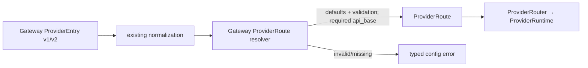

# F151 Data Model / Runtime Value Objects

F151 不新增持久化表、event schema、registry 或 runtime service。允许的新运行时值对象/持有者只限 `ProviderRoute`（含嵌套 auth reference）与实例级 `RuntimeServiceBundle`。

## ProviderRoute

所属包：`octoagent.provider.provider_route`。由 Gateway canonical resolver 构造，ProviderRouter 只消费。两个DTO均为Pydantic `BaseModel`、`frozen=True`；字段只覆盖当前真实路由输入，不为未来配置扩展预留开放容器。

| 字段 | 类型 | 约束 |
|---|---|---|
| `alias` | `str` | 非空；用于诊断与 task-scope pinning |
| `provider_id` | `str` | 已验证 adapter id |
| `model_name` | `str` | 真实模型标识；业务层仍只传 alias |
| `transport` | Provider literal/enum | required；仅`openai_chat|openai_responses|anthropic_messages` |
| `api_base` | `str` | required absolute http/https；允许path；拒绝userinfo/query/fragment/control chars；不得为 `None` |
| `auth` | nested `ProviderAuthRoute` | 仅 kind + env/profile reference，不含 raw credential |

`ProviderAuthRoute` 与 `ProviderRoute` 同包定义，不是独立 service；值域只允许：

- `api_key` + 非空 environment variable reference；
- `oauth` + 非空 canonical profile reference。

不允许 raw API key、`SecretStr`、Authorization/Cookie 等header value、Gateway config object、project/YAML path或第二loader。API-key env name复用Gateway既有`^[A-Z][A-Z0-9_]*$`约束；OAuth只传canonical profile reference。

`ProviderRoute`不含`extra_headers`或`extra_body`。Codex OAuth等内置headers仍由Provider包的typed `BUILTIN_PROVIDERS`与`AuthResolver`生成，`Authorization`/`chatgpt-account-id`等运行时值不跨DTO。`SessionMemoryExtractor`等现役per-call `extra_body`继续作为调用参数传给LLMService，不变成route config。

### 转换责任

optional `ProviderEntry.api_base`的默认化与非空校验只发生在Gateway resolver；`ProviderRoute.api_base`和现有`ProviderRuntime.api_base`均保持required `str`。optional transport同样在Gateway闭合：显式值原样验证；省略时`openai-codex→openai_responses`、`anthropic-claude→anthropic_messages`、其余→`openai_chat`。ProviderRouter不做URL或transport fallback。

### 行为不变量

1. 同一 Task 的 alias pinning 不变。
2. provider config/profile 变更时既有 client invalidation 不变。
3. resolver 错误不触发 Provider 内第二次 config load。
4. DTO 序列化/日志只包含标量路由信息与env/profile reference，不含raw credential或Provider运行时header值。

## RuntimeServiceBundle

所属包：Gateway services；实例生命周期与单个 Gateway runtime graph 一致。

| 字段 | 约束 |
|---|---|
| `llm_service` | SkillRunner-aware 的最终 LLMService，不是 bootstrap LLM |
| `provider_router` | 与该 LLM/runtime graph 相同的 ProviderRouter |
| `background_tasks` | 同一个 `app.state.background_tasks` registry/set |

### 构造协议

1. 先构造 `AgentContextService(storage_only=True)` 给 AgentSessionTurnHook。
2. Hook → SkillRunner → final LLMService。
3. final LLM ready 后，现有 Harness composition root 创建唯一 bundle。
4. 源码48个TaskService构造点基线中4个runtime-bearing、44个storage-only；复用Orchestrator同方法内两组重复实例，并把`_dispatch_inline_decision`改为storage-only预计算结果operation后，目标46=3个bundle-bearing+43个pure-storage。
5. `runtime_services` 与 `storage_only=True` 缺一或同时提供均构造失败；禁止 `bundle=None`、class state、mutable locator。
6. `AgentContextService(storage_only=True)`不得创建`MemoryRuntimeService`、auto-load reranker、background task或网络对象；这些只在runtime-bearing mode构造。

测试构造点不是运行时model，但属于同一XOR合同的machine inventories：TaskService144个identity（123 live test/nested，含3个F033 skipped；20 helper；1 shadowed），AgentContext31个identity（目标23 storage-only+8 runtime）。Provider collectable测试路径先经44项rehome map投影，manual recorder另有1项exact无Gateway依赖例外。T084准确rename、重写F033确定性oracles并迁移explicit fixtures；C084 behavior-owner map的44 owner records展开42 files+3 nodes=45 selectors，helper须reverse-call evidence，selected>0且fail/skip/error/rerun=0。完成态duplicate、skipped constructor、unknown mode、LLM override均为0。

`runtime-operation-modes.v1.json`同样不是runtime registry/model；它是版本控制的machine gate输入。每项以`service+qualname`标识public或production-called-private operation，声明允许mode、capability与side effect；constructor callsite以`path+enclosing qualname+lexical ordinal`标识。unknown默认拒绝，storage-only可达图触达MemoryRuntime/reranker/model/background/network即失败。

### 预计算结果 seam（不是新值对象/服务）

在既有 Task application 模块增加窄storage-only operation `complete_task_with_precomputed_result`。它逐字段保留现有`ModelCallResult`，复用Task/Event/Artifact/checkpoint原语；同时在既有`agent_context_session_replay.py`内从`record_response_context`拆出唯一storage persistence primitive，负责SessionContext/turn/session写入，runtime wrapper才额外触发SessionMemoryExtractor。预计算seam调用该primitive，不复制算法；bundle/LLM/ProviderRouter/transport/recall/compaction/extraction调用均为0。该seam不接受LLM对象，不成为第二runtime/provider/service。

### 关闭协议

bundle 不创建第二个 background collection。现有两阶段 drain 完成 final drain 后：

1. `LLMService.aclose()`；
2. SkillRunner / ProviderModelClient 清理本地历史，不关闭共享 Router；
3. `ProviderRouter.aclose()`；
4. composition root 关闭 stores。

重复 shutdown 幂等；LLM与Router的实际`aclose` count、Store的实际close count均为1。

## Existing data compatibility（不新增实体）

- 用户`target_kind`：case-sensitive `worker | subagent | acp_runtime | graph_agent | fallback`；仅字段缺省使用入口默认，不trim/lower/coerce。
- profile capability：`worker | subagent | acp_runtime | graph_agent`，不含fallback。
- Worker transient selector：`inline | graph`。
- `ExecutionStatusChangedPayload.backend`：新写 `inline`，历史读 `inline | docker`。
- `ExecutionConsoleSession.backend`：冻结输出 `inline | docker`；Graph 投影 `inline`。
- `container_name`：保留历史 JSON 字段，不参与运行选择。
- `JobSpec` / `ExecutionRuntimeRecord`：D-01 已批准删除；定义、core exports、仅存model tests与current docs引用全部删除，不以新legacy model替代。

四个值域不共享enum。`register_session`删除公开`backend`参数并固定新写INLINE；未知历史backend返回稳定projection error。历史分支内聚在现有 event decoder/projection，不创建 `LegacyExecutionRecord`。

## Non-model gate inputs

- tombstone：canonical bootstrap 的常量/validator，不是 model/service。
- complexity snapshot：版本控制 JSON，schema v1，只供 CI scanner，不进入 runtime config。
- namespace T029 snapshot：从冻结base重算的normalized source content/AST、source→target projection、target snapshot/可验证patch、逐文件hash/absence/import与三个exception；不是runtime entity。Final复验该artifact against base，T029之后target变化由stable symbol RGR evidence授权。
- RGR scope：Markdown与machine JSON slice ID集合必须双向相等；selector grammar解析非空、覆盖changed hunk，shared subgroup all-required，早期Gate不追索未来phase。`declared_new_paths`只描述base-absent exact path，不能获得ownership。
- planned diff：`planned-diff.v1.json`通过machine refs物化全部planned paths/source→target/delete；计划无owner、owner不在计划闭包或broad declared-new逃逸均失败。
- constructor behavior owner：`runtime-test-behavior-owners.v1.json`把44个constructor owner records展开为42 files+3 exact nodes=45 selectors；helper/fixture qualname只作call identity，必须有reverse-call evidence，不自动成为pytest node。
- active artifact authority：`active-artifacts.v1.json`精确列Round10 current与Round4-9 SUPERSEDED路径；不是runtime config。两者都必须进入planned-diff并由S002拥有，仅current可满足当前authority；archive wildcard不得匹配F151自身。
- artifact lifecycle：`artifact-lifecycle.v1.json`是gate输入而非runtime entity；精确列Design/Phase0-RED/Corrective-RED/Implement/Verify/Final状态、唯一bootstrap anchor通道、被拒绝v1 evidence的exact只读隔离规则、4个Final必需committed paths和5类local artifact。canonical v2 index使用exact schema、immutable-bootstrap兼容的12字段tree、四字段record identity与genesis-linked record hash；前缀固定6 bootstrap RED+2 corrective RED，rejected v1=0，actual accepted run set和records双向相等。`recover-index`的main review ID来自exact CLI并与corrective aggregate绑定；R0-R4按path/hash单向可重入，不是runtime service或跨路径atomic事务。每个committed path都有first_state/first_writer task/producer command，`.gitignore`不豁免unknown evidence。
- tree delete expansion：`tree-delete-expansion.v1.json`把tree/exact删除绑定到base SHA的8个tracked path+object id；目录占位不进入changed-path closure。
- active authority docs：`authority-docs.v1.json`从索引反算并列17个exact Markdown path与semantic disposition，不用`docs/**` glob，也不是runtime配置。
- evidence producer：`evidence-producers.v1.json`是non-runtime machine inventory；formal Python/Frontend共享canonical六件套与root，C19/C084有各自exact set，producer output与lifecycle必须双向相等。
- operation mode allowlist：`runtime-operation-modes.v1.json`只供AST/call-graph gate，不能被生产代码加载或变成第二service/registry。
- production startup inventory：entry解析exact argv后只import一次`main.app`；`main.app=create_app()`唯一preflight并把app instance交Uvicorn。普通canonical/legacy/invalid descriptor load/start/restart目录0写，仅显式operation可atomic migrate/repair。
