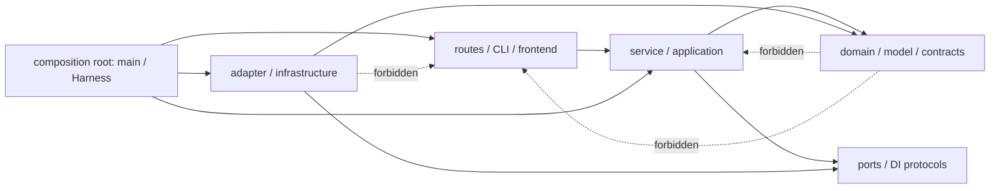

# F151 分层架构与坏味道处置清单

本清单与 complexity snapshot 分离。复杂度数值只能阻止恶化，不能证明职责正确、依赖单向或状态唯一。

## 1. 架构方向与legacy mixed operations truth

| 层 | F151 所属对象 | 允许依赖 | 禁止 |
|---|---|---|---|
| domain/model/contracts | core models、Provider包内`ProviderRoute`/`ProviderAuthRoute`/resolver protocol、execution payload enum | stdlib/Pydantic及更低稳定contract | Gateway config/path、CLI/UI、filesystem/network client、raw credential |
| service/application（新seam） | ProviderRouter、Gateway provider-route resolver、Task/Worker/Execution services | domain/contracts与注入的现役seam | UI/CLI实现、第二config loader、optional fallback、复制transport/auth规则 |
| adapter/infrastructure（新seam） | Provider clients/auth adapters、SQLite/stores、Gateway config adapter | domain/contracts；由composition显式组装 | UI、class/global mutable injection、把历史projection当运行selector |
| composition root | Harness/main | 可见application service与concrete adapter，负责唯一组装 | 通过main module/global locator反向取状态；把组装规则复制到routes/CLI |
| routes/frontend | Gateway routes、frontend | application service/public API contract | 直接访问store/client/adapter；重写Provider auth/transport、execution decoder或storage规则；绕过service直连第二runtime |
| legacy CLI composition | 15个`gateway.cli`命令/presentation文件 | 存量adapter/client/store/subprocess等按exact baseline no-growth；F151新seam只经operations/application | 新增side-effect tuple、复制下层规则、第二runtime/config path |

Provider production→Gateway为绝对禁止且无allowlist。core/provider route/model等下层不得import Gateway/UI；Gateway config resolver单向构造ProviderRoute。ProviderRouter只消费route protocol，不读取project root。frontend只消费API contract，不复制Python schema precedence。

D-03的13 application/5 domain/9 store/6 adapter只是legacy mixed operations cluster的role tags，不是physical clean layering。真实baseline为41个跨roleImportFrom nodes与147个可解析direct-name calls，含store→application、adapter→application/store；composition/routes也有6个application imports与2个store直连。完整tuples见`cross-role-edges.v1.json`，全部只可减少。domain保持严格纯净；所有新F151 seam必须遵循`domain/contracts ← application/adapters ← composition`，不能借legacy边新增反向依赖。清理全部legacy边是后续Fix，不在F151批量制造ports。

## 2. DI seam 与状态唯一性

- `ProviderRouteResolver` 是 Gateway→Provider seam；Provider tests使用Provider-side fake resolver，禁止default/global resolver。
- `RuntimeServiceBundle` 是composition root→runtime-bearing service seam；与`storage_only=True`严格XOR，禁止`None` fallback、class setter、service locator。
- Worker瞬时runtime choice、persisted decoder、Console projection三者各有值域，禁止共享新backend registry。
- `app.state.background_tasks`是LLM/AgentContext唯一集合；scheduler自有集合只有在自主管理lifecycle时可保留。
- SQLite是SoR；FTS/LanceDB并列可重建索引，任何上层不得复制持久化真值。

## 3. Forbidden import / state gate

`import-direction`与`quality-smells`至少机械检测：

1. Provider production source/manifest/TYPE_CHECKING/dynamic/module/subprocess string → Gateway：0且无allowlist。
2. `provider_route.py` → Gateway/config/filesystem/http client：0。
3. Gateway services/config/application/routes → frontend、Click/Rich/Questionary或`gateway.cli`：0；F151新CLI seam只经`gateway.services.operations`/existing config。CLI15存量adapter/client/store/subprocess/signal/filesystem按namespace inventory exact tuple no-growth。source-aware projection在迁移前也执行。
4. ProviderRouter内Gateway loader/project-root/schema `getattr` compatibility：0。
5. AgentContext class service attrs/setters、`bundle=None` fallback、chat direct LLM/module task set：0；storage-only precomputed completion接受LLM对象、读取bundle或触发Router/recall/compaction/memory-extraction：0。
6. 新management/kernel/worker package、第二runtime/Provider/config path、旧namespace shim：0。
7. 未分类新增global mutable registry、compat branch、DTO字段或runtime selector：失败并要求先更新inventory/Gate。
8. operations domain → Click/Rich/Questionary/routes/CLI/filesystem/network/subprocess：0；operations eager SCC=0、full SCC不超过冻结三节点。
9. `test-ownership.md`必须33/33 verified；scheduled/planned=0；Telegram/Update/BackupAudit等高风险owner必须direct L4。Gate解析测试AST/import并collect node，拒绝伪direct与只验证mock自身。
10. `cross-role-edges.v1.json`只声称覆盖41个import与147个可解析direct-name call ceiling；所有这些tuple集合差unknown=0、expanded=0，domain跨role=0，新seam方向违例=0。它不声称覆盖全部attribute/dynamic interaction。每个changed operations hunk另运行attribute-call/responsibility diff并要求adversarial reviewer逐项签认新增IO/状态/side effect=0；无法静态解析的call必须列入人工Gate，不得以147计数假绿。
11. production startup inventory必须只有`python -m octoagent.gateway`一个service entry；普通descriptor load/start不得隐藏写回legacy argv。

存量ratchet而非F151清零：Gateway services→harness当前43个AST nodes/24 files；Harness→main module当前11 sites。F151新增点必须为0，触达ProviderRoute/bundle的路径不得继续使用这两类反向locator。

## 4. 坏味道执行清单

### F151 必须修（阻断 Verify）

| ID | 坏味道 | 当前证据 | 收口动作 / oracle |
|---|---|---|---|
| S01 | 循环/反向依赖 | Provider生产文件反向引用Gateway | route DI后反向引用0 |
| S02 | 职责漂移 | CLI/presentation与backing services驻留Provider混合簇 | D-03 atomic迁入CLI15/config1/operations33，旧namespace0；只允许Doctor/wizard/config-bootstrap三个exception |
| S03 | 兼容层叠加 | ProviderRouter重复v1/v2 `getattr`/loader | Gateway唯一normalize，Router只消费DTO |
| S04 | 过宽/泄密DTO | Router用`getattr`探测真实schema不存在的headers/body，可能反向塑造兼容面 | ProviderRoute只含真实scalar route/auth reference；删除headers/body探测，Provider内置headers与per-call body不跨DTO |
| S05 | 命名失真/概念泄漏 | Docker config声称不存在runtime；Graph混入projection风险 | 三语义拆分，删除现役Docker config，历史projection精确保留 |
| S06 | 不可达/第二主路径 | chat/message缺TaskRunner时直跑LLM | preflight 503后删除fallback与module task set |
| S07 | 隐藏全局状态 | AgentContext class-level service setter | bundle/storage-only XOR，两个Harness隔离 |
| S08 | 重复状态/双身份 | `process_task_with_llm(llm_service=...)`可偏离bundle；Inline fake隐藏第二模型身份 | 普通路径只用bundle；窄precomputed-result seam保留exact deterministic结果并禁止所有model-derived副作用 |
| S09 | 关闭职责漂移 | model client可关闭共享Router | local close chain与bundle唯一Router owner |
| S10 | 假成功/no-op | Proxy activation/config sync/source-managed wheel命令 | 删除no-op；不支持命令副作用前typed exit69 |
| S11 | 静默配置吞噬 | empty RuntimeConfig忽略旧/unknown字段 | raw dict/env阶段精确fail-closed |
| S12 | 平行runtime | SDK model/tool loop与Proxy路径 | 删除manifest/runtime/wiring，无shim |
| S13 | 测试只验证mock自身 | resolver/close/readiness只断言fake call | 加DTO结果、状态副作用、真实库签名/进程边界oracle |
| S14 | 迁移目标自相矛盾 | 上版target把doctor放CLI、config放operations | 已批准15/1/33；source-aware首个RED锁定operations→CLI边，final为0 |
| S15 | 破坏性更新/用户数据丢失 | descriptor dirty分支执行`git checkout -- .`，staged/untracked漏检 | 三类dirty均`LOCAL_CHANGES_PRESENT`，fetch/checkout/reset/merge/uv=0；真实tmp Git不变 |
| S16 | 非原子授权状态RMW | TelegramStateStore 9 mutator锁外load→save可复活删除授权 | 单锁transaction helper；两个实例controlled concurrency RED/GREEN |
| S17 | 非原子active attempt ownership | UpdateService check→save与无owner clear可双启动/误删 | atomic claim/same-owner update/compare-release；并发仅一worker |
| S18 | 测试定义被静默覆盖 | `test_task_service_context_integration.py`两个同名顶层test使前一runtime constructor/LLM override不可收集 | collect-only先证明shadow；准确重命名前一语义node；完成态duplicate test qualname=0、两个exact nodes均collect，inventory identity144/144唯一 |
| S19 | 普通读取隐藏写入 | `UpdateStatusStore.load_runtime_descriptor`会normalize/save，invalid JSON会写`.corrupted` | 普通load/start/restart对canonical、legacy argv、invalid schema、invalid JSON均目录字节0变化；仅显式install/update/bootstrap可调用validated atomic migrate/repair |
| S20 | storage-only构造隐藏模型能力 | `AgentContextService.__init__`无条件创建MemoryRuntime与auto-load reranker | storage-only构造MemoryRuntime/reranker/auto-load/background/network全部0；runtime操作typed reject，纯store/session primitive可用 |
| S21 | 静态call inventory命名过度 | 41 imports+147 direct-name calls未覆盖attribute/dynamic interaction | 报告明确命名为ceiling；changed hunks追加attribute-call diff与manual adversarial review记录，未审查hunk阻断Gate |
| S22 | committed evidence mode忽略dirty worktree | 合同要求clean relevant worktree，旧checker/test却允许untracked production变化 | `S006-committed-worktree-clean`已完成真实RED→GREEN→REFACTOR；clean/evidence-only正向与staged/unstaged/untracked负向全部通过，main复核接受 |
| S23 | index amendment缺少TDD边界 | 旧C20-amend无真实RED证明两RED采用、prior20/12runs不变、重入、顺序与frontier | `S006-index-amendment-integrity`已完成真实RED→GREEN→REFACTOR；canonical v2固定为26条可信chain、run↔index=26/26，失败0写与frontier合同获main复核 |
| S24 | dependency selector历史仅验prefix + clean-wheel手写打包同源自证风险 | dependency resolver已完成R/G/R并fresh unresolved=0；旧standard-backend方向曾企图根据pyproject合成wheel/METADATA | 已用root dev exact pin+标准lock、`hatchling.build.build_wheel`、真实METADATA与offline/no-deps target install闭合；manual builder与host/source泄漏负例全绿 |
| S25 | import语境混叠与隔离事实伪观测 | rejected checker SHA=`5a6b5f26c255c2bdbaf340d5c70278aea6f1758f5a45ddac39f357a368c560c1`/1297行，把distribution全部静态/TYPE_CHECKING/lazy/plugin import混成direct dependency，并由parent重构child env/sys.path facts | 已按owned installed files逐occurrence分类并报告resolved/unowned delta/`final_verdict=null`；同一真实child返回cwd/sys.path/env/site/origins。target-wide扫描、availability/allowlist冒充owner、nonliteral dynamic、parent inference均失败；T070在T023后验证最终closure |

### 本 Feature 建立 ratchet（不得恶化）

| ID | 基线/边界 | Gate |
|---|---|---|
| R01 | complexity total658、六hotspot数值 | fixed ceiling + merge-base actual |
| R02 | `TaskService._task_locks`与terminal callback coordination保留现状 | 不新增service对象/跨Harness引用；register/unregister测试 |
| R03 | 全局mutable service injection | F151目标面最终0；新增任意点失败 |
| R04 | compatibility branch | Gateway v1 normalization与history decoder精确allowlist；其他新增失败 |
| R05 | direct dependency truth | T012 preliminary只冻结manifest=真实wheel METADATA、owned-file occurrence分类与诚实delta；最终目标Gateway exact7+25含dynamic keyring、Provider exact1+6含python-ulid | T023拥有manifest/lock；T070要求runtime-required直接声明、optional/type-checking/plugin/workspace-owned语义可执行，unknown/missing/unexpected失败 |
| R06 | storage-only能力 | AgentContext既有六个operation + TaskService明确`complete_task_with_precomputed_result`及既有storage operations | 未分类新增method、1141读取bundle或预计算operation触发模型派生调用失败 |
| R07 | changed-lines coverage | Python local-working-tree fresh LCOV≥90%；EXEMPT独立；frontend full Vitest/tsc | 漏staged/unstaged/untracked、stale artifact或假0失败；不替代架构审查 |
| R08 | services→harness | 43 AST nodes / 24 files | 不增加；F151新增seam不得依赖harness contract |
| R09 | Harness→main module | 11 sites | 不增加；F151触达组装点不得新增module locator |
| R10 | DX layered closure | CLI15/config1/operations33=13 app/5 domain/9 store/6 adapter；ImportFrom nodes30/7/13/1；CLI side-effect baseline=adapter8/store3+5 constructors/HTTP1+2/subprocess2+2/signal3/filesystem70 | 三exception后services/application→presentation0；CLI exact tuple只减不增；其他跨层边不得增加 |
| R11 | operations SCC | eager SCC=0；full graph唯一`doctor|secret_service|update_service`、size3 | 新SCC/新成员/扩大/eager环失败；缩小允许 |
| R12 | operations test ownership | 33/33有direct或declared owner；高风险必须direct L4 | 未分类/owner缺失/layer不符失败 |
| R13 | backup path locator | 4 helpers / 13 production consumers | 不新增helper/consumer/precedence；现有结果characterization |
| R14 | legacy operations跨role边 | imports41；可解析direct-name calls147；exact tuple见machine inventory，非完整interaction graph | 两类tuple只减不增；changed hunk attribute-call/职责审查必做；domain→other=0；新F151 seam不得引用legacy许可 |
| R15 | composition/routes legacy直连 | application imports6、routes→store2 | 只减不增；新route wiring优先application contract |
| R16 | production startup | active direct `uvicorn ...main:app` production3→目标0；唯一canonical module entry1 | 第二service entry、普通load/start隐藏descriptor写入或argv双parser失败 |
| R17 | architecture/clean-wheel checker内部规模 | runtime checker保持SHA=`657b0785b0f5d4909c344bf8c05fffd20a66d4664edd3de9a9a79813d79c3a7b`/3124 LOC/133 funcs/max50/McCabe≤10/职责簇8/single parser+runner；T012 clean-wheel checker SHA=`ceef772a96735aa4b9a777f44b12e44630c741efab64c60e4cd236c0e66f427d`/1515 LOC/86 funcs/max43/McCabe≤10 | 两者各保持single parser+runner/module；无broad exception、mutable global或duplicate body。增长/新职责须重新review，不机械压缩 |
| R18 | dependency transition与standard build backend边界 | resolver R/G/R后fresh两path均为`pre_T012→pre_T012`、unresolved=0；actual root dev pin与uv-generated lock已落地并冻结；clean-wheel checker实现已完成 | add/delete semantic delta、pin/lock/backend漂移、第二wheel算法、host/source泄漏、虚构child facts与未安装scaffold假PASS全部已验证 |

### 后续独立 Fix（F151 不做 big-bang）

| ID | 债务 | 本次边界 |
|---|---|---|
| F01 | `task_service.py` God class/2709 logical LOC | 只迁移48→45=3/42、LLM identity、storage-only precomputed operation与setter；不拆类 |
| F02 | `orchestrator.py` 2484 LOC与多职责 | 只复用两重复TaskService点、构造precomputed result与必要dispatch seam，不重写调度 |
| F03 | `provider_client.py`、`task_runner.py`、`skills/runner.py`热点 | ceiling不升；非F151职责拆分另开Fix |
| F04 | TaskService class callback registry | 明确不冒充本Feature service bundle范围；保持lifecycle且不恶化 |
| F05 | 存量固定sleep/flaky债 | 新测试零新增；存量治理按quarantine/独立Fix |
| F06 | 17k LOC product-operations cluster仍跨backup/import/update/setup多域 | F151只做15/1/33 move与三个批准exception；后续按垂直域拆分 |
| F07 | services大量依赖harness tool/threat contract | 后续把稳定contract下沉；F151只ratchet43/24 |
| F08 | `backup_service`同时泄漏project/data-dir解析 | 保持行为并另开职责Fix；R13限制4 helpers/13 consumers不增长 |
| F09 | Harness反向读取main module属性 | F151不big-bang；ratchet11且新bundle/provider seam不得使用 |
| F10 | CLI15仍混合presentation与composition/IO | F151只做ownership move与三个批准exception；exact side-effect tuple no-growth，后续逐命令纯化 |
| F11 | operations application/store/adapter跨role边 | F151冻结41 imports/147 direct calls与两类反向边，不big-bang引入ports；后续按真实多实现需求清理 |

## 5. Review 规则

每个phase的REFACTOR审查逐项更新S/R/F状态：S项未清零不得过Implementation Review/Verify；R项任一上升失败；F项若实现中变成不可分割依赖，必须停Gate扩scope，禁止暗中大改。`quality-smells`输出机器JSON与人类摘要，分别列must_fix、ratchet、follow_up；CI只允许must_fix=0、ratchet无上升，follow_up必须与本表exact ID一致。
