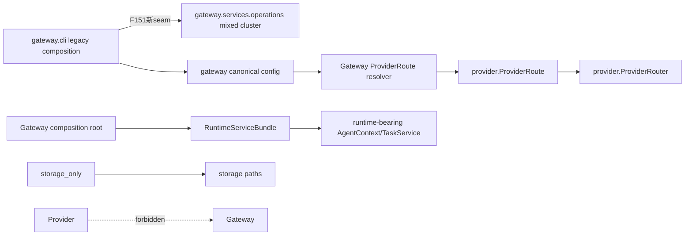

# Implementation Plan: F151 Runtime Boundary & Architecture Truth

**Branch**: `codex/f151-runtime-boundary` | **Date**: 2026-07-20 | **Spec**: [spec.md](spec.md)
**Gate**: T001-T124全部通过，76/76 tasks checked。T124 C25显式`local-working-tree`消费未stage/commit的最终Feature态并exit0，原子生成`verification-report.md` SHA=`50521128b546ebc6d649fbfe86104756aff9684c53cbc6704d0b1f54b5cc500f`；随后Final lifecycle复验确认只有T124/C25 owner、canonical index SHA、resolved base-ref与exact bytes一致的报告可被普通verify接受，提前/伪造输出仍fail closed。quality-smells、`architecture all`与`verify --through-task T124`均PASS。报告绑定canonical v2=`bd717b9d7889376d468d60480f95664dcd53dc27d116f536b4934d6c171ece9e`、269 records/head=`913082c297cf19db3c76f73891efc56faa2b8db6993d03d8d233385403cbf878`。Goal完成，未stage/commit/push。

## Summary

在既有 Gateway modular monolith 内完成四个边界闭环：

1. 已批准D-03把49个Provider DX模块迁为15 legacy CLI + 1 config + 33 operations，删除两个文件；13/5/9/6只是role tags。41 import/147可解析direct-name call只是machine ceiling而非完整interaction graph，changed hunks另做attribute-call/adversarial responsibility review；
2. Gateway canonical resolver 生成required、secret-safe且只含真实输入的ProviderRoute，ProviderRouter只负责route/transport/auth/cache；
3. 删除 Proxy/旧专用 env 文件/SDK 平行 runtime 与虚假 Docker 配置，同时分离 Worker selector、历史 decode 与 Console projection；
4. 用实例级 RuntimeServiceBundle 收敛 class injection，以独立 gates 和 clean-wheel 固化事实。

F094、Echo/Mock/legacy registry、pricing helper、bench entry 均不自动删除。不新增 management/kernel/worker package，不重写 TaskService/Orchestrator。

## Technical Context

**Runtime**: Python 3.12+；前端 TypeScript/Vitest/tsc
**Primary dependencies**: FastAPI/Starlette、Pydantic、Click、现有 workspace packages；T012仅在root dev group精确加入`hatchling==1.29.0`作为项目声明backend scaffold，不进入runtime依赖
**Storage**: SQLite/event schema 不变；只保留历史 decode/projection 分支
**Testing**: pytest、Vitest、tsc、Ruff JSON、stdlib AST/tokenize、wheel/venv/subprocess/Uvicorn
**Target**: macOS/Linux 单 Gateway application host
**Constraints**: no second runtime/provider/config/compat path；保护 F149/F150；不在 worktree `uv sync`
**Scope**: HIGH/XL，跨 packages/apps/root manifests/lock/scripts/frontend/tests/CI/docs

## Frozen inventories

| Inventory | 冻结内容 |
|---|---|
| [`namespace-migration.md`](inventories/namespace-migration.md) | 49 move/2 delete、D-03 15/1/33、13/5/9/6 role tags、CLI legacy tuple、三文件六auth、T029 snapshot与三个exception、post-T029 RGR授权 |
| [`config-retirement.md`](inventories/config-retirement.md) | YAML/env/file tombstone、UI/repo inputs、reauth/downgrade matrix |
| [`execution-semantics.md`](inventories/execution-semantics.md) | delegation/profile/Worker/Event-Console四值域、四入口、batch/audit/race与D-01 |
| [`runtime-bundle.md`](inventories/runtime-bundle.md) | 构造环、48=4/44基线→45=3/42目标、storage-only precomputed operation、teardown API/顺序 |
| [`wheel-dependencies.md`](inventories/wheel-dependencies.md) | Gateway 7+25、Provider 1+6、named extras与static/dynamic AST→Requires-Dist gate |
| [`complexity-ceiling.v1.json`](inventories/complexity-ceiling.v1.json) | 编码前真实total658、六hotspots、Ruff/config fingerprint ceiling |
| [`testing-matrix.md`](inventories/testing-matrix.md) | RGR证据协议、L4/L3/L1/L2、42 FR的文件/命令/failure oracle |
| [`architecture-quality.md`](inventories/architecture-quality.md) | 四层依赖、forbidden imports、S/R/F坏味道执行清单 |
| [`test-ownership.md`](inventories/test-ownership.md) | operations33/33 owner、高风险store/application直接L4与并发oracle |
| [`f150-scope.md`](inventories/f150-scope.md) | module entry/two handlers exact allowlist与FrontDoor protected AST |
| [`rgr-slices.md`](inventories/rgr-slices.md) | exact nodeids、命令encoding、RED oracle与production paths |
| [`rgr-slice-scopes.v1.json`](inventories/rgr-slice-scopes.v1.json) | 每个slice的machine-readable path/glob/inventory/symbol ownership |
| [`production-startup.md`](inventories/production-startup.md) | 唯一module entry、descriptor显式迁移、argv/host/port precedence |
| [`runtime-test-constructors.v1.json`](inventories/runtime-test-constructors.v1.json) | 144 AST点=123 live test/nested（含3 skipped）+20 helper+1 shadowed；44 override真值与唯一identity |
| [`agent-context-test-constructors.v1.json`](inventories/agent-context-test-constructors.v1.json) | AgentContext31点、23 storage-only/8 runtime与唯一identity |
| [`runtime-test-behavior-owners.v1.json`](inventories/runtime-test-behavior-owners.v1.json) | 44 constructor owner records→42 files+3 exact nodes=45 selectors；F033 skip与helper reverse-call均有行为证据 |
| [`runtime-operation-modes.v1.json`](inventories/runtime-operation-modes.v1.json) | 42个TaskService/AgentContext operation、45个TaskService与3个direct AgentContext production构造点的mode/capability machine allowlist |
| [`namespace-migration.v1.json`](inventories/namespace-migration.v1.json) / [`provider-test-rehome.v1.json`](inventories/provider-test-rehome.v1.json) | production49+2、Provider tests44 move+1 delete及1个manual utility exact decouple的machine source→target/delete |
| [`planned-diff.v1.json`](inventories/planned-diff.v1.json) | 全planned production/tests/config/docs/scripts/frontend/workflow/benchmark闭包 |
| [`active-artifacts.v1.json`](inventories/active-artifacts.v1.json) | 42个current F151 artifacts与6个superseded review的机器化authority/history集合；两者均由S002拥有 |
| [`artifact-lifecycle.v1.json`](inventories/artifact-lifecycle.v1.json) | Design→Final转移、唯一Phase0 anchor输入、4个Final必需committed exact paths与4类local evidence |
| [`evidence-producers.v1.json`](inventories/evidence-producers.v1.json) | formal Python/Frontend六件套、C19五件套、C084五件套与committed producer双向闭包 |
| [`tree-delete-expansion.v1.json`](inventories/tree-delete-expansion.v1.json) | base SHA/object绑定的SDK6+skill1+retired env1 exact删除路径 |
| [`stage-command-matrix.v1.json`](inventories/stage-command-matrix.v1.json) | pre/post SDK PYTHONPATH与每阶段command profile，无retired path泄漏 |
| [`authority-docs.v1.json`](inventories/authority-docs.v1.json) | 17份active authority docs的完整semantic scan集合；历史/现役语义分离 |
| [`cross-role-edges.v1.json`](inventories/cross-role-edges.v1.json) | 41 exact import +147 exact direct-name call ceilings、SCC与no-growth |
| [`stage-commands.md`](inventories/stage-commands.md) | phase path可用性、C19 pre/post/T122 fresh、T120-T124 exact命令 |

以上清单是编码前的冻结边界；实现若发现数量变化，先更新 inventory、说明 baseline drift 并重新过 Gate，不能在代码中临场扩 scope。

## Constitution Check

| Gate | Round 10冻结设计 |
|---|---|
| 单 Gateway application host | D-03只在既有Gateway distribution内使用CLI/config/operations内部namespace；无新deployable package/runtime |
| ProviderRouter canonical path | Gateway resolver + Provider route，不复制 loader |
| fail closed | 422 / 503 / exit 78 分矩阵；保留产品既有deterministic Inline fallback且模型调用=0 |
| clean-wheel/direct deps | 标准Hatchling backend构建当前9个workspace wheels，真实archive METADATA与标准offline/no-deps target install；Gateway/Provider main deps诚实声明，Hatchling仅dev |
| no class-level injection | bundle/storage-only XOR，48点基线→45点目标清单 |
| no second path/compat | old namespace/SDK/Proxy 直接删除，无 shim |
| complexity no-worsening | committed ceiling + merge-base actual 双门 |
| TDD / test layering | 稳定RED→GREEN→REFACTOR；atomic relocation诚实标注；L4/L3确定性优先，L1/L2只验独有语义 |
| credentials / external cost | F151自动Verify只用确定性C23/C24；不注册C18/live baseline，不从HOME、凭证存在或skip推定授权 |
| architecture / smell quality | 新seam按domain/contracts←application/adapters←composition；legacy mixed role边诚实ratchet；must-fix清零 |
| production startup | exact argv→import `main.app` once→`main.app=create_app()`唯一static preflight→Uvicorn app instance；完整config load先于env mode；普通四类descriptor read/start/restart目录0写；真正composition failure只经lifespan fail closed |
| F149/F150 protection | gate只约束F150-owned symbols；protected AST不变，D-03 import-only另验 |
| SQLite/FTS/LanceDB | SQLite SoR；FTS/LanceDB 并列可重建索引 |

**Post-design status**：D-01/D-03与startup scope保持冻结；T005/T006 evidence纠正、frontier order与formal RED recording/offline invocation subfix均已闭环。checker现在能phase-aware记录合法assertion RED，并把LiteLLM local-only执行条件写入/校验新run invocation；subfix未新增numeric task、runner或parser。正式T007-T010两条coverage slice已完成R→G→R。T011首次formal RED形成record33，但其五node旧合同要求T017-T029 namespace transaction、T045、T064与S070/T070之后的行为，故只保留append-only字节事实，不作为release evidence；纠正后的preliminary direct RED已由main接受且不进入canonical v2，T070 full合同仍由T070独立RGR拥有。

## Dependency Direction Freeze



Provider 不知道 Gateway schema/path；optional schema URL 到 required runtime URL 的责任在 resolver。bundle 与 storage-only 严格互斥；不引入 mutable service locator。
CLI15不是已纯化presentation层；其存量adapter/client/store/subprocess等边按exact tuple no-growth，进一步纯化列follow-up。
operations的application/store/adapter不是clean physical layers；41个import与147个direct-name call machine ceiling只减不增，composition/routes存量边也ratchet。它们不覆盖全部attribute/dynamic interaction，因此每个changed hunk还须static attribute diff+manual adversarial review。只有domain纯净与新seam方向硬清零。

## Deletion and retention freeze

### Authorized deletion

- `provider/dx/__init__.py` 与 `runtime_activation.py`；
- LiteLLM Proxy extra/activation/state/readiness/old-file paths/伪 sync；
- `packages/sdk` 平行 Agent/HTTP/LiteLLM/tool loop 与 manifest/lock/docs wiring；
- `docker_mode`、checker、旧 env 与失真现役 backend 配置/声明；
- `JobSpec`、`ExecutionRuntimeRecord`及core exports/tests/docs；
- AgentContext class attrs/setters/fallback。

### Explicit retention

- Gateway Provider v1 normalization；
- ProviderRouter task alias pinning/client invalidation；
- F094 migration CLI/audit/rollback、`memory_commands.py`；
- EchoProvider、MockProvider、legacy registry；
- pricing helper/base pricing dependency；
- `octo-bench` entry（wheel中固定exit69 source-only，不删除/打包tree）；
- `ExecutionBackend.DOCKER` 与 `container_name` 的历史 projection compatibility。

### Approved decisions

- D-01：删除`JobSpec`/`ExecutionRuntimeRecord`及core exports/tests/docs；history只留raw decoder/projection。
- D-03：15 CLI + 1 existing config + 33 operations + 2 delete；Doctor renderer/wizard Click/config-bootstrap Click三个exception；operations动态三节点SCC只ratchet。
- `runtime_descriptor_defaults` destructive dirty handling、Telegram RMW与Update active-attempt TOCTOU是F151 must-fix；backup path职责保持follow-up/no-growth。

## Project Structure

允许新增的运行时文件限于：

```text
octoagent/packages/provider/src/octoagent/provider/provider_route.py
octoagent/apps/gateway/src/octoagent/gateway/services/config/provider_route_resolver.py
octoagent/apps/gateway/src/octoagent/gateway/services/runtime_service_bundle.py
octoagent/apps/gateway/src/octoagent/gateway/__main__.py
```

允许新增的非运行时 gate artifacts：

```text
repo-scripts/check-runtime-architecture.py
repo-scripts/runtime-architecture-ceiling.v1.json
repo-scripts/check-clean-wheel.py
octoagent/tests/gate/test_runtime_architecture.py
octoagent/tests/gate/test_clean_wheel_contract.py
```

Tombstone 是 `OctoAgentConfig.from_yaml()` / existing bootstrap 常量与 validator；history decode 在现有 execution projection；complexity snapshot 不进入 runtime。

## TDD、测试分层与 Review Freeze

每个phase使用[`inventories/rgr-slices.md`](inventories/rgr-slices.md)预冻结的exact nodeids/RGR命令encoding/oracle，并以[`inventories/testing-matrix.md`](inventories/testing-matrix.md)的Cxx做phase regression：

1. **RED**：新增最小确定性契约测试并记录目标行为缺失；import error、随机时序或全仓已知违规不算RED。
2. **GREEN**：只实施该切片并用同一selector变绿；不得用fallback、skip或rerun绕过。
3. **REFACTOR**：在行为不变下清职责/命名/重复状态，重跑定向selector、import/retired/complexity/quality-smells与changed-lines coverage。

Phase0 T001-T004只用标准pytest/Vitest+JUnit bootstrap transaction；T004后硬停`PHASE0_RED_REVIEW`。formal Python/Frontend run统一由runner写入`evidence/local/runs/<slice>/<phase>/`的canonical六件套，任何alias、root override、缺件或多件失败。main创建唯一anchor manifest并提供其SHA，T005以exact file+SHA消费固定字节，拒绝missing/malformed/replacement/mixed/second anchor。required slices扫描dirty最终态与ignored lifecycle paths；planned-diff只减去hash不变的既有`.gitignore`用户patch，其他Feature/docs/design变化失败。测试证据记录TaskService144=123 live test/nested（含3 skipped）+20 helper+1 shadowed与AgentContext31；T084修复F033 skip和shadow后，C084覆盖44 owner records/45 selectors并给helper reverse-call证据。

### T005/T006 evidence-integrity纠正事务（已完成历史）

首轮T005/T006的18条index records与12组GREEN/REFACTOR六件套只证明磁盘hash一致，main已将其判为`REJECTED EVIDENCE`；它们不参与release required set。原bootstrap anchor和36个RED raw仍有效且逐字节不可变。纠正事务不新增runner/registry/compatibility path，复用同一个`check-runtime-architecture.py`与现有S004/S002 nodeids：

1. **CORRECTIVE RED**：获得main的test-only授权后，只扩展现有compound nodes，不新增nodeid；按S004 evidence integrity与S002 finalize拆成两个固定标准pytest/JUnit transactions，对当前被拒绝checker各执行一次，覆盖exact top-level/index/record/invocation/tree schema、链与run双向闭包、mode/base/through-task、same-anchor corrupt index和finalize原子写。每个case必须在受检输入上形成单一可观察缺陷，两组六件套保存到lifecycle exact corrective-red slice目录；硬停`T005_CORRECTIVE_RED_REVIEW`。这不是补跑已锚定bootstrap RED。
2. **只读隔离与可重入恢复**：main确认纠正RED并另行放行后，唯一`recover-index`命令必须显式取得corrective aggregate SHA和`--main-review-message-id`；review ID不从聊天/env/default推断，不得为空、未知或复用anchor/rejected/T006消息，并与aggregate形成canonical approval binding。命令先验证被拒绝index SHA、12组run树exact set/SHA、anchor与36个raw，再按R0 source→R1 runs quarantined→R2 v1+runs quarantined→R3 durable v2 temp→R4 complete的exact path/hash状态单向推进。runs rename、v1 rename、temp write/fsync、replace任一步中断都以相同argv识别状态并继续；仅R2上下文中的不完整recovery-owned temp可删除重建，其他混合态fail closed。这里不声称跨多路径atomic或rollback。
3. **canonical v2 index**：恢复状态机只创建`evidence/evidence-index.v2.json`，其`created_utc`由8条固定前缀的最新`finished_utc`确定，保证重入字节一致。顶层与record schema均exact；bootstrap/corrective/formal `tree.json`统一为immutable bootstrap兼容的12字段shape，record逐字段交叉。每条record强制唯一`record_sha256`和`previous_record_sha256`。genesis=`sha256(canonical-json({feature_id,bootstrap_anchor_sha256,base_sha}))`；record hash=`sha256(canonical-json(record_without_record_sha256))`，canonical JSON固定UTF-8、`sort_keys=true`、`separators=(',', ':')`；`chain_head_sha256`必须等于最后一条record hash。identity key为`lifecycle_type+task_id+slice_id+phase`；前缀顺序恰为anchor中的6条bootstrap RED后接S004/S002两条corrective RED，rejected v1 records计数固定0，之后才允许GREEN/REFACTOR。
4. **GREEN/REFACTOR**：实现同一checker后，重新以原六个Phase0 slice exact selectors写新的canonical GREEN，再以同selectors写REFACTOR；index每次append前完整重验top-level、所有prior records、实际canonical run set与chain head，使用temp+fsync+atomic replace。删除、插入、重排、替换任一prior record，或增加未索引run目录，均失败且index 0写。
5. **参数与Final语义**：local mode读取committed+staged+unstaged+untracked最终态；committed mode只允许clean relevant worktree并读取base→HEAD；两者都必须先解析base-ref/merge-base。`through-task`只接受tasks/RGR machine DAG中的真实task并要求截至该task的完整证据，`T000`等unknown失败且不追索future。`architecture all`有有效base-ref正向控制，并把同一resolved commit传给全部base-aware subgate；missing/unresolvable ref负向失败。same-anchor existing index也必须全量重验，禁止shortcut。`finalize-verification`必须显式消费mode；C25固定`local-working-tree`重验未stage/commit的最终Feature态及T120-T123与T124 input closure，普通committed mode仍要求clean relevant worktree。T124/C25/report本身不属于前置，C25成功才形成T124 output。成功后atomic replace；失败时output不存在或原字节不变。

本节需要main重新批准GATE_DESIGN/GATE_TASKS后才可修改test/checker/evidence；当前不执行CORRECTIVE RED，也不处置任何被拒绝字节。

### T006 committed-mode与index-amendment完整性窄纠正（已完成历史）

main已接受canonical v2前20条record与12个formal run，并已接受`S006-committed-worktree-clean` RED；但C20-amend仍无真实RED覆盖两条RED采用、prior20不变、重入、顺序与frontier。纠正不回写或重排前20条，不新增subcommand/runner/registry/support module，继续归属既有T006：

1. **冻结已接受dirty RED**：`S006-committed-worktree-clean`六件套及test SHA保持原字节；它只拥有clean/evidence-only accept和staged/unstaged/untracked committed-mode拒绝，不再承载index采用语义。
2. **独立index RED**：新增`S006-index-amendment-integrity`及唯一exact node`TestTddEvidence::test_t006_index_amendment_adopts_exact_two_reds_and_preserves_prior_chain`。node先有正向控制，再覆盖：两组RED一次采用、prior20对象/hash与12 runs不变、chain/reentry无重复；missing/partial/mutated artifact、错误combined aggregate、错误或复用review ID、corrupt prior index、extra/unindexed run、duplicate/wrong-order record均失败且index原字节不变；`through-task T006`在6条尾链未齐时失败，齐全后通过且不追future。若当前checker尚无capability，node必须用显式capability-absence assertion产生唯一`F151_T006_INDEX_AMENDMENT_CONTRACT_MISSING`，不得以argparse exit2或collection错误冒充RED。该RED写同一parent下`S006-index-amendment-integrity/RED/`后硬停main复审。
3. **共同授权与采用**：两组RED的aggregate按UTF-8 canonical JSON `{slice_id: artifact_aggregate_sha256}`（`sort_keys=true,separators=(',', ':')`）计算唯一combined aggregate；main只签发一个review ID。C20-amend仍复用同一`tdd-evidence run`与parser，以T006 parent、combined aggregate和review ID为输入；全量重验两组六件套、前20条与12 runs后，用一次temp+fsync+atomic replace追加第21、22条RED。任一失败保持index/runs原字节；重入只验证，不重复或部分追加。
4. **GREEN/REFACTOR与顺序**：committed mode修复后先运行dirty node GREEN，再运行index node GREEN；纯函数/命名/重复分支重构后以相同顺序运行两node REFACTOR。尾链固定为两RED→两GREEN→两REFACTOR，slice顺序均为dirty后index；record总数20→26。formal run在测试后、append前中断时，只允许完整全绿且machine-equal的unindexed run被同一exact command采用，partial/failed/unknown状态不覆盖、不删除、不补跑。
5. **frontier与质量**：`validate_record_order`只接受原20条完整序列加上述6条的任一prefix；`through-task T006`在6条未齐时失败、齐全后通过且不追future。每次append逐条比较前20个record object/hash。checker继续单文件/单parser/单runner，函数≤50、McCabe≤10、职责簇≤8、无broad exception/可变全局/clone；不为LOC机械压缩。完成后如实报告actual LOC/最大函数/McCabe/职责簇/重复分支，由main将清晰实现的actual值冻结为no-growth ceiling。

以上T006纠正已经main逐项复核完成，canonical v2固定为26 records；该历史合同保持只读。

### T006→T007 formal frontier Fix（现有Feature内4-phase窄Fix）

1. **Diagnose（已完成）**：记录首次formal T007 attempt为INVALID；它在pytest前被`EVIDENCE_RGR_ORDER_INVALID`拒绝，未生成run/record，不能计为coverage RED。5-Why定位到T006尾链硬编码、manifest未驱动frontier，以及active表中的隐式单任务`/ T015 | RGR`、两任务范围`/ T088-T089 | RGR`、三任务箭头`/ T100→T101→T102 | compound RGR`均未被统一解析。
2. **Plan/Test-code（已完成）**：现有exact node`TestTddEvidence::test_post_t006_formal_frontier_uses_manifest_partial_order`动态加载同一checker的纯seam并直接读取真实`rgr-slices.md`与canonical 26-record prefix。合同覆盖S013/S015单任务、S088的T088 RED→T088 GREEN→T089 REFACTOR、S100的T100→T101→T102严格phase映射，按表解析全部active RGR语法而非逐slice特判。
3. **RED（已完成）**：扩展合同以唯一oracle `F151_POST_T006_FORMAL_FRONTIER_MISSING`取得main接受的direct RED，aggregate=`7374b3908c7231813faee73ff734292d8af5dfc1694013f703f2f730074a98f8`。旧RED aggregate=`6a926da66dd903aeee16d50b0f973a34b3bd0ab5970a850a8155789f89a343aa`仅为superseded history，不计证据；既有26条chain未改写。
4. **GREEN/REFACTOR（已完成）**：只修改现有`parse_rgr()`、`validate_record_order()`调用链、窄纯`manifest_record_candidates()` seam与`validate_through_task()`，删除旧单值frontier，实现隐式单任务、两任务范围和三任务箭头的partial order。direct GREEN aggregate=`93a592c76e6aa49536c196a5406f6f653d9d2ea033b87e78dd5e6ed35389fee5`，同字节no-op direct REFACTOR aggregate=`b0fb20020ec0de97480393868ce7e92cd6a0df21740064033b36ddeac98fbc4b`；三阶段test SHA=`a3b9b0f95527707e8fe9057ea6034bfaf992cc83c693b208af502cda8009b9fa`。Fix未写canonical v2，records仍为26。
5. **Formal RED recording + deterministic offline invocation subfix（direct R→G→R已完成）**：exact node`TestTddEvidence::test_formal_runner_records_exact_red_oracle_before_green`直接调用现有`formal_record_from_run()`、metadata/JUnit/record seam。RED要求invocation与exit artifact均为1，exact assertion failures与contract oracle进入formal-rgr record；GREEN/REFACTOR保持exit0全绿。所有新formal phase的invocation显式包含`LITELLM_LOCAL_MODEL_COST_MAP=True`，`exact_command`由同一三项env map构造且不读取ambient env；既有26条record作为不可变prefix按fixed identity、末端hash、chain、冻结两项env与逐条record验证，新formal tail要求exact三项env，非formal tail沿用既有合同。RED outcome 11项与offline env缺失/False/command mismatch 3项共14个单缺陷逐项fail closed、六件套0改写且无合法record。main接受的direct roots/aggregates为RED `/tmp/f151-formal-red-recording-offline-red-main.bcLvA9` / `0187697982a67b839081caea16c73b3711e8d53ddcef3a9bdd64d973c08c13f6`、GREEN `/tmp/f151-formal-red-recording-offline-green-main.wuvcfT` / `7e585c12b097148bfa455c463cc89f48379f557ab897c09b4f8fe0cc9894426e`、REFACTOR `/tmp/f151-formal-red-recording-offline-refactor-main.1TddLp` / `b926a9cb6c7758835b26c1e8902cfff6e46c7a3dc0a963e01c8a87a5ad53703d`；冻结test SHA=`8b9d8790615ff115fcdc1fb2c9ed47a175fd614900e2a531fda189f75d371fbe`，checker SHA=`353c2e750280163827dbebda59eda886913a13fcee40fff27364ce0cc2a7a11d`。checker actual=2787 LOC/123函数/最大50行/McCabe≤10/职责簇8、single parser+runner，冻结为新的no-growth ceiling；后续增长重新review，不机械压缩。direct证据不写canonical v2。

该subfix不改变产品Spec、RGR selector或coverage行为，也不直接创建canonical evidence/index record。随后获批的正式T007 formal RED以aggregate=`82c857a53eab751942ba12694f0ea1d26cee677110cba8297f0d2d4f85357e28`追加第27条record；正式T008 RED以aggregate=`6606bc55fadbb7317fdbba3a695dc16374bf7fff3f91d306d8f1606d0d00119b`追加第28条record。T009的双GREEN追加第29/30条，T010双REFACTOR追加第31/32条。T011旧合同RED追加第33条后，v2 SHA=`f6deaa1c63f02833db75dc0e5e6dbe86062df68c20328dc3c540fe92a9925310`、head=`9debfc1462bf819b1af7aef2259532321480b346c370c3a580522a049474a479`；该record只保留chain事实、release资格为false，phase-correct replacement RED须另获main单次授权。

49-file namespace move声明为two-stage atomic relocation：`S017-namespace-atomic`唯一gate node先记录source51/target0并虚拟映射出三个批准presentation边的完整before artifact；单波move/delete/wiring后，T029从冻结base source重算normalized AST/content与source→target projection，保存target snapshot/可验证patch、逐文件hash、2 delete与三个exception。它不是pytest RED；任何source/target混合态或T029夹带业务hunk稳定失败。T029之后target修改只由machine scope稳定symbol+RGR evidence授权；Final复验T029 snapshot against base并检查source0/target完整/无shim，不拿当前target raw hash冒充机械迁移。T017-T025之间不允许commit或双namespace中间态。

测试以L4/L3确定性覆盖为主：L4用tmp SQLite+DI fake，L3用Echo/DI stub/ScriptedModelClient；F151无浏览器独有或真判断力新增需求，L1/L2预期为0。worktree禁`uv sync`，强制PYTHONPATH锁与`python -m pytest`；禁网络/真LLM/宿主状态/fixed sleep/blanket rerun。changed-lines≥90%只是最低门。

每个REFACTOR/Review按[`inventories/architecture-quality.md`](inventories/architecture-quality.md)报告must-fix、ratchet、follow-up；complexity不能替代职责与依赖判断。

## Implementation Phases

### Phase 0：冻结 contract，先建立 gate tests（RED）

- 先写 import/layering/retired/complexity/quality-smells/clean-wheel fixtures，证明它们能检测当前已知违规。
- 实现独立 subcommands 与 schema v1 scanner，但不改 pre-commit/CI wiring；初始化RGR ledger与S/R/F审查报告。
- 固定fail-closed matrix、tombstone behavior、namespace hash manifest与48→45点classification tests；先为TDD evidence的missing/fake/reordered/selector/collection/skip/rerun和changed-lines local/stale/exempt写负面fixtures，再实现checker；在任何production edit前把已冻结ceiling inventory复制/验证为repo gate snapshot。
- 定向验证：gate self-tests；预期 repository violation 记录为 red baseline，不假报 implementation pass。

### Phase 1：Provider route 与 CLI ownership（preliminary relocation）

- Tests first固定v1/v2 normalization、required api_base/transport三分支、env/profile auth reference、pinning与cache-evict-only invalidation；ProviderRoute不增加headers/body/open JSON字段。
- 按15/1/33 manifest搬迁49模块；2文件直接删除；执行doctor presentation exception，修正六个effective auth nodes、跨层import、entrypoint/module/monkeypatch/update-worker strings、四组tests与production/scripts/docs refs。
- ProviderRouter 删除 reverse import/getattr；Gateway resolver 注入 route。
- 按wheel dependency inventory补exact direct deps；Phase1锁变更ownership/deps但不改`litellm[proxy]`选择，更新root lock。
- 定向验证：route/CLI、四组behavior+root gate wiring、update-worker module string/import、Provider-only与`gateway --level relocation`。不得宣称full clean-wheel。
- namespace后单独修复Telegram原子RMW与Update active-attempt CAS；managed update dirty safety在任何更新操作前独立RGR，不能藏进atomic move。
- owner gate按AST+collect闭合六个scheduled direct owners、setup adapter fake-only与BackupAudit durable direct owner；planned不算covered。
- REFACTOR只允许三个已批准hash exception、路径/命名/重复import清理；Provider 44 tests rehome+1 delete并对1个manual recorder执行exact Gateway import decouple，Gateway direct keyring、Provider direct python-ulid与过宽依赖移除；T017-T025后立即运行atomic T029 gate，才允许managed-update/Telegram/Update CAS的独立RGR；不得借17k LOC move重写其他职责。

### Phase 2：单一路径退役与 full clean-wheel 前置闭合

- T040已完成：raw YAML在Pydantic前拒绝exact retired runtime keys，移除空runtime容器，拒绝unknown runtime keys；v1/v2 Provider输入保持。empty `RuntimeConfig` class/root field已在T047机械删除。
- T041已完成：dotenv与process env合并后、bootstrap副作用前拒绝六个exact retired keys；echo mode及`override=False` precedence保持，不新增第二env loader或compat alias。
- T042已完成：legacy file detector仅检查exists；`create_app`在dotenv与app/bootstrap副作用前精确调用一次；auth/setup recovery不读、复制或备份secret。F150保护只按machine scope的`function:create_app/call:detect_legacy_runtime_files`与canonical T042 R/G/R evidence开放该hunk，其他create_app语义仍冻结。
- T043已完成：formal runner在既有单parser/runner内支持frontend Vitest exact selector、三项离线env、JUnit name映射与RED stderr fail-closed校验。Settings、PendingChangesBar、Home/Workbench、App/shared四个slice均完成selected=1、skip/error/rerun=0的R/G/R；完整前端回归440/440与TypeScript typecheck通过。HomePage历史fixture的回归修正仅作为`S043-home` behavior watch，不新增生产所有权。
- T044已完成：`/ready`不再接受或返回Proxy profile，也不调用`litellm_client.health_check`；core readiness只消费本地SQLite、artifact目录、disk、`alias_registry.resolve("main")`与`provider_router.resolve_for_alias`。route解析异常fail closed为503，diagnostics只报告alias/provider/model结构事实；US-12历史fixture作为behavior watch同步。
- T045已完成：service install/uninstall、update/restart/stop、install-bootstrap与octo-bench共享同一真实source-checkout判定语义；managed descriptor优先，Git/workspace markers联合验证，wheel-only环境在manager/service/store/subprocess/runner之前typed exit69。status/logs/help保持可用。
- T046已完成：Provider fallback/benchmark统一使用`ProviderError`；删除CLI `config sync`/`--activate`、builtin `config.sync`/`ConfigSyncResult`与Control Plane activation/proxy/runtime setup投影。五个behavior slices完成正式R/G/R，`S046-bench`保持characterization，相关回归125 passed/1 skipped/1 xpassed。
- T047已完成：只移除Proxy/config manifest/source/lock/docs/wiring、空`RuntimeConfig` class/root field与退役`.env.litellm`；没有新增CLI、Control Plane或frontend行为。
- T048已完成：SDK tree、workspace/lock/docs wiring与相关入口已删除，base pricing dependency已收窄；post-SDK profile固定为7个package src+Gateway，SDK path引用为0。
- T049已完成：C03/C03-retired-behavior/C07/C09/C10/C13/C16/C17/C19-post/C20-post全部通过且未运行C11/full/all。fresh C19主suite为5345 passed/11 skipped/1 xfailed/1 xpassed，scripted E2E exit0、rerun0；canonical coverage=`677/729=92.9%`，metadata SHA=`b1b633e6…0a0e`。命令主体按machine定义执行；因工具删除策略，末尾临时目录cleanup替换为no-op并保留目录审计，不影响canonical五件套。
- Tests first：raw YAML、env-after-dotenv、two legacy files no-open、recovery-command reauth、frontend六slice、CLI config sync/activate、builtin/Control Plane字段、structural readiness、source-only guards。
- 先切断 OAuth/secret 对旧文件的写入，再删除 Proxy/old-file/伪 activation/readiness 与 SDK runtime。
- 删除CLI/builtin config sync与失真setup字段，清理root config/examples/scripts/behavior/README/obsolete skill、Settings/Home/Workbench/App；保留security denylist并运行Vitest/tsc。
- Provider pricing保留但 gate 限定为 pricing-only；更新 manifests 与 `uv.lock`。
- `ProxyUnreachableError`删除；Provider fallback/benchmark改用`ProviderError`，benchmark独立lane。
- 定向验证后复验C09 Provider与C10 relocation，证明Proxy/SDK/legacy absence与namespace final前置仍成立；此阶段不运行full/all。
- RED/GREEN后运行C03/C03-retired-behavior/C07/C09/C10/C13/C16/C17/C19-post/C20-post，审查S10-S13与retired security denylist；L1/L2保持0。T045 source guards已经完成；首次C11/full仍等待T064 startup owner。

### Phase 3 Gate：首次完整 clean-wheel

- T045完成source-managed exit69、T064完成唯一module entry/app-instance与static invalid exit78后，在T070内成组执行`S070-clean-wheel-full`与`S070-direct-dependency-closure` R→G→R；前者只新增full/all branches，后者消费T017-T029/T023/T045/T064 facts并阻断Provider1+6/Gateway7+25最终closure。
- 只有该RGR闭合后才运行C11；`all`的自动final transaction仍只在T123/C24执行。T070不得修改T029/T045/T064拥有的production，只能扩展同一`check-clean-wheel.py`消费这些已实现事实。
- **完成事实**：两条slice的RED/GREEN/REFACTOR aggregates分别为full=`f45677d9a91bcb6dda423f60f94ab405ce6ad5761fcb3cb704d29311e3008ab5`/`9f4e22efe1d8a242bb59eb11718215b659fef58c0fcf9ae9a6facbfed6469663`/`1af1d2aba0bde1601e7f66eaa1107ca6c54e46376b98f0194ccc894c6ef6c3d8`，dependency=`875e054bf613e98f5fcb6faf4c45721a7eaf2fc37cf4af041d332536a441da8d`/`a4852d4ca7c7922d1988fc4f4d95494e3e1232a3ae1cb18f7421a1079ad2762e`/`cf15ffe176b6667dd101b683bdd89761cf4249c6b670f9b91288bb4e3f542890`。C04、C08 execution/startup、C22、C11、C13、C14、C15-post均PASS；fresh C19=`988/1096=90.1%`，五件aggregate=`1b37f7685de194c02c7d85cadd36044070b5890d5c1112358436b2af25190030`；C20普通/through-task与architecture all均PASS。

### T011 superseded evidence 纠正协议

1. canonical record33及其六件套、aggregate=`1b1489ad90723853492609513d36e20d3c48a21206c0f7ac3269d53461ff48ef`、record hash=`9debfc1462bf819b1af7aef2259532321480b346c370c3a580522a049474a479`保持逐字节不变；分类为`VALID_BYTES_FOR_SUPERSEDED_CONTRACT / NOT_RELEASE_EVIDENCE`。
2. Gate获批后只修改既有五node测试正文，使T011/T012只断言preliminary事实与后续owners的typed deferral/零执行；nodeid与oracle不变。main先创建空的`/tmp/f151-s011-clean-wheel-preliminary-red-main/RED`，按`artifact-lifecycle.v1.json#superseded_contract_evidence.release_replacement`冻结的repo-root cwd、有序三项env、16项argv/absolute JUnit、11字段invocation与12字段tree执行一次；结果必须exit=1、selected/failures=5/5、error/skip/rerun=0、stderr空，五条均为唯一oracle `F151_CLEAN_WHEEL_CONTRACT_MISSING`。
3. main已逐字节接受并冻结六件SHA/size map、canonical aggregate=`2405581c676b28dea56f9ca66b13e22abeafb386e75ea680e03f246226db84da`、test SHA=`294b2e57189d79b622f7048da1e6f5a33cb00982fc7fbebec1fb04b069f238f5`、review ID=`main-f151-t011-replacement-red-review-2405581c676b28de-20260721`与attestation binding=`61047efa7dfeadb6d20f45664a1cd83e825356b11c460d8958ccc9963139f061`，并以artifact-only truth sync填入lifecycle/producer machine binding；该direct RED不进入canonical v2，不新增runner/index/compat path。原始/tmp六件套保留到T012 REFACTOR复审；T103验证attestation而非依赖/tmp永久存在。
4. T012增加`S012-import-classification-inventory`与`S012-child-isolation-observation`，combined implementation paths仍是runtime checker、root pyproject/lock与唯一clean-wheel checker四项。T012只证明manifest=真实wheel METADATA、分类inventory完整且`final_verdict=null`、实际child isolation；不拥有Provider/Gateway manifests或production delta。S011 requires-dist helper改写后，240558/294b2e/61047e binding自动降级为superseded history，必须用新root/review/aggregate/binding完成fresh direct RED。
5. actual pyproject/uv-generated lock已落地并经main复审；本corrective Gate批准、test rewrite/fresh RED与新checker code review通过后，main才可用冻结命令一次性把`hatchling==1.29.0`离线安装进shared venv。这只是本地toolchain bootstrap，不是test/release evidence。worktree禁止`uv sync`；CI/Final从committed lock经正常`uv sync --dev`取得backend。pin/lock/backend/runtime-leak/manual-builder/host-state/source-leak/scaffold-absent负例必须先绿。

### T012 Round2 corrective RGR与三态partition

- `S012-dependency-selector-semantics`：exact node=`TestManifestIntegrity::test_dependency_selectors_resolve_toml_lock_transitions_and_disjoint_hunks`，oracle=`F151_DEPENDENCY_SELECTOR_SEMANTIC_RESOLVER_MISSING`，唯一implementation owner=`repo-scripts/check-runtime-architecture.py`。clean accept与wrong group/pin、runtime leak、lock drift/closure、alias/duplicate/inversion/unowned-key负例必须在隔离tmp Git中真实执行。
- `S012-standard-backend-scaffold`：exact node=`TestCleanWheelContract::test_standard_backend_scaffold_is_locked_offline_and_never_synthesizes_wheels`，oracle=`F151_STANDARD_BACKEND_SCAFFOLD_MISSING`，implementation owners=pyproject/lock/唯一clean-wheel checker。它调用typed pure seam，不新增CLI/parser/runner。旧32-symbol aggregate=`244ccc7c0b466d71b8affbc5c44a93679daece42209c14a0430e21d054f689a7`只作predecessor合同快照；S011-owned断言按新语义改写时旧direct RED转历史，standard-backend node/helper AST仍冻结。
- `S012-import-classification-inventory`：exact node=`TestCleanWheelContract::test_import_inventory_classifies_runtime_optional_type_checking_plugin_and_workspace_ownership`，oracle=`F151_DIRECT_DEPENDENCY_IMPORT_CLASSIFICATION_MISSING`；只扫描distribution-owned installed files，逐occurrence分类并拒绝allowlist/availability/target-wide假绿。
- `S012-child-isolation-observation`：exact node=`TestCleanWheelContract::test_isolated_child_reports_actual_environment_paths_and_workspace_origins`，oracle=`F151_CLEAN_WHEEL_CHILD_OBSERVATION_MISSING`；同一child返回cwd/sys.path/env/site/prefix/origins，parent不得推断。
- 两个路径的三态一致：`pre_T012`=Hatchling absent/SDK present；`T012_target`=Hatchling present/SDK present；`T048_target`=Hatchling present/SDK absent。S012只拥有add delta，S047只拥有delete delta；absent selector必须列为required_absent，不得同时required_nonempty。
- 后续批次授权边界：一次Gate批准后连续完成test rewrite/observable-delta→两条新增formal RED+fresh main-owned S011 direct RED→checker/scaffold→三个T012 behavior slices GREEN/REFACTOR→S011 GREEN/REFACTOR；可逆、hermetic、本地且machine-scope内命令无需逐条hard stop。合同矛盾、scope/authority变化、外部/破坏性动作或架构分叉才停。

**T012完成事实**：dependency resolver unresolved=0；root pin/uv-generated lock、shared-venv一次scaffold、唯一clean-wheel checker、三个T012 behavior slices与S011 formal GREEN→REFACTOR全部完成。v2 SHA=`64c6e18fe634a0c3dd394adaa542b74635202c290f2ffb8852597b5faf7feac1`，records=47，head=`53fa74a50d2c5b4e31208d6e2307369e958842a76f62c01c1e1217f89ac77602`；C09/C10 PASS。

### Phase 3：Execution truth 与 fail-closed

- Tests first覆盖三个Control Plane actions与`subagents.spawn`；strict五值、apply/tool batch原子性、audit singleton排除、profile无TaskRunner fallback与Graph race分别有L4/L3 oracle。
- 删除Worker Docker config；保留全部合法delegation target，映射Graph→graph、其余→inline。
- `register_session`删除公开backend参数并固定inline；historical docker只用raw event→GET replay，unknown稳定失败，Console projection不变。
- 将`python -m octoagent.gateway`设为唯一入口。entry先解析help/host/port，再只import一次`main.app`；import触发唯一`create_app()`与一次config/exposure preflight，随后Uvicorn接收app instance及exact-equal host/port。普通canonical/legacy/invalid schema/invalid JSON descriptor load/start/restart均目录0写，不生成`.corrupted`；legacy/invalid typed reject，显式install/update/bootstrap才可atomic migrate/repair。F150 create_app其余AST与mode/Host/Origin/Access不变。
- 执行D-01删除两个dead core models及exports/tests/docs。
- 定向验证：worker/execution/replay/main/frontdoor/config + retired gate。
- REFACTOR运行C04/C07/C08-execution/C08-startup/C13/C14/C15-post/C19-post/C20-post，逐格复核Task/Task-domain/audit/Inline oracle与S05/S11。

### Phase 4：RuntimeServiceBundle 与 deterministic result seam

- Tests first先characterizeInline/Graph fallback，再固定production48→45=3/42和测试constructor真值。先证明duplicate test只collect后定义，以单一meta node assertion RED后准确rename，两个behavior nodes作rename后CHARACTERIZATION；F033两条skip改为确定性restart持久状态与project scope隔离oracles并取消skip；再迁143 live+恢复的1个constructor、44 AST override与typed test fixture identity，20 helper identities逐项reverse-call到collectable node。
- storage-only Hook 解构造环；final LLM 后创建 bundle。
- 迁移3 runtime-bearing与43 pure-storage，复用Orchestrator两点重复实例；普通模型路径删LLM override。TaskService加入precomputed completion并复用`agent_context_session_replay.py`中拆出的唯一storage persistence primitive，保留Task/Event/Artifact/checkpoint/SessionContext/turn/session且extraction/model/recall/compaction=0。storage-only AgentContext构造零MemoryRuntime/reranker/auto-load/background/network；统一bundle async API为`aclose`。
- 复用两阶段drain；增加ProviderModelClient/SkillRunner/LLMService local `aclose`、bundle `aclose`唯一Router owner与Harness shutdown guard。
- 定向验证：bundle/AgentContext/session/TaskService/Orchestrator/Harness、两份constructor inventory、C084 exact behavior、e2e hermetic + complexity。
- REFACTOR运行C05/C07/C08-execution/C08-startup/C14/C15-post/C19-post/C20-post，复核S06-S09、45=3/42与1141 storage-only、deterministic exact result/zero model calls、单一LLM/background identity与exactly-once。
- **T090完成事实**：C05=203 passed、C084 45 selectors PASS、C07=9 passed、C08 execution=8 passed/1既有skip、startup=5 passed；C14 totals=167/66/89/259/74均不高于ceiling，C15 PASS。fresh canonical C19=`1404/1559=90.1%`，metadata/LCOV SHA=`39fb312c…db0`/`b4396bf7…8dfc`、五件aggregate=`a5d52d48789d25dd4f73438cf3769d4ed49681899a484bc6f317681fe8ff1651`；C20与`through-task T090` PASS，v2保持254 records。
- **T100-T102完成事实**：S100五node正式R/G/R=`8435504a…6aab`/`02aee3cd…5463`/`58e113fe…288a`；pre-commit architecture先于docs fastpath，CI architecture/coverage/benchmark独立，coverage绑定fresh LCOV+committed report，frontend全Vitest/tsc。C06-final=153/153，C20与`through-task T102` PASS，v2=257 records。

### Phase 5：CI gates、coverage 与文档真值

- 先写lane/pre-commit/workflow contract RED tests，再接入pre-commit docs fastpath前和PR/baseline/release，用同selector GREEN后REFACTOR；architecture job不拥有LCOV。
- 增加独立GitHub architecture job（PR base SHA/push-before SHA、full fetch），扩paths并增加benchmark lane；不依赖`lane.py pr`或backend tests。
- 复核Phase 0 ceiling snapshot；可选择收紧到current actual但不得上调，并用merge-base fixture证明低水位，无需因下降强制刷新snapshot。
- 扩展现有changed-lines checker的local-working-tree模式；每个phase按machine stage生成fresh临时LCOV，Verify的T122必须以自身stage/start UTC/HEAD/tree/worktree fingerprint新跑且不得复用T105，EXEMPT独立，Python≥90%；frontend全Vitest/tsc。用S104扫描`authority-docs.v1.json`全部17份文档：历史陈述须显式标退役，现役/必选/✅表格/Mermaid旧Proxy/kernel/worker/current Docker陈述为0。同步constitution、Blueprint、实现级架构、README/scripts/skills；不改F149/F150功能或loopback/bearer/trusted_proxy/Host/Origin/Access语义。
- 定向验证：lane/pre-commit/workflow/docs scan + 六个architecture subcommands（含quality-smells/tdd-evidence）；Gate报告附RGR/测试分层/架构分层/坏味道四项摘要。

### Phase 6：完整 Verify

- 从 repo root 按T120冻结的22个post-SDK regression command IDs运行所有适用phase selectors；future/retired path或selected=0失败。
- 运行确定性C23、clean-wheel all、architecture all、frontend Vitest/tsc、benchmark lane、受root testpaths排除的包级tests；不运行或登记C18/`lane.py baseline`，不得读取宿主凭证或产生外部成本。
- T121固定只运行C23；T122以自身stage/start tree/UTC运行fresh C19-post+C16；T123固定确定性C24；T124仅在全部Gate通过后以C25生成verification report。任何live/manual检查都不属于F151自动证据；若其他范围提出，需main预检并取得用户当次明确授权。
- Final复验4个committed exact paths的first_state/first_writer task/producer command/required-set双向相等；检查RGR canonical六件套无缺口、L4/L3确定性、L1/L2有理由为0、must-fix=0/ratchet不升/only-approved follow-up。

## Acceptance Matrix

| 验收 | FR | 证据 | 阻断 |
|---|---|---|---|
| 49/2 migration + Provider→Gateway=0 | 001-003,037 | machine maps、41 import/147 direct-name ceiling、attribute review、SCC/owner gate | 是 |
| canonical Provider route | 004-006 | v1/v2/secret/api_base/pinning tests | 是 |
| direct deps + isolated wheels | 007-009 | metadata/three CLI/readiness/typed unsupported | 是 |
| Proxy/old file/SDK retirement | 010-014 | Python behavior/Vitest/tsc/dependency/benchmark lane | 是 |
| execution/error truth | 015-020 | four-input matrix + batch/audit/race + raw replay/model absence | 是 |
| bundle ownership | 021-024,042 | production45=3/42；test identity144/144、shadow rename、override0/XOR/identity/order | 是 |
| single startup | 008,018,040-041 | active argv0、module entry/descriptor/L3 exit64/78/start/SIGTERM | 是 |
| mechanical gates | 025-028 | independent subcommands/schema/CI wiring | 是 |
| docs/scope/full verify | 029-031 | docs scan + full applicable lanes | 是 |
| TDD/test layering | 032-033 | RGR ledger、atomic contract、layer matrix、coverage discipline | 是 |
| architecture/smells/update safety | 034-037 | forbidden imports、quality S/R/F、real Git、concurrency owners | 是 |

## Risk Controls

| 风险 | 控制 |
|---|---|
| 17k LOC move 藏重构 | T029 base-replayed snapshot + 三exception；其后target变化必须有stable symbol scope/RGR evidence |
| Provider v1 clients break | preserve normalization contract tests |
| old secrets 被读取 | spy 断言 old file open/read/dotenv 不调用 |
| Graph/Console 值域漂移 | three-semantics inventory + frozen projection tests |
| bundle stale/double-`aclose` | final identity + exactly-once order tests |
| gate 可被 docs fastpath 绕过 | wiring order + paths tests |
| complexity snapshot 被刷新放行 | write refusal + merge-base actual dual gate |
| 未授权 API 删除 | D-01只删两dead models；explicit retention list；bench冻结source-only contract |

## Gate Exit Criteria

T001-T124全部通过。Exit facts：76/76 tasks checked；T122 fresh coverage=`1404/1559=90.1%`，T123 C24 clean-wheel/architecture/benchmark/frontend/tsc全绿，S123 test-only characterization消除SSE effect断言竞态且不产生formal record；T124 C25在显式local-working-tree模式下原子生成最终报告。v2保持269 records/head=`913082c297cf19db3c76f73891efc56faa2b8db6993d03d8d233385403cbf878`；Goal完成，stage/commit/push尚未执行。
