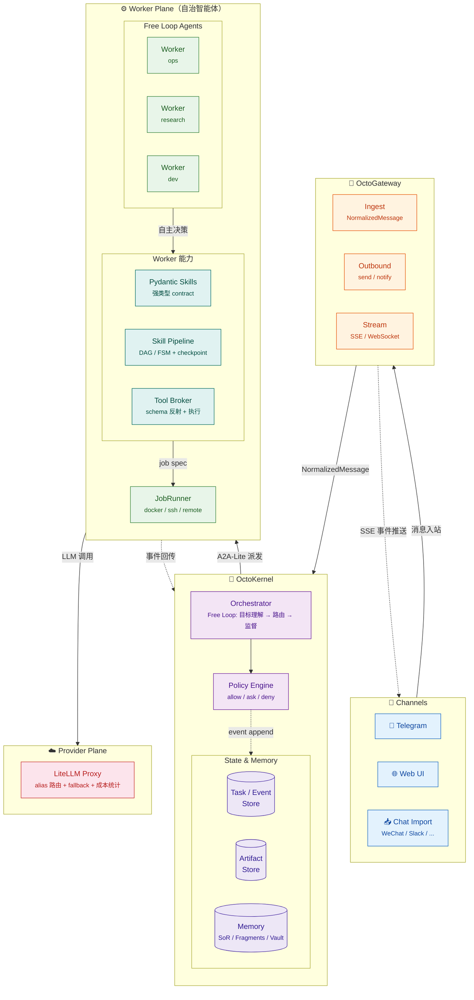

# OctoAgent 项目 BluePrint（内部代号：ATM）

> ATM = Advanced Token Monster  
> 本文档用于把 **OctoAgent**（从 Constitution → 需求 → 技术选型 → 技术架构 → 模块设计）收敛成可直接进入实现阶段的“工程蓝图”。  
> 目标是：**不用再回翻调研材料，也能按本文档开工**。

---

## 0. 文档元信息

- 项目名称：**OctoAgent**
- 内部代号：**ATM（Advanced Token Monster）**
- 文档类型：Project Blueprint / Engineering Blueprint
- 版本：v0.1（实现准备版）
- 状态：Ready-for-Implementation（待确认项见 §17）
- 目标读者：
  - 你（Owner / PM / 架构师 / 最终用户）
  - 未来可能加入的 1-3 名协作者（工程实现、前端、运维）
- 约束假设（可调整）：
  - 单用户为主（你的个人 AI OS），允许未来扩展到“小团队/家庭”但不以此为第一目标
  - 本地优先（个人电脑 + 局域网设备），允许部分组件云端化（如 GPU worker / 远端 job runner）
  - 需要 7x24 长期运行能力与可恢复能力（durable & resumable）

---

## 1. 执行摘要（Executive Summary）

OctoAgent 的定位不是“一个聊天机器人”，而是一个 **个人智能操作系统（Personal AI OS）**：

- 入口：多渠道（Web/Telegram 起步，后续可接入微信导入、Slack 等）
- 内核：任务化（Task）与事件化（Event）驱动，**可观测、可恢复、可中断、可审批**
- 执行：可隔离（Docker / SSH / 远程节点），可回放，产物（Artifacts）可追溯
- 记忆：有治理（SoR/Fragments 双线 + 版本化 + 冲突仲裁 + Vault 分区）
- 模型：统一出口（LiteLLM Proxy），别在业务代码里写死厂商模型名；以 alias + 策略路由
- 工具：契约化（schema 反射）+ 动态注入（Tool RAG）+ 风险门禁（policy allow/ask/deny）
- 目标：把你现有痛点收敛为一套“工程化可持续运行”的系统，且具备可演进能力。

**关键设计取舍：**
- 不追求一开始就做成“通用多智能体平台”。先把“单体 OS”打牢。
- 不追求一开始就引入重量级 Durable Orchestrator（如 Temporal）。先用 SQLite Event Store + Checkpoint + Watchdog 达到 80/20，预留升级路径。
- 不绑死任何一个 Provider、Channel、Memory 实现。所有外部依赖都必须可替换、可降级。

---

## 2. Constitution（系统宪章）

Constitution 是“不可谈判的硬规则”，用于防止系统在实现过程中走偏（尤其是你经历过生产事故后的硬约束）。

### 2.1 系统级宪章（System Constitution）

1) **Durability First（耐久优先）**  
   - 任何长任务/后台任务必须落盘：Task、Event、Artifact、Checkpoint 至少具备本地持久化。  
   - 进程重启后：任务状态不能”消失”，要么可恢复，要么可终止到终态（FAILED/CANCELLED/REJECTED）。

2) **Everything is an Event（事件一等公民）**  
   - 模型调用、工具调用、状态迁移、审批、错误、回放，都必须生成事件记录。  
   - UI/CLI 不应直接读内存状态，应以事件流/任务视图为事实来源。

3) **Tools are Contracts（工具即契约）**  
   - 工具对模型暴露的 schema 必须与代码签名一致（单一事实源）。  
   - 工具必须声明副作用等级：`none | reversible | irreversible`，并进入权限系统。

4) **Side-effect Must be Two-Phase（副作用必须二段式）**  
   - 不可逆操作必须拆成：`Plan`（无副作用）→ Gate（规则/人审/双模一致性）→ `Execute`。  
   - 任何绕过 Gate 的实现都视为严重缺陷。

5) **Least Privilege by Default（默认最小权限）**  
   - Kernel/Orchestrator 默认不持有高权限 secrets（设备、支付、生产配置）。  
   - secrets 必须按 project / scope 分区；工具运行时按需注入，不得进入 LLM 上下文。

6) **Degrade Gracefully（可降级）**  
   - 任一插件/外部依赖不可用时，系统不得整体不可用；必须支持 disable/降级路径。  
   - 例如：memU 插件失效 → 记忆能力降级为本地向量数据库直查，不影响任务系统。

7) **User-in-Control（用户可控 + 策略可配）**
   - 系统必须提供审批、取消、删除等控制能力（capability always available）。
   - 所有门禁默认启用（safe by default），但用户可通过策略配置（Policy Profile）调整——包括自动批准、静默执行等。
   - 对用户已明确授权的场景（定时任务、低风险工具链），应减少打扰、体现智能化。
   - 在无任何策略授权的情况下，不得静默执行不可逆操作。

8) **Observability is a Feature（可观测性是产品功能）**  
   - 每个任务必须可看到：当前状态、已执行步骤、消耗、产物、失败原因与下一步建议。  
   - 没有可观测性，就谈不上长期运行。

### 2.2 代理行为宪章（Agent Behavior Constitution）

> 这部分用于约束 Orchestrator / Worker 的行为策略（prompt + policy 的组合），避免“动作密度低”“猜配置”“乱写记忆”等典型事故模式。

1) **不猜关键配置与事实**  
   - 改配置/发命令前必须通过工具查询确认（read → propose → execute）。

2) **默认动作密度（Bias to Action）**  
   - 对可执行任务，必须输出下一步“具体动作”；禁止无意义的“汇报-等待”循环。  
   - 但动作必须满足安全门禁与可审计。

3) **上下文卫生（Context Hygiene）**  
   - 禁止把长日志/大文件原文直接塞进主上下文；必须走“工具输出压缩/摘要 + artifact 引用”。

4) **记忆写入必须治理**  
   - 禁止模型直接写入 SoR；只能提出 WriteProposal，由仲裁器验证后提交。

5) **失败必须可解释**  
   - 失败要分类（模型/解析/工具/业务），并给出可恢复路径（重试、降级、等待输入、人工介入）。

---

## 3. 目标、非目标与成功判据

### 3.1 项目目标（Goals）

- G1：构建一个能长期运行的 OctoAgent 内核：Task/Event/Artifact/Checkpoint 闭环
- G2：解决“主 Session 带宽不足”与“子任务失联/中断丢上下文”的核心痛点：  
  - 主体变成 **Orchestrator（路由/监督）**  
  - 执行下沉到 **Workers（独立上下文/独立执行环境）**
- G3：多渠道输入输出：至少 Web + Telegram；后续可插件化扩展
- G4：工具治理：工具契约化 + 动态注入 + 风险门禁
- G5：记忆治理：SoR/Fragments 双线 + 版本化 + 冲突仲裁 + Vault 分区
- G6：统一模型出口与成本治理：LiteLLM Proxy + alias 路由 + fallback + 统计
- G7：提供最小可用 UI：Chat + Task 面板 + Approvals（审批）+ Artifacts 查看

### 3.2 非目标（Non-goals / Anti-goals）

- NG1：不在 v0.x 阶段构建“插件市场/生态平台”
- NG2：不在 v0.x 阶段支持“企业级多租户/权限体系/复杂 RBAC”
- NG3：不在 v0.x 阶段追求“全自动无人值守做所有高风险动作”  
  - 高风险动作必须默认需要审批或强规则门禁
- NG4：不在 v0.x 阶段把所有子流程都 Pipeline 化
  - Orchestrator 和 Workers 永远 Free Loop；Skill Pipeline（Graph）仅用于有副作用/需要 checkpoint 的子流程，按需引入

### 3.3 成功判据（Success Metrics）

- S1：系统重启后，所有未完成任务都能在 UI 列表中看到，并且能：
  - resume（从 checkpoint 恢复）或 cancel（推进到终态）
- S2：任一任务可完整回放：能看到事件流、工具调用、产物列表
- S3：高风险操作（例如：发送外部消息、修改生产配置）默认需要审批或双模一致性门禁
- S4：多渠道一致性：同一 thread 的消息能落到同一 scope；支持增量去重与摘要
- S5：记忆一致性：同一 subject_key 在 SoR 永远只有 1 条 `current`；旧版可追溯
- S6：成本可见：每个 task 可看到 tokens/cost（按 model alias 聚合）

---

## 4. 用户画像与核心场景

### 4.1 Persona

- P1：Owner（你）
  - 需要：长任务、跨设备、可审计、可控风险、可治理记忆
  - 习惯：Telegram/微信（导入）、本地 Mac、局域网 Windows/NAS
- P2：未来协作者（可选）
  - 需要：可读的工程结构、可测试、可扩展、可观测、不会被 prompt 脆弱性拖垮

### 4.2 核心场景（Use Cases）

- UC1：每日/每周例行任务（早报、日报、周报、健康/财务/工作复盘）
- UC2：长时间研究与产出（调研报告、技术方案、对比分析）
- UC3：跨设备运维（NAS/Windows/Mac 的脚本执行、状态检查、文件同步）
- UC4：外部聊天导入与记忆更新（微信/Telegram 历史 → SoR/Fragments）
- UC5：有副作用的系统操作（改配置、发消息、创建日程、发送邮件）——默认审批，可通过 Policy Profile 授权自动执行
- UC6：项目资产治理（Projects / Skills / Scripts 组织与版本化）
- UC7：故障恢复（崩溃、断网、provider 429、插件失效）下的自动降级与可恢复

---

## 5. 需求（Requirements）

### 5.1 功能需求（Functional Requirements）

> 以 “必须/应该/可选” 分级。v0.1 以“必须 + 少量应该”为主。

#### 5.1.1 多渠道接入（Channels）

- FR-CH-1（必须）：支持 WebChannel
  - 提供基础 Chat UI（SSE/WS 流式输出）
  - 提供 Task 面板（task 列表、状态、事件、artifact）
  - 提供 Approvals 面板（待审批动作）

- FR-CH-2（必须）：支持 TelegramChannel
  - 支持 webhook 或 polling（默认 webhook）
  - 支持 pairing/allowlist（绑定用户/群）
  - thread_id 映射规则稳定（DM/群）

- FR-CH-3（应该）：支持 Chat Import Core（导入通用内核）
  - 支持增量导入去重
  - 支持窗口化摘要（chatlogs 原文 + fragments 摘要）
  - 支持在 chat scope 内维护 SoR（例如群规/约定/持续项目状态）

- FR-CH-4（可选）：微信导入插件（Adapter）
  - 解析微信导出格式 → NormalizedMessage 批量投递给 Chat Import Core

#### 5.1.2 Task / Event / Artifact（任务系统）

- FR-TASK-1（必须）：Task 生命周期管理
  - 状态：`CREATED → QUEUED → RUNNING → (WAITING_INPUT|WAITING_APPROVAL|PAUSED) → (SUCCEEDED|FAILED|CANCELLED|REJECTED)`
  - 终态：SUCCEEDED / FAILED / CANCELLED / REJECTED
  - REJECTED：策略拒绝或 Worker 能力不匹配时使用，区别于运行时 FAILED
  - 支持 retry / resume / cancel

- FR-TASK-2（必须）：事件流（Event Stream）
  - 对外提供 SSE：`/stream/task/{task_id}`
  - 每条事件有唯一 id、类型、时间、payload、trace_id

- FR-TASK-3（必须）：Artifact 产物管理
  - 多 Part 结构：单个 Artifact 可包含多个 Part（text/file/json/image），对齐 A2A Artifact.parts
  - 支持 inline 内容与 URI 引用双模（小内容 inline，大文件 storage_ref）
  - artifact 版本化，任务事件中引用 artifact_id
  - 流式追加：支持 append 模式逐步生成产物（如实时日志、增量报告）
  - 完整性：保留 hash + size 校验（A2A 没有但我们需要）

- FR-TASK-4（应该）：Checkpoint（可恢复快照）
  - Graph 节点级 checkpoint（至少保存 node_id + state snapshot）
  - 支持“从最后成功 checkpoint 恢复”而不是全量重跑

#### 5.1.3 Orchestrator + Workers（多代理/分层）

- FR-A2A-1（必须）：Orchestrator（协调器）负责：
  - 目标理解与分类
  - Worker 选择与派发
  - 全局停止条件与监督（看门狗策略）
  - 高风险动作 gate（审批/规则/双模校验）
  - 永远以 Free Loop 运行，不做模式选择

- FR-A2A-2（必须）：Workers（自治智能体）具备：
  - 独立 Free Loop（LLM 驱动，自主决策下一步）
  - 独立上下文（避免主会话带宽瓶颈）
  - 可调用 Skill Pipeline（Graph）执行确定性子流程
  - 可隔离执行环境（Docker/SSH）
  - 可回传事件与产物
  - 可被中断/取消，并推进终态

- FR-A2A-3（应该）：A2A-Lite 内部协议
  - Orchestrator 与 Worker 之间使用统一消息 envelope
  - 支持 TASK/UPDATE/CANCEL/RESULT/ERROR/HEARTBEAT
  - 内部状态为 A2A TaskState 超集，通过 A2AStateMapper 双向映射
  - Worker ↔ 外部 SubAgent 通信时使用标准 A2A TaskState

#### 5.1.4 Skills / Tools（能力沉淀与治理）

- FR-TOOL-1（必须）：工具契约化（schema 反射）
  - 从函数签名+类型注解+docstring 生成 JSON Schema
  - 工具必须声明 metadata：risk_level、side_effect、timeout、idempotency_support

- FR-TOOL-2（必须）：工具调用必须结构化
  - LLM 只能输出 tool_calls（JSON），由系统执行并回灌结构化结果
  - 工具输出超阈值必须压缩（summary + artifact）

- FR-TOOL-3（必须）：工具权限门禁（Policy Engine）
  - 默认 allow/ask/deny
  - irreversible 默认 ask（除非白名单策略）
  - 支持 per-project / per-channel / per-user 策略覆盖

- FR-SKILL-1（应该）：Skill 框架（Pydantic）
  - 每个 skill 明确 InputModel/OutputModel
  - 明确 tools_allowed 与 retry_policy
  - 可单元测试与回放

- FR-TOOLRAG-1（可选）：Tool Index + 动态注入（Tool RAG）
  - 使用向量数据库（LanceDB）做工具 embedding 检索与注入
  - 支持按 description + 参数 + tags + examples 索引

#### 5.1.5 记忆系统（Memory）

- FR-MEM-1（必须）：记忆双线
  - Fragments（事件线/可追溯）+ SoR（权威线/可覆盖）
  - SoR 必须版本化：`current/superseded`，同 subject_key 永远只有 1 条 current

- FR-MEM-2（必须）：记忆写入治理
  - 模型先生成 WriteProposal（ADD/UPDATE/DELETE/NONE）
  - 仲裁器验证合法性、冲突检测、证据引用 → commit

- FR-MEM-3（应该）：分区（Vault）
  - 支持敏感数据分区与授权检索（默认不检索）

- FR-MEM-4（可选）：文档知识库增量更新（doc_id@version）
  - doc_hash 检测变更，chunk 内容寻址，增量嵌入

#### 5.1.6 执行层（JobRunner & Sandboxing）

- FR-EXEC-1（必须）：JobRunner 抽象
  - backend：local_docker（默认），ssh（可选），remote_gpu（可选）
  - 统一语义：start/stream_logs/cancel/status/artifacts

- FR-EXEC-2（必须）：默认隔离执行
  - 代码执行、脚本运行默认进 Docker
  - 默认禁网；按需开网（白名单）

- FR-EXEC-3（应该）：Watchdog
  - 检测无进展（基于事件/日志/心跳）
  - 自动提醒/自动降级/自动 cancel（策略可配）

#### 5.1.7 模型与认证（Provider）

- FR-LLM-1（必须）：统一模型出口（LiteLLM Proxy）
  - 业务侧只用 model alias，不写厂商型号
  - 支持 fallback、限流、成本统计

- FR-LLM-2（应该）：双模型体系
  - cheap/utility 模型用于摘要/抽取/压缩/路由
  - main 模型用于规划/高风险确认/复杂推理

#### 5.1.8 管理与运维

- FR-OPS-1（必须）：配置与版本
  - config 可分：system / user / project / plugin
  - 任何配置变更生成事件并可回滚

- FR-OPS-2（必须）：最小可用可观测
  - logs：结构化日志（task_id/trace_id）
  - metrics：任务数、失败率、模型消耗、工具耗时
  - traces：至少对模型调用与工具调用打点

### 5.2 非功能需求（Non-functional Requirements）

- NFR-1：可靠性
  - 单机断电/重启后不丢任务元信息
  - 插件崩溃不应拖死主进程（隔离/超时/熔断）

- NFR-2：安全与隐私
  - secrets 不进 prompt
  - Vault 分区默认不可检索
  - 所有外部发送类动作必须门禁

- NFR-3：可维护性
  - 明确模块边界与协议
  - 核心数据模型版本化
  - 具备测试基线（unit + integration）

- NFR-4：性能与成本
  - 普通交互响应：< 2s 起流（可用 cheap 模型）
  - 任务成本可视；支持预算阈值与自动降级策略

- NFR-5：可扩展性
  - 新增 channel / tool / skill / memory backend 不应修改核心内核逻辑（或改动极小）

---

## 6. 总体架构（Architecture Overview）

### 6.1 分层架构

OctoAgent 采用”**全层 Free Loop + Skill Pipeline**”的统一架构：

- **Orchestrator（路由与监督层）**
  永远以 Free Loop 运行。负责理解目标、记忆检索与压缩、Worker 选择与派发、全局停止条件与监督。

- **Workers（自治智能体层）**
  永远以 Free Loop 运行。每个 Worker 是独立的 LLM 驱动智能体，自主决策下一步行动。
  当需要执行有结构的子流程时，调用 Skill Pipeline（Graph）。

- **Skill Pipeline / Graph（确定性流程编排）**
  Worker 的工具而非独立执行模式。把关键子流程建模为 DAG/FSM：
  节点级 checkpoint、回退/重试策略、风险门禁、可回放。

- **Pydantic Skills（强类型执行层）**
  每个节点以 contract 为中心：结构化输出、工具参数校验、并行工具调用、框架化重试/审批。

- **LiteLLM Proxy（模型网关/治理层）**
  统一模型出口：alias 路由、fallback、限流、成本统计、日志审计。

> **设计原则**：Orchestrator 和 Workers 保持最大灵活性（Free Loop），确定性只在需要的地方引入（Skill Pipeline）。Graph 不是”执行模式”，而是 Worker 手中的编排工具。

### 6.2 逻辑组件图（Mermaid）



### 6.3 数据与控制流（关键路径）

#### 6.3.1 用户消息 → 任务

1. ChannelAdapter 收到消息 → 转成 `NormalizedMessage`
2. Gateway 调 `POST /ingest_message` 投递到 Kernel
3. Kernel：
   - 创建 Task（若是新请求）或产生 UPDATE 事件（若是追加信息）
   - Orchestrator Loop 分类/路由 → 选择 Worker 并派发
   - Worker 以 Free Loop 执行，自主决定调用 Skill 或 Skill Pipeline（Graph）

#### 6.3.2 任务执行 → 事件/产物 → 流式输出

1. Skill/Tool 执行过程中：
   - 产生事件：MODEL_CALL、TOOL_CALL、STATE_TRANSITION、ARTIFACT_CREATED 等
2. Gateway 订阅任务事件流（SSE），推送到 Web UI / Telegram
3. 如果进入 WAITING_APPROVAL：  
   - UI/Telegram 展示审批卡片  
   - 用户批准 → 产生 APPROVED 事件 → Graph 继续执行

#### 6.3.3 崩溃恢复

- Kernel 重启：
  - 扫描 Task Store：所有 RUNNING/WAITING_* 的任务进入”恢复队列”
  - Skill Pipeline（Graph）内崩溃：从最后 checkpoint 继续（确定性恢复）
  - Worker Free Loop 内崩溃：重启 Free Loop，将之前的 Event 历史注入为上下文，由 LLM 自主判断从哪里继续（可配置为”需要人工确认”）

---

## 7. 技术选型（Tech Stack & Rationale）

> 目标：用尽可能少的组件实现核心价值；同时所有关键依赖都要可替换。

### 7.1 语言与运行时

- Python 3.12+（主工程）
- uv（依赖与环境管理）
- Docker（执行隔离）

理由：
- 生态与 agent 框架成熟；落地速度快；易于沉淀工具与技能。

### 7.2 Web / API

- FastAPI + Uvicorn（Gateway + Kernel API）
- SSE（任务流式事件）优先；WS 可选

理由：
- SSE 足够满足 task stream（one-way），比 WS 简单稳定；可降级到长轮询。

### 7.3 数据持久化

- SQLite（结构化数据默认）
  - WAL 模式
  - 事件表 append-only
  - 用于 Task/Event/Artifact 元信息等结构化存储

- 向量数据库（语义检索默认）
  - LanceDB（嵌入式 in-process，MVP 首选）
  - 用于 ToolIndex / 记忆检索 / 知识库
  - 直接上 embedding 方案，不经过 FTS 中间态
  - 原生支持版本化 Lance 格式、混合检索（vector + FTS + SQL）、增量更新

### 7.4 模型网关

- LiteLLM Proxy（必选）

理由：
- 把 provider 差异、密钥托管、fallback、限流、成本统计从业务代码剥离；
- 让你未来切换模型/订阅/供应商时不需要大改。

### 7.5 Agent / Workflow / Contract

- Pydantic（数据模型、输入输出校验）
- Pydantic AI（Skill 层，结构化输出 + 工具调用）
- Graph Engine：pydantic-graph（Pydantic AI 内置子模块）
  - 与 Skills 层同生态，类型体系一脉相承
  - 内置 checkpoint persistence、HITL（iter/resume）、async nodes
  - 仅需薄包装：事件发射（节点迁移 → Event Store）+ SQLite persistence adapter

理由：
- Contract 优先：把”约束”从 prompt 转移到 schema；
- Orchestrator 和 Workers 永远 Free Loop；Skill Pipeline（pydantic-graph）仅用于有副作用/需要 checkpoint 的子流程，由 Worker 按需调用；
- pydantic-graph 作为 Pydantic AI 子包，零额外依赖，避免自研 checkpoint/HITL 的开发成本。

### 7.6 Channel 适配

- Telegram：aiogram
  - 原生 async（与 FastAPI 共享 event loop）
  - 内置 FSM（适配 WAITING_APPROVAL/WAITING_INPUT 审批流）
  - webhook 模式
- Web UI：React + Vite
  - 从 M0 开始使用，避免迁移债务
  - SSE 消费用原生 EventSource 对接 Gateway `/stream/task/{id}`
  - M0 仅需 TaskList + EventStream 两个组件；后续 Approvals/Config/Artifacts 自然扩展

### 7.7 可观测

- Logfire（Pydantic 团队出品，OTel 原生）
  - 自动 instrument Pydantic AI / pydantic-graph / FastAPI，零手动打点
  - 内置 LLM 可观测：token 计数、cost 追踪、流式调用追踪、tool inspection
  - 底层是 OpenTelemetry 协议，满足 OTel 兼容要求
- structlog（结构化日志）
  - canonical log lines + 自动绑定 trace_id / task_id
  - dev 环境 pretty print，prod 环境 JSON 输出
- SQLite Event Store（metrics 数据源）
  - 项目已有 append-only events 记录 MODEL_CALL / TOOL_CALL / STATE_TRANSITION
  - cost / tokens / latency 直接 SQL 聚合查询，无需独立 metrics 服务

### 7.8 任务调度

- APScheduler（MVP）
- 后续可替换为更成熟的队列/worker（如 Celery/Arq），但不作为 v0.1 必需。

---

## 8. 核心设计（Core Design）

### 8.1 统一数据模型（Domain Model）

#### 8.1.1 NormalizedMessage

```yaml
NormalizedMessage:
  channel: "telegram" | "web" | "wechat_import" | ...
  thread_id: "stable_thread_key"
  scope_id: "chat:<channel>:<thread_id>"
  sender_id: "..."
  sender_name: "..."
  timestamp: "RFC3339"
  text: "..."
  attachments:
    - id: "..."
      mime: "..."
      filename: "..."
      size: 123
      storage_ref: "artifact://..."
  raw_ref: "pointer to original event"
  meta:
    message_id: "optional upstream id"
    reply_to: "optional"
```

#### 8.1.2 Task / Event / Artifact

```yaml
Task:
  task_id: "uuid"
  created_at: "..."
  updated_at: "..."
  status: CREATED|QUEUED|RUNNING|WAITING_INPUT|WAITING_APPROVAL|PAUSED|SUCCEEDED|FAILED|CANCELLED|REJECTED
  title: "short"
  thread_id: "..."
  scope_id: "..."
  requester: { channel, sender_id }
  assigned_worker: "worker_id"
  risk_level: low|medium|high
  budget:
    max_cost_usd: 0.0
    max_tokens: 0
    deadline_at: "optional"
  pointers:
    latest_event_id: "..."
    latest_checkpoint_id: "optional"
```

```yaml
Event:
  event_id: "ulid"
  task_id: "uuid"
  ts: "..."
  type: TASK_CREATED|USER_MESSAGE|MODEL_CALL|TOOL_CALL|TOOL_RESULT|STATE_TRANSITION|ARTIFACT_CREATED|APPROVAL_REQUESTED|APPROVED|REJECTED|TASK_REJECTED|ERROR|HEARTBEAT|CHECKPOINT_SAVED
  actor: user|kernel|worker|tool|system
  payload: { ... }   # 强结构化（尽量少塞大文本）
  trace_id: "..."
  span_id: "..."
  causality:
    parent_event_id: "optional"
    idempotency_key: "optional"
```

```yaml
Artifact:
  artifact_id: "ulid"            # 全局唯一（A2A 只有 index，我们更强）
  task_id: "uuid"
  ts: "..."
  name: "..."
  description: "optional"        # 新增，对齐 A2A
  parts:                         # 改为 parts 数组，对齐 A2A Artifact.parts
    - type: text|file|json|image # 对应 A2A 的 TextPart/FilePart/JsonPart
      mime: "..."                # Part 级别 MIME
      content: "inline 或 null"  # 小内容 inline（对齐 A2A data/text）
      uri: "file:///... 或 null" # 大文件引用（对齐 A2A FilePart.uri）
  storage_ref: "..."             # 保留，整体大文件外部存储引用
  size: 123                      # 保留，A2A 没有
  hash: "sha256"                 # 保留，完整性校验
  version: 1                     # 保留，版本化能力（A2A immutable，我们支持版本迭代）
  append: false                  # 新增，对齐 A2A 流式追加
  last_chunk: false              # 新增，标记流式最后一块
  meta: { ... }
```

Part 类型说明（对齐 A2A Part 规范）：
- `text`：纯文本 / markdown（对应 A2A TextPart）
- `file`：文件引用或 inline Base64（对应 A2A FilePart）
- `json`：结构化 JSON 数据（对应 A2A JsonPart）
- `image`：图片（本质是 file 的特化，便于 UI 渲染）
- 暂不支持 A2A 的 FormPart / IFramePart，按需扩展

---

### 8.2 Task/Event Store：事件溯源与视图

#### 8.2.1 事件溯源（Event Sourcing）策略

- 事实来源：Event 表（append-only）
- Task 表：是 Event 的“物化视图”（projection），用于快速查询
- 任何对 Task 的状态更新都必须通过写入事件触发 projection 更新

**好处：**
- 可回放（replay）
- 可审计（audit）
- 可恢复（rebuild projections）

#### 8.2.2 SQLite 表建议（MVP）

- `tasks`：task_id PK，status，meta，timestamps，indexes(thread_id, status)
- `events`：event_id PK，task_id FK，ts，type，payload_json，indexes(task_id, ts)
- `artifacts`：artifact_id PK，task_id FK，kind，storage_ref，hash，version
- `checkpoints`：checkpoint_id PK，task_id FK，node_id，state_json，ts
- `approvals`：approval_id PK，task_id FK，status，request_json，decision_json

**一致性要求：**
- 写事件与更新 projection 必须在同一事务内（SQLite transaction）
- events 使用 ULID/时间有序 id 便于流式读取

---

### 8.3 编排模型：全层 Free Loop + Skill Pipeline

#### 8.3.1 设计原则

Orchestrator 和 Workers **永远以 Free Loop 运行**，保证最大灵活性和自主决策能力。
确定性编排（Graph）**下沉为 Worker 的工具**——Skill Pipeline，仅在需要时由 Worker 主动调用。

- **Free Loop**（Orchestrator / Workers）：LLM 驱动的推理循环，自主决策下一步行动
- **Skill Pipeline**（Worker 的子流程）：确定性 DAG/FSM，用于有副作用/需要 checkpoint/需要审计的子任务

> Graph 不是”执行模式的一种选择”，而是 Worker 手中的编排工具——类似于 Worker 可以调用单个 Skill，也可以调用一条 Skill Pipeline。

#### 8.3.2 Worker 何时调用 Skill Pipeline（建议默认规则）

Worker 在 Free Loop 中自主决策。满足任一条件时，倾向于使用 Skill Pipeline：
- 有不可逆副作用（发消息/改配置/支付/删除）
- 对接”正式系统”（calendar/email/生产配置）
- 需要可审计/可回放（对外承诺、重要决策）
- 需要强 SLA（定时任务、稳定交付）
- 多步骤流程需要节点级 checkpoint（崩溃后可从中间恢复）

其余情况，Worker 在 Free Loop 中直接调用单个 Skill 或 Tool 即可。

#### 8.3.3 Skill Pipeline 类型

- DAG：一次性流水线（抽取→规划→执行→总结）
- FSM：多轮交互、审批、等待外部事件（审批通过→执行，否则回退）

#### 8.3.4 Skill Pipeline Engine MVP 要求（基于 pydantic-graph）

- 节点 contract 校验（输入/输出）— pydantic-graph 原生类型安全
- checkpoint（每个节点结束写 checkpoint）— pydantic-graph 内置 persistence，需适配 SQLite
- retry 策略：
  - 同模型重试
  - 升级模型（cheap → main）
  - 切换 provider（由 LiteLLM 处理）
- interrupt（HITL）— pydantic-graph 内置 iter/resume：
  - WAITING_APPROVAL
  - WAITING_INPUT
- 事件化：节点运行与迁移必须发事件 — 需薄包装 EventEmitter

#### 8.3.5 崩溃恢复策略

| 崩溃位置                   | 恢复方式                                                       |
| -------------------------- | -------------------------------------------------------------- |
| Skill Pipeline 节点内      | 从最后 checkpoint 确定性恢复                                   |
| Worker Free Loop 内        | 重启 Loop，将 Event 历史注入为上下文，LLM 自主判断续接点       |
| Orchestrator Free Loop 内  | 重启 Loop，扫描未完成 Task，重新派发或等待人工确认             |

---

### 8.4 Skills（Pydantic AI）设计

#### 8.4.1 Skill 模板

```yaml
SkillSpec:
  name: "string"
  version: "semver"
  risk_level: low|medium|high
  input_model: "PydanticModel"
  output_model: "PydanticModel"
  tools_allowed:
    - tool_id
  tool_policy: sequential|parallel|mixed
  retry_policy:
    max_attempts: 3
    backoff_ms: 500
    upgrade_model_on_fail: true
  approval_policy:
    mode: none|rule_based|human_in_loop
```

#### 8.4.2 Skill 运行语义（必须一致）

1. 校验输入（InputModel）
2. 调用模型（通过 LiteLLM alias）
3. 解析并校验输出（OutputModel）
4. 若输出包含 tool_calls：
   - 校验工具参数 schema
   - Policy Engine 判定 allow/ask/deny
   - allow → 执行；ask → 进入审批；deny → 返回错误并可重试
5. 工具结果回灌模型（结构化）
6. 输出最终结果（校验 + 产物）

---

### 8.5 Tooling：工具契约 + 动态注入 + 安全门禁

#### 8.5.1 工具分级（必须）

- Read-only：检索、查询、读取日历/邮件、读取配置
- Write-but-reversible：写草稿、创建临时记录、生成建议但不提交
- Irreversible / High-risk：发邮件、发送消息、支付、写生产配置、删除数据

#### 8.5.2 工具元数据（Tool Metadata）

```yaml
ToolMeta:
  tool_id: "namespace.name"
  version: "hash or semver"
  side_effect: none|reversible|irreversible
  risk_level: low|medium|high
  timeout_s: 30
  idempotency: supported|required|not_supported
  requires:
    - capability: "device.ssh"
    - permission: "proj:ops:write"
  outputs:
    max_inline_chars: 4000
    store_full_as_artifact: true
```

#### 8.5.3 Tool Index（MVP）

- 向量数据库（LanceDB）：embedding 索引 tool 描述 + 参数 + tags + examples
- Orchestrator 在运行时检索：
  - 语义相似度匹配候选工具集合（Top-K）
  - 再由 Policy Engine 过滤
  - 最终注入到 Skill 的可用工具列表（减少工具膨胀）

#### 8.5.4 工具输出压缩（Context GC）

规则（建议默认）：
- 工具输出 > `N` 字符：
  - 全量输出存 artifact
  - 生成 summary（cheap 模型）
  - 只把 summary 回灌主上下文
- 工具输出含敏感信息：
  - 自动 redaction（屏蔽）
  - 存入 Vault 分区（需要授权检索）

---

### 8.6 Policy Engine：allow/ask/deny + 审批工作流

#### 8.6.1 最小策略模型

- 输入：tool_call / action_plan / task_meta / user_context
- 输出：Decision
  - allow（自动执行）
  - ask（请求审批）
  - deny（拒绝并解释原因）

#### 8.6.2 默认策略（建议）

- irreversible 工具：默认 ask
- reversible 工具：默认 allow，但可按 project 提升为 ask
- read-only：默认 allow
- 任何涉及外部发送/支付/删除：默认 ask（需要策略白名单或显式审批才可 silent allow）

**策略可配原则（与 Constitution 原则 7 对齐）：**
- 所有门禁 safe by default，但用户可通过 Policy Profile 调整
- 对用户已明确授权的场景（如定时任务、低风险工具链），自动批准以减少打扰
- 策略变更本身是事件，可审计可回滚

#### 8.6.3 审批交互

- 触发 ask：
  - 写入 APPROVAL_REQUESTED 事件
  - task 状态进入 WAITING_APPROVAL
- 用户批准：
  - 写入 APPROVED 事件
  - task 状态回到 RUNNING，Graph 从 gate 节点继续

审批载荷（建议）：
- action summary
- risk explanation
- idempotency_key
- dry_run 结果（若有）
- rollback/compensation 提示

---

### 8.7 Memory：SoR/Fragments/Vault + 写入仲裁

#### 8.7.1 两条记忆线

- Fragments（事件线）：append-only；保存对话/工具执行/聊天窗口摘要；用于证据与回放
- SoR（权威线）：同一 subject_key 只有一个 current；旧版 superseded

**默认回答策略：**
- 问“现在是什么” → 只查 SoR.current
- 问“为什么/过程” → SoR + Fragments + superseded 版本（可选）

#### 8.7.2 六大分区（建议）

- `core`：系统运行信息（tasks、incidents、configs）
- `profile`：用户偏好/长期事实（非敏感）
- `work`：工作项目与知识（可更新）
- `health`：健康相关（敏感，默认 Vault）
- `finance`：财务相关（敏感，默认 Vault）
- `chat:<channel>:<thread_id>`：聊天 scope（可维护群规/约定/项目状态）

#### 8.7.3 写入治理：两阶段仲裁

- 阶段 A（cheap 模型）：提出 WriteProposal
- 阶段 B（规则 + 可选强模型）：校验合法性/冲突/证据存在性 → commit

WriteProposal 示例：

```yaml
WriteProposal:
  action: ADD|UPDATE|DELETE|NONE
  subject_key: "work.projectX.status"
  partition: "work"
  new_value: { ... }
  rationale: "..."
  evidence_refs:
    - fragment_id
    - artifact_id
  confidence: 0.0-1.0
```

#### 8.7.4 Chat Import Core（通用内核）

- thread/scope 隔离：`scope_id=chat:<channel>:<thread_id>`
- 增量去重：`msg_key = hash(sender + timestamp + normalized_text)` 或原 msg_id
- 窗口化摘要：
  - chatlogs：原文可审计
  - fragments：可检索摘要片段
- 可选：实体提取与关系索引
- 可选：在 chat scope 内更新 SoR（群规/约定/项目状态）

---

### 8.8 Execution Plane：Worker + JobRunner + Sandboxing

#### 8.8.1 Worker 责任边界

**Worker 是自治智能体**，以 Free Loop（LLM 驱动循环）运行，自主决策下一步行动。

Worker 不负责：
- 多渠道 I/O（由 Gateway 负责）
- 全局策略决策（由 Kernel Policy 负责）
- 全局路由与监督（由 Orchestrator 负责）

Worker 负责：

- 以 Free Loop 自主执行任务
- 决策何时调用单个 Skill、Skill Pipeline（Graph）、或 Tool
- 维护 project workspace
- 产出 artifact
- 回传事件与心跳

#### 8.8.2 JobRunner 接口（概念）

```python
class JobRunner(Protocol):
    async def start(self, job_spec) -> str: ...
    async def status(self, job_id) -> dict: ...
    async def stream_logs(self, job_id, cursor=None): ...
    async def cancel(self, job_id) -> None: ...
    async def collect_artifacts(self, job_id) -> list[Artifact]: ...
```

backend：
- local_docker：默认
- ssh：控制 LAN 设备
- remote_gpu：跑大模型/训练/批处理（可选）

#### 8.8.3 Sandboxing 策略

- 默认 Docker：
  - 非 root
  - 网络默认禁用
  - 只挂载白名单目录
- 需要网络的任务：
  - 通过策略显式开启（并记录事件）
- 对宿主机操作：
  - 必须通过专用 tool，并默认 ask（除非白名单）

---

### 8.9 Provider Plane：LiteLLM alias 策略

#### 8.9.1 alias 分类（建议）

- `router`：意图分类、风险分级（小模型）
- `extractor`：结构化抽取（小/中模型）
- `planner`：多约束规划（大模型）
- `executor`：高风险执行前确认（大模型，稳定优先）
- `summarizer`：摘要/压缩（小模型）
- `fallback`：备用 provider

#### 8.9.2 统一成本治理

- 每次模型调用写入事件：
  - model_alias、provider、latency、tokens、cost
- per-task 预算阈值触发策略：
  - 超预算 → 降级到 cheap 模型 / 提示用户 / 暂停等待确认

---

## 9. 模块设计（Module Breakdown）

> 本节给出实现层面的模块拆分、职责、接口与边界，确保进入实现阶段时“有人照着写也不会打架”。

### 9.1 Repo 结构建议（Monorepo）

```text
octoagent/
  pyproject.toml
  uv.lock
  apps/
    gateway/                 # OctoGateway
    kernel/                  # OctoKernel
    workers/
      ops/
      research/
      dev/
  packages/
    core/                    # domain models + event store + common utils
    protocol/                # A2A-lite envelope + NormalizedMessage
    plugins/                 # plugin loader + manifests + capability graph
    tooling/                 # tool schema reflection + tool broker
    memory/                  # SoR/Fragments/Vault + arbitration
    provider/                # litellm client wrappers + cost model
    observability/           # otel setup + logging helpers
    ui/                      # minimal web ui (optional)
  plugins/
    channels/
      telegram/
      web/
      wechat_import/
    tools/
      filesystem/
      docker/
      ssh/
      web/
  data/
    sqlite/                  # local db
    artifacts/               # artifact files
    vault/                   # encrypted or restricted
  docs/
    blueprint.md
```

### 9.2 packages/core

职责：
- Domain models（Task/Event/Artifact/Checkpoint/Approval）
- SQLite store（event-sourcing + projections）
- 迁移与 schema version
- 幂等键处理

关键接口：
- `TaskStore.create_task(...)`
- `EventStore.append_event(...)`
- `Projection.apply_event(...)`
- `ArtifactStore.put/get/list(...)`

### 9.3 apps/gateway

职责：
- ChannelAdapter lifecycle（start/stop）
- 入站消息 normalization（NormalizedMessage）
- 出站消息发送（Telegram/Web）
- SSE/WS stream 转发（从 Kernel 订阅）

对外 API（MVP）：
- `POST /ingest_message`
- `GET /stream/task/{task_id}`
- `POST /approve/{approval_id}`

### 9.4 apps/kernel

职责：

- Orchestrator Loop（目标理解、路由、监督；永远 Free Loop）
- Policy Engine（allow/ask/deny + approvals）
- Memory Core（检索、写入提案、仲裁、commit）

关键内部组件：

- `Router`：决定 worker 派发
- `Supervisor`：watchdog + stop condition
- `ApprovalService`：审批状态机
- `MemoryService`：read/write arbitration

### 9.5 workers/*

每个 worker 是自治智能体（Free Loop），具备：

- 独立运行（进程/容器均可）
- 拥有自己的工作目录（project workspace）
- Skill Runner（Pydantic AI）+ Skill Pipeline（pydantic-graph）
- Tool Broker（schema、动态注入、执行编排）
- 暴露内部 RPC（HTTP/gRPC 均可；MVP 用 HTTP）

worker 的最小端点：
- `POST /a2a/run`（TASK）
- `POST /a2a/update`（UPDATE）
- `POST /a2a/cancel`（CANCEL）
- `GET /health`

### 9.6 packages/plugins

职责：
- Plugin manifest 解析
- Plugin Loader（enable/disable）
- Capability Graph（依赖解析、健康门禁）
- 插件隔离策略（超时、崩溃熔断）

Manifest 示例：

```yaml
id: "channel.telegram"
version: "0.1.0"
type: "channel"
requires:
  - "core>=0.1"
  - "provider.litellm"
capabilities:
  - "channel.ingest"
  - "channel.send"
healthcheck:
  kind: "http"
  url: "http://localhost:9001/health"
config_schema:
  ...
```

### 9.7 packages/tooling

职责：
- 工具扫描与 schema 反射
- ToolIndex 构建（向量 embedding 检索）
- ToolBroker（执行、并发、超时、结果压缩）
- ToolResult 结构化回灌

### 9.8 packages/memory

职责：
- Fragments/SoR/Vault 数据模型
- 检索（向量语义检索）
- 写入仲裁（WriteProposal → validate → commit）
- Chat Import Core（dedupe、window、summarize）

### 9.9 packages/provider

职责：
- LiteLLM proxy client wrapper
- alias 与策略（router/extractor/planner/executor/summarizer）
- fallback 与错误分类
- cost/tokens 解析

### 9.10 packages/observability

职责：
- Logfire init（自动 instrument Pydantic AI / FastAPI）
- structlog 配置（dev pretty / prod JSON）
- 统一 trace_id 贯穿 event payload
- Event Store metrics 查询辅助（cost/tokens 聚合）

---

## 10. API 与协议（Interface Spec）

### 10.1 Gateway ↔ Kernel（HTTP）

- `POST /kernel/ingest_message`
  - body: NormalizedMessage
  - returns: `{task_id}`

- `GET /kernel/stream/task/{task_id}`
  - SSE events: Event（json）

- `POST /kernel/approvals/{approval_id}/decision`
  - body: `{decision: approve|reject, comment?: str}`

### 10.2 Kernel ↔ Worker（A2A-Lite Envelope）

```yaml
A2AMessage:
  message_id: "uuid"
  task_id: "uuid"
  from: "agent://kernel"
  to: "agent://worker.ops"
  type: TASK|UPDATE|CANCEL|RESULT|ERROR|HEARTBEAT
  idempotency_key: "string"
  timestamp_ms: 0
  payload: { ... }
  trace: { trace_id, parent_span_id }
```

语义要求：
- UPDATE 必须可投递到”正在运行的 task”；否则进入 WAITING_INPUT 并提示用户
- CANCEL 必须推进终态（CANCELLED），不可”卡 RUNNING”

#### 10.2.1 A2A 状态映射（A2A TaskState Compatibility）

OctoAgent 内部状态是 A2A 协议的**超集**。内部通信（Kernel ↔ Worker）使用完整状态；对外暴露 A2A 接口时通过映射层转换。

```yaml
# OctoAgent → A2A TaskState 映射
StateMapping:
  CREATED:           submitted     # 合并到 submitted（已接收未处理）
  QUEUED:            submitted
  RUNNING:           working
  WAITING_INPUT:     input-required
  WAITING_APPROVAL:  input-required  # 审批对外表现为”需要输入”
  PAUSED:            working         # 暂停是内部实现细节，对外仍为”处理中”
  SUCCEEDED:         completed
  FAILED:            failed
  CANCELLED:         canceled
  REJECTED:          rejected        # 直接映射

# A2A → OctoAgent 反向映射（外部 Agent 调入时）
ReverseMapping:
  submitted:      QUEUED
  working:        RUNNING
  input-required: WAITING_INPUT
  completed:      SUCCEEDED
  canceled:       CANCELLED
  failed:         FAILED
  rejected:       REJECTED
  auth-required:  WAITING_APPROVAL   # auth 语义映射到审批
  unknown:        FAILED             # 降级为失败
```

设计原则：
- **内部超集**：OctoAgent 保留 WAITING_APPROVAL、PAUSED、CREATED 等 A2A 没有的状态，满足内部治理需求
- **外部兼容**：对外通过 A2AStateMapper 暴露标准 A2A TaskState，实现 Worker ↔ SubAgent 通信一致性
- **映射无损**：终态（completed/canceled/failed/rejected）一一对应；非终态映射后语义明确

#### 10.2.2 A2A Artifact 映射

OctoAgent Artifact 是 A2A Artifact 的**超集**（多出 artifact_id、version、hash、size）。对外暴露时通过映射层转换。

```yaml
# OctoAgent Artifact → A2A Artifact 映射
ArtifactMapping:
  name:        → name
  description: → description
  parts:       → parts            # Part 结构已对齐（text/file/json → TextPart/FilePart/JsonPart）
  append:      → append
  last_chunk:  → lastChunk
  # 以下字段对外不暴露（A2A 没有，OctoAgent 独有）
  artifact_id: → 丢弃（A2A 用 index 代替）
  version:     → metadata.version  # 降级到 metadata
  hash:        → metadata.hash
  size:        → metadata.size
  storage_ref: → 转为 parts[].uri  # storage_ref 映射到 Part 的 uri 字段

# Part 类型映射
PartTypeMapping:
  text:  → TextPart   (content → text)
  file:  → FilePart   (content → data[base64], uri → uri)
  json:  → JsonPart   (content → data)
  image: → FilePart   (mime: image/*, uri → uri)
```

### 10.3 Tool Call 协议

- LLM 输出：
  - `tool_calls: [{tool_id, args_json, idempotency_key}]`
- ToolBroker 执行：
  - 返回 `ToolResult { ok, data, error, artifact_refs }`
- 结果回灌：
  - 只回灌 summary + structured fields
  - 全量输出走 artifact

---

## 11. 冲突排查与合理性校验（Consistency & Conflict Checks）

本节把“容易互相打架”的点提前检查并给出收敛方案。

### 11.1 事件溯源 vs 快速迭代

**冲突：** Event sourcing 看起来“重”，会拖慢 MVP。  
**收敛：**  
- MVP 只实现最小 event 表 + tasks projection 表，不做复杂 replay 工具；  
- 先保证“崩溃不丢任务”，再逐步增强回放能力。

### 11.2 SQLite vs 可扩展并发

**冲突：** SQLite 并发能力有限。  
**收敛：**
- 单用户场景使用 WAL + 单写多读即可；  
- 单用户场景 SQLite WAL 足够，暂不引入额外数据库。

### 11.3 Free Loop 自由度 vs 安全门禁

**冲突：** Free Loop 容易越权执行高风险动作。  
**收敛：**
- mode 不是安全边界；安全边界在 Policy Engine。  
- 即使是 Free Loop，也必须通过 tool broker + policy；不可直接调用外部系统。

### 11.4 Tool RAG 动态注入 vs 可预测性

**冲突：** 动态注入工具会导致行为不稳定。  
**收敛：**
- ToolIndex 的检索结果必须写事件（记录当时注入的工具集合与版本）。  
- 对关键 Graph，工具集合固定在 Graph 版本里（不动态注入）。

### 11.5 记忆自动写入 vs 记忆污染

**冲突：** 自动写记忆容易污染 SoR。  
**收敛：**
- 禁止直接写 SoR；必须 WriteProposal + 仲裁。  
- 仲裁默认严格：证据不足/冲突不明 → 不写（NONE）或进入待确认。

### 11.6 多 Channel 实时接入 vs 导入一致性

**冲突：** 实时渠道与离线导入格式差异大。  
**收敛：**
- 统一入口：NormalizedMessage + scope/thread 模型。  
- 渠道差异只存在于 Adapter；内核只处理标准消息流。

---

## 12. 运行与部署（Ops & Deployment）

### 12.1 最小部署（单机 Docker Compose）

- litellm-proxy（容器）
- octo-kernel（容器或本地）
- octo-gateway（容器或本地）
- octo-worker-ops/research/dev（可选；先内置在 kernel 进程也可）
- sqlite + artifacts 挂载到本地卷

### 12.2 数据备份策略

- SQLite：每日快照 + WAL 归档
- artifacts：按 task_id 目录存放，定期 rsync 到 NAS
- vault：单独加密备份

### 12.3 故障策略

- Provider 失败：LiteLLM fallback + 冷却；事件记录原因
- Worker 失败：标记 worker unhealthy；task 进入 WAITING_INPUT 或重派发策略
- Plugin 失败：自动 disable 并降级；记录 incident

---

## 13. 测试策略（Testing Strategy）

### 13.1 单元测试（Unit）

- domain models 校验
- event store 事务一致性
- tool schema 反射一致性（contract tests）
- policy engine 决策矩阵

### 13.2 集成测试（Integration）

- task 执行：从 ingest_message 到 stream events
- approval flow：ask → approve → resume
- worker 执行：jobrunner docker backend
- memory arbitration：write proposal → commit

### 13.3 回放测试（Replay）

- 选取 10 个典型任务事件流作为 golden test
- replay 后的 tasks projection 与 artifacts 列表必须一致

---

## 14. 里程碑与交付物（Roadmap）

> 这里给出“可以直接开工”的拆解顺序，按收益/风险比排序。

### M0（基础底座）：Task/Event/Artifact（1-2 周）

- [ ] SQLite schema + event append API + projection
- [ ] `/ingest_message` 创建 task + 写 USER_MESSAGE 事件
- [ ] `/stream/task/{task_id}` SSE 事件流
- [ ] Artifact store（文件系统即可）
- [ ] 最小 Web UI：能看到 task 列表与事件流

交付：一个可跑的“任务账本 + 事件流”系统（哪怕还没有智能）

### M1（最小智能闭环）：LiteLLM + Skill + Tool contract（1-2 周）

- [ ] 接入 LiteLLM Proxy
- [ ] 实现 Pydantic Skill Runner（结构化输出）
- [ ] 工具 schema 反射 + ToolBroker 执行
- [ ] Policy Engine（allow/ask/deny）+ Approvals UI
- [ ] 工具输出压缩（summarizer）

交付：能安全调用工具、能审批、能产出 artifacts

### M2（多渠道与多 worker）：Telegram + Worker + JobRunner（2-4 周）

- [ ] TelegramChannel（pairing + thread_id）
- [ ] Worker 框架（ops/research/dev 至少 1 个）
- [ ] A2A-Lite 消息投递（TASK/UPDATE/CANCEL）
- [ ] A2AStateMapper（内部状态 ↔ A2A TaskState 双向映射）
- [ ] JobRunner docker backend + watchdog
- [ ] 基础 memory（Fragments + SoR + 仲裁）

交付：长任务可分工、可中断、可恢复；多渠道可用

### M3（增强）：Chat Import Core + Vault + ToolIndex（后续）

- [ ] Chat Import Core（dedupe/window/summarize）
- [ ] 微信导入插件
- [ ] Vault 分区与授权检索
- [ ] ToolIndex（向量检索）+ 动态工具注入
- [ ] Skill Pipeline Engine（关键子流程固化、可回放）

---

## 15. 风险清单与缓解（Risks & Mitigations）

1) Provider/订阅认证不稳定  
   - 缓解：统一走 LiteLLM；alias + fallback；不要把认证逻辑散落在业务代码

2) Tool/插件供应链风险  
   - 缓解：manifest + health gate；默认禁用未签名/未测试插件；工具分级与审批

3) 记忆污染  
   - 缓解：WriteProposal + 仲裁；证据与版本化；Vault 默认不可检索

4) 长任务失控与成本爆炸  
   - 缓解：预算阈值；utility 模型做压缩；watchdog；可暂停/可取消

5) SQLite 扩展瓶颈  
   - 缓解：明确升级到 Postgres 的触发条件（并发写冲突/跨机 worker）

---

## 16. 实现前检查清单（Pre-Implementation Checklist）

- [ ] 明确 v0.1 的 P0 场景（建议：早报/日报 + 局域网运维 + 调研报告）
- [ ] 确定第一批高风险工具清单与默认策略（哪些必须审批）
- [ ] 确定 secrets 分区方案（哪些放 Vault、哪些放 provider）
- [ ] 确定本地运行拓扑（单进程/多进程/容器化）
- [ ] 确定 UI 最小形态（task 面板字段 + 审批交互）

---

## 17. 待确认事项（需要你拍板/补充信息）

> 为避免“边做边返工”，这里列出我认为会影响架构的关键决策点。你不需要现在回答，但在进入 M1/M2 前至少要冻结。

1) **目标运行拓扑**：你希望 v0.1 就拆成 gateway/kernel/worker 多进程（更接近生产），还是先单进程（更快）？
2) **渠道优先级**：Telegram 是否是第一优先？微信是“导入”即可还是需要“实时接入”？
3) **高风险动作列表**：你认为哪些动作必须永远审批？（例如：发送外部消息、改配置、删文件）
4) **记忆敏感分区**：health/finance 是否默认完全不可检索？是否允许“按 task 临时授权”？
5) **设备控制方式**：LAN 设备是否统一走 SSH？是否存在需要安装 agent 的设备？
6) **数据存储位置**：SQLite/artifacts/vault 放本机还是 NAS？备份周期与保留期？
7) **预算策略**：是否需要 per-task 的硬预算上限？超过后自动暂停还是自动降级？

---

## 附录 A：术语表（Glossary）

- Orchestrator Loop：Free Loop 驱动的路由与监督层（目标理解、Worker 派发、全局停止条件）
- Skill Pipeline（Graph Engine）：Worker 的确定性编排工具（DAG/FSM + checkpoint），非独立执行模式
- Skill：强类型执行单元（Input/Output contract）
- Tool：可被 LLM 调用的函数/能力（schema 反射 + 风险标注）
- Policy Engine：工具与副作用门禁（allow/ask/deny）
- Task：可追踪的工作单元（状态机）
- Event：不可变事件记录（append-only）
- Artifact：任务产物（文件/报告/日志等）
- SoR：Source of Record，权威记忆线（current/superseded）
- Fragments：事件记忆线（证据与回放）
- Vault：敏感数据分区（默认不可检索）
- LiteLLM Proxy：模型网关，alias 路由与治理层

---

## 附录 B：示例配置片段（无链接版）

### B.1 system.yaml（示例）

```yaml
system:
  timezone: "Asia/Singapore"
  base_url: "http://localhost:9000"
provider:
  litellm:
    base_url: "http://localhost:4000/v1"
    api_key: "internal-token"
models:
  router: "alias/router"
  planner: "alias/planner"
  executor: "alias/executor"
  summarizer: "alias/summarizer"
storage:
  sqlite_path: "./data/sqlite/octoagent.db"
  artifacts_dir: "./data/artifacts"
  vault_dir: "./data/vault"
policy:
  default:
    read_only: allow
    reversible: allow
    irreversible: ask
```

### B.2 telegram.yaml（示例）

```yaml
telegram:
  mode: "webhook"
  bot_token: "ENV:TELEGRAM_BOT_TOKEN"
  allowlist:
    users: ["123456"]
    groups: ["-10011223344"]
  thread_mapping:
    dm: "tg:{user_id}"
    group: "tg_group:{chat_id}"
```

---

**END**
