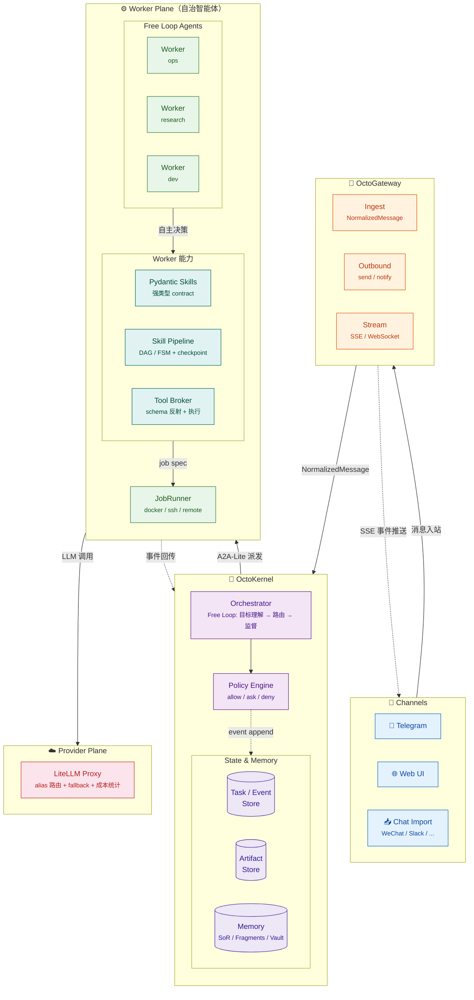

# OctoAgent 项目 BluePrint（内部代号：ATM）

> ATM = Advanced Token Monster  
> 本文档用于把 **OctoAgent**（从 Constitution → 需求 → 技术选型 → 技术架构 → 模块设计）收敛成可直接进入实现阶段的“工程蓝图”。  
> 目标是：**不用再回翻调研材料，也能按本文档开工**。

---

## 0. 文档元信息

- 项目名称：**OctoAgent**
- 内部代号：**ATM（Advanced Token Monster）**
- 文档类型：Project Blueprint / Engineering Blueprint
- 版本：v0.1（实现准备版）
- 状态：M0-Delivered / M1-Delivered / M1.5-Delivered / M2-Delivered / M3-Delivered（2026-03-08 同步）
- M0 完成日期：2026-02-28（commit `52959a7`）
- 目标读者：
  - 你（Owner / PM / 架构师 / 最终用户）
  - 未来可能加入的 1-3 名协作者（工程实现、前端、运维）
- 约束假设（可调整）：
  - 单用户为主（你的个人 AI OS），允许未来扩展到“小团队/家庭”但不以此为第一目标
  - 本地优先（个人电脑 + 局域网设备），允许部分组件云端化（如 GPU worker / 远端 job runner）
  - 需要 7x24 长期运行能力与可恢复能力（durable & resumable）

---

## 1. 执行摘要（Executive Summary）

OctoAgent 的定位不是“一个聊天机器人”，而是一个 **个人智能操作系统（Personal AI OS）**：

- 入口：多渠道（Web/Telegram 起步，后续可接入微信导入、Slack 等）
- 内核：任务化（Task）与事件化（Event）驱动，**可观测、可恢复、可中断、可审批**
- 执行：可隔离（Docker / SSH / 远程节点），可回放，产物（Artifacts）可追溯
- 记忆：有治理（SoR/Fragments 双线 + 版本化 + 冲突仲裁 + Vault 分区）
- 模型：统一出口（LiteLLM Proxy），别在业务代码里写死厂商模型名；以 alias + 策略路由
- 工具：契约化（schema 反射）+ 动态注入（Tool RAG）+ 风险门禁（policy allow/ask/deny）
- 目标：把你现有痛点收敛为一套“工程化可持续运行”的系统，且具备可演进能力。

**关键设计取舍：**
- 不追求一开始就做成“通用多智能体平台”。先把“单体 OS”打牢。
- 不追求一开始就引入重量级 Durable Orchestrator（如 Temporal）。先用 SQLite Event Store + Checkpoint + Watchdog 达到 80/20，预留升级路径。
- 不绑死任何一个 Provider、Channel、Memory 实现。所有外部依赖都必须可替换、可降级。

---

## 2. Constitution（系统宪章）

Constitution 是“不可谈判的硬规则”，用于防止系统在实现过程中走偏（尤其是你经历过生产事故后的硬约束）。

### 2.1 系统级宪章（System Constitution）

1) **Durability First（耐久优先）**  
   - 任何长任务/后台任务必须落盘：Task、Event、Artifact、Checkpoint 至少具备本地持久化。  
   - 进程重启后：任务状态不能”消失”，要么可恢复，要么可终止到终态（FAILED/CANCELLED/REJECTED）。

2) **Everything is an Event（事件一等公民）**  
   - 模型调用、工具调用、状态迁移、审批、错误、回放，都必须生成事件记录。  
   - UI/CLI 不应直接读内存状态，应以事件流/任务视图为事实来源。

3) **Tools are Contracts（工具即契约）**  
   - 工具对模型暴露的 schema 必须与代码签名一致（单一事实源）。  
   - 工具必须声明副作用等级：`none | reversible | irreversible`，并进入权限系统。

4) **Side-effect Must be Two-Phase（副作用必须二段式）**  
   - 不可逆操作必须拆成：`Plan`（无副作用）→ Gate（规则/人审/双模一致性）→ `Execute`。  
   - 任何绕过 Gate 的实现都视为严重缺陷。

5) **Least Privilege by Default（默认最小权限）**  
   - Kernel/Orchestrator 默认不持有高权限 secrets（设备、支付、生产配置）。  
   - secrets 必须按 project / scope 分区；工具运行时按需注入，不得进入 LLM 上下文。

6) **Degrade Gracefully（可降级）**  
   - 任一插件/外部依赖不可用时，系统不得整体不可用；必须支持 disable/降级路径。  
- 例如：memU 插件失效 → 记忆能力降级为本地向量数据库直查，不影响任务系统。
  - 在 M2 起，`packages/memory` 保留 governance plane；`MemUBackend` 作为 memory engine 可插拔接入。

7) **User-in-Control（用户可控 + 策略可配）**
   - 系统必须提供审批、取消、删除等控制能力（capability always available）。
   - 所有门禁默认启用（safe by default），但用户可通过策略配置（Policy Profile）调整——包括自动批准、静默执行等。
   - 对用户已明确授权的场景（定时任务、低风险工具链），应减少打扰、体现智能化。
   - 在无任何策略授权的情况下，不得静默执行不可逆操作。

8) **Observability is a Feature（可观测性是产品功能）**  
   - 每个任务必须可看到：当前状态、已执行步骤、消耗、产物、失败原因与下一步建议。  
   - 没有可观测性，就谈不上长期运行。

### 2.2 代理行为宪章（Agent Behavior Constitution）

> 这部分用于约束 Orchestrator / Worker 的行为策略（prompt + policy 的组合），避免“动作密度低”“猜配置”“乱写记忆”等典型事故模式。

1) **不猜关键配置与事实**  
   - 改配置/发命令前必须通过工具查询确认（read → propose → execute）。

2) **默认动作密度（Bias to Action）**  
   - 对可执行任务，必须输出下一步“具体动作”；禁止无意义的“汇报-等待”循环。  
   - 但动作必须满足安全门禁与可审计。

3) **上下文卫生（Context Hygiene）**  
   - 禁止把长日志/大文件原文直接塞进主上下文；必须走“工具输出压缩/摘要 + artifact 引用”。

4) **记忆写入必须治理**  
   - 禁止模型直接写入 SoR；只能提出 WriteProposal，由仲裁器验证后提交。

5) **失败必须可解释**  
   - 失败要分类（模型/解析/工具/业务），并给出可恢复路径（重试、降级、等待输入、人工介入）。

---

## 3. 目标、非目标与成功判据

### 3.1 项目目标（Goals）

- G1：构建一个能长期运行的 OctoAgent 内核：Task/Event/Artifact/Checkpoint 闭环
- G2：解决“主 Session 带宽不足”与“子任务失联/中断丢上下文”的核心痛点：  
  - 主体变成 **Orchestrator（路由/监督）**  
  - 执行下沉到 **Workers（独立上下文/独立执行环境）**
- G3：多渠道输入输出：至少 Web + Telegram；后续可插件化扩展
- G4：工具治理：工具契约化 + 动态注入 + 风险门禁
- G5：记忆治理：SoR/Fragments 双线 + 版本化 + 冲突仲裁 + Vault 分区
- G6：统一模型出口与成本治理：LiteLLM Proxy + alias 路由 + fallback + 统计
- G7：提供最小可用 UI：Chat + Task 面板 + Approvals（审批）+ Artifacts 查看

### 3.2 非目标（Non-goals / Anti-goals）

- NG1：不在 v0.x 阶段构建“插件市场/生态平台”
- NG2：不在 v0.x 阶段支持“企业级多租户/权限体系/复杂 RBAC”
- NG3：不在 v0.x 阶段追求“全自动无人值守做所有高风险动作”  
  - 高风险动作必须默认需要审批或强规则门禁
- NG4：不在 v0.x 阶段把所有子流程都 Pipeline 化
  - Orchestrator 和 Workers 永远 Free Loop；Skill Pipeline（Graph）仅用于有副作用/需要 checkpoint 的子流程，按需引入

### 3.3 成功判据（Success Metrics）

- S1：系统重启后，所有未完成任务都能在 UI 列表中看到，并且能：
  - resume（从 checkpoint 恢复）或 cancel（推进到终态）
- S2：任一任务可完整回放：能看到事件流、工具调用、产物列表
- S3：高风险操作（例如：发送外部消息、修改生产配置）默认需要审批或双模一致性门禁
- S4：多渠道一致性：同一 thread 的消息能落到同一 scope；支持增量去重与摘要
- S5：记忆一致性：同一 subject_key 在 SoR 永远只有 1 条 `current`；旧版可追溯
- S6：成本可见：每个 task 可看到 tokens/cost（按 model alias 聚合）

---

## 4. 用户画像与核心场景

### 4.1 Persona

- P1：Owner（你）
  - 需要：长任务、跨设备、可审计、可控风险、可治理记忆
  - 习惯：Telegram/微信（导入）、本地 Mac、局域网 Windows/NAS
- P2：未来协作者（可选）
  - 需要：可读的工程结构、可测试、可扩展、可观测、不会被 prompt 脆弱性拖垮

### 4.2 核心场景（Use Cases）

- UC1：每日/每周例行任务（早报、日报、周报、健康/财务/工作复盘）
- UC2：长时间研究与产出（调研报告、技术方案、对比分析）
- UC3：跨设备运维（NAS/Windows/Mac 的脚本执行、状态检查、文件同步）
- UC4：外部聊天导入与记忆更新（微信/Telegram 历史 → SoR/Fragments）
- UC5：有副作用的系统操作（改配置、发消息、创建日程、发送邮件）——默认审批，可通过 Policy Profile 授权自动执行
- UC6：项目资产治理（Projects / Skills / Scripts 组织与版本化）
- UC7：故障恢复（崩溃、断网、provider 429、插件失效）下的自动降级与可恢复

---

## 5. 需求（Requirements）

### 5.1 功能需求（Functional Requirements）

> 以 “必须/应该/可选” 分级。v0.1 以“必须 + 少量应该”为主。
> 里程碑标注约定：`[Mx]` 表示该需求最早必须落地的里程碑；`[Mx-My]` 表示分阶段交付。

#### 5.1.1 多渠道接入（Channels）

- FR-CH-1（必须，[M0-M1]）：支持 WebChannel
  - [M0] 提供 Task 面板（task 列表、状态、事件、artifact）
  - [M0] 提供事件流可视化（EventStream）
  - [M1] 提供基础 Chat UI（SSE/WS 流式输出）
  - [M1] 提供 Approvals 面板（待审批动作）

- FR-CH-2（必须，[M2]）：支持 TelegramChannel
  - 支持 webhook 或 polling（默认 webhook）
  - 支持 pairing/allowlist（绑定用户/群）
  - thread_id 映射规则稳定（DM/群）

- FR-CH-3（应该，[M2]）：支持 Chat Import Core（导入通用内核）
  - 提供 `octo import chats` CLI 入口
  - 支持 `--dry-run` 预览与 `ImportReport`
  - 支持增量导入去重
  - 支持窗口化摘要（chatlogs 原文 + fragments 摘要）
  - 支持在 chat scope 内维护 SoR（例如群规/约定/持续项目状态）

- FR-CH-4（可选，[M3]）：微信导入插件（Adapter）
  - 解析微信导出格式 → NormalizedMessage 批量投递给 Chat Import Core

- FR-CH-5（应该，[M2]）：统一操作收件箱与移动端等价控制
  - Web 与 Telegram 必须共享 approvals / pairing / watchdog alerts / retry / cancel 的操作语义
  - 必须展示 pending 数量、过期时间、最近一次动作结果，避免用户只能读日志定位状态
  - 高风险动作在不同渠道的审批结果必须落同一事件链，禁止出现“Web 可做、Telegram 不可追溯”的分叉行为

#### 5.1.2 Task / Event / Artifact（任务系统）

- FR-TASK-1（必须，[M0+]）：Task 生命周期管理
  - 状态：`CREATED → QUEUED → RUNNING → (WAITING_INPUT|WAITING_APPROVAL|PAUSED) → (SUCCEEDED|FAILED|CANCELLED|REJECTED)`
  - 终态：SUCCEEDED / FAILED / CANCELLED / REJECTED
  - REJECTED：策略拒绝或 Worker 能力不匹配时使用，区别于运行时 FAILED
  - 支持 retry / resume / cancel

- FR-TASK-2（必须，[M0]）：事件流（Event Stream）
  - 对外提供 SSE：`/stream/task/{task_id}`
  - 每条事件有唯一 id、类型、时间、payload、trace_id

- FR-TASK-3（必须，[M0-M1+]）：Artifact 产物管理
  - 多 Part 结构：单个 Artifact 可包含多个 Part（text/file/json/image），对齐 A2A Artifact.parts
  - 支持 inline 内容与 URI 引用双模（小内容 inline，大文件 storage_ref）
  - artifact 版本化，任务事件中引用 artifact_id
  - [M1+] 流式追加：支持 append 模式逐步生成产物（如实时日志、增量报告）
  - 完整性：保留 hash + size 校验（A2A 没有但我们需要）

- FR-TASK-4（应该，[M1.5]）：Checkpoint（可恢复快照）
  - Graph 节点级 checkpoint（至少保存 node_id + state snapshot）
  - 支持“从最后成功 checkpoint 恢复”而不是全量重跑

#### 5.1.3 Orchestrator + Workers（多代理/分层）

- FR-A2A-1（必须，[M1.5]）：Butler（主 Agent / Orchestrator / Supervisor）负责：
  - 当前阶段作为**唯一对用户负责的发言人**
  - 拥有自己的 `ButlerSession`、`ButlerMemory` 与 Recall runtime
  - 目标理解与分类
  - Worker 选择与 A2A 派发
  - 全局停止条件与监督（看门狗策略）
  - 高风险动作 gate（审批/规则/双模校验）
  - 永远以 Free Loop 运行，不做模式选择
  - 后续若开放“用户直连 Worker”表面，也必须创建独立 `DirectWorkerSession`，不得绕过 Butler 语义偷改主链

- FR-A2A-2（必须，[M1.5]）：Workers（自治智能体）具备：
  - 独立 Free Loop（LLM 驱动，自主决策下一步）
  - 独立 `WorkerSession`、`WorkerMemory` 与 Recall runtime（避免主会话带宽瓶颈）
  - 独立 persona / tool set / capability set / permission set / auth context
  - 默认通过 Butler 下发的 A2A context capsule 获得任务上下文，而不是直接读取完整用户历史
  - 可调用 Skill Pipeline（Graph）执行确定性子流程
  - 可隔离执行环境（Docker/SSH）
  - 可回传事件与产物
  - 可被中断/取消，并推进终态

- FR-A2A-3（应该，[M2]）：A2A-Lite 内部协议
  - Butler 与 Worker 之间使用统一、**message-native** 的消息 envelope
  - 支持 TASK/UPDATE/CANCEL/RESULT/ERROR/HEARTBEAT
  - `A2AConversation`、`A2AMessage`、`WorkerSession` 必须是一等可审计对象
  - 内部状态为 A2A TaskState 超集，通过 A2AStateMapper 双向映射
  - Worker ↔ 外部 SubAgent 通信时使用标准 A2A TaskState
  - 不接受“只做 envelope 适配、实际仍是进程内直调”的半实现作为最终验收

#### 5.1.4 Skills / Tools（能力沉淀与治理）

- FR-TOOL-1（必须）：工具契约化（schema 反射）
  - 从函数签名+类型注解+docstring 生成 JSON Schema
  - 工具必须声明 metadata：risk_level、side_effect、timeout、idempotency_support

- FR-TOOL-2（必须）：工具调用必须结构化
  - LLM 只能输出 tool_calls（JSON），由系统执行并回灌结构化结果
  - 工具输出超阈值必须压缩（summary + artifact）

- FR-TOOL-3（必须）：工具权限门禁（Policy Engine）
  - 默认 allow/ask/deny
  - irreversible 默认 ask（除非白名单策略）
  - 支持 per-project / per-channel / per-user 策略覆盖

- FR-SKILL-1（应该）：Skill 框架（Pydantic）
  - 每个 skill 明确 InputModel/OutputModel
  - 明确 tools_allowed 与 retry_policy
  - 可单元测试与回放

- FR-TOOLRAG-1（可选）：Tool Index + 动态注入（Tool RAG）
  - 使用向量数据库（LanceDB）做工具 embedding 检索与注入
  - 支持按 description + 参数 + tags + examples 索引

#### 5.1.5 记忆系统（Memory）

- FR-MEM-1（必须）：记忆双线
  - Fragments（事件线/可追溯）+ SoR（权威线/可覆盖）
  - SoR 必须版本化：`current/superseded`，同 subject_key 永远只有 1 条 current

- FR-MEM-2（必须）：记忆写入治理
  - 模型先生成 WriteProposal（ADD/UPDATE/DELETE/NONE）
  - 仲裁器验证合法性、冲突检测、证据引用 → commit

- FR-MEM-3（应该）：分区（Vault）
  - 支持敏感数据分区与授权检索（默认不检索）

- FR-MEM-4（可选）：文档知识库增量更新（doc_id@version）
  - doc_hash 检测变更，chunk 内容寻址，增量嵌入

#### 5.1.6 执行层（JobRunner & Sandboxing）

- FR-EXEC-1（必须）：JobRunner 抽象
  - backend：local_docker（默认），ssh（可选），remote_gpu（可选）
  - 统一语义：start/stream_logs/cancel/status/artifacts/attach_input

- FR-EXEC-2（必须）：默认隔离执行
  - 代码执行、脚本运行默认进 Docker
  - 默认禁网；按需开网（白名单）

- FR-EXEC-3（应该）：Watchdog
  - 检测无进展（基于事件/日志/心跳）
  - 自动提醒/自动降级/自动 cancel（策略可配）

- FR-EXEC-4（应该，[M2]）：长任务交互式控制
  - 用户可查看实时 stdout/stderr、最近产物与当前步骤，并在必要时发送确认输入或主动中断
  - 交互输入、重试、取消都必须事件化并可回放，不能只存在于临时终端会话

#### 5.1.7 模型与认证（Provider）

- FR-LLM-1（必须，[M1]）：统一模型出口（LiteLLM Proxy）
  - 业务侧只用 model alias，不写厂商型号
  - 支持 fallback、限流、成本统计

- FR-LLM-2（应该）：双模型体系
  - cheap/utility 模型用于摘要/抽取/压缩/路由
  - main 模型用于规划/高风险确认/复杂推理

#### 5.1.8 管理与运维

- FR-OPS-1（必须）：配置与版本
  - config 可分：system / user / project / plugin
  - 任何配置变更生成事件并可回滚

- FR-OPS-2（必须）：最小可用可观测
  - logs：结构化日志（task_id/trace_id）
  - metrics：任务数、失败率、模型消耗、工具耗时
  - traces：至少对模型调用与工具调用打点

- FR-OPS-3（应该，[M2]）：引导式上手与诊断修复
  - `octo config`、`octo doctor`、`octo onboard` 必须形成连续的首次使用路径，覆盖 provider、channel、runtime、首次发消息验证
  - 配置流程必须可恢复：中断后能从上次步骤继续，而不是要求用户重头再做
  - 诊断输出必须给出可执行修复动作，而非仅输出原始报错

- FR-OPS-4（应该，[M2]）：自助备份/恢复与会话导出
  - Web/CLI 都应支持触发 backup/export，覆盖 tasks / events / artifacts / chats / config 元数据
  - restore 必须支持 dry-run、冲突提示与最近一次恢复验证时间，避免“只有 shell 脚本可恢复”

### 5.2 非功能需求（Non-functional Requirements）

- NFR-1：可靠性
  - 单机断电/重启后不丢任务元信息
  - 插件崩溃不应拖死主进程（隔离/超时/熔断）

- NFR-2：安全与隐私
  - secrets 不进 prompt
  - Vault 分区默认不可检索
  - 所有外部发送类动作必须门禁

- NFR-3：可维护性
  - 明确模块边界与协议
  - 核心数据模型版本化
  - 具备测试基线（unit + integration）

- NFR-4：性能与成本
  - 普通交互响应：< 2s 起流（可用 cheap 模型）
  - 任务成本可视；支持预算阈值与自动降级策略

- NFR-5：可扩展性
  - 新增 channel / tool / skill / memory backend 不应修改核心内核逻辑（或改动极小）

---

## 6. 总体架构（Architecture Overview）

### 6.1 分层架构

OctoAgent 采用”**全层 Free Loop + Skill Pipeline**”的统一架构：

- **Orchestrator（路由与监督层）**
  永远以 Free Loop 运行。负责理解目标、记忆检索与压缩、Worker 选择与派发、全局停止条件与监督。

- **Workers（自治智能体层）**
  永远以 Free Loop 运行。每个 Worker 是独立的 LLM 驱动智能体，自主决策下一步行动。
  当需要执行有结构的子流程时，调用 Skill Pipeline（Graph）。

- **Skill Pipeline / Graph（确定性流程编排）**
  Worker 的工具而非独立执行模式。把关键子流程建模为 DAG/FSM：
  节点级 checkpoint、回退/重试策略、风险门禁、可回放。

- **Pydantic Skills（强类型执行层）**
  每个节点以 contract 为中心：结构化输出、工具参数校验、并行工具调用、框架化重试/审批。

- **LiteLLM Proxy（模型网关/治理层）**
  统一模型出口：alias 路由、fallback、限流、成本统计、日志审计。

> **设计原则**：Orchestrator 和 Workers 保持最大灵活性（Free Loop），确定性只在需要的地方引入（Skill Pipeline）。Graph 不是”执行模式”，而是 Worker 手中的编排工具。

### 6.2 逻辑组件图（Mermaid）


```mermaid
flowchart TB
  subgraph Channels["📡 Channels"]
    direction LR
    TG["🤖 Telegram"]
    WEB["🌐 Web UI"]
    IMP["📥 Chat Import<br/><small>WeChat / Slack / ...</small>"]
  end

  subgraph Gateway["🚪 OctoGateway"]
    direction LR
    IN["Ingest<br/><small>NormalizedMessage</small>"]
    OUT["Outbound<br/><small>send / notify</small>"]
    STRM["Stream<br/><small>SSE / WebSocket</small>"]
  end

  subgraph Kernel["🧠 OctoKernel"]
    direction TB
    ROUTER["Orchestrator<br/><small>Free Loop: 目标理解 → 路由 → 监督</small>"]
    POLICY["Policy Engine<br/><small>allow / ask / deny</small>"]

    subgraph Store["State & Memory"]
      direction LR
      TASKS[("Task / Event<br/>Store")]
      ART[("Artifact<br/>Store")]
      MEM[("Memory<br/><small>SoR / Fragments / Vault</small>")]
    end

    ROUTER --> POLICY
    POLICY -.->|event append| Store
  end

  subgraph Exec["⚙️ Worker Plane（自治智能体）"]
    direction TB

    subgraph Workers["Free Loop Agents"]
      direction LR
      W1["Worker<br/><small>ops</small>"]
      W2["Worker<br/><small>research</small>"]
      W3["Worker<br/><small>dev</small>"]
    end

    subgraph Capabilities["Worker 能力"]
      direction LR
      SKILLS["Pydantic Skills<br/><small>强类型 contract</small>"]
      GRAPH["Skill Pipeline<br/><small>DAG / FSM + checkpoint</small>"]
      TOOLS["Tool Broker<br/><small>schema 反射 + 执行</small>"]
    end

    JR["JobRunner<br/><small>docker / ssh / remote</small>"]

    Workers -->|"自主决策"| Capabilities
    Capabilities -->|job spec| JR
  end

  subgraph Provider["☁️ Provider Plane"]
    LLM["LiteLLM Proxy<br/><small>alias 路由 + fallback + 成本统计</small>"]
  end

  Channels -->|"消息入站"| Gateway
  Gateway -->|"NormalizedMessage"| Kernel
  Kernel -->|"A2A-Lite 派发"| Exec
  Exec -->|"LLM 调用"| Provider
  Exec -.->|"事件回传"| Kernel
  Gateway -.->|"SSE 事件推送"| Channels

  %% 样式定义
  classDef channel fill:#e3f2fd,stroke:#1565c0,color:#0d47a1
  classDef gateway fill:#fff3e0,stroke:#e65100,color:#bf360c
  classDef kernel fill:#f3e5f5,stroke:#6a1b9a,color:#4a148c
  classDef worker fill:#e8f5e9,stroke:#2e7d32,color:#1b5e20
  classDef provider fill:#fce4ec,stroke:#c62828,color:#b71c1c
  classDef store fill:#ede7f6,stroke:#4527a0,color:#311b92
  classDef capability fill:#e0f2f1,stroke:#00695c,color:#004d40

  class TG,WEB,IMP channel
  class IN,OUT,STRM gateway
  class ROUTER,POLICY kernel
  class TASKS,ART,MEM store
  class W1,W2,W3,JR worker
  class SKILLS,GRAPH,TOOLS capability
  class LLM provider
```

### 6.3 数据与控制流（关键路径）

#### 6.3.1 用户消息 → 任务

1. ChannelAdapter 收到消息 → 转成 `NormalizedMessage`
2. Gateway 调 `POST /ingest_message` 投递到 Kernel
3. Kernel：
   - 创建 Task（若是新请求）或产生 UPDATE 事件（若是追加信息）
   - Orchestrator Loop 分类/路由 → 选择 Worker 并派发
   - Worker 以 Free Loop 执行，自主决定调用 Skill 或 Skill Pipeline（Graph）

#### 6.3.2 任务执行 → 事件/产物 → 流式输出

1. Skill/Tool 执行过程中：
   - 产生事件：MODEL_CALL_STARTED / MODEL_CALL_COMPLETED / MODEL_CALL_FAILED、TOOL_CALL、STATE_TRANSITION、ARTIFACT_CREATED 等
2. Gateway 订阅任务事件流（SSE），推送到 Web UI / Telegram
3. 如果进入 WAITING_APPROVAL：  
   - UI/Telegram 展示审批卡片  
   - 用户批准 → 产生 APPROVED 事件 → Graph 继续执行

#### 6.3.3 崩溃恢复

- Kernel 重启：
  - 扫描 Task Store：所有 RUNNING/WAITING_* 的任务进入”恢复队列”
  - Skill Pipeline（Graph）内崩溃：从最后 checkpoint 继续（确定性恢复）
  - Worker Free Loop 内崩溃：重启 Free Loop，将之前的 Event 历史注入为上下文，由 LLM 自主判断从哪里继续（可配置为”需要人工确认”）

---

## 7. 技术选型（Tech Stack & Rationale）

> 目标：用尽可能少的组件实现核心价值；同时所有关键依赖都要可替换。

### 7.1 语言与运行时

- Python 3.12+（主工程）
- uv（依赖与环境管理）
- Docker（执行隔离）

理由：
- 生态与 agent 框架成熟；落地速度快；易于沉淀工具与技能。

### 7.2 Web / API

- FastAPI + Uvicorn（Gateway + Kernel API）
- SSE（任务流式事件）优先；WS 可选

理由：
- SSE 足够满足 task stream（one-way），比 WS 简单稳定；可降级到长轮询。

### 7.3 数据持久化

- SQLite（结构化数据默认）
  - WAL 模式
  - 事件表 append-only
  - 用于 Task/Event/Artifact 元信息等结构化存储

- 向量数据库（语义检索默认）
  - LanceDB（嵌入式 in-process，MVP 首选）
  - 用于 ToolIndex / 记忆检索 / 知识库
  - 直接上 embedding 方案，不经过 FTS 中间态
  - 原生支持版本化 Lance 格式、混合检索（vector + FTS + SQL）、增量更新

### 7.4 模型网关

- LiteLLM Proxy（必选）

理由：
- 把 provider 差异、密钥托管、fallback、限流、成本统计从业务代码剥离；
- 让你未来切换模型/订阅/供应商时不需要大改。

### 7.5 Agent / Workflow / Contract

- Pydantic（数据模型、输入输出校验）
- Pydantic AI（Skill 层，结构化输出 + 工具调用）
- Graph Engine：pydantic-graph（Pydantic AI 内置子模块）
  - 与 Skills 层同生态，类型体系一脉相承
  - 内置 checkpoint persistence、HITL（iter/resume）、async nodes
  - 仅需薄包装：事件发射（节点迁移 → Event Store）+ SQLite persistence adapter

理由：
- Contract 优先：把”约束”从 prompt 转移到 schema；
- Orchestrator 和 Workers 永远 Free Loop；Skill Pipeline（pydantic-graph）仅用于有副作用/需要 checkpoint 的子流程，由 Worker 按需调用；
- pydantic-graph 作为 Pydantic AI 子包，零额外依赖，避免自研 checkpoint/HITL 的开发成本。

### 7.6 Channel 适配

- Telegram：aiogram
  - 原生 async（与 FastAPI 共享 event loop）
  - 内置 FSM（适配 WAITING_APPROVAL/WAITING_INPUT 审批流）
  - webhook 模式
- Web UI：React + Vite
  - 从 M0 开始使用，避免迁移债务
  - SSE 消费用原生 EventSource 对接 Gateway `/stream/task/{id}`
  - M0 仅需 TaskList + EventStream 两个组件；后续 Approvals/Config/Artifacts 自然扩展

### 7.7 可观测

- Logfire（Pydantic 团队出品，OTel 原生）
  - 自动 instrument Pydantic AI / pydantic-graph / FastAPI，零手动打点
  - 内置 LLM 可观测：token 计数、cost 追踪、流式调用追踪、tool inspection
  - 底层是 OpenTelemetry 协议，满足 OTel 兼容要求
- structlog（结构化日志）
  - canonical log lines + 自动绑定 trace_id / task_id
  - dev 环境 pretty print，prod 环境 JSON 输出
- SQLite Event Store（metrics 数据源）
  - 项目已有 append-only events 记录 MODEL_CALL_STARTED / MODEL_CALL_COMPLETED / MODEL_CALL_FAILED / TOOL_CALL / STATE_TRANSITION
  - cost / tokens / latency 直接 SQL 聚合查询，无需独立 metrics 服务

### 7.8 任务调度

- APScheduler（MVP）
- 后续可替换为更成熟的队列/worker（如 Celery/Arq），但不作为 v0.1 必需。

---

## 8. 核心设计（Core Design）

### 8.1 统一数据模型（Domain Model）

#### 8.1.1 NormalizedMessage

```yaml
NormalizedMessage:
  channel: "telegram" | "web" | "wechat_import" | ...
  thread_id: "stable_thread_key"
  scope_id: "chat:<channel>:<thread_id>"
  sender_id: "..."
  sender_name: "..."
  timestamp: "RFC3339"
  text: "..."
  attachments:
    - id: "..."
      mime: "..."
      filename: "..."
      size: 123
      storage_ref: "artifact://..."
  raw_ref: "pointer to original event"
  meta:
    message_id: "optional upstream id"
    reply_to: "optional"
```

#### 8.1.2 Task / Event / Artifact

```yaml
Task:
  task_id: "uuid"
  created_at: "..."
  updated_at: "..."
  status: CREATED|QUEUED|RUNNING|WAITING_INPUT|WAITING_APPROVAL|PAUSED|SUCCEEDED|FAILED|CANCELLED|REJECTED
  title: "short"
  thread_id: "..."
  scope_id: "..."
  owner_agent_id: "agent://butler.main"
  owner_session_id: "session://butler-user/..."
  a2a_conversation_id: "optional uuid"
  parent_task_id: "optional uuid"   # 子任务层级（Orchestrator → Worker 派发时关联）
  requester: { channel, sender_id }
  assigned_worker: "worker_id"
  risk_level: low|medium|high
  budget:
    max_cost_usd: 0.0
    max_tokens: 0
    deadline_at: "optional"
  pointers:
    latest_event_id: "..."
    latest_checkpoint_id: "optional"
```

```yaml
Event:
  event_id: "ulid"
  task_id: "uuid"
  task_seq: 1                    # 同一 task 内单调递增序号（用于确定性回放）
  ts: "..."
  type: TASK_CREATED|USER_MESSAGE|MODEL_CALL|MODEL_CALL_STARTED|MODEL_CALL_COMPLETED|MODEL_CALL_FAILED|TOOL_CALL|TOOL_RESULT|STATE_TRANSITION|ARTIFACT_CREATED|APPROVAL_REQUESTED|APPROVED|REJECTED|TASK_REJECTED|ERROR|HEARTBEAT|CHECKPOINT_SAVED|A2A_MESSAGE_SENT|A2A_MESSAGE_RECEIVED|A2A_MESSAGE_ACKED
  schema_version: 1               # 事件格式版本，便于后续兼容迁移
  actor: user|butler|worker|tool|system
  payload: { ... }   # 强结构化（默认不放原始大文本/敏感原文）
  trace_id: "..."
  span_id: "..."
  causality:
    parent_event_id: "optional"
    idempotency_key: "required for ingress/side-effects"
```

- `MODEL_CALL` 为历史兼容事件类型（M0 / 旧 schema）；新写入默认使用 `MODEL_CALL_STARTED|MODEL_CALL_COMPLETED|MODEL_CALL_FAILED` 三段事件。

```yaml
Artifact:
  artifact_id: "ulid"            # 全局唯一（A2A 只有 index，我们更强）
  task_id: "uuid"
  ts: "..."
  name: "..."
  description: "optional"        # 新增，对齐 A2A
  parts:                         # 改为 parts 数组，对齐 A2A Artifact.parts
    - type: text|file|json|image # 对应 A2A 的 TextPart/FilePart/JsonPart
      mime: "..."                # Part 级别 MIME
      content: "inline 或 null"  # 小内容 inline（对齐 A2A data/text）
      uri: "file:///... 或 null" # 大文件引用（对齐 A2A FilePart.uri）
  storage_ref: "..."             # 保留，整体大文件外部存储引用
  size: 123                      # 保留，A2A 没有
  hash: "sha256"                 # 保留，完整性校验
  version: 1                     # 保留，版本化能力（A2A immutable，我们支持版本迭代）
  append: false                  # 新增，对齐 A2A 流式追加
  last_chunk: false              # 新增，标记流式最后一块
  meta: { ... }
```

Part 类型说明（对齐 A2A Part 规范）：
- `text`：纯文本 / markdown（对应 A2A TextPart）
- `file`：文件引用或 inline Base64（对应 A2A FilePart）
- `json`：结构化 JSON 数据（对应 A2A JsonPart）
- `image`：图片（本质是 file 的特化，便于 UI 渲染）
- 暂不支持 A2A 的 FormPart / IFramePart，按需扩展

#### 8.1.3 Agent Runtime Objects（2026-03-13 架构纠偏）

```yaml
AgentRuntime:
  agent_id: "agent://butler.main" | "agent://worker.research/default"
  agent_kind: butler|worker
  role: supervisor|research|dev|ops|custom
  project_id: "project_id"
  profile_id: "agent_profile_id or worker_profile_id"
  persona_refs:
    - "artifact://persona.md"
  instruction_refs:
    - "artifact://project-instructions.md"
  tool_profile: minimal|standard|privileged
  auth_profile: "optional"
  policy_profile: "optional"
  memory_namespace_ids:
    - "memory://project/<project_id>/shared"
    - "memory://agent/<agent_id>/private"
  default_session_kind: butler_user|worker_a2a|worker_direct
```

```yaml
AgentSession:
  session_id: "uuid"
  agent_id: "agent://..."
  session_kind: butler_user|worker_a2a|worker_direct
  project_id: "project_id"
  channel_thread_id: "optional stable_thread_key"
  parent_session_id: "optional uuid"
  a2a_conversation_id: "optional uuid"
  effective_config_snapshot_ref: "artifact://..."
  recent_turn_refs:
    - "task_id or artifact_id"
  rolling_summary_ref: "artifact://..."
  compaction_state:
    enabled: true
    last_compacted_at: "optional"
```

```yaml
MemoryNamespace:
  namespace_id: "memory://project/<project_id>/shared" | "memory://agent/<agent_id>/private"
  owner_kind: project|agent
  owner_id: "project_id or agent_id"
  visibility: shared|private
  partitions:
    - profile
    - work
    - chat:web:thread_id
  backend: sqlite|memu|lancedb|hybrid
```

```yaml
RecallFrame:
  recall_frame_id: "uuid"
  agent_id: "agent://..."
  session_id: "session://..."
  trigger_task_id: "task_id"
  query: "当前问题 / A2A payload / task goal"
  sources:
    session_recency: ["turn_ref"]
    agent_private_memory: ["memory_ref"]
    project_shared_memory: ["memory_ref"]
    work_evidence: ["artifact_ref"]
  provenance_ref: "artifact://..."
```

```yaml
A2AConversation:
  conversation_id: "uuid"
  source_agent_id: "agent://butler.main"
  target_agent_id: "agent://worker.research/default"
  source_session_id: "session://butler-user/..."
  target_session_id: "session://worker-a2a/..."
  work_id: "work_id"
  status: active|completed|failed|cancelled
  last_message_id: "optional uuid"
```

关系约束：
- `Project` 提供共享 instructions / knowledge / shared memory / secrets / channel bindings。
- `Butler` 与每个 `Worker` 都是独立 `AgentRuntime`，各自拥有 session、memory、recall、compaction。
- `Work` 是执行与委派单元，不再兼职承载“Agent 私有会话”语义。
- `A2AConversation` 是 Butler 与 Worker 之间的 durable carrier；没有 durable A2A conversation，就不算完成多 Agent 主链。

---

### 8.2 Task/Event Store：事件溯源与视图

#### 8.2.1 事件溯源（Event Sourcing）策略

- 事实来源：Event 表（append-only）
- Task 表：是 Event 的“物化视图”（projection），用于快速查询
- 任何对 Task 的状态更新都必须通过写入事件触发 projection 更新
- Event payload 默认写摘要与引用（artifact_ref），避免在事件中存储大体积/敏感原文

**好处：**
- 可回放（replay）
- 可审计（audit）
- 可恢复（rebuild projections）

#### 8.2.2 SQLite 表建议（MVP）

- `tasks`：task_id PK，status，meta，timestamps，indexes(thread_id, status)
- `events`：event_id PK，task_id FK，task_seq，ts，type，payload_json，idempotency_key，indexes(task_id, task_seq), indexes(task_id, ts), unique(task_id, task_seq), unique(idempotency_key where not null)
- `artifacts`：artifact_id PK，task_id FK，parts_json，storage_ref，hash，version
- `checkpoints`：checkpoint_id PK，task_id FK，node_id，state_json，ts
- `approvals`：approval_id PK，task_id FK，status，request_json，decision_json
- `agent_runtimes`：agent_id PK，agent_kind，role，project_id，profile_id，tool/auth/policy profile refs，persona/instruction refs
- `agent_sessions`：session_id PK，agent_id FK，session_kind，project_id，channel_thread_id，parent_session_id，a2a_conversation_id，summary refs，updated_at
- `memory_namespaces`：namespace_id PK，owner_kind，owner_id，visibility，backend，partition config
- `recall_frames`：recall_frame_id PK，agent_id FK，session_id FK，task_id FK，query，sources_json，provenance_ref
- `a2a_conversations`：conversation_id PK，source_agent_id，target_agent_id，source_session_id，target_session_id，work_id，status
- `a2a_messages`：message_id PK，conversation_id FK，type，from_agent_id，to_agent_id，from_session_id，to_session_id，payload_json，ts，idempotency_key

**一致性要求：**
- 写事件与更新 projection 必须在同一事务内（SQLite transaction）
- events 使用 ULID/时间有序 id 便于流式读取
- 同一 task 的 `task_seq` 必须严格单调递增（无重复、无回退）
- 外部入口写入与带副作用动作必须携带 `idempotency_key`（用于去重与重试安全）

---

### 8.3 编排模型：全层 Free Loop + Skill Pipeline

#### 8.3.1 设计原则

Orchestrator 和 Workers **永远以 Free Loop 运行**，保证最大灵活性和自主决策能力。
确定性编排（Graph）**下沉为 Worker 的工具**——Skill Pipeline，仅在需要时由 Worker 主动调用。

- **Free Loop**（Orchestrator / Workers）：LLM 驱动的推理循环，自主决策下一步行动
- **Skill Pipeline**（Worker 的子流程）：确定性 DAG/FSM，用于有副作用/需要 checkpoint/需要审计的子任务

> Graph 不是”执行模式的一种选择”，而是 Worker 手中的编排工具——类似于 Worker 可以调用单个 Skill，也可以调用一条 Skill Pipeline。

#### 8.3.2 Worker 何时调用 Skill Pipeline（建议默认规则）

Worker 在 Free Loop 中自主决策。满足任一条件时，倾向于使用 Skill Pipeline：
- 有不可逆副作用（发消息/改配置/支付/删除）
- 对接”正式系统”（calendar/email/生产配置）
- 需要可审计/可回放（对外承诺、重要决策）
- 需要强 SLA（定时任务、稳定交付）
- 多步骤流程需要节点级 checkpoint（崩溃后可从中间恢复）

其余情况，Worker 在 Free Loop 中直接调用单个 Skill 或 Tool 即可。

#### 8.3.3 Skill Pipeline 类型

- DAG：一次性流水线（抽取→规划→执行→总结）
- FSM：多轮交互、审批、等待外部事件（审批通过→执行，否则回退）

#### 8.3.4 Skill Pipeline Engine MVP 要求（基于 pydantic-graph）

- 节点 contract 校验（输入/输出）— pydantic-graph 原生类型安全
- checkpoint（每个节点结束写 checkpoint）— pydantic-graph 内置 persistence，需适配 SQLite
- retry 策略：
  - 同模型重试
  - 升级模型（cheap → main）
  - 切换 provider（由 LiteLLM 处理）
- interrupt（HITL）— pydantic-graph 内置 iter/resume：
  - WAITING_APPROVAL
  - WAITING_INPUT
- 事件化：节点运行与迁移必须发事件 — 需薄包装 EventEmitter

#### 8.3.5 崩溃恢复策略

| 崩溃位置                   | 恢复方式                                                       |
| -------------------------- | -------------------------------------------------------------- |
| Skill Pipeline 节点内      | 从最后 checkpoint 确定性恢复                                   |
| Worker Free Loop 内        | 重启 Loop，将 Event 历史注入为上下文，LLM 自主判断续接点       |
| Orchestrator Free Loop 内  | 重启 Loop，扫描未完成 Task，重新派发或等待人工确认             |

---

### 8.4 Skills（Pydantic AI）设计

#### 8.4.1 Skill 模板

```yaml
SkillSpec:
  name: "string"
  version: "semver"
  risk_level: low|medium|high
  input_model: "PydanticModel"
  output_model: "PydanticModel"
  tools_allowed:
    - tool_id
  model_alias: "planner"          # LiteLLM alias（见 §8.9.1）
  timeout_s: 300                  # Skill 级超时
  tool_policy: sequential|parallel|mixed
  retry_policy:
    max_attempts: 3
    backoff_ms: 500
    upgrade_model_on_fail: true
  approval_policy:
    mode: none|rule_based|human_in_loop
```

#### 8.4.2 Skill 运行语义（必须一致）

1. 校验输入（InputModel）
2. 调用模型（通过 LiteLLM alias）
3. 解析并校验输出（OutputModel）
4. 若输出包含 tool_calls：
   - 校验工具参数 schema
   - Policy Engine 判定 allow/ask/deny
   - allow → 执行；ask → 进入审批；deny → 返回错误并可重试
5. 工具结果回灌模型（结构化）
6. 输出最终结果（校验 + 产物）

#### 8.4.3 SkillRunner 演进方向（竞品源码深度分析）

> Agent Zero / OpenClaw 源码深度分析的关键发现，指导 Feature 005 SkillRunner 设计。

##### 循环控制与终止

Agent Zero 使用双层循环（外层 monologue loop + 内层 message_loop），工具可通过返回 `Response(break_loop=True)` 终止内层循环。OctoAgent SkillRunner 应借鉴此模式：

- OutputModel 增加 `complete: bool` 字段，Skill 判定任务完成时主动通知 SkillRunner 停止迭代
- 重复调用检测：hash 每轮 tool_calls 签名，连续 3 次相同签名触发告警并终止（参考 OpenClaw 4 型循环检测）

##### 异常分流

Agent Zero 使用三层异常处理：InterventionException（暂停等审批）→ RepairableException（重试修复）→ Generic（报告失败）。SkillRunner 应实现类似分流：

- `SkillRepeatError`：可重试（如 LLM 输出格式不符，自动重试含错误反馈）
- `SkillValidationError`：需修复输入后重试（参考 OpenClaw `ToolInputError` 即时通知 LLM）
- `ToolExecutionError`：不可恢复，记录并报告

##### 生命周期钩子

Agent Zero 提供 15+ Extension hook 点（monologue_start/end、message_loop_start/end、before/after_llm_call、tool_execute_before/after 等）。SkillRunner 应在关键点提供钩子：

- `skill_start` / `skill_end`：Skill 级可观测
- `before_llm_call` / `after_llm_call`：模型调用拦截
- `before_tool_execute` / `after_tool_execute`：工具执行拦截（与 ToolBroker Hook Chain 协作）

##### Context Budget Guard

OpenClaw 的 tool-result-context-guard 在工具返回结果超出 context 预算时自动截断。SkillRunner 应在工具结果回灌前检查 context 预算，超限时使用 artifact 路径引用替代全文。

---

### 8.5 Tooling：工具契约 + 动态注入 + 安全门禁

#### 8.5.1 工具分级（必须）

- Read-only：检索、查询、读取日历/邮件、读取配置
- Write-but-reversible：写草稿、创建临时记录、生成建议但不提交
- Irreversible / High-risk：发邮件、发送消息、支付、写生产配置、删除数据

#### 8.5.2 工具元数据（Tool Metadata）

```yaml
ToolMeta:
  tool_id: "namespace.name"
  version: "hash or semver"
  side_effect: none|reversible|irreversible
  risk_level: low|medium|high
  timeout_s: 30
  idempotency: supported|required|not_supported
  requires:
    - capability: "device.ssh"
    - permission: "proj:ops:write"
  outputs:
    max_inline_chars: 500
    store_full_as_artifact: true
```

#### 8.5.3 Tool Index（MVP）

- 向量数据库（LanceDB）：embedding 索引 tool 描述 + 参数 + tags + examples
- Orchestrator 在运行时检索：
  - 语义相似度匹配候选工具集合（Top-K）
  - 再由 Policy Engine 过滤
  - 最终注入到 Skill 的可用工具列表（减少工具膨胀）

#### 8.5.4 Tool Profile 分级（M1）

> 参考实现：OpenClaw `tool-catalog.ts` 的四级 profile。OctoAgent 采用 minimal/standard/privileged 三级命名（`privileged` 语义比 `full` 更精确，对齐 Constitution C5 Least Privilege）。

Tool Profile 控制不同场景下可用的工具集，作为 Policy Engine 的**第一道过滤层**：

| Profile | 包含工具类型 | 适用场景 |
|---------|-------------|---------|
| `minimal` | 只读工具（echo, datetime, status 查询） | 低风险任务、初始对话 |
| `standard` | 读写工具（file_read, file_write, 数据库查询） | 常规任务 |
| `privileged` | 全部工具（含 exec, docker, 外部 API） | 高权限任务（需显式授权） |

- Skill Manifest 通过 `tool_profile` 字段声明所需 Profile（§8.4.1）
- Orchestrator 可根据任务风险等级动态选择 Profile
- Profile 过滤在 Policy Engine Pipeline 的 Layer 1 执行（§8.6.4）
- M1 实现 `minimal` + `standard` 两级；`privileged` 在 M1.5 引入 Docker 执行后激活

#### 8.5.5 工具输出压缩（Context GC）

规则（建议默认）：

- 工具输出 > `max_inline_chars`（默认 500）字符：
  - 全量输出存 artifact
  - **M1 Phase 1**（Feature 004）：裁切后保留 artifact 路径引用在上下文中（参考 AgentZero `_90_save_tool_call_file.py`，零 LLM 依赖）
  - **M1 Phase 2**（Feature 005 就绪后）：可选启用 summarizer（通过 cheap alias 生成摘要回灌上下文）
- 工具输出含敏感信息：
  - 自动 redaction（屏蔽）
  - 存入 Vault 分区（需要授权检索）

#### 8.5.6 后续演进方向（Feature 004 对标洞见）

> Feature 004 交付后，与 Agent Zero、OpenClaw 工具系统对标分析的关键发现。以下能力按优先级排列，标注目标 Feature。

##### 交互式工具执行（M2, Feature 009）

Agent Zero 支持 Shell Session 保持 + 增量输出 + 提示符检测（`LocalInteractiveSession` / `SSHInteractiveSession`），工具可以多轮交互。当前 ToolBroker 为"一进一出"模型（`execute() → ToolResult`），不支持多轮。

- 演进方向：ToolResult 增加 `continuation_token` 字段 + Broker 支持 `resume(token, input)` 方法
- 参考：Agent Zero `python/helpers/docker.py`、`code_execution_tool.py`

##### 工具循环检测（M1.5, Feature 004-b 增强）

OpenClaw 通过 bucket strategy 检测工具被反复调用的异常模式（LLM 陷入死循环）。当前 ToolBroker 无此防护。

- 演进方向：作为 BeforeHook 实现 `ToolLoopGuard`，per-task 维度计数，超阈值生成 WARNING 事件
- 参考：OpenClaw `src/agents/pi-tools.before-tool-call.ts`

##### 细粒度超时分级（M1.5, Feature 004-b 增强）

Agent Zero 对代码执行工具使用 4 层超时：`first_output`（30s）/ `between_output`（15s）/ `max_exec`（180s）/ `dialog_timeout`（60s）。当前 ToolMeta 仅有单一 `timeout_seconds`。

- 演进方向：ToolMeta 增加 `timeout_config: TimeoutConfig` 嵌套对象，按阶段拆分超时
- 适用场景：Docker 执行、SSH 远程命令等长时工具

##### MCP 工具集成（M1, Feature 007）

Agent Zero 已原生支持 MCP 协议（stdio + SSE），可发现和调用外部 MCP Server 暴露的工具。

- 演进方向：MCP tools 默认注册为 `standard` Profile（可通过配置覆盖为 `privileged`），区分 Tool vs Resource
- 参考：Agent Zero `python/helpers/mcp_handler.py`、`prompts/agent.system.mcp_tools.md`

##### 插件加载隔离 + 诊断（M1.5）

OpenClaw 单个插件加载失败不影响其他插件和核心工具，失败信息记录到 `registry.diagnostics[]`。当前 Broker 注册失败会抛异常。

- 演进方向：`ToolBroker.register()` 增加 `try_register()` 变体，失败工具进 `_diagnostics` 列表
- 参考：OpenClaw `src/plugins/loader.ts`

##### 敏感参数标记（M2, UI 集成）

OpenClaw 的 `ChannelConfigUiHint` 支持 `sensitive: true` 标记，UI 自动隐藏输入。

- 演进方向：ToolMeta 增加 `sensitive_params: list[str]` 字段，Web UI 渲染时自动遮蔽

---

### 8.6 Policy Engine：allow/ask/deny + 审批工作流

#### 8.6.1 最小策略模型

- 输入：tool_call / action_plan / task_meta / user_context
- 输出：Decision
  - allow（自动执行）
  - ask（请求审批）
  - deny（拒绝并解释原因）

#### 8.6.2 默认策略（建议）

- irreversible 工具：默认 ask
- reversible 工具：默认 allow，但可按 project 提升为 ask
- read-only：默认 allow
- 任何涉及外部发送/支付/删除：默认 ask（需要策略白名单或显式审批才可 silent allow）

**策略可配原则（与 Constitution 原则 7 对齐）：**
- 所有门禁 safe by default，但用户可通过 Policy Profile 调整
- 对用户已明确授权的场景（如定时任务、低风险工具链），自动批准以减少打扰
- 策略变更本身是事件，可审计可回滚

#### 8.6.3 审批交互：Two-Phase Approval（M1）

> 参考实现：OpenClaw `exec-approvals.ts` 的 register → wait 双阶段模式。

**Two-Phase 设计**（防并发竞态）：

```python
# Phase 1: 注册审批请求（立即返回 approval_id，防止竞态）
approval = await approval_service.register(
    task_id=..., tool_call=..., risk_explanation=...
)  # → { approval_id, expires_at }

# Phase 2: 阻塞等待用户决策
decision = await approval_service.wait_for_decision(
    approval_id, timeout_s=120
)  # → allow / deny
```

- 分离"注册请求"与"等待决策"两个操作，避免同一审批被重复处理
- 超时默认策略：`deny`（参考 OpenClaw `DEFAULT_ASK_FALLBACK = "deny"`，120s）
- 用户可配置超时后 escalate（通知 Owner）而非直接 deny

**审批状态流转**：

- 触发 ask：
  - 写入 APPROVAL_REQUESTED 事件（含 approval_id）
  - task 状态进入 WAITING_APPROVAL
- 用户批准：
  - 写入 APPROVED 事件
  - task 状态回到 RUNNING，Skill Pipeline 从 gate 节点继续
- 用户拒绝：
  - 写入 REJECTED 事件
  - task 进入终态
- 超时：
  - 按配置执行 deny 或 escalate

审批载荷（建议）：

- action summary
- risk explanation
- idempotency_key
- dry_run 结果（若有）
- rollback/compensation 提示

#### 8.6.4 多层 Policy Pipeline（M1）

> 参考实现：OpenClaw `tool-policy-pipeline.ts` 的 profile → global → agent → group 四层管道。

策略以 Pipeline 形式逐层执行，每层可**收紧**但不可**放松**上层决策：

```
Layer 1: Tool Profile 过滤（§8.5.4）
    → 不在当前 Profile 中的工具直接 deny
Layer 2: Global 规则（§8.6.2 默认策略）
    → side_effect 驱动的 allow/ask/deny
Layer 3: Agent 级策略（M2+）
    → per-agent 工具白名单/黑名单
Layer 4: Group 级策略（M2+）
    → per-project / per-channel 策略覆盖
```

- M1 实现 Layer 1 + Layer 2（Profile + Global）
- M2 扩展 Layer 3 + Layer 4（Agent + Group）
- Safe Bins 白名单（参考 OpenClaw `DEFAULT_SAFE_BINS`）：对 exec 类工具，预置安全命令列表（git, python, npm, node 等），匹配白名单的命令可跳过 ask 直接 allow

#### 8.6.5 Policy Engine 演进方向（竞品源码深度分析）

> OpenClaw / AgentStudio / Agent Zero 源码深度分析的关键发现，指导 Feature 006 设计。

##### Label 决策追踪（OpenClaw，高优先级）

OpenClaw 的 Policy Pipeline 每层决策附带 label（如 `{ decision: "allow", label: "workspace:allowlist" }`），完整追溯决策来源。OctoAgent 的 PolicyEngine 每个 Decision 必须包含 label 字段，记录是哪一层、哪条规则产生了该决策。这是审计合规的基础。

##### consumeAllowOnce 原子审批消费（OpenClaw，高优先级）

OpenClaw `exec-approval-manager.ts` 实现原子性一次性审批令牌消费，防止同一审批被重放。配合 15s 宽限期（审批通过后保留 15s，允许迟到的 await 调用找到已解决条目）和幂等注册（同 ID 不重复添加到审批队列）。OctoAgent 直接采用此模式，但审批状态必须持久化到 Event Store（Agent Zero 仅内存存储是反模式）。

##### Provider Pipeline + Fast-Fail（AgentStudio，中优先级）

AgentStudio Pre-Send Guard 的 Provider Pipeline 支持 allow/block/rewrite/require_confirm 四种决策。借鉴点：

- 可插拔 Provider 链式评估
- block 决策立即短路返回（AgentStudio 未实现此 fast-fail，是反模式）
- 每个 Provider 声明 `failureStrategy`：`block_on_failure`（强制型）vs `continue_on_failure`（建议型）

##### 前端审批 UX（OpenClaw，中优先级）

OpenClaw 前端提供三按钮决策（Allow Once / Always Allow / Deny）+ 队列 Badge（`"3 pending"`）+ 独立过期倒计时。M1 Approvals 面板直接采用此 UX 模式；Telegram 渠道通过 inline keyboard 实现等价交互。

##### 必须避免的反模式

1. **审批状态非持久化**（Agent Zero）— 进程重启丢失所有审批状态 → 必须写入 Event Store
2. **轮询等待**（Agent Zero `asyncio.sleep(0.1)`）— CPU 浪费 → 使用 `asyncio.Event` + SSE 事件驱动
3. **枚举值部分实现**（AgentStudio `require_confirm`）— 定义了 4 种决策但只实现 3 种 → Python 用 exhaustive match + `assert_never()` 确保全覆盖

---

### 8.7 Memory：SoR/Fragments/Vault + 写入仲裁

#### 8.7.1 两条记忆线

- Fragments（事件线）：append-only；保存对话/工具执行/聊天窗口摘要；用于证据与回放
- SoR（权威线）：同一 subject_key 只有一个 current；旧版 superseded

**默认回答策略：**
- 问“现在是什么” → 只查 SoR.current
- 问“为什么/过程” → SoR + Fragments + superseded 版本（可选）

#### 8.7.2 六大分区（建议）

- `core`：系统运行信息（tasks、incidents、configs）
- `profile`：用户偏好/长期事实（非敏感）
- `work`：工作项目与知识（可更新）
- `health`：健康相关（敏感，默认 Vault）
- `finance`：财务相关（敏感，默认 Vault）
- `chat:<channel>:<thread_id>`：聊天 scope（可维护群规/约定/项目状态）

术语约束（2026-03-08）：
- `profile` 在本节仅指记忆分区名，不等同于 tool profile、auth profile、agent profile
- 其余设计文档必须显式写出 `tool profile`、`auth profile`、`agent profile`、`readiness level`，避免裸 `profile` 歧义

补充约束（2026-03-07）：
- `partition/scope` 与 `layer` 分离建模：`partition` 表示业务域（如 `work` / `health`），`layer` 表示记忆层（SoR / Fragments / Vault）
- 敏感分区可以保留安全摘要到 SoR，但原始敏感内容默认只留在 Vault 引用路径，不参与普通检索

#### 8.7.3 写入治理：两阶段仲裁

- 阶段 A（cheap 模型）：提出 WriteProposal
- 阶段 B（规则 + 可选强模型）：校验合法性/冲突/证据存在性 → commit

WriteProposal 示例：

```yaml
WriteProposal:
  action: ADD|UPDATE|DELETE|NONE
  subject_key: "work.projectX.status"
  partition: "work"
  new_value: { ... }
  rationale: "..."
  evidence_refs:
    - fragment_id
    - artifact_id
  confidence: 0.0-1.0
```

冻结服务接口（M2 / Feature 020）：
- `propose_write()`
- `validate_proposal()`
- `commit_memory()`
- `search_memory()`
- `get_memory()`
- `before_compaction_flush()`（只生成 flush 草案，不直接改 SoR）
- `MemoryBackend`（engine protocol）
- `MemUBackend`（可选 adapter，承担检索/索引/增量同步）

#### 8.7.4 语义检索集成（LanceDB）

- MemoryItem 的 embedding 存入 LanceDB（与 SQLite 元信息分离）
- 检索时：vector 相似度 + metadata filter（partition / scope_id / status）
- SoR 查询：先 metadata filter `status=current`，再 vector 排序
- Fragments 查询：vector 检索 + 时间范围过滤
- 写入时：WriteProposal commit 成功后，异步更新 LanceDB embedding

在 SQLite-only 降级路径下：
- SoR 先走 `status=current` 过滤和 `subject_key/content` metadata 查询
- 检索契约采用 `search_memory()` / `get_memory()` 两段式，避免把长正文直接塞回主上下文

在 MemU backend 路径下：
- governance 仍由 SQLite + arbitration 控制
- MemU 承担检索、索引、增量同步和后续 chat import / knowledge update 的主要执行负载
- MemU 不可用时自动降级回 SQLite-only search
- `MemUBackend` transport 必须同时支持本地 `command` 与远端 `http`
- 当 MemU 与 Gateway 同机部署时，默认优先 `command` 路径，不强制要求独立 bridge 服务
- 本地 `command` 路径允许包裹 OpenClaw 风格的 MemU 脚本链，只要求 embedding / rerank / expanding 等模型与本地运行时，不额外引入常驻服务复杂度
- Web `Settings > Memory` 与 `octo config memory *` 必须共享同一套 `local_only / memu(command) / memu(http)` 配置语义，避免 Web 与 CLI 漂移

M3 产品化集成约束（2026-03-07）：
- `MemUBackend` 不应被视为纯外挂检索器，而应作为 Memory engine 的首选实现之一，与 `search_memory()` / `get_memory()` / `before_compaction_flush()` 共用同一治理边界
- 多模态记忆、Category、ToM、关系抽取等高级能力只能产出 `Fragments`、派生索引或 `WriteProposal` 草案，不能绕过 SoR / Vault 直接成为权威事实
- 所有高级记忆结果都必须带 `evidence_refs` / artifact 引用，确保 Memory 浏览与证据追溯可落地
- MemU 不可用或插件降级时，系统仍需保留 SQLite-only 的最小检索与 SoR 回答路径（对齐 Constitution 6）

2026-03-13 运行时上下文纠偏（参考 Agent Zero Projects / OpenClaw session-key + compaction）：
- `Memory` 与 `Recall` 必须分离建模：Memory 回答“长期保留了什么”，Recall 回答“当前问题该取回什么”
- 每个 Agent 必须拥有自己的私有 `MemoryNamespace` 与 `AgentSession`；`Project` 只提供共享上下文与共享记忆，不替代 Agent 私有上下文
- Butler 默认只读取 `ButlerSession + ButlerMemory + ProjectMemory + child result summary`
- Worker 默认只读取 `WorkerSession + WorkerMemory + 被授权的 ProjectMemory + 当前 Work evidence`
- Worker 默认**不得直接读取完整用户主聊天历史**；Butler 必须通过 A2A payload / context capsule 选择性转述
- `MemUBackend` 的索引维度必须至少覆盖 `namespace_id + agent_id + session_id + partition + scope_id`，不能只按 project/thread 粗暴混用
- Recall pipeline 必须显式可观测，默认顺序为：`session recency -> agent private memory -> project shared memory -> work evidence -> explicit knowledge`

#### 8.7.5 Chat Import Core（通用内核）

- 用户入口：`octo import chats [--dry-run] [--resume]`
- thread/scope 隔离：`scope_id=chat:<channel>:<thread_id>`
- 增量去重：`msg_key = hash(sender + timestamp + normalized_text)` 或原 msg_id
- 导入报告：每次执行都返回 `ImportReport`（新增数 / 重复数 / warnings / errors / cursor）
- 窗口化摘要：
  - chatlogs：原文可审计
  - fragments：可检索摘要片段
- 可选：实体提取与关系索引
- 可选：在 chat scope 内更新 SoR（群规/约定/项目状态）

说明：上下文压缩 / auto-compaction 不属于 Memory Core 本体；Memory 仅提供 `before_compaction_flush()` 钩子承接 cheap/summarizer 模型产出的摘要与 WriteProposal 草案。

Feature 034（2026-03-09，M4 hardening）补充约束：

- 上下文压缩必须落在主 Agent / Worker 的真实 prompt assembly 路径，不能只做离线 helper
- Subagent 默认不接入上下文压缩，避免 delegation 运行链双重压缩
- compaction 必须产生 request snapshot artifact、summary artifact 与结构化事件，并通过 maintenance/flush evidence 链接入 Memory
- summarizer 不可用时必须优雅降级到原始历史，不能静默丢轮次或让主模型调用一起失败

---

### 8.8 Execution Plane：Worker + JobRunner + Sandboxing

#### 8.8.1 Worker 责任边界

**Worker 是自治智能体**，以 Free Loop（LLM 驱动循环）运行，自主决策下一步行动。

Worker 不负责：
- 多渠道 I/O（由 Gateway 负责）
- 全局策略决策（由 Kernel Policy 负责）
- 全局路由与监督（由 Orchestrator 负责）

Worker 负责：

- 以 Free Loop 自主执行任务
- 决策何时调用单个 Skill、Skill Pipeline（Graph）、或 Tool
- 维护 project workspace
- 产出 artifact
- 回传事件与心跳

#### 8.8.2 JobRunner 接口（概念）

```python
class JobRunner(Protocol):
    async def start(self, job_spec) -> str: ...
    async def status(self, job_id) -> dict: ...
    async def stream_logs(self, job_id, cursor=None): ...
    async def cancel(self, job_id) -> None: ...
    async def collect_artifacts(self, job_id) -> list[Artifact]: ...
```

backend：
- local_docker：默认
- ssh：控制 LAN 设备
- remote_gpu：跑大模型/训练/批处理（可选）

#### 8.8.3 Sandboxing 策略

- 默认 Docker：
  - 非 root
  - 网络默认禁用
  - 只挂载白名单目录
- 需要网络的任务：
  - 通过策略显式开启（并记录事件）
- 对宿主机操作：
  - 必须通过专用 tool，并默认 ask（除非白名单）

---

### 8.9 Provider Plane：LiteLLM alias 策略

#### 8.9.1 语义 alias（业务侧）

- `router`：意图分类、风险分级（小模型）
- `extractor`：结构化抽取（小/中模型）
- `planner`：多约束规划（大模型）
- `executor`：高风险执行前确认（大模型，稳定优先）
- `summarizer`：摘要/压缩（小模型）
- `fallback`：备用 provider

#### 8.9.2 运行时 alias group（Proxy 侧，M1 默认）

- `cheap`：承载 `router/extractor/summarizer`
- `main`：承载 `planner/executor`
- `fallback`：承载 `fallback`
- 应用层始终使用语义 alias；由 `AliasRegistry` 统一映射到运行时 group，避免业务代码直接耦合具体模型组命名。

#### 8.9.3 统一成本治理

- 每次模型调用写入事件：
  - model_alias、provider、latency、tokens、cost
- per-task 预算阈值触发策略：
  - 超预算 → 降级到 cheap 模型 / 提示用户 / 暂停等待确认

#### 8.9.4 多 Provider 扩展与 Auth Adapter（M1）

> 目标：新增 Provider 时**零代码变更**（仅修改 litellm-config.yaml），同时支持非标准认证模式。

**当前架构**（M0/M1）：

- 业务代码通过语义 alias（`router`/`planner`/...）调用 → AliasRegistry 映射到运行时 group（`cheap`/`main`/`fallback`）→ LiteLLM Proxy 路由到真实模型
- 新增 Provider 只需在 `litellm-config.yaml` 中添加 `model_list` 条目，支持 100+ Provider（OpenAI、Anthropic、OpenRouter、Azure、Google、本地 Ollama 等）
- 示例：从 OpenAI 切换到 OpenRouter 仅需修改 `model` 前缀和 `api_key` 环境变量名

**Auth Adapter 抽象层**（M1 基础 + M1.5 增强）：

> 参考实现：OpenClaw（`_references/opensource/openclaw/src/agents/auth-profiles/`）
> 已验证支持 OpenAI（API Key + Codex OAuth）、Anthropic（Setup Token + API Key）、Google、GitHub Copilot 等。

不同 Provider 存在多种认证模式，需要统一抽象：

| 认证模式 | 代表 Provider | 说明 | OpenClaw 参考 |
|----------|--------------|------|--------------|
| 标准 API Key | OpenAI / Anthropic / OpenRouter | `Authorization: Bearer sk-xxx`，LiteLLM 原生支持 | `ApiKeyCredential` type |
| Setup Token | Anthropic Claude Code | `sk-ant-oat01-...` 格式，有过期时间，需 `claude setup-token` 生成 | `TokenCredential` type |
| OAuth / Device Flow | OpenAI Codex / Google Gemini CLI | 需要 token 刷新、设备授权流程 | `OAuthCredential` type + pi-ai 库 |
| 平台托管 | Azure OpenAI / GCP Vertex AI | 需要 Azure AD token 或 GCP service account | LiteLLM Proxy 内置支持 |
| 本地部署 | Ollama / vLLM / LocalAI | 无认证或自定义 header | 直接配置 `api_base` |

**设计方向**（参考 OpenClaw 双层架构，M1 实现）：

1. **Config / Credential 分离**：
   - Config 层（`.env` 或 `octoagent.yaml`）：声明 auth profile 元数据（provider, mode）
   - Credential 层（`auth-profiles.json`，`.gitignore` 保护）：存储实际凭证
   - 对齐 Constitution C5（Least Privilege）：凭证与配置物理隔离

2. **三种凭证类型**（对齐 OpenClaw 模型）：

   ```python
   # packages/provider/auth/credentials.py
   class ApiKeyCredential(BaseModel):
       type: Literal["api_key"] = "api_key"
       provider: str
       key: SecretStr

   class TokenCredential(BaseModel):
       type: Literal["token"] = "token"
       provider: str
       token: SecretStr
       expires_at: datetime | None = None  # Setup Token 有过期时间

   class OAuthCredential(BaseModel):
       type: Literal["oauth"] = "oauth"
       provider: str
       access_token: SecretStr
       refresh_token: SecretStr
       expires_at: datetime
   ```

3. **AuthAdapter 接口**（`packages/provider/auth/adapter.py`）：

   ```python
   class AuthAdapter(ABC):
       @abstractmethod
       async def resolve(self) -> str:
           """返回可用的 API key / access token"""
       @abstractmethod
       async def refresh(self) -> str | None:
           """刷新凭证，返回新 token；不支持刷新返回 None"""
       @abstractmethod
       def is_expired(self) -> bool:
           """检查凭证是否过期"""
   ```

4. **Handler Chain 模式**（参考 OpenClaw `applyAuthChoice`）：
   - 每个 Provider 一个 handler，Chain of Responsibility 依次匹配
   - `octo init`（历史路径）/ `octo config`（当前路径）引导时调用对应 handler 完成认证配置
   - 运行时解析优先级：显式 profile → auth-profiles.json → 环境变量 → 默认值

5. **Token 自动刷新**（参考 OpenClaw `refreshOAuthTokenWithLock`，M1 实现 Setup Token 过期检测，M1.5 实现完整 OAuth 刷新）：
   - 每次 LLM 调用前检查 `expires_at`
   - 过期时获取文件锁 → 调用 `adapter.refresh()` → 持久化新凭证
   - 刷新失败时降级到 fallback Provider（对齐 C6）
   - LiteLLM Proxy 已内置 Azure AD / Vertex AI 刷新，优先复用 Proxy 能力
   - 仅当 Proxy 不支持的认证模式（如 Codex Device Flow、Anthropic Setup Token）才在应用层实现

6. **凭证注入到 LiteLLM Proxy**：
   - API Key 类型：写入 `.env.litellm` 环境变量
   - OAuth/Token 类型：动态更新 Proxy 配置（LiteLLM Proxy 支持 `/model/update` API）
   - 或通过 `litellm-config.yaml` 的 `get_key_from_env` 配合环境变量刷新

7. **OAuth Authorization Code + PKCE 流程**（Feature 003-b，M1.5 已交付）：
   - 支持 Authorization Code + PKCE（RFC 7636）标准流程，取代纯 Device Flow
   - `OAuthProviderRegistry` 注册表管理多 Provider 的 OAuth 配置（内置 openai-codex + github-copilot）
   - `PkceOAuthAdapter` 适配器继承 `AuthAdapter`，实现 PKCE 流程编排
   - 环境检测（SSH/容器/无 GUI）自动选择浏览器 / 手动粘贴模式
   - 本地回调服务器（`127.0.0.1:1455`）接收授权码，端口冲突自动降级到手动模式
   - JWT access_token 直连 ChatGPT Backend API（Codex Responses API），不经过 LiteLLM Proxy

8. **多认证路由隔离**（Feature 003-b 集成阶段发现）：
   - JWT OAuth 路径需绕过 LiteLLM Proxy 直连 `chatgpt.com/backend-api`，API Key 路径继续走 Proxy
   - `HandlerChainResult` 扩展 `api_base_url: str | None` 和 `extra_headers: dict[str, str]` 字段
   - `LiteLLMClient.complete()` 新增 `api_base`、`api_key`、`extra_headers` keyword-only 参数，支持按调用覆盖路由
   - `PkceOAuthAdapter` 通过 `get_api_base_url()` / `get_extra_headers()` 提供路由覆盖信息

9. **Codex Reasoning/Thinking 模式**（Feature 003-b 增量能力）：
   - `ReasoningConfig` 模型：`effort`（none/low/medium/high/xhigh）+ `summary`（auto/concise/detailed）
   - `LiteLLMClient.complete()` 新增 `reasoning: ReasoningConfig | None` 参数
   - 双路径适配：Responses API 使用嵌套 `reasoning` 对象，Chat Completions API 使用顶层 `reasoning_effort` 字符串

**扩展原则**：

- 业务代码（Kernel/Worker/Skill）永远不感知具体 Provider 或认证方式
- Provider 变更的影响范围限定在 `litellm-config.yaml` + `.env.litellm`
- Auth Adapter 变更的影响范围限定在 `packages/provider/auth/`
- 新增 Provider 只需实现对应 `AuthAdapter` 子类 + 注册到 Handler Chain
- JWT 直连路径通过 HandlerChainResult 路由覆盖实现，不影响 API Key 路径的默认行为

M3 用户化约束（2026-03-07）：
- 环境变量继续作为高级/CI 路径保留，但不应再是普通用户完成 provider/channel/gateway 配置的默认方式
- 用户视角的主路径应收敛为统一 Secret Store + Wizard：Provider Key、OAuth Token、Telegram Bot Token、Gateway Token 等通过同一配置入口管理、审计、轮换与 reload
- CLI / Web / 未来桌面端应共用 onboarding + config protocol，避免重复实现两套配置逻辑
- secret 配置的默认目标应从“让用户记住要 export 哪些 env”转为“告诉用户存到哪个 project/scope，系统负责注入运行时”

---

## 9. 模块设计（Module Breakdown）

> 本节给出实现层面的模块拆分、职责、接口与边界，确保进入实现阶段时“有人照着写也不会打架”。

### 9.1 Repo 结构建议（Monorepo）

```text
octoagent/
  pyproject.toml
  uv.lock
  apps/
    gateway/                 # OctoGateway
    kernel/                  # OctoKernel
    workers/
      ops/
      research/
      dev/
  packages/
    core/                    # domain models + event store + common utils
    protocol/                # A2A-lite envelope + NormalizedMessage
    plugins/                 # plugin loader + manifests + capability graph
    tooling/                 # tool schema reflection + tool broker
    memory/                  # SoR/Fragments/Vault + arbitration
    provider/                # litellm client wrappers + cost model
    observability/           # logfire init + structlog + event metrics
  frontend/                    # React + Vite Web UI（M0 起步）
  plugins/
    channels/
      telegram/
      web/
      wechat_import/
    tools/
      filesystem/
      docker/
      ssh/
      web/
  data/
    sqlite/                  # local db
    artifacts/               # artifact files
    vault/                   # encrypted or restricted
  docs/
    blueprint.md
```

### 9.2 packages/core

职责：
- Domain models（Task/Event/Artifact/Checkpoint/Approval）
- SQLite store（event-sourcing + projections）
- 迁移与 schema version
- 幂等键处理

关键接口：
- `TaskStore.create_task(...)`
- `EventStore.append_event(...)`
- `Projection.apply_event(...)`
- `ArtifactStore.put/get/list(...)`

### 9.3 apps/gateway

职责：
- ChannelAdapter lifecycle（start/stop）
- 入站消息 normalization（NormalizedMessage）
- 出站消息发送（Telegram/Web）
- SSE/WS stream 转发（从 Kernel 订阅）

对外 API（Gateway 暴露给渠道/Web UI）：

- `POST /api/message`（接收用户消息）
- `GET /api/stream/task/{task_id}`（SSE 事件流）
- `POST /api/approve/{approval_id}`（审批决策）

内部调用（Gateway → Kernel）：

- `POST /kernel/ingest_message`
- `GET /kernel/stream/task/{task_id}`
- `POST /kernel/approvals/{approval_id}/decision`

### 9.4 apps/kernel

职责：

- Orchestrator Loop（目标理解、路由、监督；永远 Free Loop）
- Policy Engine（allow/ask/deny + approvals）
- Memory Core（检索、写入提案、仲裁、commit）

关键内部组件：

- `Router`：决定 worker 派发
- `Supervisor`：watchdog + stop condition
- `ApprovalService`：审批状态机
- `MemoryService`：read/write arbitration
- `SchedulerService`：APScheduler wrapper，定时任务触发 → 创建 Task（UC1 例行任务）

### 9.5 workers/*

每个 worker 是自治智能体（Free Loop），具备：

- 独立运行（进程/容器均可）
- 拥有自己的工作目录（project workspace）
- 拥有自己的 `WorkerSession`、`WorkerMemory`、Recall/compaction 状态与 effective context frame
- 拥有自己的 persona / instruction overlays / tool set / capability set / permission set / auth context
- Skill Runner（Pydantic AI）+ Skill Pipeline（pydantic-graph）
- Tool Broker（schema、动态注入、执行编排）
- 暴露内部 RPC（HTTP/gRPC 均可；MVP 用 HTTP）

Worker 类型与专长（Orchestrator Router 据此派发）：

- `ops`：运维与系统操作——脚本执行、设备管理、文件同步、定时巡检
- `research`：调研与分析——信息检索、对比分析、报告生成、知识整理
- `dev`：开发与工程——代码编写、项目构建、测试运行、技术方案实现

当前产品边界：
- 默认只有 Butler 直接面向用户；Worker 主要通过 `worker_a2a` session 与 Butler 协作
- 未来允许用户直连 Worker，但必须创建独立 `worker_direct` session，并维持独立 memory / recall / policy / audit 链

worker 的最小端点：
- `POST /a2a/run`（TASK）
- `POST /a2a/update`（UPDATE）
- `POST /a2a/cancel`（CANCEL）
- `GET /health`

### 9.6 packages/protocol

职责：

- A2AMessage envelope 定义（见 §10.2）
- NormalizedMessage 定义（见 §8.1.1）
- A2AStateMapper：内部状态 ↔ A2A TaskState 双向映射（见 §10.2.1）
- A2A Artifact 映射层（见 §10.2.2）

关键接口：

- `A2AMessage.wrap(payload) → envelope`
- `A2AStateMapper.to_a2a(internal_state) → a2a_state`
- `A2AStateMapper.from_a2a(a2a_state) → internal_state`
- `ArtifactMapper.to_a2a(artifact) → a2a_artifact`

### 9.7 packages/plugins

职责：
- Plugin manifest 解析
- Plugin Loader（enable/disable）
- Capability Graph（依赖解析、健康门禁）
- 插件隔离策略（超时、崩溃熔断）

Manifest 示例：

```yaml
id: "channel.telegram"
version: "0.1.0"
type: "channel"
requires:
  - "core>=0.1"
  - "provider.litellm"
capabilities:
  - "channel.ingest"
  - "channel.send"
healthcheck:
  kind: "http"
  url: "http://localhost:9001/health"
config_schema:
  ...
```

`plugins/` 实现目录约定（实际插件放在 repo 顶层 `plugins/` 下）：

- 每个插件一个子目录，包含 `manifest.yaml` + Python 模块
- 目录结构示例：`plugins/channels/telegram/`（manifest.yaml + adapter.py）
- 插件实现依赖 `packages/plugins` 提供的 Loader / Manifest 解析能力
- Channel 插件须实现 `ChannelAdapter` 协议；Tool 插件须实现 `ToolMeta` 声明

### 9.8 packages/tooling

职责：

- 工具扫描与 schema 反射
- ToolIndex 构建（LanceDB 向量 embedding 检索，见 §8.5.3）
- ToolBroker（执行、并发、超时、结果压缩）
- ToolResult 结构化回灌

### 9.9 packages/memory

职责：

- Fragments/SoR/Vault 数据模型
- MemoryBackend 抽象（默认 SQLite metadata fallback，可插 MemU / LanceDB）
- 写入仲裁（WriteProposal → validate → commit）
- 基础检索契约（`search_memory` / `get_memory`）
- compaction 前 flush 钩子（`before_compaction_flush`）
- Chat Import Core（dedupe、window、summarize）

### 9.10 packages/provider

职责：

- LiteLLM proxy client wrapper
- alias 与策略（router/extractor/planner/executor/summarizer）
- fallback 与错误分类
- cost/tokens 解析

### 9.11 packages/observability

职责：

- Logfire init（自动 instrument Pydantic AI / FastAPI）
- structlog 配置（dev pretty / prod JSON）
- 统一 trace_id 贯穿 event payload
- Event Store metrics 查询辅助（cost/tokens 聚合）

### 9.12 frontend/（React + Vite Web UI）

职责：

- M0：TaskList + EventStream 两个核心组件
- SSE 消费：原生 EventSource 对接 Gateway `/api/stream/task/{id}`
- 后续扩展：Approvals 审批面板、Config 配置管理、Artifacts 查看、Memory 浏览

技术栈：

- React + Vite（从 M0 起步，避免迁移债务）
- 独立于 Python 后端，通过 Gateway API 通信
- 开发时 Vite dev server 代理到 Gateway；生产时静态文件由 Gateway 托管

---

## 10. API 与协议（Interface Spec）

### 10.1 Gateway ↔ Kernel（HTTP）

- `POST /kernel/ingest_message`
  - body: NormalizedMessage
  - returns: `{task_id}`

- `GET /kernel/tasks/{task_id}`
  - returns: Task（当前状态快照）

- `POST /kernel/tasks/{task_id}/cancel`
  - returns: `{ok, task_id}`

- `GET /kernel/stream/task/{task_id}`
  - SSE events: Event（json）
  - 终止信号：终态事件携带 `"final": true`，客户端据此关闭连接（对齐 A2A SSE 规范）

- `POST /kernel/approvals/{approval_id}/decision`
  - body: `{decision: approve|reject, comment?: str}`

### 10.2 Kernel ↔ Worker（A2A-Lite Envelope）

```yaml
A2AMessage:
  schema_version: "0.1"
  message_id: "uuid"
  task_id: "uuid"
  context_id: "a2a_conversation_id"   # 对齐 A2A contextId，关联 Butler ↔ Worker 对话
  from: "agent://butler.main"
  to: "agent://worker.ops/default"
  type: TASK|UPDATE|CANCEL|RESULT|ERROR|HEARTBEAT
  idempotency_key: "string"
  timestamp_ms: 0
  payload: { ... }
  trace: { trace_id, parent_span_id }
  metadata:
    source_session_id: "session://butler-user/..."
    target_session_id: "session://worker-a2a/..."
    origin_user_thread_id: "stable_thread_key"
    work_id: "work_id"
    context_capsule_ref: "artifact://..."
    recall_frame_id: "optional uuid"
```

语义要求：
- UPDATE 必须可投递到“正在运行的 `A2AConversation + WorkerSession`”；否则进入 WAITING_INPUT 并提示用户
- CANCEL 必须推进终态（CANCELLED），不可“卡 RUNNING”
- Butler 当前是唯一 user-facing speaker；Worker 返回 RESULT/ERROR 后，由 Butler 负责综合并对用户发言
- Worker 默认接收 `context_capsule_ref`，而不是 ButlerSession 的完整原始历史；若需要更宽上下文，必须显式声明授权与 provenance
- 未来若开放 DirectWorkerSession，仍必须走独立 `AgentSession + A2AConversation + MemoryNamespace` 链路，不得把 user-facing 会话和 internal worker session 复用成同一个对象

#### 10.2.1 A2A 状态映射（A2A TaskState Compatibility）

OctoAgent 内部状态是 A2A 协议的**超集**。内部通信（Kernel ↔ Worker）使用完整状态；对外暴露 A2A 接口时通过映射层转换。

```yaml
# OctoAgent → A2A TaskState 映射
StateMapping:
  CREATED:           submitted     # 合并到 submitted（已接收未处理）
  QUEUED:            submitted
  RUNNING:           working
  WAITING_INPUT:     input-required
  WAITING_APPROVAL:  input-required  # 审批对外表现为”需要输入”
  PAUSED:            working         # 暂停是内部实现细节，对外仍为”处理中”
  SUCCEEDED:         completed
  FAILED:            failed
  CANCELLED:         canceled
  REJECTED:          rejected        # 直接映射

# A2A → OctoAgent 反向映射（外部 Agent 调入时）
ReverseMapping:
  submitted:      QUEUED
  working:        RUNNING
  input-required: WAITING_INPUT
  completed:      SUCCEEDED
  canceled:       CANCELLED
  failed:         FAILED
  rejected:       REJECTED
  auth-required:  WAITING_APPROVAL   # auth 语义映射到审批
  unknown:        FAILED             # 降级为失败
```

设计原则：
- **内部超集**：OctoAgent 保留 WAITING_APPROVAL、PAUSED、CREATED 等 A2A 没有的状态，满足内部治理需求
- **外部兼容**：对外通过 A2AStateMapper 暴露标准 A2A TaskState，实现 Worker ↔ SubAgent 通信一致性
- **映射无损**：终态（completed/canceled/failed/rejected）一一对应；非终态映射后语义明确

#### 10.2.2 A2A Artifact 映射

OctoAgent Artifact 是 A2A Artifact 的**超集**（多出 artifact_id、version、hash、size）。对外暴露时通过映射层转换。

```yaml
# OctoAgent Artifact → A2A Artifact 映射
ArtifactMapping:
  name:        → name
  description: → description
  parts:       → parts            # Part 结构已对齐（text/file/json → TextPart/FilePart/JsonPart）
  append:      → append
  last_chunk:  → lastChunk
  # 以下字段 A2A v0.3 部分支持，其余降级到 metadata
  artifact_id: → artifactId        # A2A v0.3 已支持 artifactId 字段
  version:     → metadata.version  # 降级到 metadata
  hash:        → metadata.hash
  size:        → metadata.size
  storage_ref: → 转为 parts[].uri  # storage_ref 映射到 Part 的 uri 字段

# Part 类型映射
PartTypeMapping:
  text:  → TextPart   (content → text)
  file:  → FilePart   (content → data[base64], uri → uri)
  json:  → JsonPart   (content → data)
  image: → FilePart   (mime: image/*, uri → uri)
```

### 10.3 Tool Call 协议

- LLM 输出：
  - `tool_calls: [{tool_id, args_json, idempotency_key}]`
- ToolBroker 执行：
  - 返回 `ToolResult { ok, data, error, artifact_refs }`
- 结果回灌：
  - 只回灌 summary + structured fields
  - 全量输出走 artifact

---

## 11. 冲突排查与合理性校验（Consistency & Conflict Checks）

本节把“容易互相打架”的点提前检查并给出收敛方案。

### 11.1 事件溯源 vs 快速迭代

**冲突：** Event sourcing 看起来“重”，会拖慢 MVP。  
**收敛：**  
- MVP 只实现最小 event 表 + tasks projection 表，不做复杂 replay 工具；  
- 先保证“崩溃不丢任务”，再逐步增强回放能力。

### 11.2 SQLite vs 可扩展并发

**冲突：** SQLite 并发能力有限。  
**收敛：**

- 单用户场景使用 WAL + 单写多读即可；  
- 单用户场景 SQLite WAL 足够，暂不引入额外数据库。

### 11.3 Free Loop 自由度 vs 安全门禁

**冲突：** Free Loop 容易越权执行高风险动作。
**收敛：**

- mode 不是安全边界；安全边界分两层纵深防御：
  1. **工具级**（不可绕过）：ToolBroker + Policy Engine — 无论 Worker 走 Free Loop 直接调 Tool 还是走 Skill Pipeline，所有工具调用都必须经过此链路。
  2. **任务级**：Orchestrator Supervisor + Watchdog — 预算阈值、超时、无进展检测，提供全局监督。
- 即使 Policy Engine 失效，Docker 隔离作为最后防线（§12.1 执行隔离）。

### 11.4 Tool RAG 动态注入 vs 可预测性

**冲突：** 动态注入工具会导致行为不稳定。
**收敛：**

- ToolIndex 的检索结果必须写事件（记录当时注入的工具集合与 schema 版本 hash）。
- 对关键 Skill Pipeline，工具集合固定在 SkillSpec.tools_allowed 里（§8.4.1），不动态注入。
- 动态注入的工具应有来源验证；ToolIndex 检索失败时降级到固定基础工具集。

### 11.5 记忆自动写入 vs 记忆污染

**冲突：** 自动写记忆容易污染 SoR。
**收敛：**

- 禁止直接写 SoR；必须 WriteProposal + 仲裁。
- 仲裁默认严格：证据不足/冲突不明 → 不写（NONE）或进入待确认。
- 所有仲裁结果（包括 NONE）写入事件，便于分析仲裁质量。

### 11.6 多 Channel 实时接入 vs 导入一致性

**冲突：** 实时渠道与离线导入格式差异大。
**收敛：**

- 统一入口：NormalizedMessage + scope/thread 模型。
- 渠道差异只存在于 Adapter；内核只处理标准消息流。
- 离线导入幂等保证：基于 `msg_key = hash(sender + timestamp + normalized_text)` 去重（§8.7.5）。
- 时序交叉（历史导入 ts 早于已有实时消息）：以物理时间排序，导入消息按原始 ts 插入。

### 11.7 Policy Profile 可配 vs 安全门禁不可绕过

**冲突：** §8.6.2 允许用户通过 Policy Profile 调整门禁，包括"自动批准"和"静默执行"。但 Constitution §4 要求"不可逆操作必须二段式（Plan → Gate → Execute），绕过 Gate 视为严重缺陷"。如果 Policy Profile 将 irreversible 工具设为 `allow`，是否算"绕过 Gate"？
**收敛：**

- 明确区分 **Gate 的存在** 与 **Gate 的决策**。Policy Profile 改变的是 Gate 的决策结果（从 `ask` 变为 `allow`），但 Gate 链路本身（Plan → 策略评估 → Execute）仍然存在且执行，决策链条不可缩短。
- 即使 Policy Profile 设为 `allow`，仍必须：(1) 生成 Plan 事件；(2) Policy Engine 评估并记录决策事件（含引用的 Policy Profile）；(3) 才能 Execute。
- 安全底线：标记为 `policy_override_prohibited` 的动作（如 `delete_production_data`、`send_payment`）即使用户配了 `allow` 也强制 `ask`。

### 11.8 Free Loop 停止条件 vs 成本控制

**冲突：** Orchestrator/Workers "永远以 Free Loop 运行"（§8.3.1），每轮循环产生模型调用开销。若 Worker 陷入"推理但无进展"的循环，成本会快速累积。
**收敛：**

- Free Loop 必须内置**三道刹车**：
  1. **轮次上限**（max_iterations_per_task）：Worker 对单任务的推理轮次有硬上限，超过后进入 WAITING_INPUT 或 FAILED。
  2. **预算阈值**（来自 §8.9.2）：per-task 成本超限后自动降级（切换 cheap 模型）或暂停。
  3. **无进展检测**（Watchdog）：连续 N 轮没有产生工具调用或状态变更 → 自动暂停并通知用户。
- Watchdog 从"应该"（FR-EXEC-3）提升为 Free Loop 安全运行的**必要条件**。

### 11.9 A2A 状态映射信息损耗 vs 内部治理需求

**冲突：** §10.2.1 中 WAITING_APPROVAL → input-required、PAUSED → working 存在语义损耗。外部 SubAgent 看到 `working` 可能误以为任务正在执行，实际已暂停。
**收敛：**

- 接受这个语义压缩——A2A 协议本身就不区分这些状态。
- 在 A2A 消息的 `metadata` 中附加 `internal_status` 字段（可选），供知道 OctoAgent 扩展语义的客户端使用。
- 反向映射 `unknown → FAILED` 的降级必须写事件记录，因为可能掩盖外部 Agent 的真实状态。

### 11.10 Artifact 流式追加 vs Event Store 事件膨胀

**冲突：** Artifact 支持 `append: true` 的流式追加模式。若每次追加都生成 ARTIFACT_CREATED 事件，长时间流式产物（如 10 分钟实时日志）会产生大量事件，影响 SQLite 性能和事件流可读性。若不生成事件，又违反 Constitution §2（Everything is an Event）。
**收敛：**

- 流式 Artifact 采用**分层事件策略**：
  - 首次创建：生成 `ARTIFACT_CREATED` 事件（含 artifact_id、name、append=true）。
  - 中间追加：**不逐 chunk 写事件**，追加数据直接写入 Artifact Store（文件系统）。
  - 最终完成：生成 `ARTIFACT_COMPLETED` 事件（last_chunk=true，附带最终 hash + size）。
- 中间 chunk 的细粒度追踪通过 structlog + Logfire trace span 记录，不进入 Event Store。

### 11.11 REJECTED 终态 vs retry/resume 语义

**冲突：** REJECTED 作为终态（策略拒绝/能力不匹配），但 FR-TASK-1 声称"支持 retry / resume / cancel"。REJECTED 的任务是否允许 retry？策略没变则永远被拒绝。
**收敛：**

- REJECTED 是**不可重试的终态**，语义为"系统主动拒绝"：
  - Policy 拒绝 → REJECTED（用户需修改策略或任务描述后**新建任务**，不 retry 原任务）。
  - Worker 能力不匹配 → REJECTED（Orchestrator 可自动新建任务并 re-route 到另一 Worker，原任务保持 REJECTED）。
  - 运行时错误 → FAILED（支持 retry / resume）。
- Event 中记录 `rejection_reason: policy_denied | capability_mismatch | budget_exceeded | ...`，支持 UI 差异化展示。

### 11.12 双存储（SQLite + 向量数据库）一致性窗口

**冲突：** §7.3 设计了 SQLite（结构化）+ 向量数据库（embedding 语义检索）双存储。写入流程"commit 成功后异步更新向量索引"存在一致性窗口：SQLite 已 commit 但向量索引尚未更新，此时语义检索会漏掉最新数据。
**收敛：**

- 接受最终一致性（eventual consistency）——单用户场景下毫秒到秒级延迟可接受。
- 向量写入失败时记录事件并触发异步重试。
- 关键查询（如 SoR.current）走 SQLite metadata filter 优先，不依赖向量检索实时性。
- 提供手动 re-index 运维接口用于异常恢复。

### 11.13 Checkpoint 持久化 vs SQLite 事务边界

**冲突：** §8.3.4 要求 Skill Pipeline 每个节点结束后写 checkpoint，§8.2.2 要求"写事件与更新 projection 必须在同一事务内"。checkpoint、event、projection 三者是否必须同一事务？
**收敛：**

- 采用 **checkpoint + 事件原子写入**：节点完成后，在同一个 SQLite 事务中写入 (1) checkpoint (2) STATE_TRANSITION 事件 (3) 更新 tasks projection。
- 节点执行本身（模型调用、工具执行）在事务**之外**完成；只有结果元数据持久化在事务内，事务不会阻塞。
- 崩溃恢复时 checkpoint 和事件流始终一致——要么都写了，要么都没写。

### 11.14 上下文窗口管理 vs 任务完整性

**冲突：** 长任务的上下文可能超出模型 context window，截断会丢失关键信息，影响任务质量和连续性。
**收敛：**

- Orchestrator/Worker 层实现上下文管理策略：
  - checkpoint 保证任务状态完整性（不依赖 context window 保持状态）。
  - 对话历史在接近 context 上限时自动压缩（保留关键事实 + 最近 N 轮原文）。
  - 工具调用结果只回灌 summary + structured fields，全量输出走 Artifact（§10.3 已定义）。
- 压缩策略写事件记录（记录压缩前后 token 数），支持审计。

---

## 12. 运行与部署（Ops & Deployment）

> 本节覆盖从开发到生产的完整运维体系。设计原则对齐 Constitution：
> - **C1 Durability First** → 备份、恢复验证、优雅关闭
> - **C5 Least Privilege** → 容器安全加固、secrets 注入、网络隔离
> - **C6 Degrade Gracefully** → 分级故障策略、熔断、降级
> - **C8 Observability** → 健康检查、运维事件、告警通道

### 12.1 部署拓扑

#### 12.1.1 开发拓扑（单进程）

MVP 开发阶段采用单进程模式，降低调试复杂度：

- Gateway / Kernel / Worker 全部运行在同一 Python 进程内（FastAPI sub-app 或模块化路由）
- SQLite 文件直接读写本地 `./data/sqlite/`
- LiteLLM Proxy 单独容器运行（唯一外部依赖）
- 不需要 Docker 网络编排，本地 `localhost` 通信即可

```
[ 本地进程: Gateway + Kernel + Workers ]
          ↓ HTTP
[ Docker: litellm-proxy :4000 ]
          ↓
[ SQLite: ./data/sqlite/octoagent.db ]
[ Artifacts: ./data/artifacts/ ]
```

#### 12.1.2 生产拓扑（Docker Compose 多容器）

长期运行场景采用容器化部署，每个服务独立隔离：

```
                    ┌──────────────────────┐
                    │   reverse-proxy      │  :443 (HTTPS)
                    │   (caddy / nginx)    │
                    └──────┬───────────────┘
                           │
              ┌────────────┼────────────────┐
              ▼            ▼                ▼
        ┌──────────┐ ┌──────────┐   ┌─────────────┐
        │ gateway  │ │ kernel   │   │ worker-ops  │
        │ :9000    │ │ :9001    │   │ (内部端口)  │
        └──────────┘ └──────────┘   └─────────────┘
              │            │                │
              └────────────┼────────────────┘
                           ▼
                    ┌──────────────┐
                    │ litellm-proxy│  :4000 (内部)
                    └──────────────┘
                           │
              ┌────────────┴────────────┐
              ▼                         ▼
     [ volume: ./data ]         [ Docker Socket ]
     sqlite / artifacts / vault   (JobRunner 沙箱)
```

服务清单：

| 服务 | 镜像 | 端口 | 说明 |
|------|------|------|------|
| reverse-proxy | caddy:2-alpine | 443, 80 | HTTPS 终止（Telegram webhook 要求）；自动 Let's Encrypt |
| octo-gateway | 自建 | 9000（内部） | 渠道适配 + SSE 转发 |
| octo-kernel | 自建 | 9001（内部） | Orchestrator + Policy + Event Store |
| octo-worker-* | 自建 | 无外部端口 | Worker 进程；MVP 可先内置在 kernel 中 |
| litellm-proxy | ghcr.io/berriai/litellm | 4000（内部） | 模型网关 |

#### 12.1.3 Docker-in-Docker 策略（执行沙箱 vs 部署容器）

系统存在**两层 Docker 使用**，必须明确区分：

- **部署层**：系统自身的容器化（docker-compose 管理）
- **执行层**：JobRunner 为 Worker 创建的沙箱容器（FR-EXEC-1/2）

**方案选择：Docker Socket 挂载（非 DinD）**

```yaml
# kernel / worker 容器挂载宿主 Docker socket
volumes:
  - /var/run/docker.sock:/var/run/docker.sock:ro
```

- 理由：DinD 复杂度高且有安全隐患；Socket 挂载是 Agent Zero / Dify 等项目验证过的方案
- 约束：JobRunner 创建的沙箱容器**必须**挂载到独立的 Docker network（`octo-sandbox-net`），与系统内部网络隔离
- 沙箱容器默认：`--network=octo-sandbox-net --read-only --cap-drop=ALL --memory=512m --cpus=1`

### 12.2 Docker Compose 参考配置

```yaml
# docker-compose.yml（生产参考）
version: "3.9"

x-common: &common
  restart: unless-stopped
  logging:
    driver: json-file
    options:
      max-size: "10m"
      max-file: "3"

networks:
  octo-internal:        # 系统内部通信
    driver: bridge
  octo-sandbox-net:     # JobRunner 沙箱隔离网络
    driver: bridge
    internal: true       # 默认禁止外部访问

volumes:
  octo-data:            # sqlite + artifacts + vault

services:
  reverse-proxy:
    <<: *common
    image: caddy:2-alpine
    ports:
      - "443:443"
      - "80:80"
    volumes:
      - ./deploy/Caddyfile:/etc/caddy/Caddyfile:ro
      - caddy-data:/data
    networks:
      - octo-internal
    depends_on:
      gateway:
        condition: service_healthy

  litellm-proxy:
    <<: *common
    image: ghcr.io/berriai/litellm:main-latest
    env_file: .env.litellm
    volumes:
      - ./deploy/litellm-config.yaml:/app/config.yaml:ro
    networks:
      - octo-internal
    healthcheck:
      test: ["CMD", "curl", "-f", "http://localhost:4000/health"]
      interval: 30s
      timeout: 5s
      retries: 3
    deploy:
      resources:
        limits:
          memory: 512M

  gateway:
    <<: *common
    build:
      context: .
      dockerfile: deploy/Dockerfile.gateway
    env_file: .env
    networks:
      - octo-internal
    depends_on:
      litellm-proxy:
        condition: service_healthy
    healthcheck:
      test: ["CMD", "curl", "-f", "http://localhost:9000/health"]
      interval: 15s
      timeout: 5s
      retries: 3
    read_only: true
    user: "1000:1000"
    cap_drop:
      - ALL
    deploy:
      resources:
        limits:
          memory: 256M

  kernel:
    <<: *common
    build:
      context: .
      dockerfile: deploy/Dockerfile.kernel
    env_file: .env
    volumes:
      - octo-data:/app/data
      - /var/run/docker.sock:/var/run/docker.sock:ro   # JobRunner 沙箱
    networks:
      - octo-internal
      - octo-sandbox-net   # 管理沙箱容器
    depends_on:
      litellm-proxy:
        condition: service_healthy
    healthcheck:
      test: ["CMD", "curl", "-f", "http://localhost:9001/health"]
      interval: 15s
      timeout: 5s
      retries: 3
    user: "1000:1000"
    deploy:
      resources:
        limits:
          memory: 1G
```

#### 12.2.1 Secrets 注入策略

- **绝不**将 secrets 硬编码在 docker-compose.yml 或镜像中
- 使用 `.env` 文件（`.gitignore` 保护）注入环境变量
- `.env` 文件分层：`.env`（通用）+ `.env.litellm`（LiteLLM 专用 API keys）
- 生产环境可升级为 Docker Secrets 或 HashiCorp Vault
- 对齐 Constitution C5：secrets 按 scope 分区，不进 LLM 上下文

```
# .env 示例（.gitignore 必须包含）
OCTO_DB_PATH=/app/data/sqlite/octoagent.db
OCTO_ARTIFACTS_DIR=/app/data/artifacts
OCTO_VAULT_DIR=/app/data/vault
TELEGRAM_BOT_TOKEN=ENV:...       # 由渠道插件读取
```

#### 12.2.2 服务启动顺序

严格依赖链（通过 `depends_on` + `condition: service_healthy` 保证）：

```
litellm-proxy（先启动，健康检查通过）
    → gateway + kernel（并行启动）
        → reverse-proxy（gateway 健康后启动）
```

Worker 进程的启动策略：
- MVP：Worker 内嵌在 kernel 进程中，无需独立启动
- M2+：Worker 作为独立容器，depends_on kernel 健康检查

### 12.3 健康检查与监控

#### 12.3.1 健康检查端点

每个服务必须暴露以下端点：

| 端点 | 用途 | 响应 |
|------|------|------|
| `GET /health` | Liveness — 进程是否存活 | `200 {"status": "ok"}` |
| `GET /ready` | Readiness — 能否接受请求（依赖就绪） | `200 {"status": "ready", "checks": {...}}` |

Readiness 检查内容（分级 level；响应字段为兼容沿用 `profile`）：

- `core`（默认，M0 必须）：`sqlite`、`artifacts_dir`、`disk_space_mb`
- `llm`（M1）：`core` + `litellm_proxy`
- `full`（M2+）：`llm` + memory/plugins 等扩展依赖
- 未启用组件返回 `skipped`，不应导致 profile 失败

```json
// GET /ready 响应示例
{
  "status": "ready",
  "profile": "core",
  "checks": {
    "sqlite": "ok",
    "litellm_proxy": "skipped",
    "disk_space_mb": 2048,
    "artifacts_dir": "ok"
  }
}
```

- Docker HEALTHCHECK 使用 `/health`（liveness）
- 反向代理使用 `/ready`（readiness）做上游健康判定
- 对齐 §9.6 插件 Manifest 中的 `healthcheck` 字段

#### 12.3.2 运维事件类型

对齐 Constitution C2（Everything is Event），系统运维操作必须生成事件：

```yaml
# 新增运维事件类型（扩展 §8.1 Event.type）
OpsEventTypes:
  - SYSTEM_STARTED         # 进程启动完成
  - SYSTEM_SHUTTING_DOWN   # 收到停止信号，开始优雅关闭
  - HEALTH_DEGRADED        # 某依赖不健康（如 litellm 不可达）
  - HEALTH_RECOVERED       # 依赖恢复
  - BACKUP_STARTED         # 备份开始
  - BACKUP_COMPLETED       # 备份完成
  - BACKUP_FAILED          # 备份失败
  - PLUGIN_DISABLED        # 插件被自动禁用
  - CONFIG_CHANGED         # 配置变更（对齐 FR-OPS-1）
```

#### 12.3.3 告警通道

故障事件必须主动通知 Owner（对齐 C7 User-in-Control + C8 Observability）：

- **首选**：通过 Telegram Bot 推送告警消息（复用已有渠道基础设施）
- **备选**：结构化日志输出（structlog JSON），由外部监控工具拾取
- 告警级别：`info`（备份完成）/ `warn`（依赖降级）/ `critical`（数据不一致/进程异常退出）
- 告警抑制：同类告警 5 分钟内不重复推送（防刷屏）

### 12.4 数据备份与恢复

#### 12.4.1 备份对象与策略

| 数据 | 方案 | 频率 | 保留策略 |
|------|------|------|---------|
| SQLite DB | `sqlite3 .backup` 在线快照 + WAL 归档 | 每日 + 重大操作前 | 7 天滚动 + 每月 1 份永久 |
| Artifacts | `rsync --checksum` 增量同步到 NAS | 每日 | 跟随关联 task 生命周期 |
| Vault | `gpg --symmetric` 加密后 rsync | 每日 | 30 天滚动 + 每月 1 份永久 |
| 配置文件 | Git 版本管理（deploy/ 目录） | 每次变更 | Git 历史 |
| Event Store | 随 SQLite DB 备份（events 表是核心） | 同 SQLite | 同 SQLite |

#### 12.4.2 SQLite 备份细节

- **在线备份**：使用 `sqlite3 .backup` API（不中断服务、保证一致性快照）
- **WAL 归档**：备份后执行 `PRAGMA wal_checkpoint(TRUNCATE)` 回收 WAL 文件
- **可选增强（M2+）**：引入 Litestream 做实时 WAL 流复制到 NAS/S3，RPO 趋近于零
- **备份命名**：`octoagent-{date}-{time}.db`，保留最近 7 天

#### 12.4.3 Vault 加密备份

- 加密方式：`gpg --symmetric --cipher-algo AES256`（对称加密，密码短语）
- 密钥管理：备份密码存储在 Owner 的密码管理器中（不与系统共存）
- 恢复时需要：备份文件 + 密码短语（两要素）

#### 12.4.4 备份自动化

- MVP：APScheduler 定时任务触发备份脚本（复用已有调度基础设施）
- 备份前后生成运维事件（BACKUP_STARTED / BACKUP_COMPLETED / BACKUP_FAILED）
- 备份失败时通过告警通道通知 Owner

#### 12.4.5 恢复验证

- **每月一次**：自动执行恢复验证（restore test）
  - 将最新备份恢复到临时 SQLite 文件
  - 校验 tasks projection 与 events 一致性
  - 校验 artifact 引用完整性
  - 结果写入运维事件
- 恢复验证失败 → critical 告警

### 12.5 故障策略与恢复

#### 12.5.1 服务级故障（对齐 §8.3.5 崩溃恢复策略）

| 崩溃位置 | 恢复方式 | 触发条件 |
|----------|---------|---------|
| Skill Pipeline 节点内 | 从最后 checkpoint 确定性恢复 | 进程重启后扫描未完成 checkpoint |
| Worker Free Loop 内 | 重启 Loop，Event 历史注入上下文，LLM 自主判断续接点 | Docker restart policy 自动拉起 |
| Orchestrator Free Loop 内 | 重启 Loop，扫描未完成 Task，重新派发或等待人工确认 | 同上 |
| Gateway | 无状态，直接重启；客户端 SSE 断线重连 | 同上 |
| LiteLLM Proxy | 容器自动重启；期间 kernel 走 fallback 或进入冷却 | 同上 |

#### 12.5.2 系统级故障

| 故障 | 检测方式 | 应对策略 |
|------|---------|---------|
| 磁盘空间不足 | `/ready` 检查 `disk_space_mb` | warn 告警 → 暂停新 task 创建 → critical 时拒绝写入 |
| OOM（内存溢出） | Docker OOM killer 日志 | `deploy.resources.limits` 限制；OOM 后容器自动重启 |
| 网络断开 | litellm 健康检查失败 | 进入降级模式：已有 task 暂停；新 task 排队；HEALTH_DEGRADED 事件 |
| 宿主机重启 | Docker `restart: unless-stopped` | 全部容器按依赖顺序自动拉起；kernel 启动时执行恢复扫描 |
| SQLite 损坏 | 启动时 `PRAGMA integrity_check` | 自动切换到最近备份；CRITICAL 告警通知 Owner |

#### 12.5.3 应用级故障

- **Provider 失败**：LiteLLM 内置 fallback + 冷却机制；事件记录失败原因与 fallback 路径
- **Worker 失败**：标记 worker unhealthy；task 根据策略进入 WAITING_INPUT（等待人工）或重派发到其他 worker
- **Plugin 失败**：自动 disable 并降级（对齐 C6）；记录 PLUGIN_DISABLED 事件；Owner 可手动重新启用
- **熔断策略**：同一组件 5 分钟内连续失败 3 次 → 触发熔断（circuit open）→ 冷却 60 秒后 half-open 探测 → 成功则恢复

#### 12.5.4 优雅关闭协议

收到 `SIGTERM` 后，系统按以下顺序关闭（对齐 C1 Durability First + C2 Everything is Event）：

```
1. 写入 SYSTEM_SHUTTING_DOWN 事件
2. 停止接受新请求（Gateway 返回 503）
3. 等待进行中的 Skill Pipeline 节点完成（最长 30s）
4. 对未完成 Task 保存 checkpoint（如支持）
5. Flush 所有待写入的事件到 SQLite
6. 关闭 SSE 连接（发送终止信号）
7. 关闭 SQLite 连接（确保 WAL checkpoint）
8. 退出进程
```

超时保护：整个关闭流程最长 60 秒，超时后强制退出（Docker `stop_grace_period: 60s`）。

#### 12.5.5 Watchdog 集成（对齐 FR-EXEC-3）

Watchdog 作为 kernel 内部组件，监控 Task 执行健康度：

- **无进展检测**：Task 在 RUNNING 状态超过配置时间未产生新事件 → 触发告警
- **策略可配**（per-task / per-worker）：
  - `warn`：通知 Owner
  - `degrade`：降级到 cheap 模型 / 减少工具集
  - `cancel`：自动取消并推进终态
- **心跳机制**：Worker 定期发送 HEARTBEAT 事件；超过 2 个周期未收到 → 标记 unhealthy

### 12.6 升级与迁移

#### 12.6.1 Schema 迁移策略

Event 表的 `schema_version` 字段（§8.1）提供版本化基础：

- 迁移工具：使用 Python 脚本（`deploy/migrations/`），不依赖重量级 ORM
- 迁移方向：仅支持向前迁移（forward-only），不支持回滚（备份即回滚）
- 迁移流程：
  1. 停止服务（维护窗口）
  2. 执行 SQLite 备份
  3. 运行迁移脚本
  4. 校验 `PRAGMA integrity_check` + projection 一致性
  5. 启动新版本

#### 12.6.2 配置兼容性

- 配置文件版本化（`config_version` 字段）
- 新版本必须兼容上一版本配置（或提供自动迁移）
- 配置变更生成 CONFIG_CHANGED 事件（对齐 FR-OPS-1），支持回滚

#### 12.6.3 容器升级流程

- **MVP（停机升级）**：`docker compose down && docker compose pull && docker compose up -d`
- **M2+（最小停机）**：
  - 先升级无状态服务（gateway）
  - 再升级有状态服务（kernel），利用优雅关闭保证数据完整
  - 升级前自动触发备份

### 12.7 日志管理

#### 12.7.1 日志策略（对齐 §9.10 packages/observability）

- **开发环境**：`structlog` pretty 格式，输出到 stdout
- **生产环境**：`structlog` JSON 格式，输出到 stdout（由 Docker 日志驱动收集）
- 所有日志携带 `task_id` / `trace_id`（贯穿事件与日志）

#### 12.7.2 日志轮转与持久化

- Docker 日志驱动配置（已包含在 docker-compose 的 `x-common` 中）：
  - `max-size: 10m`，`max-file: 3`（每个容器最多 30MB 日志）
- 长期日志归档：定期 `docker compose logs > archive.log` 到 NAS（可选）
- Logfire 自动采集 Pydantic AI / FastAPI 的 traces 和 spans（§9.10），无需额外配置

### 12.8 SSL/TLS 与外部访问

- Telegram webhook **要求 HTTPS**，因此生产部署必须配置 TLS
- 使用 Caddy 自动 HTTPS（内置 ACME / Let's Encrypt），零配置获取证书
- 内部服务间通信走 `octo-internal` 网络，**不加密**（Docker bridge 隔离足够）
- 外部仅暴露 reverse-proxy 的 443/80 端口，其余服务无外部端口

### 12.9 开发者体验（Developer Experience / DX）

> 目标：降低首次部署和日常运维的认知负担，让 `git clone` 到 `第一次成功调用 LLM` 的路径尽可能短。
> 对齐 Constitution C7（User-in-Control）+ C6（Degrade Gracefully）。

#### 12.9.1 `octo config` — 统一模型配置管理（M1.5，Feature 014 已交付）

当前基线以 `octoagent.yaml` 作为模型与 Provider 配置的**单一事实源**：

1. **运行模式与 Provider 配置**：
   - 支持 `echo`（零依赖开发）或 `litellm`（真实 LLM）
   - 支持通过 `octo config provider add/list/disable` 管理 OpenRouter / OpenAI / Anthropic / Azure / 本地 Ollama 等 Provider
2. **模型别名管理**：
   - 通过 `octo config alias list/set` 查看并更新 `main` / `cheap` 等 alias 到真实模型的映射
   - 用户不需要直接理解 LiteLLM 的 `model_list` 结构
3. **衍生配置同步**：
   - `litellm-config.yaml` 由 `octoagent.yaml` 自动推导生成，避免三份配置漂移
   - 保留 `octo config migrate` 兼容旧的 `.env` / `.env.litellm` / `litellm-config.yaml` 体系
4. **兼容入口**：
   - `octo init` 保留为历史引导入口；新流程以 `octo config` 为准

产出文件：`octoagent.yaml`（用户主配置）+ `litellm-config.yaml`（衍生文件）+ `.env`（运行时环境变量）

#### 12.9.2 `octo doctor` — 配置诊断（M1，M2 扩展 guided remediation）

> 对齐 §16.2 已记录的检查项。

运行 `octo doctor` 执行全面环境健康检查：

```
$ octo doctor

OctoAgent Environment Check
────────────────────────────
✅ Python 3.12.x
✅ uv installed
✅ .env exists
✅ octoagent.yaml exists
✅ litellm-config.yaml synced from octoagent.yaml
✅ OCTOAGENT_LLM_MODE = litellm
✅ LITELLM_MASTER_KEY configured
✅ Docker daemon running
✅ litellm-proxy container healthy
✅ LiteLLM Proxy reachable (http://localhost:4000/health)
✅ SQLite DB writable
✅ data/artifacts/ directory exists
⚠️  Provider credential present but not validated (use --live to test)

All checks passed! Run `octo start` to launch.
```

检查项分级：

- **必须通过**（❌ 阻断启动）：Python 版本、.env 存在、DB 可写
- **建议通过**（⚠️ 可降级运行）：Docker、Proxy 可达、Provider 凭证有效性
- `--live` 标志：发送一个 cheap 模型 ping 请求验证端到端连通性
- M2 扩展：对 Telegram pairing / webhook、JobRunner、backup 最近验证时间输出可执行修复建议

#### 12.9.3 `octo onboard` — 引导式上手与恢复（M2）

M2 在 `octo config` / `octo doctor` 之上补齐**首次使用闭环**：

1. 配置 Provider 与 alias；
2. 执行 `octo doctor --live` 做真实模型连通性验证；
3. 选择并接入第一条渠道（优先 Telegram）；
4. 完成 pairing / allowlist / webhook 自检；
5. 发送第一条测试消息并校验结果回传、审批、告警链路。

要求：

- 向导中断后可恢复到上次完成步骤；
- 每一步都给出修复动作，而不是只打印错误；
- 最终摘要应明确告知“系统已可用”还是“仍有阻塞项”。

#### 12.9.4 dotenv 自动加载（M1）

当前问题：`uvicorn` 不自动加载 `.env`，开发者必须手动 `source .env`。

解决方案：

- Gateway `main.py` 启动时使用 `python-dotenv` 自动加载 `.env`（已在 M1 依赖中）
- 加载优先级：环境变量 > `.env` 文件（不覆盖已设置的环境变量）
- 仅在开发模式加载（生产环境由 Docker `env_file` 注入）

```python
# apps/gateway/src/octoagent/gateway/main.py
from dotenv import load_dotenv
load_dotenv()  # 开发便利；生产环境由容器 env_file 覆盖
```

#### 12.9.5 `octo start` — 一键启动（M2）

统一启动入口，根据 `.env` 配置自动决定启动方式：

- `echo` 模式：仅启动 Gateway（uvicorn）
- `litellm` 模式：先确认 litellm-proxy 容器运行 → 启动 Gateway
- `full` 模式（M2+）：`docker compose up -d` 启动全部服务

---

## 13. 测试策略（Testing Strategy）

> 测试策略按层级递进：基础设施 → 单元 → LLM 交互 → 集成 → 编排 → 安全 → 可观测 → 回放 → 韧性。
> 每层都需与 Constitution（C1-C8）和成功判据（S1-S6）对齐，见 §13.10 覆盖矩阵。

### 13.1 测试基础设施（Test Infrastructure）

- **框架**：pytest + anyio（async 测试）+ pytest-asyncio
- **全局 LLM 安全锁**：测试环境设置 `ALLOW_MODEL_REQUESTS = False`，防止意外调用真实 LLM API
- **conftest.py 核心 fixture**：
  - `InMemoryEventStore`：内存实现的 Event Store，替代 SQLite 加速单元测试
  - `TestModel` / `FunctionModel`：Pydantic AI 提供的确定性 LLM mock（零成本、类型安全）
  - `dirty-equals`：处理非确定性字段（`IsStr()`、`IsDatetime()`），用于事件断言
  - `inline-snapshot`：结构化输出断言，自动更新预期值
- **VCR 录制回放**：pytest-recording + vcrpy 录制真实 LiteLLM 请求，集成测试回放时无需网络
- **Logfire 测试隔离**：每个测试后 `logfire.shutdown(flush=False)`，防止 OTel span 跨测试泄漏
- **测试目录结构**：
  ```
  tests/
    unit/           # 纯逻辑、无 IO
    integration/    # 真实 SQLite + Docker + SSE
    replay/         # golden test 事件流回放
    evals/          # LLM 输出质量评估（预留）
    conftest.py     # 全局 fixture + 安全锁
  ```

### 13.2 单元测试（Unit）

- **domain models**：
  - Task 状态机转移覆盖：所有合法转移路径 + 非法转移拒绝
  - Pydantic validator / serializer 正确性（NormalizedMessage / Event / Artifact）
  - Artifact parts 多部分结构校验（对齐 A2A Part 规范）
- **event store 事务一致性**：写事件 + 更新 projection 必须在同一事务内（原子性）
- **tool schema 反射一致性**（contract tests）：schema 生成与函数签名 + 类型注解 + docstring 一致（对齐 C3）
- **policy engine 决策矩阵**：allow / ask / deny 全路径覆盖；Policy Profile 优先级测试
- **A2AStateMapper 映射**：内部状态 ↔ A2A TaskState 双向映射幂等性；终态一一对应
- **成本计算逻辑**：按 model alias 聚合 tokens/cost 正确性（对齐 S6）
- **memory 模型**：SoR current 唯一性约束；Fragments append-only 不可变性（对齐 S5）

### 13.3 LLM 交互测试（LLM Interaction）

> Agent 系统最核心也最难测的部分。借鉴 Pydantic AI 的 TestModel / FunctionModel 模式。

- **TestModel override**：自动调用所有注册工具，生成 schema 兼容参数，验证工具调用链路正确
- **FunctionModel**：精确控制 LLM 响应，适用于测试 Orchestrator 多轮决策路径、Worker 分支逻辑
- **LiteLLM alias 路由**：测试环境通过 alias 将请求路由到 mock 后端，验证 Provider 抽象层
- **非确定性输出策略**：
  - 验证输出结构 / 必填字段 / 类型，而非精确字符串
  - 使用 dirty-equals（`IsStr(regex=...)`）做模糊匹配
  - 关键路径使用 FunctionModel 保证确定性
- **预留：LLM-as-Judge 评估**：pydantic-evals 或自定义 judge 函数，评判 Agent 输出质量（后续迭代）

### 13.4 集成测试（Integration）

- **task 全流程**：从 `ingest_message` → task 创建 → Worker 派发 → stream events → 终态
- **approval flow**：ask → approve → resume；ask → reject → REJECTED 终态（对齐 C4 / C7）
- **worker 执行**：JobRunner docker backend 启动 / 执行 / 产物回收 / 超时处理
- **memory arbitration**：WriteProposal → 冲突检测 → commit；SoR current/superseded 转换一致性（对齐 S5）
- **Skill Pipeline checkpoint**：
  - 正常路径：Pipeline 从起点到终点，验证每个节点 checkpoint 写入
  - 恢复路径：从任意中间 checkpoint 恢复，不重跑已完成节点
  - 中断路径：WAITING_APPROVAL → 审批后从中断点继续
- **多渠道消息路由**：同一 thread_id 的消息落到同一 scope_id；不同渠道的消息隔离（对齐 S4）
- **SSE 事件流**：`/stream/task/{task_id}` 端到端验证事件顺序与完整性

### 13.5 编排与循环测试（Orchestration & Loop）

> Orchestrator 和 Workers 都是 Free Loop，需要专门验证循环控制与异常恢复。

- **Orchestrator 路由决策**：给定 NormalizedMessage，验证目标分类、Worker 选择、risk_level 评估
- **Worker Free Loop 终止**：验证正常完成、budget 耗尽、deadline 到期、用户取消等终止条件
- **死循环检测**：
  - 输出相似度阈值（连续 N 轮输出 similarity > 0.85 → 强制中断）
  - 最大迭代次数限制（硬上限）
  - 测试验证检测机制能正确触发并生成 ERROR 事件
- **Worker 崩溃恢复**：模拟 Worker 进程中断，验证从 Event 历史恢复状态、从最后 checkpoint 续跑（对齐 C1 / S1）
- **多 Worker 协作**：Orchestrator 派发子任务 → Workers 并行执行 → 事件回传 → Orchestrator 汇总

### 13.6 安全与策略测试（Security & Policy）

- **Docker 沙箱隔离**：验证工具执行在容器内，无法访问宿主文件系统 / 网络（除白名单）
- **secrets 不泄漏**：验证 Vault 中的 secrets 不出现在 LLM 上下文、Event payload、日志输出中（对齐 C5）
- **Two-Phase 门禁端到端**：不可逆操作必须经历 Plan → Gate → Execute；跳过 Gate 的请求被拒绝（对齐 C4）
- **工具权限分级**：
  - `read-only` 工具：默认 allow，无需审批
  - `reversible` 工具：默认 allow，可配置为 ask
  - `irreversible` 工具：默认 ask，必须审批后执行
- **未签名插件拒绝**：未通过 manifest 校验的插件默认禁用

### 13.7 可观测性与成本测试（Observability & Cost）

- **事件完整性**：每个 task 的关键步骤必须产生对应 event（对齐 C2 / C8）：
  - `TASK_CREATED` / `MODEL_CALL_STARTED` / `MODEL_CALL_COMPLETED` / `TOOL_CALL` / `TOOL_RESULT` / `STATE_TRANSITION` / `ARTIFACT_CREATED`
  - 缺失任何关键 event 类型 → 测试失败
- **成本追踪正确性**：验证每个 task 的 tokens / cost 聚合与实际 `MODEL_CALL_COMPLETED` 事件 payload 一致（对齐 S6）
- **Logfire span 完整性**：关键操作（LLM 调用、工具执行、状态转移）必须生成 OTel span
- **structlog 输出**：验证日志包含 task_id / trace_id / span_id 等结构化字段，便于关联查询

### 13.8 回放测试（Replay / Golden Tests）

> 利用事件溯源的天然优势，验证系统确定性与可重现性（对齐 S2）。

- **golden test 场景清单**（10 个典型任务事件流）：
  1. 简单问答：单轮 USER_MESSAGE → MODEL_CALL_STARTED → MODEL_CALL_COMPLETED → 回复
  2. 工具调用：MODEL_CALL_STARTED → MODEL_CALL_COMPLETED → TOOL_CALL → TOOL_RESULT → 回复
  3. 多轮对话：多次 USER_MESSAGE 交替
  4. 审批通过：APPROVAL_REQUESTED → APPROVED → 继续执行
  5. 审批拒绝：APPROVAL_REQUESTED → REJECTED → REJECTED 终态
  6. 长任务 + checkpoint：多节点 Pipeline，中间有 CHECKPOINT_SAVED
  7. 任务取消：用户主动 CANCELLED
  8. 工具失败 + 重试：TOOL_CALL → ERROR → 重试 → 成功
  9. 子任务派发：Orchestrator → Worker 子任务 → 回传
  10. 崩溃恢复：中断 → 从 checkpoint 恢复 → 完成
- **一致性断言**：replay 后的 tasks projection、artifacts 列表、终态必须与原始执行一致
- **event schema 兼容**：不同 `schema_version` 的事件 replay 时正确解析
- **发布门禁**：凡涉及 Event schema 或 projection 逻辑变更，必须通过历史事件回放套件（不通过禁止合并）

### 13.9 降级与恢复测试（Resilience）

> 验证 Constitution C1（Durability First）和 C6（Degrade Gracefully）。

- **进程崩溃恢复**：
  - 模拟 kernel/worker 进程崩溃后重启
  - 所有未完成任务在 UI 中可见，且能 resume 或 cancel（对齐 S1）
- **Provider 不可用**：
  - 模拟 LLM Provider 返回 429 / 500 / 超时
  - 验证 LiteLLM fallback 机制触发，切换到备选模型
  - 验证事件记录失败原因（对齐 C6）
- **插件崩溃隔离**：
  - 单个插件 / 工具抛异常不导致整体系统不可用
  - 自动 disable 故障插件并记录 incident（对齐 C6）
- **SQLite WAL 并发一致性**：
  - 模拟两个 task 同时写事件，验证 projection 最终一致
  - 模拟数据库崩溃，验证 WAL 恢复后 projection 可从 events 重建
- **网络中断**：Telegram / Web 渠道断连后重连，消息不丢失、不重复

### 13.10 测试覆盖对齐矩阵

| Constitution / 成功判据 | 对应测试 |
|------------------------|---------|
| C1 Durability First | §13.8 回放测试、§13.9 崩溃恢复 |
| C2 Everything is Event | §13.7 事件完整性 |
| C3 Tools are Contracts | §13.2 contract tests |
| C4 Side-effect Two-Phase | §13.4 approval flow、§13.6 Two-Phase 门禁 |
| C5 Least Privilege | §13.6 secrets 不泄漏 |
| C6 Degrade Gracefully | §13.9 Provider / 插件降级 |
| C7 User-in-Control | §13.4 approval flow、§13.5 用户取消 |
| C8 Observability is Feature | §13.7 事件完整性、Logfire span |
| S1 重启后可恢复 | §13.9 进程崩溃恢复 |
| S2 任务可完整回放 | §13.8 golden tests |
| S3 高风险需审批 | §13.4 approval flow、§13.6 权限分级 |
| S4 多渠道一致性 | §13.4 多渠道消息路由 |
| S5 记忆一致性 | §13.2 memory 模型、§13.4 memory arbitration |
| S6 成本可见 | §13.2 成本计算、§13.7 成本追踪 |

---

## 14. 里程碑与交付物（Roadmap）

> 这里给出”可以直接开工”的拆解顺序，按收益/风险比排序。

**分层策略说明**：M0-M1 聚焦核心基础设施（数据模型 + 事件系统 + 工具治理），此阶段部分”必须”级需求（Telegram、Workers、Memory）尚未引入，这属于**有意的架构分层策略**——先保证 Constitution 中 Durability First 和 Everything is an Event 的基础牢固，再叠加智能与交互能力。M1.5 补齐最小 Agent 闭环（Orchestrator + Worker），M2 扩展多渠道与治理，M3 深化增强。

### M0（基础底座）：Task/Event/Artifact + 端到端验证 ✅ 已完成

> **完成日期**：2026-02-28 | **测试**：105 passed | **代码**：`octoagent/` | **Spec**：`.specify/features/001-implement-m0-foundation/`

- [x] SQLite schema（WAL 模式）+ event append API + projection + rebuild CLI
- [x] `POST /api/message` 创建 task + 写 TASK_CREATED / USER_MESSAGE 事件（含 idempotency_key 去重）
- [x] `GET /api/stream/task/{task_id}` SSE 事件流（历史回放 + 实时推送 + final 标记）
- [x] Artifact store（inline < 4KB + 文件系统 > 4KB，含 SHA-256 校验）
- [x] 可观测性基础：structlog + Logfire 配置 + x-request-id/trace_id 贯穿所有日志
- [x] 最小 LLM 回路：Echo LLM → MODEL_CALL_STARTED/COMPLETED 双事件 + token_usage → SSE 推送
- [x] 最小 Web UI：TaskList 页 + TaskDetail 页（事件时间线 + Artifact 展示）+ useSSE Hook
- [x] Task 取消：`POST /api/tasks/{id}/cancel` → CANCELLED 终态（终态任务返回 409）
- [x] Readiness check：`GET /ready` profile-based（core/llm/full）

交付：一个可跑的”任务账本 + 事件流 + 最小 LLM 回路”系统，端到端已验证。

验收标准（6/6 通过）：

- [x] SC-1：task 创建 → 事件落盘 → LLM 调用 → SSE 推送 端到端通过
- [x] SC-2：进程 kill -9 后重启，task 状态 + events + artifacts 完好（Durability First 验证）
- [x] SC-3：Projection Rebuild 从 events 重建 task 状态，与原始一致
- [x] SC-4：Artifact 文件可存储（inline + 文件系统双模式）、可按 task_id 检索
- [x] SC-5：所有响应头包含 x-request-id（ULID），日志绑定 request_id/trace_id
- [x] SC-6：Task 取消 API 正确推进到 CANCELLED 终态

M0 实现要点与 Blueprint 偏差记录：

- Gateway/Kernel 合并为单 FastAPI 进程（M0 阶段 Kernel 核心职责未就绪，独立进程过度设计）
- LLM 使用 Echo 模式直连（非 LiteLLM Proxy），M1 升级仅改 base_url
- Event payload 遵循最小化原则：摘要 + artifact_ref，原文不入 Event

### M1（最小智能闭环）：LiteLLM + Auth + Skill + Tool contract（2 周）

- [x] 接入 LiteLLM Proxy + 运行时 alias group 配置（cheap/main/fallback）+ 语义 alias 映射 — Feature 002 已交付
- [x] 语义 alias → 运行时 group 映射 + FallbackManager + 成本双通道记录 — Feature 002 已交付
- [x] Auth Adapter + DX 工具（§8.9.4 + §12.9）— Feature 003 已交付（253 tests）
  - 凭证数据模型（ApiKey/Token/OAuth 三种类型定义）+ AuthAdapter 接口
  - ApiKeyAdapter + SetupTokenAdapter + CodexOAuthAdapter（Device Flow）
  - Credential Store + Handler Chain + `octo init` / `octo doctor` + dotenv 自动加载
- [x] OAuth Authorization Code + PKCE + Per-Provider Auth — Feature 003-b 已交付（404 tests）
  - PKCE 生成器 + 本地回调服务器 + Per-Provider OAuth 注册表
  - 多认证路由隔离（HandlerChainResult 路由覆盖）+ Codex Reasoning 配置
  - 环境检测 + 手动粘贴降级 + Token 自动刷新
- [x] 工具 schema 反射 + ToolBroker 执行 — Feature 004 已交付
- [x] 实现 Pydantic Skill Runner（结构化输出）— Feature 005 已交付
- [x] Policy Engine（allow/ask/deny）+ Approvals UI — Feature 006 已交付
- [x] 端到端集成 + M1 验收 — Feature 007 已交付并合入 master（2026-03-02）
- [x] 工具输出压缩（summarizer）— Feature 004（路径引用）+ 007（可选激活）已就绪
- [x] Feature 007 集成补齐运行治理能力（随 007 一并交付）：
  - Task Journal（TASK_MILESTONE / TASK_HEARTBEAT 事件 + 投影视图）
  - Runner 漂移检测（stale-progress + status drift detector，含修复建议）
  - Schedule Job Contract（payload 模板 + preflight + retry/backoff + delivery ack）
  - 运行治理视图（运行中 / 疑似卡死 / 已漂移 / 待审批）
  - Secret Hygiene 收口（配置快照/运行日志/事件统一脱敏 + 漏检扫描）

交付：能安全调用工具、能审批、能产出 artifacts；模型调用有成本可见性；三种认证模式全部就绪（API Key + Setup Token + OAuth PKCE）。

验收标准：

- LLM 调用 → 结构化输出 → 工具执行 端到端通过
- irreversible 工具触发审批流，approve 后继续执行
- 工具 schema 自动反射与代码签名一致（contract test 通过）
- 每次模型调用生成 cost/tokens 事件
- 语义 alias 路由正确（router/extractor/summarizer -> cheap；planner/executor -> main；fallback -> fallback）
- Auth：OpenAI/OpenRouter API Key → credential store → LiteLLM Proxy → 真实 LLM 调用成功
- Auth：OAuth PKCE 全流程（本地回调 + 手动降级 + Token 自动刷新）
- Auth/DX：`octo init`（历史路径）+ `octo config`（当前路径）可完成认证配置，`octo doctor` 诊断凭证状态
- Auth：凭证不出现在日志/事件/LLM 上下文中（C5 合规）

Feature 007（已完成）验证快照（2026-03-02）：

- 已新增真实联调测试：`octoagent/tests/integration/test_f007_e2e_integration.py`
- 已验证链路：`SkillRunner -> ToolBroker -> PolicyCheckHook -> ApprovalManager`
- 已验证事件链：`POLICY_DECISION / APPROVAL_REQUESTED / APPROVAL_APPROVED / TOOL_CALL_*`
- 说明：本轮按范围控制不改 Gateway 主聊天链路（主链路重构移至 M1.5 评估）

### M1.5（最小 Agent 闭环）：Orchestrator + Worker + Checkpoint（2 周）✅ 已交付

> **完成日期**：2026-03-04（核心闭环 008-013）/ 2026-03-06（DX 收口 014）  
> **拆解文档**：`docs/m1.5-feature-split.md`

- [x] Feature 008：Orchestrator Skeleton（版本化派发契约 + Worker 回传）
- [x] Feature 009：Worker Runtime（Free Loop + Docker/timeout/cancel）
- [x] Feature 010：Checkpoint & Resume（幂等恢复 + 损坏降级）
- [x] Feature 011：Watchdog + Task Journal + Drift Detector
- [x] Feature 012：Logfire + Health/Plugin Diagnostics
- [x] Feature 013：M1.5 E2E 集成验收
- [x] Feature 014：统一模型配置管理（`octo config`，M1.5 DX 收口）
- [ ] 插件**进程级**隔离仍保留为后续增强项；M1.5 已先完成诊断与健康治理

M1.5 交付约束（已验证）：

- 控制平面契约版本化：`DispatchEnvelope` 包含 `contract_version`、`route_reason`、`worker_capability`、`hop_count/max_hops`
- Checkpoint 恢复幂等：重复恢复不重复执行已落盘副作用，快照损坏可安全降级
- Watchdog 默认阈值生效：heartbeat / no-progress / cooldown 有默认值且可配置

交付：已具备最小自治 Agent 闭环能力——Orchestrator 接收任务、派发 Worker、Worker 自主执行并回传结果；任务可恢复、可监控，并且 DX 配置入口已统一到 `octo config`。

验收标准（已通过）：

- [x] 用户消息 → Orchestrator 路由 → Worker 执行 → 结果回传 端到端通过
- [x] `DispatchEnvelope` 版本字段与跳数保护生效（`hop_count <= max_hops`）
- [x] Worker 中断后可从 checkpoint 恢复，不需全量重跑
- [x] 重复恢复幂等（不重复执行已落盘副作用）
- [x] 无进展任务被 watchdog 检测并触发提醒
- [x] 默认 watchdog 阈值生效（heartbeat/no-progress/cooldown）
- [x] Logfire 面板可查看 trace 链路（Gateway → Kernel → Worker → LLM）
- [x] `task_id/trace_id/span_id` 在关键链路透传一致并可校验

### M2（多渠道 + 运行治理体验化）：Telegram + A2A + JobRunner + Memory（4-5 周）✅ 已交付

- 拆解文档：`docs/m2-feature-split.md`（2026-03-06 新增）
- 当前基线（2026-03-08）：015 / 016 / 017 / 018 / 019 / 020 / 021 / 022 / 023 已交付
- [x] Feature 015：`octo onboard` + doctor guided remediation（首次使用闭环）
- [x] Feature 016：TelegramChannel（pairing + webhook/polling + session routing）
- [x] Feature 017：统一操作收件箱（approvals / alerts / retry / cancel，Web + Telegram 等价）
- [x] Feature 018：A2A-Lite 消息投递 + A2AStateMapper
- [x] Feature 019：JobRunner docker backend + 交互式执行控制台
- [x] Feature 020：基础 memory（Fragments + SoR + WriteProposal + Vault skeleton）
- [x] Feature 021：Chat Import Core（`octo import chats` / dry-run / report）
- [x] Feature 022：Backup/Restore + 会话导出 + 恢复演练记录
- [x] Feature 023：M2 集成验收（不引入新能力）

M2 执行约束（2026-03-06 OpenClaw / Agent Zero 可用性复核）：

- 上手路径必须闭环：`octo config` → `octo doctor --live` → channel pairing → 首条消息验证，禁止要求用户手改多份配置后自行猜下一步
- 操作控制必须渠道等价：approve / retry / cancel / 查看 pending 队列在 Web 与 Telegram 上使用同一事件语义
- 长任务交互必须可审计：日志流、人工输入、取消、重试都要落同一任务事件链
- 备份恢复必须自助化：至少提供 backup/export/restore dry-run，而不是只留底层脚本

交付：从“能运行的 Agent”推进到“每天能稳定使用的 Personal AI OS”——新用户可完成首次配置并真正发出第一条消息；操作者可在 Web/Telegram 统一处理审批、告警、重试与取消；A2A、JobRunner、Memory 与导入链路全部具备可用入口。

验收标准：

- 新用户在引导式流程内完成 provider 配置、doctor 自检、Telegram pairing，并成功发送首条测试消息
- Telegram 消息 → NormalizedMessage → Task 创建 / 审批 / 回传 端到端通过
- A2A-Lite 消息在 Orchestrator ↔ Worker 间可靠投递，A2AStateMapper 映射幂等
- JobRunner 在 Docker 内执行任务并支持日志流、取消、可选人工输入
- Memory 写入经仲裁（WriteProposal → 验证 → commit），SoR 同 subject_key 只有 1 条 current
- Chat Import 增量导入去重 + 窗口化摘要正确，且不污染主聊天 scope
- 备份包可在 dry-run 中完成校验，并能恢复 tasks / events / chats / config 元数据

### M3（用户 Ready 增强）：统一配置 / 管理台 / 记忆产品化（补位中）

- 拆解文档：`docs/m3-feature-split.md`（2026-03-09 已同步到“033 context continuity 补位”版本）
- 本阶段目标不是继续堆“高级能力名词”，而是把 OctoAgent 推到**普通用户可安装、可配置、可升级、可恢复、可迁移**的状态
- 参考复核（2026-03-08）：OpenClaw 的 wizard / onboarding protocol / Control UI / updating / export session / subagents；Agent Zero 的 projects / backup / memory / settings / tunnel
- 当前里程碑判断：Feature 024-031 已交付并合入 `master`；2026-03-09 的 live-usage 复核曾发现主 Agent 缺少 context continuity 主链，后续以 Feature 033 完成补位并关闭该 gate
- [x] 一键安装 / 一键升级 / 迁移修复（installer + updater + doctor/migrate）
- [x] 统一配置与 Secret Store（Provider / Channel / Model / Gateway 一体化向导，环境变量退居高级路径）
- [x] Project / Workspace 一等公民（project = instructions + memory + secrets + files + channel/A2A bindings 的统一隔离单位）
- [~] WorkerProfile / capability pack 与主 Agent Profile + Context Continuity 主链已具备骨架；Butler/Worker 的全 Agent session/memory/recall parity 仍待补齐
- [x] Telegram / Web 控制命令面（`approve` / model 切换 / skill 调用 / subagent 控制 / status）
- [x] 用户友好的 Web 管理台（dashboard / agents / memory / permissions / secrets / runtime status）
- [x] Session / Chat Lifecycle Center（history / export / queue / focus / reset / interrupt / resume）
- [x] Automation / Scheduler 产品化（recurring jobs / run history / project-scoped automation）
- [x] Runtime Diagnostics Console（logs / event stream / provider/model health / usage&cost / worker&subagent&work status）
- [x] Vault 授权检索 + Memory 浏览 / 证据追溯
- [x] Project Asset Manifest（knowledge / files / artifacts 的 upload / list / inspect / bind 最小产品面）
- [x] `MemUBackend` 深度集成（检索 / 索引 / 增量同步 / 多模态 / Category / ToM）
- [x] 微信导入插件 + 多源导入工作台
- [x] 内置 Skill/Tools 与 Bootstrap Agent Pack（bundled skills / bundled tools / worker bootstrap）
- [x] Delegation Plane（A2A / Work graph / subagent / ACP-like runtime / graph agents）
- [x] ToolIndex（向量检索）+ 动态工具注入
- [x] Skill Pipeline Engine（关键子流程固化、可回放）+ 多 Worker 类型（ops/research/dev）+ Orchestrator 智能派发 / Work 合并
- [x] Feature 031：M3 User-Ready E2E Acceptance（正式 release gates、迁移演练、最终验收报告）
- [~] Feature 033：Agent Profile + Bootstrap + Context Continuity（Butler 主链已接入 profile / context frame / recent context / memory retrieval；Worker runtime continuity 与独立 session 仍待补齐）
- [~] Feature 038：Agent Memory Recall Optimization（project-scoped recall 主链已打通；agent-private namespace / worker recall runtime / namespace-aware MemU index 仍待补齐）
- [ ] 多端远程节点 / companion surfaces（按需引入，留给 M4）

2026-03-08 进展：

- Feature 024 已交付 installer / updater / preflight / migrate / restart / verify operator flow。
- Feature 025 已交付 project/workspace、default project migration、Secret Store、统一 wizard 与 asset manifest。
- Feature 026 已交付统一 control plane backend 与正式 Web 控制台：六类 canonical resources、snapshot/per-resource/actions/events routes、Telegram/Web 共用 action semantics、Session Center、Automation/Scheduler、Runtime Diagnostics Console、配置中心、channel/device 管理入口与统一 operator/ops 控制入口均已落地。
- Feature 027 已交付 Memory Console、Vault authorized retrieval、proposal audit 与 memory inspect / export / restore verify 入口。
- Feature 028 已交付 MemU integration point、检索/索引/降级路径与 evidence-aligned ingest。
- Feature 029 已交付 WeChat adapter、Import Workbench、mapping/dry-run/dedupe/resume 与 memory effect 链路。
- Feature 030 已交付 built-in capability pack、ToolIndex、Delegation Plane、Skill Pipeline Engine 与多 Worker 路由增强，并把 tool hit、route reason、work ownership、pipeline replay 接入现有 control plane。
- Feature 031 原范围已完成：M3 已具备正式的 acceptance matrix、migration rehearsal、front-door boundary 与 release report；随后由 Feature 033 关闭 context continuity gate，M3 现已完成最终签收。
- 2026-03-09 设计复核新增 Feature 033：当时主 Agent 仍未真实消费 `AgentProfile`、owner basics、bootstrap、recent summary 与 memory retrieval；该补位已完成，不再作为当前 blocker。
- 2026-03-10 设计复核新增并实现 Feature 038：memory runtime 已补齐 `project/workspace -> resolver -> recall pack -> context/tooling/import` 主链，不再把 `MemoryBackendResolver` 限制在 console-only 路径。
- 2026-03-14 产品化纠偏：`/memory` 必须先经过用户态 display model，再展示 current memory / vault refs / derived 结果；不得把 raw projection、技术写回或占位摘要直接暴露给用户。
- 2026-03-14 配置纠偏：Memory 设置必须显式支持 `local_only`、`memu + command`、`memu + http` 三条路径；同机默认优先 command，本地 MemU 不应被描述成“必须另起独立服务”。
- 2026-03-10 M4 升级波次已启动：Feature 035 已落地 guided workbench shell 与五个主页面骨架；Feature 036 已落地 setup-governance 资源与 review/profile/policy 主链；Feature 037 已完成 runtime lineage hardening；Feature 039 已完成 supervisor-only 主 Agent、worker review/apply 与 message-native A2A 主链。
- 2026-03-12 起持续补齐的 Feature 041 已把 ambient current time、Butler-owned freshness delegation、worker governed web/tool readiness、worker private recall、缺城市追问、backend unavailable 降级与 runtime truth/workbench 可视化收口到同一主链；041 现已完成签收。
- front-door `loopback` 模式已补充对常见代理转发 header 的 fail-closed 拒绝，降低“本机反向代理误暴露 = owner-facing API 被放行”的风险。

2026-03-13 架构复核纠偏（基于 live usage + Agent Zero + OpenClaw 对标）：

- 当前实现已具备 `project / profile / work graph / dispatch envelope / memory recall` 的骨架，但运行语义仍偏向“单主 Agent + preflight 路由 + worker 直调”
- 这与目标中的“Butler 拥有自己的 session/memory/recall，并通过 message-native A2A 与拥有独立 session/memory/recall 的 Worker 通信”仍有语义差距
- 自本次复核起，Feature 033 / 038 / 039 / 041 的后续验收以“每个 Agent 都有完整上下文系统 + Butler ↔ Worker 真 A2A roundtrip + Worker 默认不直读用户主会话”为准
- Agent Zero 的 `project = instructions + memory + secrets + subagent settings + workspace` 设计被明确吸收为 `Project` 根隔离单位
- OpenClaw 的 `agentId + sessionKey` 维度、按 session 的 compaction / usage / metadata 管理被明确吸收为 `AgentSession` 设计基线

M3 产品化约束（基于 OpenClaw / Agent Zero 调研）：

- 安装、配置、首聊、管理台打开必须是一条连续路径；不能要求用户手工拼装多份 `.env`、Docker 命令和 channel token
- secret 默认应集中收敛到统一 store，并提供 audit / reload / rotate / apply；环境变量只保留给 CI、容器编排和高级用户
- `project/workspace` 必须成为 M3 的一等公民；instructions、memory、secrets、knowledge、files、A2A target 与 channel bindings 都应优先挂在 project 上，而不是散落为独立配置块
- `AgentProfile` / `WorkerProfile` 必须是正式产品对象；session、automation、work delegation 必须引用 profile id 与 effective config snapshot，而不是把 prompt、模型、工具包、策略散落在多处
- `AgentProfile` / owner basics / bootstrap / recent summary / memory retrieval 必须进入 Butler 与 Worker 的真实运行链；不能只在控制台、文档或 worker preflight 中存在
- CLI / Web 共享同一 wizard session 与 config schema，避免出现“CLI 能做、Web 不能做”或两边语义不一致
- Telegram / Web 必须共用同一命令/动作语义，不能出现“Web 能 approve，Telegram 只能看不能控”的半控制面
- 用户与 Agent 的“会话”必须成为可管理对象，而不是仅把一切折叠成 task；history/export/focus/queue/reset/intervene 等生命周期操作要进入正式产品面
- `AgentRuntime -> AgentSession -> Work/A2AConversation` 必须成为正式运行链；不得继续把 Worker 私有上下文压扁为 task metadata 或 runtime 临时对象
- 每个 Agent 都必须拥有完整上下文栈：persona / project markdown / session recency / memory namespaces / recall frame / capability / scratchpad
- Butler 当前必须是唯一 user-facing speaker；后续若开放 DirectWorkerSession，必须在产品面和数据模型中显式建模
- automation / scheduler 必须是用户可理解、可操作、可回放的产品能力，而不是只在底层放一个 APScheduler job
- 必须明确 `project -> agent runtime -> agent session -> work` 与 `project -> automation -> work` 两条继承链：project 提供默认 bindings，agent runtime 选择 profile 与 context policy，session/automation 决定交互边界，work 继承 effective config 并允许显式覆盖少数字段
- 管理台优先复用成熟开源 UI primitives，而不是手写整套控件体系；配置中心、审批、恢复、Memory 浏览应统一在同一控制台
- Agent / Worker / Subagent / Graph Agent 的管理与状态查询必须进入统一控制面，而不是散落在日志和底层脚本中；同时应提供 runtime diagnostics console，汇总 health、logs、event stream、usage/cost、provider/model 与 work graph 状态
- `project/workspace` 至少要有最小 asset manifest 能力（upload / list / inspect / bind）；真正的 file browser / editor / diff 可以延后到 M4，但 M3 不能只有概念没有挂载点
- 高级 Memory engine（MemU）必须服从 SoR / Fragments / Vault / WriteProposal 的治理边界，而不是绕过核心设计另起一套记忆模型；并且其索引与召回必须支持 Agent 私有 namespace
- 若 control-plane / ops 入口继续维持当前单 owner、localhost 或 trusted-network 假设，则 Feature 031 的验收与最终报告必须明确写出部署边界；不得默认暗示“可直接公网暴露”
- M3 正式签收前必须完成一次 OpenClaw -> OctoAgent 迁移演练，至少覆盖 project 建立、secret 处理、导入、memory/vault 审计、dashboard 操作与 rollback 记录
- 验收 harness 必须考虑共享 `.venv` 并发 `uv run` 的环境竞争；需要串行化相关步骤或显式使用隔离环境，避免把工具链竞争误判成产品不稳定
- 术语必须收敛：`tool profile`、`auth profile`、`agent profile`、`readiness level` 分开命名；除记忆分区外不再使用裸 `profile`

M3 核心对象关系（2026-03-08 补充）：

| 对象 | 归属 / 作用域 | 主要承载 | 默认继承来源 | 说明 |
|------|---------------|----------|--------------|------|
| `Project` | Owner 显式选择的一级产品对象 | instructions、memory bindings、secret bindings、asset bindings、channel/A2A routing | system defaults | M3 的根隔离单位 |
| `AgentProfile` | system 或 project 作用域的可复用模板 | persona、instruction overlays、model route、tool profile、capability refs、policy refs、budget defaults | project | Butler / Worker runtime 的静态模板 |
| `WorkerProfile` | project 作用域的可复用模板 | worker role、bootstrap、工具集合、权限集合、能力集合 | project + AgentProfile | WorkerRuntime 的静态模板 |
| `AgentRuntime` | 严格隶属于一个 project | agent identity、effective config、persona、capability、memory namespace bindings | project + selected profile | Butler 或 Worker 的长期运行实体 |
| `ButlerSession` | 严格隶属于一个 ButlerRuntime | 用户 ↔ Butler 对话、history、queue、focus、rolling summary | project + ButlerRuntime | 当前阶段唯一 user-facing session |
| `WorkerSession` | 严格隶属于一个 WorkerRuntime | Butler ↔ Worker 内部对话、worker recency、tool/evidence summary、compaction | project + WorkerRuntime + A2AConversation | 默认 internal-only，不直接面向用户 |
| `DirectWorkerSession` | 严格隶属于一个 WorkerRuntime | 用户 ↔ Worker 直接对话 | project + WorkerRuntime | 后续扩展能力；当前不默认开放 |
| `Automation` | 严格隶属于一个 project | schedule、trigger、target、run history、effective config snapshot | project + selected runtime/profile | 可创建 session 或直接派生 work |
| `Work` | 隶属于一个 ButlerSession / WorkerSession / Automation | delegation graph、owner、children、artifacts、budget、state | session 或 automation | 执行与委派单元，不再兼职承载 Agent 私有会话 |
| `A2AConversation` | 隶属于一个 Work | Butler ↔ Worker 消息往返、context capsule、message lineage | Work + source/target sessions | 多 Agent 运行链的一等对象 |
| `MemoryNamespace` | project 或 agent 作用域 | shared memory / private memory / partition bindings | project 或 agent runtime | 支撑 SoR / Fragments / Vault / MemU |
| `RecallFrame` | 单次响应或单次 A2A 交互 | session recency、memory hits、artifact evidence、provenance | AgentSession + MemoryNamespace + Work | “当前问题真正取回了什么”的 durable 证明 |

交付：从“能力齐全的 Agent 系统”推进到“普通用户 Ready 的 Personal AI OS”——新用户可一键安装并完成统一向导配置，随后在 Web 管理台完成渠道接入、审批、恢复和 Memory 浏览；高级记忆能力通过 MemU 等 backend 深度融入，但不破坏现有治理模型。

验收标准：

- 新机器从安装脚本或 App 入口开始，在 10 分钟内完成安装、统一向导配置、dashboard 打开和首条消息验证；过程中不要求用户手工维护多处环境变量
- 升级路径支持 doctor/migrate/preflight，失败时可给出回滚或恢复建议；用户可从 CLI 或 Web 发起一键升级
- 用户可以创建 / 选择 / 切换 project，并让 project 统一承载 instructions、memory mode、secrets bindings、knowledge/files、channel/A2A routing
- 用户可以为 project 选择默认 `AgentProfile` / `WorkerProfile`，并让 runtime / session / automation / work 展示继承后的 effective config；跨 project 切换时不得串用 secrets、memory 或 profile
- Butler 与 Worker 的每次实际响应都必须消费各自的 profile/bootstrap/recent summary/memory retrieval 形成的 context frame，而不是只基于当前一句话
- Telegram 与 Web 都可以完成最基本的控制命令：approve、model 切换、skill 调用、subagent/work 控制、状态查询
- Web 管理台可以完成 provider/channel 配置、device pairing、agents / memory / permissions / secrets 管理、任务查看、backup/restore dry-run、memory 浏览与证据追溯，不再依赖终端作为唯一操作面
- 用户可以在正式的 session/chat center 中完成 ButlerSession / WorkerSession 的 history/export、queue、focus/unfocus、reset/new、interrupt/resume 等日常会话操作
- 用户可以创建 recurring automation / scheduler job，查看 run history，并把任务明确绑定到某个 project / channel / target
- Project 至少提供 asset manifest 的 upload / list / inspect / bind 路径，使 knowledge/files/artifacts 能稳定挂载到 project，而不是只停留在目录约定
- runtime diagnostics console 可以查看 health、logs、event stream、provider/model 状态、usage/cost、worker/subagent/work graph 执行态与最近失败原因
- Vault 分区默认不可检索，授权后可查且带证据链；MemU 不可用时自动降级回核心 Memory 能力
- 多模态记忆、Category、ToM 等高级能力通过 `MemUBackend` 提供，但其输出必须可追溯、可审核，并通过 SoR/WriteProposal 治理落盘
- Butler 能创建/管理/合并 Work，能把 Work 派发给 Worker / Subagent / ACP-like runtime / Graph Agent，且整条委派链可审计、可中断、可降级
- Butler ↔ Worker 的委派链必须能在控制台中看到 `A2AConversation + A2AMessage + WorkerSession + RecallFrame`，而不是只有 `WORKER_DISPATCHED`
- automation 触发的 work 必须保留其继承来源（project / agent profile / budget / target），并能在控制台与事件链中解释“为什么使用这套配置”
- ToolIndex 向量检索精度满足 top-5 命中率 > 80%，Skill Pipeline 可 checkpoint + 可回放 + 可中断（HITL），多 Worker 派发策略可解释且失败可降级回单 Worker 路径
- Feature 031 已补齐 M3 acceptance matrix、deployment boundary、OpenClaw migration rehearsal 与最终 release report；结合 Feature 033 关闭 `GATE-M3-CONTEXT-CONTINUITY` 后，M3 现已按 user-ready 版本签收

### M3 Carry-Forward（Feature 033）：Agent Profile + Bootstrap + Context Continuity

- 目标：把 `AgentProfile`、owner basics、bootstrap、recent session summary 和 long-term memory retrieval 真正接进 Butler 与 Worker 的运行链
- 这不是 M4 体验增强，而是当前多 Agent 系统“是否像长期助手组织而不是 stateless router + tools shell” 的基础门槛
- 当前状态：Butler 主链已大体补齐；Worker 侧的 session continuity / private memory / recall parity 仍未完成，因此 033 的“全 Agent 完成态”仍需后续补位
- `GATE-M3-CONTEXT-CONTINUITY` 仅对主 Agent 路径关闭；从 2026-03-13 起，新增 `GATE-M4-AGENT-RUNTIME-CONTINUITY`

### M3 Carry-Forward（Feature 038）：Agent Memory Recall Optimization

- 目标：把 Agent Memory 从 `chat import / fragment & SoR 写入 / backend resolve / runtime recall / built-in tool` 收敛为同一条 `project shared + agent private + work evidence` 主链
- 已完成项：`MemoryService.recall_memory()`、`MemoryRecallHit/Result`、`ContextFrame.memory_recall provenance`、`memory.recall` built-in tool、`ChatImportService` runtime resolver 接线
- 已完成项：delayed recall durable carrier、`MEMORY_RECALL_*` events/artifacts、Control Plane recall provenance 可视化、内建 `keyword_overlap post-filter + heuristic rerank` hooks
- 吸收了 Agent Zero 的 project-scoped memory 隔离经验，也吸收 OpenClaw 的 session-key / compaction / recall ordering 思路，但当前实现仍缺 `agent private namespace + worker recall runtime`
- 038 的完成态定义被上调：MemU / backend resolver 必须进入 Butler 与 Worker 的真实运行链，并能按 namespace / agent / session 维度审计 recall 质量与 provenance

### M4（引导式工作台 / Setup Governance / Runtime Safety / Supervisor）

- 本阶段聚焦 032 之后这一轮“可用性 / 串联 / 安全性 / 三层结构”升级，不再把语音、companion、通知中心混在当前里程碑里
- 033 与 038 均已作为 M3 carry-forward 完成；它们服务 M4，但不改写当前 M4 feature 编号面
- [x] Feature 032：OpenClaw Built-in Tool Suite + Live Runtime Truth（built-in tool catalog、graph/subagent live runtime、child work split/merge、control plane runtime truth）
- [x] Feature 034：主 Agent / Worker 上下文压缩（cheap/summarizer 驱动，artifact/evidence 可审计，Subagent 排除）
- [~] Feature 035：Guided User Workbench + Visual Config Center（`Home / Chat / Work / Memory / Settings / Advanced` 已落地；已接入 setup readiness、worker review/apply、context degraded 提示，以及 `memory -> operator -> export/recovery` guided 主路径；`/memory` 已补齐用户态 display model、internal writeback 过滤与派生信息可读化；仍待更细粒度 context evidence）
- [x] Feature 036：Guided Setup Governance（`setup-governance / policy-profiles / skill-governance / setup.review / setup.apply / agent_profile.save / policy_profile.select / skills.selection.save` 已落地；CLI/Web 已汇流到 canonical setup review/apply 语义；Memory 配置已统一成 `local / memu-command / memu-http` 三条 operator path）
- [x] Feature 037：Runtime Context Hardening（runtime lineage、selector drift、session authority 收口）
- [x] Feature 039：Supervisor Worker Governance + Internal A2A Dispatch（已完成 supervisor-only 主 Agent、`workers.review`、`worker.review/apply`、message-native A2A roundtrip 与 durable `A2AConversation / A2AMessage / WorkerSession`）
- [x] Feature 040：M4 Guided Experience Integration Acceptance（已形成 M4 acceptance matrix / release gate report，并打通 `setup -> workbench -> chat -> worker review/apply -> memory/operator/export/recovery` 主链；033/036 blocker 已关闭）
- [x] Feature 041：Butler / Worker Runtime Readiness + Ambient Context（已补齐当前本地时间/日期、Butler-owned freshness delegation 主链、缺城市显式追问、backend unavailable 降级、worker private recall runtime、message-native 返回链与 runtime truth surface）
- [ ] Feature 050：Agent Management Simplification（把 `Agents` 收口为“当前项目主 Agent + 已创建 Agent 列表 + 模板创建流”，并将结构化编辑控件替代技术字段编辑主路径）

M4 约束：

- M4 能力必须建立在 M3 的 project、session、automation、runtime console 之上，不得倒逼重做核心产品对象
- 上下文压缩与 runtime lineage 类能力必须优先作用于主 Agent / Worker 的真实运行链，并保留 artifact/event/evidence 审计链
- 主 Agent 默认必须是 supervisor；具体执行面由 `research / dev / ops / subagent / graph` 承担，不再把 web/browser/code 等工具默认挂在主 Agent 身上
- 若系统已经具备 delegated `web.search / web.fetch / browser.*` 路径，则 Butler/Worker 必须把“实时/外部事实问题”优先解释为可治理 delegation，而不是直接退回“没有实时能力”的静态回答
- live dispatch 必须真的经过 `ButlerSession -> A2AConversation -> WorkerSession` 的 message-native 主链，并保留 runtime context / work lineage；不能只有 A2A adapter 或测试样例
- 每个 Agent 都必须拥有完整上下文管理：session、MemU/Memory namespaces、recall、persona、project markdown、policy/tool/auth context 与 scratchpad
- `WorkerSession` 不得退化为纯运行态结构（如 loop_step/max_steps/tool_profile）；它必须是完整的对话/记忆/召回承载体
- 工作台/图形化配置类能力必须优先复用 015 wizard、026 control-plane canonical API、027 memory console、030 delegation/runtime truth、033 context provenance 与 034 compaction status，不得新造平行 backend
- 初始化配置/权限治理类能力必须优先复用 015 onboarding、025 wizard/session、026 control-plane actions/resources、030 capability/MCP runtime truth 与 035 workbench 设置入口；不得让 Web 与 CLI 各维护一套 setup 语义
- 035/036/040 必须显式处理 `context_continuity` 的实际运行状态；若未来再次 degraded，不能把缺失的上下文连续性静默隐藏
- 本轮从架构纠偏到实现落地的正式执行顺序，见 `docs/agent-runtime-refactor-plan.md`

### M5（文件工作台 / 语音多模态 / Companion / Attention）

- [ ] 文件/工作区工作台（file browser / editor / diff / git-aware workspace inspector）
- [ ] 语音与多模态交互表面（STT / TTS / voice session / richer multimodal chat surfaces）
- [ ] Progressive Web App / companion surfaces / remote tunnel polish
- [ ] 更完整的通知中心与 attention model（提醒、升级提示、后台任务完成通知、多端同步提示）

M5 说明：

- 这些内容原先放在 M4，但在当前升级波次里不是阻塞用户可用、也不是阻塞三层结构成立的核心项
- M5 建立在 035/036/039/040 收口完成之后推进，避免继续把“入口闭环”和“未来表面增强”混在同一阶段

---

## 15. 风险清单与缓解（Risks & Mitigations）

> 每条风险附带检测指标与触发阈值，确保可操作化。

1) **Provider/订阅认证不稳定**
   - 缓解：统一走 LiteLLM；alias + fallback；不要把认证逻辑散落在业务代码
   - 检测：连续 N 次（建议 3）同 provider 调用失败 → 自动切换 fallback + 写 incident 事件
   - 阈值：单任务内 provider 切换 > 2 次 → 暂停任务并通知用户

2) **Tool/插件供应链风险**
   - 缓解：manifest + health gate；默认禁用未签名/未测试插件；工具分级与审批
   - 检测：插件 healthcheck 连续失败 > 3 次 → 自动 disable + 降级
   - 阈值：未在 manifest 注册的工具调用 → 直接 deny

3) **记忆污染**
   - 缓解：WriteProposal + 仲裁；证据与版本化；Vault 默认不可检索
   - 检测：WriteProposal confidence < 0.5 → 默认 NONE（不写入）；同 subject_key 短时间内多次冲突写入 → 告警
   - 阈值：单任务内 SoR 写入 > 10 条 → 需人工确认

4) **长任务失控与成本爆炸**
   - 缓解：预算阈值；utility 模型做压缩；watchdog；可暂停/可取消
   - 检测指标：
     - Worker Free Loop 迭代次数（建议默认上限 50，参考 CrewAI max_iter=20）
     - Skill Pipeline 单节点重试次数（建议默认上限 3）
     - 无进展检测（连续 N 个心跳周期无新事件 → watchdog 介入）
   - 阈值：per-task 预算分三级：
     - 软阈值（80%）→ 降级到 cheap 模型
     - 硬阈值（100%）→ 暂停等待用户确认
     - 绝对上限（150%）→ 强制终止
   - 参考：AutoGPT 将剩余预算注入 Agent 上下文做自感知，建议效仿

5) **SQLite 扩展瓶颈**
   - 缓解：明确升级到 Postgres 的触发条件（并发写冲突/跨机 worker）
   - 触发条件：WAL 文件持续 > 100MB；或需要跨机 Worker 共享数据库

6) **LLM 幻觉与输出质量不可靠**
   - 缓解：Skill OutputModel 强校验（Pydantic 解析失败 → 重试）；guardrails 函数校验业务规则
   - 检测：OutputModel 校验失败率 > 30% → 升级模型或调整 prompt
   - 阈值：单 Skill 连续校验失败 > max_retries（默认 3）→ 标记任务 FAILED + 写 ERROR 事件

7) **上下文窗口溢出**
   - 缓解：工具输出压缩（§8.5.4）；长任务分段；utility 模型摘要；Free Loop 迭代上限
   - 检测：单次 LLM 调用 token 数 > context_window × 80% → 触发 Context GC
   - 阈值：工具输出 > 4000 字符 → 自动压缩为 summary + artifact 引用

8) **安全攻击面（Prompt Injection / 信息泄露）**
   - 缓解：Docker 隔离（§8.8.3）；secrets 不进 LLM 上下文（Constitution 5）；Vault 分区；输入消毒
   - 检测：工具输出含已知敏感模式（API key / token / password）→ 自动 redaction + 存 Vault
   - 阈值：用户输入含已知注入模式 → 写告警事件 + 不透传到 LLM

---

## 16. 实现前检查清单（Pre-Implementation Checklist）

### 16.1 决策类（需要拍板，影响架构）

- [ ] 明确 v0.1 的 P0 场景（建议：早报/日报 + 局域网运维 + 调研报告）
- [ ] 确定第一批高风险工具清单与默认策略（哪些必须审批）
- [ ] 确定 secrets 分区方案（哪些放 Vault、哪些放 provider）
- [ ] 确定本地运行拓扑（单进程/多进程/容器化）
- [ ] 确定 UI 最小形态（task 面板字段 + 审批交互）

### 16.2 准备类（工程环境就绪，开工前完成）

- [x] 开发环境确认：Python 3.12 + uv + Docker Desktop + Node.js（Web UI）— M0 已验证
- [ ] LiteLLM Proxy 就绪：至少 1 个 provider 可用 + cheap/main/fallback 运行时 group 配通 — M1 前置
- [x] SQLite schema 初始化脚本准备 — M0 已交付（lifespan 自动建表）
- [x] CI/测试基础设施：pytest + pytest-asyncio + ruff — M0 已交付（105 tests）
- [x] 可观测性基础：structlog + Logfire 本地配置 — M0 已交付
- [ ] Telegram Bot 注册（如 M2 需要接入，提前准备 bot token + allowlist）
- [x] 配置诊断工具 `octo doctor` + 统一模型配置 `octo config`（详见 §12.9）— Feature 014 已交付

---

## 17. 待确认事项（需要你拍板/补充信息）

> 为避免“边做边返工”，这里列出我认为会影响架构的关键决策点。你不需要现在回答，但在进入 M1/M2 前至少要冻结。

1) **目标运行拓扑**：你希望 v0.1 就拆成 gateway/kernel/worker 多进程（更接近生产），还是先单进程（更快）？
2) **渠道优先级**：Telegram 是否是第一优先？微信是“导入”即可还是需要“实时接入”？
3) **高风险动作列表**：你认为哪些动作必须永远审批？（例如：发送外部消息、改配置、删文件）
4) **记忆敏感分区**：health/finance 是否默认完全不可检索？是否允许“按 task 临时授权”？
5) **设备控制方式**：LAN 设备是否统一走 SSH？是否存在需要安装 agent 的设备？
6) **数据存储位置**：SQLite/artifacts/vault 放本机还是 NAS？备份周期与保留期？
7) **预算策略**：是否需要 per-task 的硬预算上限？超过后自动暂停还是自动降级？
8) **错误上报渠道**：watchdog 检测到异常（长任务无进展、Worker 崩溃、预算超限）时，通过什么渠道通知你？Telegram 推送 / Web UI 告警 / 两者都要？
9) **Free Loop 迭代上限**：Worker 单次任务最多允许多少轮 LLM 调用？建议默认 50（参考：CrewAI 默认 20，LangGraph 默认 1000）。是否需要 per-worker 可配？

---

## 附录 A：术语表（Glossary）

**架构层级：**

- Free Loop：LLM 驱动的自主推理循环，Orchestrator 和 Workers 的核心运行模式——自主决策下一步行动，不预设固定流程
- Orchestrator（协调器）：Free Loop 驱动的路由与监督层（目标理解、Worker 派发、全局停止条件）
- Worker（自治智能体）：Free Loop 驱动的执行层，独立上下文、自主决策，可调用 Skill/Tool/Skill Pipeline
- Gateway：渠道适配层，负责消息标准化（NormalizedMessage）、出站发送、SSE/WS 流式推送
- Skill Pipeline（Graph Engine）：Worker 的确定性编排工具（DAG/FSM + checkpoint），非独立执行模式
- Skill：强类型执行单元（Input/Output contract，Pydantic 模型校验输入输出）
- Tool：可被 LLM 调用的函数/能力（schema 反射 + 风险标注）
- Policy Engine：工具与副作用门禁（allow/ask/deny），支持 per-project/per-channel 策略覆盖
- JobRunner：执行隔离层，统一接口（start/status/cancel/stream_logs/collect_artifacts），后端支持 Docker/SSH/远程

**数据模型：**

- Task：可追踪的工作单元（状态机：CREATED → QUEUED → RUNNING → ... → 终态）
- Event：不可变事件记录（append-only），系统的事实来源
- Artifact：任务产物（多 Part 结构：text/file/json/image，支持版本化与流式追加）
- Checkpoint：Skill Pipeline 节点级快照（node_id + state），用于崩溃后确定性恢复
- NormalizedMessage：统一消息格式，屏蔽渠道差异（Telegram/Web/导入 → 统一结构）
- A2A-Lite：内部 Agent 间通信协议 envelope（TASK/UPDATE/CANCEL/RESULT/ERROR/HEARTBEAT）

**记忆系统：**

- SoR：Source of Record，权威记忆线（同 subject_key 永远只有 1 条 current；旧版标记 superseded）
- Fragments：事件记忆线（append-only，保存对话/工具执行/摘要，用于证据与回放）
- Vault：敏感数据分区（默认不可检索，需要授权才能访问）
- WriteProposal：记忆写入提案（ADD/UPDATE/DELETE/NONE），必须经仲裁器验证后才能提交

**基础设施：**

- LiteLLM Proxy：模型网关，alias 路由（router/extractor/planner/executor/summarizer/fallback）与治理层
- Thread / Scope：消息关联维度；thread_id 标识对话线程，scope_id 标识归属范围（如 `chat:telegram:123`）

---

## 附录 B：示例配置片段（无链接版）

### B.1 system.yaml（示例）

```yaml
system:
  timezone: "Asia/Singapore"
  base_url: "http://localhost:9000"

provider:
  litellm:
    base_url: "http://localhost:4000/v1"
    api_key: "ENV:LITELLM_API_KEY"

# 对齐 §8.9.1 / §8.9.2：语义 alias -> 运行时 group
model_alias_map:
  router: "cheap"                  # 意图分类、风险分级（小模型）
  extractor: "cheap"               # 结构化抽取（小/中模型）
  planner: "main"                  # 多约束规划（大模型）
  executor: "main"                 # 高风险执行前确认（大模型）
  summarizer: "cheap"              # 摘要/压缩（小模型）
  fallback: "fallback"             # 备用 provider

runtime_models:
  cheap: "alias/cheap"
  main: "alias/main"
  fallback: "alias/fallback"

storage:
  sqlite_path: "./data/sqlite/octoagent.db"
  artifacts_dir: "./data/artifacts"
  vault_dir: "./data/vault"
  lancedb_path: "./data/lancedb"   # 向量数据库（Memory + ToolIndex）

# 对齐 §8.6 Policy Engine
policy:
  default:
    read_only: allow
    reversible: allow
    irreversible: ask
  # per-project 策略覆盖示例
  # projects:
  #   ops:
  #     reversible: ask            # ops 项目提升到 ask

# 对齐 §15 风险阈值
limits:
  worker_max_iterations: 50        # Free Loop 单任务迭代上限
  skill_max_retries: 3             # Skill Pipeline 节点重试上限
  tool_output_max_chars: 4000      # 超过此值自动压缩为 summary + artifact

observability:
  logfire_token: "ENV:LOGFIRE_TOKEN"
  log_format: "dev"                # dev（pretty print）| json（生产）
```

### B.2 telegram.yaml（示例）

```yaml
telegram:
  mode: "webhook"
  bot_token: "ENV:TELEGRAM_BOT_TOKEN"
  allowlist:
    users: ["123456"]
    groups: ["-10011223344"]
  thread_mapping:
    dm: "tg:{user_id}"
    group: "tg_group:{chat_id}"
```

---

**END**
