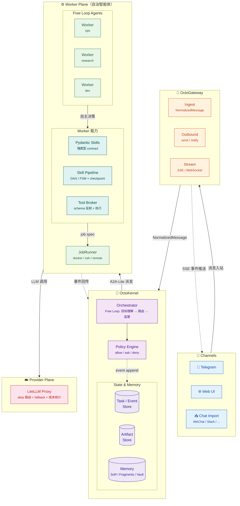

# §6 总体架构（Architecture Overview）

> 本文件是 [blueprint.md](../blueprint.md) §6 的完整内容。

---

### 6.1 分层架构

OctoAgent 采用"**三层 Agent + Skill Pipeline**"的统一架构：

- **主 Agent（Butler / 主执行者 + 监督者）**
  永远以 Free Loop 运行。既是主要执行者（直接处理用户请求），又负责 Worker 创建与派发、全局监督与门禁。
  类似 Agent Zero 的 Agent0，但额外拥有创建和管理 Worker 的能力。
  每个主 Agent 绑定一个 Project，是该 Project 的所有者之一。

- **Workers（持久化自治智能体）**
  永远以 Free Loop 运行。每个 Worker 是持久化的、预定义角色的 LLM 驱动智能体，类似 Agent Zero 的 Agent0。
  每个 Worker 工作时绑定一个 Project（一个 Project 同时只有一个活跃 Session），是该 Project 的所有者之一。
  当主 Agent 派发任务时，如果 Worker 没有合适的 Project，可以动态创建新 Project。
  当需要执行有结构的子流程时，调用 Skill Pipeline（Graph）。

- **Subagent（临时智能体）**
  由 Worker 按需创建的临时 LLM 驱动代理体，以 Free Loop 运行。
  不拥有 Project，共享所属 Worker 的 Project 上下文。
  任务完成后结束生命周期，临时内容全部回收。

- **Skill Pipeline / Graph（确定性流程编排）**
  Worker / Subagent 的工具而非独立执行模式。把关键子流程建模为 DAG/FSM：
  节点级 checkpoint、回退/重试策略、风险门禁、可回放。

- **Pydantic Skills（强类型执行层）**
  每个节点以 contract 为中心：结构化输出、工具参数校验、并行工具调用、框架化重试/审批。

- **LiteLLM Proxy（模型网关/治理层）**
  统一模型出口：alias 路由、fallback、限流、成本统计、日志审计。

> **设计原则**：主 Agent、Workers、Subagent 都以 Free Loop 保持最大灵活性，确定性只在需要的地方引入（Skill Pipeline）。Graph 不是"执行模式"，而是 Agent 手中的编排工具。三层 Agent 的核心区别在于持久性与 Project 所有权：主 Agent/Worker 持久化且拥有 Project，Subagent 临时且共享 Project。

### 6.2 逻辑组件图（Mermaid）

### 6.3 数据与控制流（关键路径）

#### 6.3.1 用户消息 → 任务

1. ChannelAdapter 收到消息 → 转成 `NormalizedMessage`
2. Gateway 调 `POST /ingest_message` 投递到 Kernel
3. Kernel：
   - 创建 Task（若是新请求）或产生 UPDATE 事件（若是追加信息）
   - Orchestrator Loop 分类/路由 → 选择 Worker 并派发
   - Worker 以 Free Loop 执行，自主决定调用 Skill 或 Skill Pipeline（Graph）

#### 6.3.2 任务执行 → 事件/产物 → 流式输出

1. Skill/Tool 执行过程中：
   - 产生事件：MODEL_CALL_STARTED / MODEL_CALL_COMPLETED / MODEL_CALL_FAILED、TOOL_CALL、STATE_TRANSITION、ARTIFACT_CREATED 等
2. Gateway 订阅任务事件流（SSE），推送到 Web UI / Telegram
3. 如果进入 WAITING_APPROVAL：
   - UI/Telegram 展示审批卡片
   - 用户批准 → 产生 APPROVED 事件 → Graph 继续执行

#### 6.3.3 崩溃恢复

- Kernel 重启：
  - 扫描 Task Store：所有 RUNNING/WAITING_* 的任务进入"恢复队列"
  - Skill Pipeline（Graph）内崩溃：从最后 checkpoint 继续（确定性恢复）
  - Worker Free Loop 内崩溃：重启 Free Loop，将之前的 Event 历史注入为上下文，由 LLM 自主判断从哪里继续（可配置为"需要人工确认"）

---
