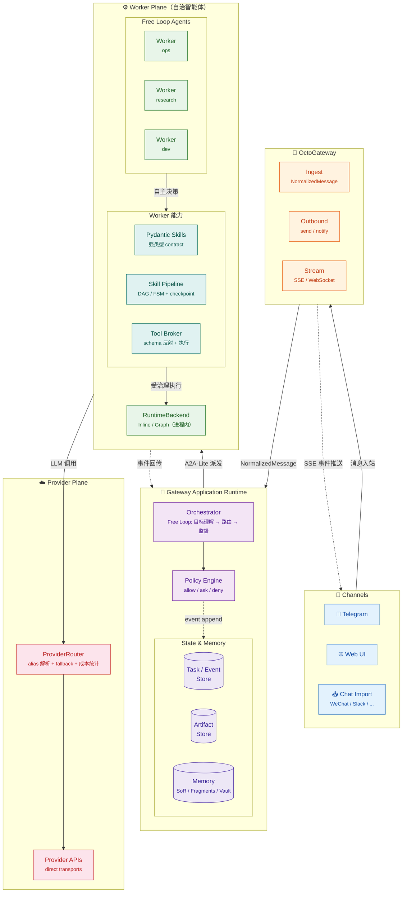

# §6 总体架构（Architecture Overview）

> 本文件是 [blueprint.md](../blueprint.md) §6 的完整内容。

---

### 6.1 分层架构

OctoAgent 采用"**三层 Agent + Skill Pipeline**"的统一架构：

- **主 Agent（主执行者 + 监督者）**
  永远以 Free Loop 运行。既是主要执行者（直接处理用户请求），又负责 Worker 创建与派发、全局监督与门禁。
  类似 Agent Zero 的 Agent0，但额外拥有创建和管理 Worker 的能力。
  每个主 Agent 绑定一个 Project，是该 Project 的所有者之一。

- **Workers（持久化自治智能体）**
  永远以 Free Loop 运行。每个 Worker 是持久化的、预定义角色的 LLM 驱动智能体，类似 Agent Zero 的 Agent0。
  每个 Worker 工作时绑定一个 Project（一个 Project 同时只有一个活跃 Session），是该 Project 的所有者之一。
  当主 Agent 派发任务时，如果 Worker 没有合适的 Project，可以动态创建新 Project。
  当需要执行有结构的子流程时，调用 Skill Pipeline（Graph）。

- **Subagent（临时智能体）**
  由 Worker 按需创建的临时 LLM 驱动代理体，以 Free Loop 运行。
  不拥有 Project，共享所属 Worker 的 Project 上下文。
  任务完成后结束生命周期，临时内容全部回收。

- **Skill Pipeline / Graph（确定性流程编排）**
  Worker / Subagent 的工具而非独立执行模式。把关键子流程建模为 DAG/FSM：
  节点级 checkpoint、回退/重试策略、风险门禁、可回放。

- **Pydantic Skills（强类型执行层）**
  每个节点以 contract 为中心：结构化输出、工具参数校验、并行工具调用、框架化重试/审批。

- **ProviderRouter（模型路由与治理层）**
  在进程内完成 alias 解析、direct transport、fallback、成本统计与调用审计。

> **设计原则**：主 Agent、Workers、Subagent 都以 Free Loop 保持最大灵活性，确定性只在需要的地方引入（Skill Pipeline）。Graph 不是"执行模式"，而是 Agent 手中的编排工具。三层 Agent 的核心区别在于持久性与 Project 所有权：主 Agent/Worker 持久化且拥有 Project，Subagent 临时且共享 Project。

### 6.2 逻辑组件图（Mermaid）

```mermaid
flowchart TB
  subgraph Channels["📡 Channels"]
    direction LR
    TG["🤖 Telegram"]
    WEB["🌐 Web UI"]
    IMP["📥 Chat Import<br/><small>WeChat / Slack / ...</small>"]
  end

  subgraph Gateway["🚪 OctoGateway"]
    direction LR
    IN["Ingest<br/><small>NormalizedMessage</small>"]
    OUT["Outbound<br/><small>send / notify</small>"]
    STRM["Stream<br/><small>SSE / WebSocket</small>"]
  end

  subgraph Runtime["🧠 Gateway Application Runtime"]
    direction TB
    ROUTER["Orchestrator<br/><small>Free Loop: 目标理解 → 路由 → 监督</small>"]
    POLICY["Policy Engine<br/><small>allow / ask / deny</small>"]

    subgraph Store["State & Memory"]
      direction LR
      TASKS[("Task / Event<br/>Store")]
      ART[("Artifact<br/>Store")]
      MEM[("Memory<br/><small>SoR / Fragments / Vault</small>")]
    end

    ROUTER --> POLICY
    POLICY -.->|event append| Store
  end

  subgraph Exec["⚙️ Worker Plane（自治智能体）"]
    direction TB

    subgraph Workers["Free Loop Agents"]
      direction LR
      W1["Worker<br/><small>ops</small>"]
      W2["Worker<br/><small>research</small>"]
      W3["Worker<br/><small>dev</small>"]
    end

    subgraph Capabilities["Worker 能力"]
      direction LR
      SKILLS["Pydantic Skills<br/><small>强类型 contract</small>"]
      GRAPH["Skill Pipeline<br/><small>DAG / FSM + checkpoint</small>"]
      TOOLS["Tool Broker<br/><small>schema 反射 + 执行</small>"]
    end

    RB["RuntimeBackend<br/><small>Inline / Graph（进程内）</small>"]

    Workers -->|"自主决策"| Capabilities
    Capabilities -->|"受治理执行"| RB
  end

  subgraph Provider["☁️ Provider Plane"]
    ROUTE["ProviderRouter<br/><small>alias 解析 + fallback + 成本统计</small>"]
    LLM["Provider APIs<br/><small>direct transports</small>"]
    ROUTE --> LLM
  end

  Channels -->|"消息入站"| Gateway
  Gateway -->|"NormalizedMessage"| Runtime
  Runtime -->|"A2A-Lite 派发"| Exec
  Exec -->|"LLM 调用"| ROUTE
  Exec -.->|"事件回传"| Runtime
  Gateway -.->|"SSE 事件推送"| Channels

  %% 样式定义
  classDef channel fill:#e3f2fd,stroke:#1565c0,color:#0d47a1
  classDef gateway fill:#fff3e0,stroke:#e65100,color:#bf360c
  classDef kernel fill:#f3e5f5,stroke:#6a1b9a,color:#4a148c
  classDef worker fill:#e8f5e9,stroke:#2e7d32,color:#1b5e20
  classDef provider fill:#fce4ec,stroke:#c62828,color:#b71c1c
  classDef store fill:#ede7f6,stroke:#4527a0,color:#311b92
  classDef capability fill:#e0f2f1,stroke:#00695c,color:#004d40

  class TG,WEB,IMP channel
  class IN,OUT,STRM gateway
  class ROUTER,POLICY kernel
  class TASKS,ART,MEM store
  class W1,W2,W3,RB worker
  class SKILLS,GRAPH,TOOLS capability
  class ROUTE,LLM provider
```

### 6.3 数据与控制流（关键路径）

#### 6.3.1 用户消息 → 任务

1. ChannelAdapter 收到消息 → 转成 `NormalizedMessage`
2. Gateway 调 `POST /ingest_message` 投递到同一 Gateway application runtime
3. Runtime：
   - 创建 Task（若是新请求）或产生 UPDATE 事件（若是追加信息）
   - Orchestrator Loop 分类/路由 → 选择 Worker 并派发
   - Worker 以 Free Loop 执行，自主决定调用 Skill 或 Skill Pipeline（Graph）

#### 6.3.2 任务执行 → 事件/产物 → 流式输出

1. Skill/Tool 执行过程中：
   - 产生事件：MODEL_CALL_STARTED / MODEL_CALL_COMPLETED / MODEL_CALL_FAILED、TOOL_CALL、STATE_TRANSITION、ARTIFACT_CREATED 等
2. Gateway 订阅任务事件流（SSE），推送到 Web UI / Telegram
3. 如果进入 WAITING_APPROVAL：
   - UI/Telegram 展示审批卡片
   - 用户批准 → 产生 APPROVED 事件 → Graph 继续执行

#### 6.3.3 崩溃恢复

- Gateway application runtime 重启：
  - 扫描 Task Store：所有 RUNNING/WAITING_* 的任务进入"恢复队列"
  - Skill Pipeline（Graph）内崩溃：从最后 checkpoint 继续（确定性恢复）
  - Worker Free Loop 内崩溃：重启 Free Loop，将之前的 Event 历史注入为上下文，由 LLM 自主判断从哪里继续（可配置为"需要人工确认"）

#### 6.3.4 原生设备敏感数据 → 单次分析（F152）

F152 冻结跨端语义，但不实现 F153 的 iOS transport 或签名：

1. `RawSample` 与 `NormalizedFact` 默认只存在于原生设备，按 session/24 小时 TTL
   删除；Protocol 不发布这两个 local stage。
2. 用户先看到 `ReviewBundle`，再对 canonical bundle/packet hash、purpose、
   owner/device 作一次性 `ConsentGrant`；批准窗口最长 15 分钟。
3. 只有 `ApprovedAnalysisPacket` 可进入后续分析。服务端以阶段专表保存
   review/packet/result/candidate，不使用通用 blob 或第二 store。
4. `AnalysisResult` 永不自动写 Memory。用户明确选择文本后只能生成
   `OptionalMemoryCandidate(pending)`，还需独立、精确绑定的第二次确认并进入既有
   Memory review owner。
5. durable audit 只保存 hash/count/type/decision/reason/UTC，不保存正文、token、
   signature、nonce、owner email 或 Apple raw identifier。
6. 删除沿 provenance graph 在单一 SQLite transaction 中执行，正文级联删除后只保留
   `DeletionReceipt` 与 audit hash；部分失败回滚正文并允许同 request 恢复。
7. capability exact match、device owner/id/key thumbprint、request method/path/body/
   timestamp/nonce/token-id 全绑定；revoked device 优先于 expired token，未知 capability
   或 replay 必须 fail closed。

F153 只能消费 Protocol 发布的 `DeviceIdentity`、`CapabilityGrant` 与
`RequestProofPayload` exact schema；F154/F155 只能消费 review→deletion 七项 schema。
Web Access cookie/service token 不得转换成原生设备身份，F154/F155 也不得提前新增
health/calendar capability。

#### 6.3.5 原生 iOS 设备注册 → 短期设备访问（F153）

1. 已通过 F150 Access 的电脑 Web owner 创建 2 分钟、single-use registration
   challenge；Gateway 只持久化 secret hash 与不可逆 owner id。
2. 原生 SwiftUI App 在 Secure Enclave 生成 P-256 key，Keychain 使用
   `AfterFirstUnlockThisDeviceOnly`；私钥不导出，App 不保存 Web Cookie、
   Cloudflare service token 或部署者凭证。
3. iOS 通过唯一 `DeviceTrustClient`/ephemeral `URLSession` 提交签名 enrollment；
   owner 核对设备后显式 approve/reject。未批准设备不能取得 token。
4. active device 以新的 single-use challenge 换取最长 15 分钟的
   capability-scoped opaque token；服务端只保存 token SHA-256。
5. 每个 protected request 同时绑定 token、device key、method/path/body hash、
   timestamp 与 nonce；P-256 验签、F152 policy 和 durable replay consume 全部通过后
   才进入 `/api/mobile/v1/ready` 或 device-profile workload。
6. mobile hostname 与 Web hostname 共用同一 named tunnel，但 Host/path 与认证模型
   分离；mobile 其它 API/SPA/docs/health 为 404，Web Access session 不能冒充设备。
7. Simulator cold start、六状态功能/视觉回归、Dynamic Type、Reduce Motion、scheme
   tests、generic iPhoneOS Release build、focused Gateway regression 与 source/bundle
   secret scan 已通过；真实 `ios.maojiwang.work` 与 iPhone 上的签名安装、
   owner-assisted enrollment、signed ready、replay 拒绝、revoke、重连及网络生命周期
   也已完成，F153 `GATE_VERIFY=true`。F154 的 HealthKit 真机权限与数据旅程仍须单独
   验证，不能由 F153、Simulator、编译或静态扫描替代。

---
