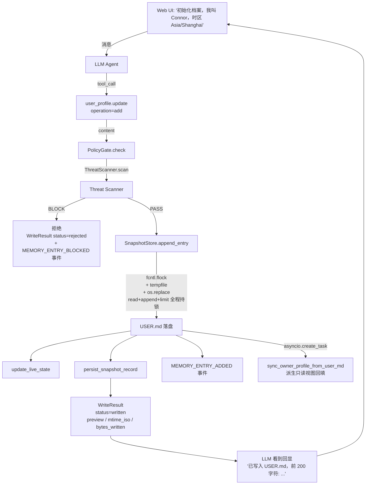

# Harness + Context 全栈架构（Feature 084）

> 作者：Connor
> 引入版本：Feature 084（5 Phase，2026-04-28）
> 状态：✅ 完成
> 参考：`_references/opensource/hermes-agent/`（冻结快照 + Live State 模式 / 中央 Tool Registry / Threat Scanner / Routine / delegate_task）

## 1. 历史问题

F082（Bootstrap & Profile Integrity）引入了三层抽象（BootstrapSession 状态机 / BootstrapSessionOrchestrator / UserMdRenderer），用户实测多次反馈"USER.md 写入失败"。F084 通过对照 5 个 reference 产品（Agent-Zero / Pydantic AI / OpenClaw / OpenClaw Connor 实际使用快照 / **Hermes Agent**）发现 4 个根因（D1-D4）：

| # | 断层 | 现象 | 修复 |
|---|------|------|------|
| **D1** | capability_pack `_resolve_tool_entrypoints` 硬编码 explicit dict 漏掉新工具 | `bootstrap.complete` web 入口看不到，用户无法触发写入 | Phase 1：删硬编码 dict，改 ToolRegistry 数据驱动；工具自描述 `_TOOL_ENTRYPOINTS` |
| **D2** | 没有 SnapshotStore，每次会话重读文件，无冻结快照保护 prefix cache；写入失败无回显 | LLM 调用了写工具但不知道是否成功 | Phase 2：SnapshotStore（冻结快照 + live_state + atomic write_through）+ WriteResult 通用回显契约 |
| **D3** | `OwnerProfile.is_filled()` 标记位污染状态机 | 真实写入了 USER.md 但状态字段说"未完成" | Phase 4：删除 BootstrapSession 状态机；bootstrap 完成由 `_user_md_substantively_filled(USER.md)` 直接判定 |
| **D4** | `bootstrap.complete` 工具命名混乱（暗示流程结束，实际只是写一次档案）| 命名隐藏语义 | Phase 2：替换为 `user_profile.update(operation="add"/"replace"/"remove")`，语义自显 |

## 2. Harness 层组件

Harness = 工具与执行的硬约束基础设施层（与 Context 层数据语义解耦）：

```
apps/gateway/src/octoagent/gateway/harness/
├── tool_registry.py      # 中央 ToolEntry + ToolRegistry + AST 自动发现
├── toolset_resolver.py   # 从 toolsets.yaml 计算 per-agent_type 可用工具集
├── threat_scanner.py     # ≥17 ThreatPattern + invisible unicode 检测
├── snapshot_store.py     # 冻结快照 + live_state + atomic write_through + SnapshotRecord 持久化
├── approval_gate.py      # session allowlist + SSE 异步审批 + ensure_audit_task
└── delegation.py         # MAX_DEPTH=2 / MAX_CONCURRENT_CHILDREN=3 / blacklist
```

### 2.1 ToolRegistry（FR-1）

中央 ToolEntry 注册表，**数据驱动 entrypoints 可见性**（取代 capability_pack hardcoded dict）。

| 字段 | 用途 |
|------|------|
| `name` | 工具唯一标识 |
| `entrypoints: frozenset[str]` | 工具可见的入口（`web` / `agent_runtime` / `telegram`）|
| `handler` | 异步可调用 |
| `metadata: dict` | 含 `produces_write` 标记（FR-2.4） |

注册期 hooks：
1. **AST 扫描自动发现**：`scan_and_register(registry, builtin_tools_path)` 启动时执行
2. **`func._tool_meta` metadata 同步**：`register(entry)` 自动从 handler 同步 produces_write 等元数据
3. **WriteResult 契约 enforce**：`produces_write=True` 工具的 return type 必须是 `WriteResult` 子类（fail-fast 启动期）

### 2.2 SnapshotStore（FR-2，Hermes 核心模式）

**冻结快照 + Live State 二分**（保护 prefix cache，SC-011）：

| 字段 | 语义 |
|------|------|
| `_system_prompt_snapshot: dict[str, str]` | session 启动时冻结，整个 session 不变（system prompt 注入路径读这里）|
| `_live_state: dict[str, str]` | 随每次写入更新（`user_profile.read` 路径读这里）|
| `_file_mtimes: dict[Path, float]` | 启动时记录，会话结束时 diff（漂移则 WARN 日志，FR-2.5）|
| `_locks: dict[Path, asyncio.Lock]` | per-file async lock，配合 fcntl.flock 防 read-modify-write 竞态 |

关键 API：
- `load_snapshot(session_id, files)`：会话启动时冻结
- `format_for_system_prompt() → dict[str, str]`：返回**冻结副本**（不变）
- `get_live_state(key) → str`：返回当前 live state（变）
- `write_through(file_path, new_content)`：fcntl.flock + tempfile + os.replace 原子写
- `append_entry(file_path, new_entry, char_limit)`：read+append+limit+write 全程持锁（防 F21 concurrent 数据丢失）
- `persist_snapshot_record(tool_call_id, result_summary)`：每次工具调用回显落库（snapshot_records 表，TTL 30 天）

### 2.3 ThreatScanner（FR-3，Hermes pattern table 模式）

| 检测 | 实现 |
|------|------|
| Prompt Injection / Role Hijacking / Exfiltration / SSH backdoor / base64 payload | `_MEMORY_THREAT_PATTERNS` ≥17 条正则 |
| Invisible Unicode 字符（U+200B / U+200C / U+200D / ZWNBSP）| `_INVISIBLE_CHARS` frozenset O(n) 遍历 |

每条 pattern 含 `pattern_id` + `severity`（WARN / BLOCK）。BLOCK 命中由 PolicyGate 统一拦截，写 `MEMORY_ENTRY_BLOCKED` 事件（不含原始恶意内容，Constitution C5）。

### 2.4 ApprovalGate（FR-4）

| 维度 | 行为 |
|------|------|
| Session allowlist | 同 session + 同 operation_type 第二次不弹卡片（不跨 session 持久化）|
| 审批请求 | `request_approval` 写 `APPROVAL_REQUESTED` 事件 + SSE 推送审批卡片到 Web UI |
| 异步等待 | `wait_for_decision(handle, timeout=300)` 阻塞等 `asyncio.Event.set()` |
| 决策注入 | `resolve_approval(handle_id, decision)` 写 `APPROVAL_DECIDED` 事件（同时写 `handle_id` 和 `approval_id` 兼容字段）|
| Timeout | 显式 reject + 写 `APPROVAL_DECIDED` 终态事件（防事件重放悬挂）|

### 2.5 DelegationManager（FR-5）

| 约束 | 阈值 |
|------|------|
| `MAX_DEPTH` | 2（防无限递归 sub-agent）|
| `MAX_CONCURRENT_CHILDREN` | 3（防并发爆炸）|
| Worker blacklist | 默认空，可配 |

通过约束 → 写 `SUBAGENT_SPAWNED` 事件 + 调 `launch_child` 真实派发（与 `subagents.spawn` 同路径）。失败不写假事件。

### 2.6 PolicyGate（Constitution C10 统一入口）

工具层不再直接调 `threat_scan`；统一通过 `PolicyGate.check()` 入口：
- `BLOCK` → 拦截 + 写 `MEMORY_ENTRY_BLOCKED` 事件（含 `ensure_audit_task` 防 FK violation）
- `WARN` → 由 GatewayToolBroker 触发 ApprovalGate（reversible+ 工具）
- 通过 → dispatch

## 3. Context 层组件

```
behavior/
├── system/
│   ├── USER.md       # SoT：用户档案，user_profile.update 写入
│   └── MEMORY.md     # MEMORY 持久化（Phase 5 扩展）
└── observations/     # observation_candidates 派生候选（待用户审核）
```

| 实体 | SoT | 派生方向 |
|------|-----|----------|
| **USER.md** | ✅ Single Source of Truth | OwnerProfile 解析回填 / SnapshotStore 注入 system prompt |
| `OwnerProfile` | ❌ 派生只读视图（FR-9.1）| `sync_owner_profile_from_user_md(USER.md)` 解析 timezone/locale 等 |
| `observation_candidates` 表 | candidates 队列 | promote 后写入 USER.md（用户决策）|

## 4. WriteResult 通用回显契约（FR-2.4 / FR-2.7）

所有 `produces_write=True` 工具（≥ 18 个）的 return type 必须是 `WriteResult` 子类：

```python
class WriteResult(BaseModel):
    status: Literal["written", "skipped", "rejected", "pending"]
    target: str          # 文件路径 / DB 表名 / 子任务 ID / 异步 job ID
    bytes_written: int | None
    preview: str | None  # 前 200 字符摘要
    mtime_iso: str | None
    reason: str | None   # 状态非 written 时必填
```

每个写工具定义 WriteResult 子类**保留关联键**（防字段压扁）：

| 工具 | 子类 | 关联键 |
|------|------|--------|
| `subagents.spawn` | `SubagentsSpawnResult` | `children: list[ChildSpawnInfo]`（每个含 task_id / work_id / session_id）|
| `subagents.kill` | `SubagentsKillResult` | `task_id` / `work_id` / `runtime_cancelled` / `work` |
| `memory.write` | `MemoryWriteResult` | `memory_id` / `version` / `action` / `scope_id` |
| `mcp.install` | `McpInstallResult` | `task_id` (status="pending" 时必填，npm/pip 异步路径) |
| `graph_pipeline` | `GraphPipelineResult` | `run_id` / `task_id` / `action` |
| ... | 共 ≥ 12 个子类 | |

注册期 enforce：`produces_write=True` 工具的 return annotation 必须是 `WriteResult` 子类（用 `typing.get_type_hints` 兼容 `from __future__ import annotations` 字符串注解）。违规启动 fail-fast。

## 5. USER.md 写入数据流图



## 6. Observation → Promote 数据流图

```mermaid
flowchart TD
    Routine[ObservationRoutine 30min]
    Routine --> Extract[_extract: 从对话提取候选事实]
    Extract --> Dedupe[_dedupe: SHA-256 去重<br/>source_turn_id + fact_content_hash]
    Dedupe --> Cat[_categorize: utility model<br/>打 category + confidence]
    Cat -->|confidence < 0.7| Drop[丢弃]
    Cat -->|confidence ≥ 0.7| Queue[observation_candidates 表<br/>+ OBSERVATION_OBSERVED 事件]
    Queue --> Badge[Web UI 红点 badge<br/>useMemoryCandidateCount]
    User[用户] --> UI[MemoryCandidates.tsx]
    UI --> Card[CandidateCard<br/>accept / edit+accept / reject]
    Card -->|POST /promote| API[/api/memory/candidates/{id}/promote]
    API -->|atomic claim<br/>UPDATE status='promoting'<br/>WHERE status='pending'| Claim[F28 防 concurrent 重复写入]
    Claim --> ThreatPolicy[ThreatScanner + PolicyGate]
    ThreatPolicy -->|PASS| AppendUM[SnapshotStore.append_entry → USER.md]
    AppendUM --> SetPromoted[UPDATE status='promoted']
    SetPromoted --> Event2[OBSERVATION_PROMOTED + MEMORY_ENTRY_ADDED 事件]
    Event2 --> Refresh[badge 监听 'memory-candidates-changed' 事件刷新]
```

## 7. F082 退役清单（Phase 4 完成）

| 文件 | 状态 |
|------|------|
| `apps/gateway/.../builtin_tools/bootstrap_tools.py` | 删除（Phase 1） |
| `apps/gateway/.../services/user_md_renderer.py` | 删除（Phase 4） |
| `apps/gateway/.../services/bootstrap_integrity.py` | 删除（Phase 4） |
| `apps/gateway/.../services/bootstrap_orchestrator.py` | 删除（Phase 4） |
| `packages/provider/.../dx/bootstrap_commands.py` | 删除（Phase 4） |
| `packages/core/.../models/agent_context.BootstrapSession` | 删除（Phase 4） |
| `bootstrap_sessions` SQLite 表 | DROP migration 启动自动执行（Phase 4） |
| `octo bootstrap reset/migrate-082/rebuild-user-md` CLI | 删除（Phase 4） |
| ~50 个 F082 deprecated 测试 | 删除或迁移到新路径 |

**净删 dead code**：~2400 行（Phase 4）。

## 8. 重装路径（spec 用户决策 6）

不做 migrate 命令——用户重装方案：
```bash
rm -rf ~/.octoagent/data/ ~/.octoagent/behavior/   # 清状态
# 保留：~/.octoagent/octoagent.yaml + .env（用户配置）
octo update                                         # 重启
# bootstrap 完成由 USER.md 实质填充（>100 字符）判定，不依赖任何旧表 / 状态机
```

## 9. 测试覆盖

| 维度 | 测试数 |
|------|--------|
| Phase 1（Tool Registry / Toolset / Threat Scanner） | +33 |
| Phase 2（WriteResult 契约 + SnapshotStore + user_profile.* + sync hook） | +50 |
| Phase 3（ApprovalGate / Delegation / Routine / Memory Candidates API + 前端 UI） | +42 + 21 frontend |
| Phase 4（退役 + DROP migration） | -50 deprecated + 14 调整 |
| **F084 总测试** | **1911 passed / 0 failed** |

## 10. 关联文档

- `docs/codebase-architecture/bootstrap-profile-flow.md` — F082 → F084 流程对照
- `docs/codebase-architecture/provider-direct-routing.md` — F081 ProviderRouter（Harness 上游）
- `docs/codebase-architecture/testing-concurrency.md` — F083 测试并发（Harness 验证基础）
- `.specify/features/084-context-harness-rebuild/spec.md` — 完整 FR / 验收准则
- `.specify/features/084-context-harness-rebuild/contracts/tools-contract.md` — WriteResult 契约 + 工具 schema
