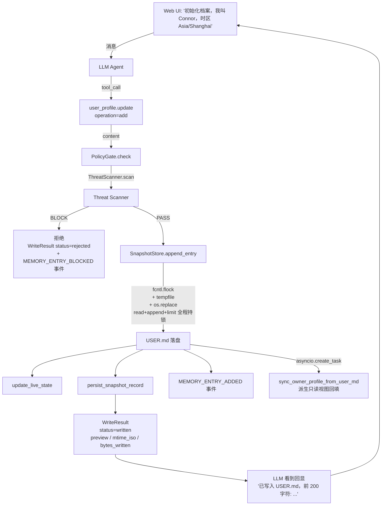

# Harness + Context 全栈架构（Feature 084）

> 作者：Connor
> 引入版本：Feature 084（5 Phase，2026-04-28）
> 状态：✅ 完成
> 参考：`_references/opensource/hermes-agent/`（冻结快照 + Live State 模式 / 中央 Tool Registry / Threat Scanner / Routine / delegate_task）

## 1. 历史问题

F082（Bootstrap & Profile Integrity）引入了三层抽象（BootstrapSession 状态机 / BootstrapSessionOrchestrator / UserMdRenderer），用户实测多次反馈"USER.md 写入失败"。F084 通过对照 5 个 reference 产品（Agent-Zero / Pydantic AI / OpenClaw / OpenClaw Connor 实际使用快照 / **Hermes Agent**）发现 4 个根因（D1-D4）：

| # | 断层 | 现象 | 修复 |
|---|------|------|------|
| **D1** | capability_pack `_resolve_tool_entrypoints` 硬编码 explicit dict 漏掉新工具 | `bootstrap.complete` web 入口看不到，用户无法触发写入 | Phase 1：删硬编码 dict，改 ToolRegistry 数据驱动；工具自描述 `_TOOL_ENTRYPOINTS` |
| **D2** | 没有 SnapshotStore，每次会话重读文件，无冻结快照保护 prefix cache；写入失败无回显 | LLM 调用了写工具但不知道是否成功 | Phase 2：SnapshotStore（冻结快照 + live_state + atomic write_through）+ WriteResult 通用回显契约 |
| **D3** | `OwnerProfile.is_filled()` 标记位污染状态机 | 真实写入了 USER.md 但状态字段说"未完成" | Phase 4：删除 BootstrapSession 状态机；bootstrap 完成由 `_user_md_substantively_filled(USER.md)` 直接判定 |
| **D4** | `bootstrap.complete` 工具命名混乱（暗示流程结束，实际只是写一次档案）| 命名隐藏语义 | Phase 2：替换为 `user_profile.update(operation="add"/"replace"/"remove")`，语义自显 |

## 2. Harness 层组件

Harness = 工具与执行的硬约束基础设施层（与 Context 层数据语义解耦）：

```
apps/gateway/src/octoagent/gateway/harness/
├── tool_registry.py      # 中央 ToolEntry + ToolRegistry + AST 自动发现
├── toolset_resolver.py   # 从 toolsets.yaml 计算 per-agent_type 可用工具集
├── threat_scanner.py     # ≥17 ThreatPattern + invisible unicode 检测
├── snapshot_store.py     # 冻结快照 + live_state + atomic write_through + SnapshotRecord 持久化
├── approval_gate.py      # session allowlist + SSE 异步审批 + ensure_audit_task
└── delegation.py         # MAX_DEPTH=2 / MAX_CONCURRENT_CHILDREN=3 / blacklist
```

### 2.1 ToolRegistry（FR-1）

中央 ToolEntry 注册表，**数据驱动 entrypoints 可见性**（取代 capability_pack hardcoded dict）。

| 字段 | 用途 |
|------|------|
| `name` | 工具唯一标识 |
| `entrypoints: frozenset[str]` | 工具可见的入口（`web` / `agent_runtime` / `telegram`）|
| `handler` | 异步可调用 |
| `metadata: dict` | 含 `produces_write` 标记（FR-2.4） |

注册期 hooks：
1. **AST 扫描自动发现**：`scan_and_register(registry, builtin_tools_path)` 启动时执行
2. **`func._tool_meta` metadata 同步**：`register(entry)` 自动从 handler 同步 produces_write 等元数据
3. **WriteResult 契约 enforce**：`produces_write=True` 工具的 return type 必须是 `WriteResult` 子类（fail-fast 启动期）

> **F135 gap-1 校正（LLM 工具可见性的真实门）**：`ToolEntry.entrypoints` +
> `ToolsetResolver.resolve_for_entrypoint` + `toolsets.yaml` 三者是 F084 D1 遗留的设计，
> **在当前生产链路里对"给 LLM 的工具集"零作用**（`resolve_for_entrypoint` 无生产调用者）。
> 主 Agent（含 web 来源）的工具可见性真实由 `CapabilityPackService.resolve_profile_first_tools`
> 决定，过滤维度是 **tool_group ∈ default_tool_groups / selected_tools 白名单 / tool_profile /
> availability**——**不看 entrypoint**。可见工具再按 `CoreToolSet.default()` 二分：
> **Core = 完整 schema 直接可调（一跳）**；**Deferred = 只在 system prompt 列名，须 `tool_search`
> 激活（两跳）**。因此"某工具对聊天会话是否可用"取决于它是否在 default_tool_groups 覆盖的
> tool_group 里 + 是否 Core，**与 entrypoints 声明无关**。`behavior.write_file`（tool_group=
> `behavior`，在 general default_tool_groups 内）此前是 Deferred → 首次引导填 USER.md 的闭环
> 因两跳链路脆弱而在生产走不通，F135 将其提进 Core（发现层），治理执行层（review_mode
> Two-Phase）不受影响。entrypoint 三件套作为历史冗余保留（未清理）。
>
> **F136 治理执行层加固**：F135 Codex P1 证实 handler 的 `confirmed` 是 LLM 自填参数、
> 一轮自确认即绕过人审。F136 起 REVIEW_REQUIRED 文件 `confirmed=true` 不再自证，
> 而是经 `builtin_tools/write_approval.gate_behavior_write` 发起服务端 ApprovalGate
> 审批（卡片含 unified diff），用户在 Web/Telegram 批准后才落盘（详见 §2.4）。

### 2.2 SnapshotStore（FR-2，Hermes 核心模式）

**冻结快照 + Live State 二分**（保护 prefix cache，SC-011）：

| 字段 | 语义 |
|------|------|
| `_system_prompt_snapshot: dict[str, str]` | session 启动时冻结，整个 session 不变（system prompt 注入路径读这里）|
| `_live_state: dict[str, str]` | 随每次写入更新（`user_profile.read` 路径读这里）|
| `_file_mtimes: dict[Path, float]` | 启动时记录，会话结束时 diff（漂移则 WARN 日志，FR-2.5）|
| `_locks: dict[Path, asyncio.Lock]` | per-file async lock，配合 fcntl.flock 防 read-modify-write 竞态 |

关键 API：
- `load_snapshot(session_id, files)`：会话启动时冻结
- `format_for_system_prompt() → dict[str, str]`：返回**冻结副本**（不变）
- `get_live_state(key) → str`：返回当前 live state（变）
- `write_through(file_path, new_content)`：fcntl.flock + tempfile + os.replace 原子写
- `append_entry(file_path, new_entry, char_limit)`：read+append+limit+write 全程持锁（防 F21 concurrent 数据丢失）
- `persist_snapshot_record(tool_call_id, result_summary)`：每次工具调用回显落库（snapshot_records 表，TTL 30 天）

### 2.3 ThreatScanner（FR-3，Hermes pattern table 模式；F124 扩 scope 维度 + tool 结果管道）

| 检测 | 实现 |
|------|------|
| Prompt Injection / Role Hijacking / Exfiltration / SSH backdoor / base64 payload + CONTEXT 间接注入族（C2-promptware / role-play / fake-update / hidden-HTML / deception） | `_THREAT_PATTERNS`（17 baseline + 10 CONTEXT，正则）|
| Invisible Unicode 字符（U+200B / U+200C / U+200D / ZWNBSP）| `_INVISIBLE_CHARS` frozenset O(n) 遍历 |

每条 pattern 含 `pattern_id` + `severity`（WARN / BLOCK）+ **`scopes`**（F124）。

**F124 scope 维度（显式成员，非累积）**：`ScanScope{MEMORY, CONTEXT}`。
- **MEMORY**（冻结 = 17 baseline）：memory/profile 写入路径，`scan(scope=MEMORY)`（默认）由 PolicyGate 触发，BLOCK 命中拦截写 `MEMORY_ENTRY_BLOCKED`。
- **CONTEXT**（tool 结果路径）：`scan_context()` 对 web.fetch/search/MCP/terminal 结果做有界全覆盖扫描（带 overlap 分块 + 输入上限 2MB；MEMORY 超限 degraded-block / CONTEXT 超限 degraded-annotate）。命中**只标注不拦截**（tool 结果是用户未撰写内容），写 `TOOL_RESULT_THREAT_FLAGGED`（hash 无原文，C5）。新 CONTEXT pattern 用有界量词 → ReDoS-safe + 有限 max_span。

### 2.4 ApprovalGate（FR-4）

| 维度 | 行为 |
|------|------|
| Session allowlist | 同 session + 同 operation_type 第二次不弹卡片（不跨 session 持久化）|
| 审批请求 | `request_approval` 写 `APPROVAL_REQUESTED` 事件 + SSE 推送审批卡片到 Web UI |
| 异步等待 | `wait_for_decision(handle, timeout=300)` 阻塞等 `asyncio.Event.set()` |
| 决策注入 | `resolve_approval(handle_id, decision)` 写 `APPROVAL_DECIDED` 事件（同时写 `handle_id` 和 `approval_id` 兼容字段）|
| Timeout | 显式 reject + 写 `APPROVAL_DECIDED` 终态事件（防事件重放悬挂）|

**工具内阻塞审批消费者**（request_approval → ApprovalManager 双注册 → mark_waiting_approval →
notify_approval_request(CRITICAL) → wait_for_decision → 条件恢复 RUNNING）：

| 消费者 | 引入 | 差异语义 |
|--------|------|----------|
| `worker.escalate_permission`（ask_back_tools）| F099/F101 | rejected/timeout 均不恢复 RUNNING（任务核心动作被禁止 → task_runner 推 FAILED）|
| `behavior.write_file` REVIEW_REQUIRED 写（write_approval.gate_behavior_write）| F136 | **显式拒绝恢复 RUNNING**（用户否决一次写入，对话继续）；超时不恢复；审批卡片携带 unified diff；**每次写独立审批、不参与 session allowlist**（allowlist 无法区分内容，一次批准会变成 session 内任意改写豁免）；gate 缺失 fail-closed 拒写 |
| `cron.delete` / `cron.update`（改 schedule）（write_approval.gate_destructive_action）| F132 | 与 behavior.write 同款序列的**通用**破坏性操作审批门（无文件 diff，operation_summary 由调用方拼）；rejected 恢复 RUNNING；超时不恢复；**每次操作独立审批**；gate 缺失 fail-closed 拒执行。`cron.update` 仅改 `enabled`（暂停/恢复，可逆）时**跳过审批**直接生效 |

### 2.5 DelegationManager（FR-5）

| 约束 | 阈值 |
|------|------|
| `MAX_DEPTH` | 2（防无限递归 sub-agent）|
| `MAX_CONCURRENT_CHILDREN` | 3（防并发爆炸）|
| Worker blacklist | 默认空，可配 |

通过约束 → 写 `SUBAGENT_SPAWNED` 事件 + 调 `launch_child` 真实派发（与 `subagents.spawn` 同路径）。失败不写假事件。

### 2.6 内容威胁扫描入口（Constitution C10；F124 两入口一 service）

内容威胁扫描统一经 **`ContentThreatScanService`**（C10 单一 scanner 入口），分两个语义入口：

**① PolicyGate（权限/拦截入口，MEMORY scope）** —— memory/profile 写入：
- `BLOCK` → 拦截 + 写 `MEMORY_ENTRY_BLOCKED`（含 `ensure_audit_task` 防 FK violation）；超输入上限 degraded → 同样 block
- `WARN` → 由 GatewayToolBroker 触发 ApprovalGate（reversible+ 工具）
- 通过 → dispatch

**② ToolBroker `_finalize_result`（内容标注入口，CONTEXT scope）** —— tool 结果（F124）：
- broker 所有 ToolResult 退出分支（success / error / 异常）统一经 `finalize_result`，对 output + error 做 CONTEXT 扫描（截断前全文）
- 命中 → 挂 `ToolSecurityFinding` 到 `ToolResult.security_findings`（**不改 raw output/error**）+ emit `TOOL_RESULT_THREAT_FLAGGED`；**永不 block**
- LLM 渲染层（`provider_model_client._append_feedback_to_history` live + replay / memory-extraction / research-handoff 从持久化 finding 重渲染）经唯一 `render_tool_result_for_llm` helper 前置 `[security-warning]`，扛 replay（finding JSON-native 持久化进 `AgentSessionTurn.metadata`）
- `ContentThreatScanProtocol` 定义在 `packages/tooling`（scope-free），broker 经 DI 注入、不反向依赖 gateway

### 2.7 出站 URL 安全 / SSRF 预检（Feature 123，harness/url_safety.py）

ThreatScanner 管**入站**（memory 写入 + F124 tool 结果），出站 web/browser 请求此前是裸 httpx
（仅 `_validate_remote_url` 检 scheme/netloc）→ LLM 可被诱导抓内网 / 云元数据偷凭证。
F123 新增 `harness/url_safety.py` 作出站方向的统一安全控制（与 ThreatScanner 同层兄弟）：

- **入口**：`ensure_url_safe(url)` / `async_ensure_url_safe(url)`（后者 `asyncio.to_thread`
  跑阻塞 DNS，不阻塞 event loop）；不安全抛 `UnsafeUrlError(RuntimeError)`（沿用既有
  tool-error 事件路径，`is_error=True`）。
- **chokepoint 收敛（Constitution C10）**：`web.fetch` / `browser.open` / `browser.navigate`
  / `browser.act` 全经 `CapabilityPackService._fetch_browser_page`；该函数对初始 URL 预检 +
  其 httpx client 挂 `event_hooks={"request":[_ssrf_request_hook]}`，对**每跳 302 目标**连接前
  重校验。`_search_web` 同样接入（host 虽固定 DDG，defense-in-depth）。
- **三层 IP 判定**：①云元数据 always-block 地板（169.254.169.254 / ECS / Azure IMDS /
  阿里云 / IPv4-mapped / NAT64 / 6to4 内嵌形态——`allow_private_urls=true` 也拦）；②本机/内部
  地址永远拦（loopback / link-local / multicast / unspecified / reserved）；③普通私网
  （RFC1918 / benchmark / ULA / CGNAT）默认拦，仅 `allow_private_urls=true` 放行。
- **开关 `security.allow_private_urls`**（默认 false）：env `OCTOAGENT_ALLOW_PRIVATE_URLS`
  优先 → yaml（按 octoagent.yaml mtime 失效缓存，改 yaml 即时生效，无需重启）。
- **fail-closed**：scheme 非法 / DNS 解析失败 / 空解析 / 解析异常一律拦。
- **已知 limitation**：DNS rebinding（TOCTOU）需连接级 IP pinning（pre-flight 无法根治，
  列 M6/M7 egress 域）；出站 web/browser tool 结果的**入站内容**扫描已由 F124 覆盖。

### 2.8 工具三层职责边界与跨层契约（F108 D9 收口定调）

F108 impact 分析（`.specify/features/108-capability-layer-refactor/`）实测三层 import 方向干净
（broker 零对上依赖；capability_pack/harness 高→低），D9 的实质不是层次倒置而是
capability_pack 超载——F108a W5 已把 browser/web 搜索/TTS/文件检视业务逻辑拆出治理层。
定调后的职责边界：

| 层 | 模块 | 职责 | 不做什么 |
|----|------|------|---------|
| **执行运行时** | `packages/tooling`（ToolBroker） | 单次工具调用编排（事件/权限/hook/超时/finalize）；**工具注册表 SoT**（register/discover/ToolMeta） | 不决定"哪些工具可用"；不含业务逻辑 |
| **治理面** | `gateway/services/capability_pack.py`（+5 业务 mixin） | 工具选择/挂载编排（mount/defer/blocked 三态）、可用性裁决、pack **投影**（BundledCapabilityPack = registry 的二次表示）、ToolDeps 装配 | 不持有 registry SoT；业务逻辑在 mixin（出宿主） |
| **装配层** | `gateway/harness/octo_harness.py` | 纯 wiring：11 段 bootstrap 构造与注入（broker→cap_pack→gate→executors） | 零业务逻辑；**结构不动**（hermetic 测试钉住 6 个 `_bootstrap_*` 符号 + main.py 唯一 caller） |

跨层契约现状（有意设计，文档化防误判为债）：

- **审批 override 缓存三层共享同一实例**：协议 `ApprovalOverrideCacheProtocol` 与参考内存实现
  `_ApprovalOverrideMemoryCache`（无 TTL fallback）在 `tooling/permission.py`（F108b W6 自
  capability_pack 下沉）；生产实例是 `policy.ApprovalOverrideCache`（TTL 版），由 harness 构造、
  注入 broker 与 cap_pack——两实现语义不同（TTL），不是合并对象。
- **截断双层**：通用大输出截断 = broker after-hook（`LargeOutputHandler`，harness 装配，
  含 artifact 卸载）；browser/web 工具在 capability 层另有内容内自截（html 500k 硬截 /
  `_truncate_text`）。统一策略 = 行为变更，刻意不在 F108 做。
- **错误包装契约**：capability 层业务方法直接 raise（多种异常类型），由 `broker.execute`
  except 兜底包装成 `ToolResult(is_error=True)`——隐式契约，新增工具沿用此约定。
- **双 safety-scan 分工**：工具结果内容扫描在 broker（`ContentThreatScanProtocol` 注入，F124）；
  出站 URL/SSRF 预检在 capability 层（`url_safety` + `_ssrf_request_hook`，F123）。语义不同非重复。
- **执行前 schema 校验**（F126 项1）：broker before-hook 链含 fail-closed `SchemaValidationHook`
  （priority=900 靠后，校验最终将传 handler 的 args）。宽松：必传字段缺失 + 容器↔标量结构性
  错配；标量↔标量放行（交工具体内 coerce）。`@tool_contract(skip_arg_validation=True)` 逐工具豁免。
  失败经 `validation_errors`（loc/msg/type）回灌 runner 自愈 retry loop。
- **artifact read-back + task 隔离**（F126 项3）：被卸载的 artifact 不再"仅审计"——LLM 经
  `artifact.read_content(artifact_ref, offset?, limit?)` 按字节分页读回（hooks_legacy.py:148 旧
  "仅审计不供恢复"约束已推翻）。`get_artifact`/`get_artifact_content` 加 `Optional task` 参数：
  `None`=内部信任（既有 caller 零变更），非 None 时 SQL `WHERE task_id` 物理隔离；read-back 传
  当前 task，跨 task 读回被拒（中央 `check_permission` + store 过滤两道）。
- **tool_call_id 确定性 tail eviction**（F126 项2）：`provider_model_client._maybe_compact_history`
  在 history token 超 `compaction_threshold_ratio`（默认 0.8）× max_context 时，从**最旧**折叠有
  `artifact_ref`（可 read-back 恢复）的 role:tool 结果为确定性占位 `[已折叠，见 artifact:<ref>…]`。
  **占位首次折叠原地改写 + 冻结**（下轮检测占位前缀则跳过），只改 role:tool content、不碰
  system/assistant/user、不动 tool_call_id → 前缀单调收敛（KV-cache 逐 transport 实测验证，见
  F126 kv-cache-probe.md：chat/DeepSeek + responses/codex 实测 cache-compatible）。占位指向的 artifact
  经 项3 read-back 读回（卸载-占位-读回闭环）。新 EventType `TOOL_RESULT_EVICTED`。与 §2.8
  context-assembly 侧 prefix-cache 不变量（system 组装层 / AmbientRuntime）**不同层**：tail eviction
  在 history 层、不触 system 折叠（provider_client `_merge_system_messages_to_front`）。
- **per-turn 跨工具聚合预算**（F126 项3，warn-only 最小版）：runner 单轮 tool 执行后聚合输出
  token（chars/4 近似），超 `OCTOAGENT_PER_TURN_TOOL_OUTPUT_BUDGET`（默认 8000）即 emit
  `PER_TURN_BUDGET_EXCEEDED` 告警。聚合卸载与 项2 tail eviction 统一占位语义，待 项2 落地。

设计原则（M6 调研采纳，作不变量约束而非待办）：

- **prefix-cache 工具侧不变量**（Manus 输入）：工具集稳定排序 + 静态注入；可见性收敛到
  Policy 决策（返回 policy-deny 而非删 schema）。禁照搬纯 logit_bias（三 transport 不统一）。
- **决策环扩展缝** = broker 的 BeforeHook/AfterHook（az-1）：已是具名扩展点，
  不照搬 Agent Zero 29 点全自动包裹（违 Constitution #9）。
- **context-assembly 侧 prefix-cache 不变量**（F108b W8-C2 起）：volatile 内容（秒级
  时间戳等）不得置于 system prompt 冻结前缀（Block 1 core_sections）中段。AmbientRuntime
  块自 W8-C2 起归属 Block 2（context_sections）**尾部**——Block 1 + Block 2 前段
  （session 内稳定内容）全部可缓存；位置选择经评审独立推理确认（Block 3 头会把运行时
  环境元数据混进会话历史 = 概念泄漏，turn 内缓存差异量级极小不值得）。已知残留核查项：
  capability_pack bootstrap 模板的 `{{current_datetime_local}}` 占位符（另一条注入路径，
  见 w8-ledger O6）。

## 3. Context 层组件

```
behavior/
├── system/
│   ├── USER.md       # SoT：用户档案，user_profile.update 写入
│   └── MEMORY.md     # MEMORY 持久化（Phase 5 扩展）
└── observations/     # observation_candidates 派生候选（待用户审核）
```

| 实体 | SoT | 派生方向 |
|------|-----|----------|
| **USER.md** | ✅ Single Source of Truth | OwnerProfile 解析回填 / SnapshotStore 注入 system prompt |
| `OwnerProfile` | ❌ 派生只读视图（FR-9.1）| `sync_owner_profile_from_user_md(USER.md)` 解析 timezone/locale 等 |
| `observation_candidates` 表 | candidates 队列 | promote 后写入 USER.md（用户决策）|

## 4. WriteResult 通用回显契约（FR-2.4 / FR-2.7）

所有 `produces_write=True` 工具（≥ 18 个）的 return type 必须是 `WriteResult` 子类：

```python
class WriteResult(BaseModel):
    status: Literal["written", "skipped", "rejected", "pending"]
    target: str          # 文件路径 / DB 表名 / 子任务 ID / 异步 job ID
    bytes_written: int | None
    preview: str | None  # 前 200 字符摘要
    mtime_iso: str | None
    reason: str | None   # 状态非 written 时必填
```

每个写工具定义 WriteResult 子类**保留关联键**（防字段压扁）：

| 工具 | 子类 | 关联键 |
|------|------|--------|
| `subagents.spawn` | `SubagentsSpawnResult` | `children: list[ChildSpawnInfo]`（每个含 task_id / work_id / session_id）|
| `subagents.kill` | `SubagentsKillResult` | `task_id` / `work_id` / `runtime_cancelled` / `work` |
| `memory.write` | `MemoryWriteResult` | `memory_id` / `version` / `action` / `scope_id` |
| `mcp.install` | `McpInstallResult` | `task_id` (status="pending" 时必填，npm/pip 异步路径) |
| `graph_pipeline` | `GraphPipelineResult` | `run_id` / `task_id` / `action` |
| ... | 共 ≥ 12 个子类 | |

注册期 enforce：`produces_write=True` 工具的 return annotation 必须是 `WriteResult` 子类（用 `typing.get_type_hints` 兼容 `from __future__ import annotations` 字符串注解）。违规启动 fail-fast。

## 5. USER.md 写入数据流图



## 6. Observation → Promote 数据流图

```mermaid
flowchart TD
    Routine[ObservationRoutine 30min]
    Routine --> Extract[_extract: 从对话提取候选事实]
    Extract --> Dedupe[_dedupe: SHA-256 去重<br/>source_turn_id + fact_content_hash]
    Dedupe --> Cat[_categorize: utility model<br/>打 category + confidence]
    Cat -->|confidence < 0.7| Drop[丢弃]
    Cat -->|confidence ≥ 0.7| Queue[observation_candidates 表<br/>+ OBSERVATION_OBSERVED 事件]
    Queue --> Badge[Web UI 红点 badge<br/>useMemoryCandidateCount]
    User[用户] --> UI[MemoryCandidates.tsx]
    UI --> Card[CandidateCard<br/>accept / edit+accept / reject]
    Card -->|POST /promote| API[/api/memory/candidates/{id}/promote]
    API -->|atomic claim<br/>UPDATE status='promoting'<br/>WHERE status='pending'| Claim[F28 防 concurrent 重复写入]
    Claim --> ThreatPolicy[ThreatScanner + PolicyGate]
    ThreatPolicy -->|PASS| AppendUM[SnapshotStore.append_entry → USER.md]
    AppendUM --> SetPromoted[UPDATE status='promoted']
    SetPromoted --> Event2[OBSERVATION_PROMOTED + MEMORY_ENTRY_ADDED 事件]
    Event2 --> Refresh[badge 监听 'memory-candidates-changed' 事件刷新]
```

## 7. F082 退役清单（Phase 4 完成）

| 文件 | 状态 |
|------|------|
| `apps/gateway/.../builtin_tools/bootstrap_tools.py` | 删除（Phase 1） |
| `apps/gateway/.../services/user_md_renderer.py` | 删除（Phase 4） |
| `apps/gateway/.../services/bootstrap_integrity.py` | 删除（Phase 4） |
| `apps/gateway/.../services/bootstrap_orchestrator.py` | 删除（Phase 4） |
| `packages/provider/.../dx/bootstrap_commands.py` | 删除（Phase 4） |
| `packages/core/.../models/agent_context.BootstrapSession` | 删除（Phase 4） |
| `bootstrap_sessions` SQLite 表 | DROP migration 启动自动执行（Phase 4） |
| `octo bootstrap reset/migrate-082/rebuild-user-md` CLI | 删除（Phase 4） |
| ~50 个 F082 deprecated 测试 | 删除或迁移到新路径 |

**净删 dead code**：~2400 行（Phase 4）。

## 8. 重装路径（spec 用户决策 6）

不做 migrate 命令——用户重装方案：
```bash
rm -rf ~/.octoagent/data/ ~/.octoagent/behavior/   # 清状态
# 保留：~/.octoagent/octoagent.yaml + .env（用户配置）
octo update                                         # 重启
# bootstrap 完成由 USER.md 实质填充（>100 字符）判定，不依赖任何旧表 / 状态机
```

## 9. 测试覆盖

| 维度 | 测试数 |
|------|--------|
| Phase 1（Tool Registry / Toolset / Threat Scanner） | +33 |
| Phase 2（WriteResult 契约 + SnapshotStore + user_profile.* + sync hook） | +50 |
| Phase 3（ApprovalGate / Delegation / Routine / Memory Candidates API + 前端 UI） | +42 + 21 frontend |
| Phase 4（退役 + DROP migration） | -50 deprecated + 14 调整 |
| **F084 总测试** | **1911 passed / 0 failed** |

## 10. 关联文档

- `docs/codebase-architecture/bootstrap-profile-flow.md` — F082 → F084 流程对照
- `docs/codebase-architecture/provider-direct-routing.md` — F081 ProviderRouter（Harness 上游）
- `docs/codebase-architecture/testing-concurrency.md` — F083 测试并发（Harness 验证基础）
- `.specify/features/084-context-harness-rebuild/spec.md` — 完整 FR / 验收准则
- `.specify/features/084-context-harness-rebuild/contracts/tools-contract.md` — WriteResult 契约 + 工具 schema
